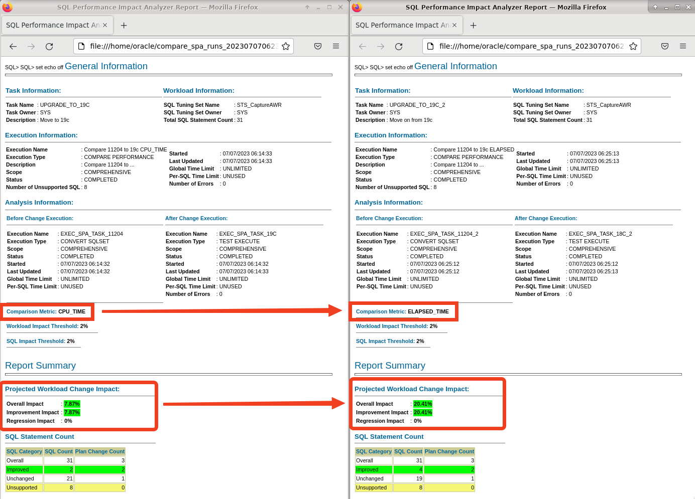

# SQL Performance Analyzer

## Introduction

In this lab, you will use the SQL Performance Analyzer (SPA) that is a part of the Real Application Testing (RAT) option. You will compare statements collected before the upgrade to a simulation of these statements after upgrade. You will use the SQL Tuning Sets collected earlier in the workshop.

Estimated Time: 10 minutes

[](videohub:1_141rt83h)

### Objectives

In this lab, you will:
* Check statements

### Prerequisites

This lab assumes:

- You have completed Lab 5: AWR Compare Periods

## Task 1: Check statements

1. Use the yelloe terminal. Set the environment and connect to the upgraded UPGR database.

    ```
    <copy>
    . upgr19
    sqlplus / as sysdba
    </copy>
    ```

2. Check the SQL Tuning Sets and the number of statements in them:

    ```
    <copy>
    col sqlset_name format a40
    select count(*), sqlset_name from dba_sqlset_statements group by sqlset_name order by 2;
    </copy>
    ```
    
    <details>
    <summary>*click to see the output*</summary>
    ``` text
    SQL> col sqlset_name format a40
    SQL> select count(*), sqlset_name from dba_sqlset_statements group by sqlset_name order by 2;

      COUNT(*) SQLSET_NAME
    ---------- ----------------------------------------
            31 STS_CaptureAWR
            38 STS_CaptureCursorCache  
    ```
    </details>

3. Analyze performance in the upgraded database. Using the workload captured in SQL Tuning Sets before the upgrade as a baseline, the database now test executes the workload stored in the SQL Tuning Sets, but this time in an upgraded database. Now you can see the effect of the new 19c optimizer. First, you compare *CPU\_TIME*.

    ```
    <copy>
    @/home/oracle/scripts/spa_cpu.sql
    </copy>
    ```

    <details>
    <summary>*click to see the output*</summary>
    ``` text
    SQL> @/home/oracle/scripts/spa_cpu.sql
    SQL Tuning Set does exist - will run SPA now ...
    SQL Performance Analyzer Task does not exist - will be created ...

    PL/SQL procedure successfully completed.    
    ```
    </details>

    The script:
    - Convert the information from `STS_CaptureAWR` into the right format.
    - Simulate the execution of all statements in `STS_CaptureAWR`.
    - Compare before/after.
    - Report on the results based on *CPU\_TIME*.

4. Generate the HTML Report containing the results below.

    ```
    <copy>
    @/home/oracle/scripts/spa_report_cpu.sql
    </copy>
    ```
5. Then repeat this for *ELAPSED\_TIME*. First, analyze performance.

    ```
    <copy>
    @/home/oracle/scripts/spa_elapsed.sql
    </copy>
    ```

5. Next, generate a report.

    ```
    <copy>
    @/home/oracle/scripts/spa_report_elapsed.sql
    </copy>
    ```    

6. Exit SQL*Plus.

    ```
    <copy>
    exit
    </copy>
    ```

7. Open the two SPA reports. Put them side-by-side.
    
    ```
    <copy>
    firefox compare_spa_* &
    </copy>
    ```
    

    Notice: 
    * The comparison method used in the two reports - CPU usage and elapsed time.
    * Regardless of how you measure it, the workload overall runs faster in the upgraded database.
        - For *CPU\_TIME* there is around 7 % performance improvement.
        - For *ELAPSED\_TIME* there is around 20 % performance improvement.
    * The workload runs faster in the upgraded database.

10. Scroll down to *Top nn SQL ...*. The list shows the SQLs sorted by impact. 

    

    * Only impact larger than 2 % are marked in green. If the workload is between 0 and 2 %, it is still an improvement. But in the SPA script the threshold is set to 2 %. 
    * Optionally, examine the SPA script (`/home/oracle/scripts/spa_elapsed.sql`), change the threshold and repeat the report to see the difference.

11. Find the details on SQL ID *7m5h0wf6stq0q* and see the difference in execution plans. 

    

    * Notice how the plan changes. After upgrade, the optimizer used a better access method (TABLE ACCESS BY INDEX ROWID BATCHED) on object CUSTOMER.
    * TABLE ACCESS BY INDEX ROWID BATCHED access method allows the database to retrieve a few row ids from the index, and then attempts to access rows in block order to improve the clustering and reduce the number of times that the database must access a block. This makes it run faster.
    * This demonstrates that a new optimizer out-of-the-box brings a lot of performance improvements. It is not always a good idea to deny plan changes as part of an upgrade. 
    
12. Examine the rest of the SPA reports.

13. Close Firefox.

14. Reconnect to the database.
    
    ```
    <copy>
    . upgr19
    sqlplus / as sysdba
    </copy>
    ```

15. Implement a change. This could be any change that you want to test the effect of. Here you are changing an initialization parameter, but you could also change statistics, optimizer settings (`DBMS_OPTIM_BUNDLE`), or many other things.

    ```
    <copy>
    alter session set optimizer_features_enable='11.2.0.4';
    </copy>
    ```

15. Re-analyze the workload based on *ELAPSED\_TIME*. This allows you to see the impact of the change on the database.

    ```
    <copy>
    @/home/oracle/scripts/spa_elapsed.sql
    </copy>
    ```

15. Generate a new report.

    ```
    <copy>
    @/home/oracle/scripts/spa_report_elapsed.sql
    </copy>
    ```    

16. Exit SQL*Plus.

    ```
    <copy>
    exit
    </copy>
    ```    
    
17. Open it with Firefox.

    ```
    <copy>
    firefox $(ls -t compare_spa_runs*html | head -1) & 
    </copy>
    ```

18. Find the details on SQL ID *7m5h0wf6stq0q* again.

    

    * Notice that the plan no longer changes. By changing *optimizer\_features\_enable* you prevented the optimizer from using new access methods. 
    * There is still a performance improvement. The new optimizer code still works better, even without the improved access method.
    * This also shows that *optimizer\_features\_enable* does not bring back the old optimizer. The database still runs on the new code, but certain new things are disabled.

Normally, you would focus on the SQLs with a negative impact on your workload. The idea of such SPA runs is to accept the better plans and identify and cure the ones which are regressing.

You may now *proceed to the next lab*.

## Learn More

You can run SQL Performance Analyzer on a production system or a test system that closely resembles the production system. It's highly recommended to execute the SQL Performance Analyzer runs on a test system rather than directly on the production system.

* Documentation, [SQL Performance Analyzer](https://docs.oracle.com/en/database/oracle/oracle-database/19/ratug/introduction-to-sql-performance-analyzer.html#GUID-860FC707-B281-4D81-8B43-1E3857194A72)
* Webinar, [Performance Stability Perscription #3: SQL Performance Analyzer](https://www.youtube.com/watch?v=qCt1_Fc3JRs&t=4463s)

## Acknowledgements

* **Author** - Mike Dietrich, Database Product Management
* **Contributors** - Daniel Overby Hansen, Roy Swonger, Sanjay Rupprel, Cristian Speranta, Kay Malcolm
* **Last Updated By/Date** - Daniel Overby Hansen, July 2023