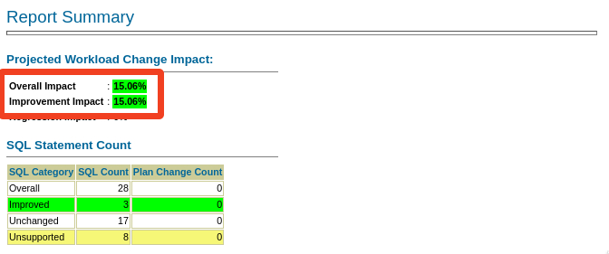

# SQL Tuning Advisor

## Introduction

In this lab, you will use SQL Tuning Advisor (STA) to find suggestions for improving SQLs.

Estimated Time: 10 minutes

[](videohub:1_uchy3yhs)

### Objectives

In this lab, you will:

* Create a tuning task
* Implement recommendations
* Validate recommendations using SQL Performance Analyzer

### Prerequisites

This lab assumes:

- You have completed Lab 7: SQL Plan Management

## Task 1: Create a tuning task

You use the SQL Tuning Set *STS_CaptureCursorCache* as input to the advisor. The SQL Tuning Set contains the workload you generated with HammerDB. STA will look at each of the statements and come up with tuning suggestions.

1. Use the yellow terminal. Connect to the upgraded UPGR database.

    ```
    <copy>
    . upgr19
    sqlplus / as sysdba
    </copy>
    ```

2. Create a STA task.

    ```
    <copy>
    @/home/oracle/scripts/sta_cc.sql
    </copy>
    ```

3. Optionally, you can look at the script to understand how you use the SQL Tuning Advisor API.

4. Examine the output of STA. Scroll to the top of the output. Your output may vary from the sample output below. Read and interpret your own report.

    * General information contains basic information on the STA task. You can see it was created based on a SQL Tuning Set.

    <details>
    <summary>*click to see the output*</summary>
    ``` text
    -------------------------------------------------------------------------------
    GENERAL INFORMATION SECTION
    -------------------------------------------------------------------------------
    Tuning Task Name                : STA_UPGRADE_TO_19C_CC
    Tuning Task Owner               : SYS
    Workload Type                   : SQL Tuning Set
    Scope                           : COMPREHENSIVE
    Time Limit(seconds)             : 360
    Completion Status               : COMPLETED
    Started at                      : 07/08/2023 08:43:29
    Completed at                    : 07/08/2023 08:43:36
    SQL Tuning Set (STS) Name       : STS_CaptureCursorCache
    SQL Tuning Set Owner            : SYS
    Number of Statements in the STS : 37        
    ```
    </details>

    * The Details section contains the findings made by the advisor.

    <details>
    <summary>*click see to an example of a finding*</summary>
    ``` text
    -------------------------------------------------------------------------------
    FINDINGS SECTION (1 finding)
    -------------------------------------------------------------------------------

    1- Index Finding (see explain plans section below)
    --------------------------------------------------
    The execution plan of this statement can be improved by creating one or more
    indices.

    Recommendation (estimated benefit: 97.64%)
    ------------------------------------------
    - Consider running the Access Advisor to improve the physical schema design
        or creating the recommended index.
        create index TPCC.IDX$$_00E80002 on TPCC.CUSTOMER("C_LAST","C_D_ID","C_W_ID");

    Rationale
    ---------
        Creating the recommended indices significantly improves the execution plan
        of this statement. However, it might be preferable to run "Access Advisor"
        using a representative SQL workload as opposed to a single statement. This
        will allow to get comprehensive index recommendations which takes into
        account index maintenance overhead and additional space consumption.

    -------------------------------------------------------------------------------
    Object ID  : 13
    Schema Name: TPCC
    SQL ID	   : 89k9fqaq5b5sy
    SQL Text   : SELECT C_BALANCE, C_FIRST, C_MIDDLE, C_ID FROM CUSTOMER WHERE
                 C_LAST = :B3 AND C_D_ID = :B2 AND C_W_ID = :B1 ORDER BY C_FIRST   
    ```
    </details>

    * In the end, there is a summary of the findings that you can use to implement all the recommendations.

    <details>
    <summary>*click to see the output*</summary>
    ``` text
    -- Script generated by DBMS_SQLTUNE package, advisor framework --
    -- Use this script to implement some of the recommendations    --
    -- made by the SQL tuning advisor.			       --
    --							       --
    -- NOTE: this script may need to be edited for your system     --
    --	 (index names, privileges, etc) before it is executed. --
    -----------------------------------------------------------------
    create index TPCC.IDX$$_00E80001 on TPCC.CUSTOMER("C_LAST","C_D_ID","C_W_ID");
    create index TPCC.IDX$$_00E80002 on TPCC.CUSTOMER("C_LAST","C_D_ID","C_W_ID");
    create index TPCC.IDX$$_00E80003 on TPCC.ORDERS("O_C_ID","O_D_ID","O_W_ID");
    create index TPCC.IDX$$_00E80004 on TPCC.CUSTOMER("C_LAST","C_D_ID","C_W_ID");    
    ```
    </details>

## Task 2: Implement recommendations

You can implement the recommendations and then use SPA to validate the effect on your workload. 

1. Implement the changes. Be sure to remove duplicate recommendations. Your recommendations may vary from the sample output. Copy/paste the recommendations from your own report.

    ```
    <copy>
    create index TPCC.IDX$$_00E80002 on TPCC.CUSTOMER("C_LAST","C_D_ID","C_W_ID");
    create index TPCC.IDX$$_00E80003 on TPCC.ORDERS("O_C_ID","O_D_ID","O_W_ID");
    </copy>
            
    Be sure to hit RETURN
    ```

    <details>
    <summary>*click to see the output*</summary>
    ``` text
    SQL> create index TPCC.IDX$$_00E80002 on TPCC.CUSTOMER("C_LAST","C_D_ID","C_W_ID");

    Index created.

    SQL> create index TPCC.IDX$$_00E80003 on TPCC.ORDERS("O_C_ID","O_D_ID","O_W_ID");

    Index created.
    ```
    </details>

    * This is an exercise only. In a real environment, don't accept the recommendations without thorough consideration.
    * In this lab, the recommendations are to create indexes. Although the effect on your workload might be positive, remember that indexes also affect DMLs.

## Task 3: Validate recommendations using SQL Performance Analyzer

1. Evaluate the effect on your workload. Use SPA to test based on *CPU\_TIME* and *ELAPSED\_TIME* and generate reports.
    
    ```
    <copy>
    @/home/oracle/scripts/spa_cpu.sql
    @/home/oracle/scripts/spa_report_cpu.sql
    @/home/oracle/scripts/spa_elapsed.sql
    @/home/oracle/scripts/spa_report_elapsed.sql
    </copy>
            
    Be sure to hit RETURN
    ```
 
2. Exit SQL*Plus

    ```
    <copy>
    exit
    </copy>
    ```

3. Examine the SQL Performance Analyzer report based on *CPU\_TIME*.

    ```
    <copy>
    firefox $(ls -t compare_spa_runs*html | head -2 | tail -1 ) &
    </copy>
    ```

    * If you made additional SPA runs using the script, then the above command won't select the right report.

    

    * Overall there is a 15 % improvement from creating indexes. 
    * This is based on the workload from the SQL Tuning Set. It does not tell anything about the effect on other workloads, like DMLs.
    
4. Examine the other SQL Performance Analyzer report based on *ELAPSED\_TIME*.

    ```
    <copy>
    firefox $(ls -t compare_spa_runs*html | head -1 ) &
    </copy>
    ```

You may now *proceed to the next lab*.

## Learn More

SQL Tuning Advisor is SQL diagnostic software in the Oracle Database Tuning Pack.

You can submit one or more SQL statements as input to the advisor and receive advice or recommendations for how to tune the statements, along with a rationale and expected benefit.

* Documentation, [SQL Tuning Advisor](https://docs.oracle.com/en/database/oracle/oracle-database/19/tgsql/sql-tuning-advisor.html#GUID-8E1A39CB-A491-4254-8B31-9B1DF7B52AA1)
* Webinar, [Performance Stability Perscription #4: SQL Tuning Advisor, SQL profiles and SQL patches](https://www.youtube.com/watch?v=qCt1_Fc3JRs&t=4923s)

## Acknowledgements
* **Author** - Mike Dietrich
* **Contributors** - Daniel Overby Hansen, Roy Swonger, Sanjay Rupprel, Cristian Speranta, Kay Malcolm
* **Last Updated By/Date** - Daniel Overby Hansen, July 2023
