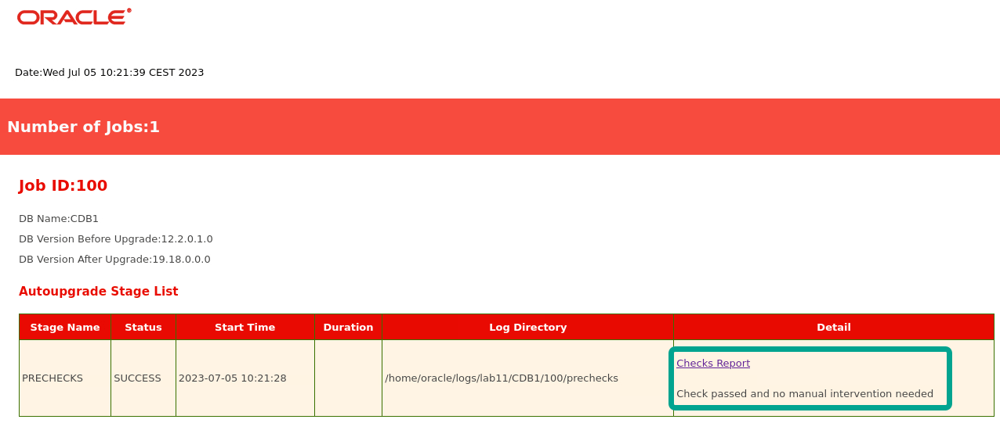
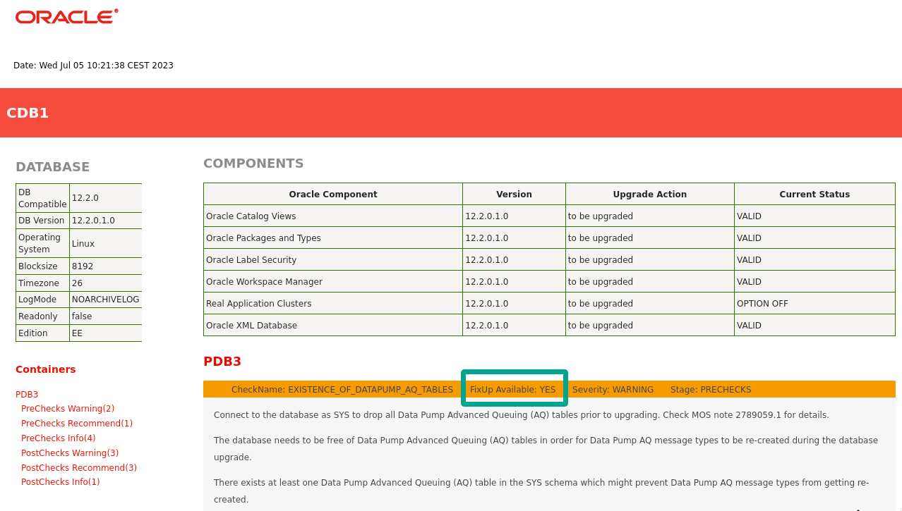

# Unplug-plug - Upgrade

## Introduction

In this lab, you will unplug a PDB (PDB3) from a CDB (CDB1) running on Oracle Database 12.2.0.1. Then, you plug it into a higher release CDB (CDB2) running on Oracle Database 19c and upgrade the PDB.

Estimated Time: 20 minutes

### Objectives

In this lab, you will:

* Prepare environment
* Analyze the PDB
* Unplug-plug upgrade

### Prerequisites

This lab assumes:

- You have completed Lab 1: Initialize Environment

## Task 1: Prepare environment

1. Use the yellow terminal. Log in to the source CDB.

    ```
    <copy>
    . cdb1
    sqlplus / as sysdba
    </copy>
    ```

2. Start it up and verify that PDB3 is open in *read write* mode.
    ```
    <copy>
    startup
    show pdbs
    exit
    </copy>

    Be sure to hit RETURN
    ```

    <details>
    <summary>*click to see the output*</summary>
    ``` text
    SQL> startup
    ORACLE instance started.

    Total System Global Area 1459617792 bytes
    Fixed Size                  8792872 bytes
    Variable Size             486540504 bytes
    Database Buffers          956301312 bytes
    Redo Buffers                7983104 bytes
    Database mounted.
    Database opened.
    SQL> show pdbs

        CON_ID CON_NAME                       OPEN MODE  RESTRICTED
    ---------- ------------------------------ ---------- ----------
             2 PDB$SEED                       READ ONLY  NO
             3 PDB3                           READ WRITE NO
    SQL> exit
    Disconnected from Oracle Database 12c Enterprise Edition Release 12.2.0.1.0 - 64bit Production
    ```
    </details>

## Task 2: Analyze the PDB
Before you upgrade the PDB, it is a good idea to check it for upgrade readiness. Use AutoUpgrade in *analyze* mode to generate a report.

1. Examine the AutoUpgrade config file.

    ```
    <copy>
    cat /home/oracle/scripts/PDB3.cfg
    </copy>
    ```

    ``` text
    global.autoupg_log_dir=/home/oracle/logs
    upg1.source_home=/u01/app/oracle/product/12.2.0.1
    upg1.target_home=/u01/app/oracle/product/19
    upg1.sid=CDB1
    upg1.pdbs=PDB3
    upg1.target_cdb=CDB2
    upg1.log_dir=/home/oracle/logs
    upg1.target_pdb_copy_option=file_name_convert=('CDB1', 'CDB2')
    ```

    * AutoUpgrade unplugs the PDBs specified by `pdbs`.
    * From the database specified by `sid`.
    * Plugs them into the database specified by `target_cdb`.
    * `target_pdb_copy_option` instructs AutoUpgrade to copy the data files as part of the plug-in operation. The target database determines the new file names by replacing *CDB1* with *CDB2* in the original file name.
    * Since AutoUpgrade copies the data files, the source PDB remains intact in CDB1. You can use it for fallback (if necessary).

2. Use AutoUpgrade to analyze the PDB before the upgrade. The analysis is usually fast. Wait for it to complete or use `lsj` command to monitor the progress.

    ```
    <copy>
    java -jar $OH19/rdbms/admin/autoupgrade.jar -mode analyze -config /home/oracle/scripts/PDB3.cfg
    </copy>
    ```

    <details>
    <summary>*click to see the output*</summary>
    ``` text
    $ java -jar $OH19/rdbms/admin/autoupgrade.jar -mode analyze -config /home/oracle/scripts/PDB3.cfg
    AutoUpgrade 23.2.230626 launched with default internal options
    Processing config file ...
    +--------------------------------+
    | Starting AutoUpgrade execution |
    +--------------------------------+
    1 PDB(s) will be analyzed
    Type 'help' to list console commands
    upg> Job 100 completed
    ------------------- Final Summary --------------------
    Number of databases            [ 1 ]

    Jobs finished                  [1]
    Jobs failed                    [0]

    Please check the summary report at:
    /home/oracle/logs/cfgtoollogs/upgrade/auto/status/status.html
    /home/oracle/logs/cfgtoollogs/upgrade/auto/status/status.log    
    ```
    </details>

    AutoUpgrade in analyze mode is a lightweight, non-intrusive check of the database. You can use it on a live database without interrupting users.

3. AutoUpgrade prints the path to the summary report. Check it.

    ```
    <copy>
    cat /home/oracle/logs/cfgtoollogs/upgrade/auto/status/status.log
    </copy>
    ```

    <details>
    <summary>*click to see the output*</summary>
    ``` text
    $ cat /home/oracle/logs/cfgtoollogs/upgrade/auto/status/status.log
    ==========================================
            Autoupgrade Summary Report
    ==========================================
    [Date]           Wed Jul 05 10:21:39 CEST 2023
    [Number of Jobs] 1
    ==========================================
    [Job ID] 100
    ==========================================
    [DB Name]                CDB1
    [Version Before Upgrade] 12.2.0.1.0
    [Version After Upgrade]  19.18.0.0.0
    ------------------------------------------
    [Stage Name]    PRECHECKS
    [Status]        SUCCESS
    [Start Time]    2023-07-05 10:21:28
    [Duration]       
    [Log Directory] /home/oracle/logs/CDB1/100/prechecks
    [Detail]        /home/oracle/logs/CDB1/100/prechecks/cdb1_preupgrade.log
                    Check passed and no manual intervention needed
    ------------------------------------------
    ```
    </details>
    
    The report states: *Check passed and no manual intervention needed*. AutoUpgrade found no severe issues that it couldn't fix automatically. 

4. You can also check the summary report in HTML format. Click on *Checks Report* for even more details. Firefox might print warnings to the console. You can safely ignore those.

    ```
    <copy>
    firefox /home/oracle/logs/cfgtoollogs/upgrade/auto/status/status.html &
    </copy>
    ```

    
    


## Task 3: Unplug-plug upgrade

AutoUpgrade informed you that you are ready to upgrade the PDB. Use AutoUpgrade in *deploy* mode to perform the unplug-plug upgrade.

1. Start AutoUpgrade in *deploy* mode. It will handle the entire operation for you.

    ```
    <copy>
    java -jar $OH19/rdbms/admin/autoupgrade.jar -mode deploy -config /home/oracle/scripts/PDB3.cfg
    </copy>
    ```

    <details>
    <summary>*click to see the output*</summary>
    ``` text
    $ java -jar $OH19/rdbms/admin/autoupgrade.jar -mode deploy -config /home/oracle/scripts/PDB3.cfg
    AutoUpgrade 23.2.230626 launched with default internal options
    Processing config file ...
    +--------------------------------+
    | Starting AutoUpgrade execution |
    +--------------------------------+
    1 PDB(s) will be processed
    Type 'help' to list console commands
    upg> 
    ```
    </details>

    Notice you are using the exact same command line as for the analysis. Only the `-mode` parameter changes.

2. Monitor the upgrade using the `lsj` command. The `-a` parameter instructs AutoUpgrade to refresh the information every 30 seconds.

    ```
    <copy>
    lsj -a 30
    </copy>
    ```

    <details>
    <summary>*click to see the output*</summary>
    ``` text
    upg> lsj -a 30
    upg> +----+-------+-----+---------+-------+----------+-------+------------------+
    |Job#|DB_NAME|STAGE|OPERATION| STATUS|START_TIME|UPDATED|           MESSAGE|
    +----+-------+-----+---------+-------+----------+-------+------------------+
    | 101|   CDB1|DRAIN|EXECUTING|RUNNING|  10:48:11| 3s ago|Executing describe|
    +----+-------+-----+---------+-------+----------+-------+------------------+
    Total jobs 1
    ```
    </details>

3. The upgrade usually completes in 15-20 minutes. AutoUpgrade prints a message stating the job completed.

    <details>
    <summary>*click to see the output*</summary>
    ``` text
    Job 101 completed
    ------------------- Final Summary --------------------
    Number of databases            [ 1 ]

    Jobs finished                  [1]
    Jobs failed                    [0]
    Jobs restored                  [0]
    Jobs pending                   [0]


    Please check the summary report at:
    /home/oracle/logs/cfgtoollogs/upgrade/auto/status/status.html
    /home/oracle/logs/cfgtoollogs/upgrade/auto/status/status.log
    ```
    </details>

4. Connect to the higher release CDB (CDB2) and ensure that PDB3 is plugged in. 

    ```
    <copy>
    . cdb2
    sqlplus / as sysdba
    show pdbs
    exit
    </copy>
     
    Be sure to hit RETURN
    ```

    <details>
    <summary>*click to see the output*</summary>
    ``` text
    $ sqlplus / as sysdba

    SQL*Plus: Release 19.0.0.0.0 - Production on Wed Jul 5 11:12:12 2023
    Version 19.18.0.0.0

    Copyright (c) 1982, 2022, Oracle.  All rights reserved.


    Connected to:
    Oracle Database 19c Enterprise Edition Release 19.0.0.0.0 - Production
    Version 19.18.0.0.0

    SQL> show pdbs

        CON_ID                       CON_NAME  OPEN MODE RESTRICTED
    ---------- ------------------------------ ---------- ----------
             2                       PDB$SEED  READ ONLY         NO
             3                           PDB3 READ WRITE         NO
    SQL> exit
    Disconnected from Oracle Database 19c Enterprise Edition Release 19.0.0.0.0 - Production
    Version 19.18.0.0.0
    ```
    </details>    

    Notice how the PDB is open in *read write* mode and unrestricted. This indicates the plug-in and upgrade went fine. Otherwise, AutoUpgrade would also inform you.

Congratulations! You have completed the lab.

## Learn More

You can upgrade PDBs by unplugging from a lower release CDB, plugging it into a higher release CDB, and then upgrading that PDB to the higher release. This is called unplug-plug upgrade. 

When you plug in a lower release PDB, it will open in *restricted* mode. As each PDB has its own dictionary, it needs to be upgraded to match the version of the CDB. PDBs always need to match the version of the CDB$ROOT.

* Documentation, [Upgrading Multitenant Using Unplug-Plug](https://docs.oracle.com/en/database/oracle/oracle-database/19/spupu/upgrade-multitenant-architecture-sequentially.html#GUID-8F9AAFA1-690D-4F70-8448-E66D765AF136)
* Blog post, [Unplugging, Plugging and Upgrading a PDB to a new CDB](https://mikedietrichde.com/2021/06/07/unplug-plug-upgrade-with-autoupgrade/)
* Webinar, [Upgrade Internal, Unplug-plug upgrade](https://www.youtube.com/watch?v=1wr8-1SVQMA&t=4295s)
* Webinar, [Upgrade Internal, Parallel upgrade engine](https://www.youtube.com/watch?v=1wr8-1SVQMA&t=1044s)

## Acknowledgements

* **Author** - Mike Dietrich, Database Product Management
* **Contributors** -  Daniel Overby Hansen, Roy Swonger, Sanjay Rupprel, Cristian Speranta, Kay Malcolm
* **Last Updated By/Date** - Daniel Overby Hansen, July 2023
