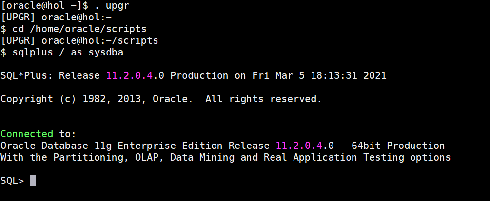
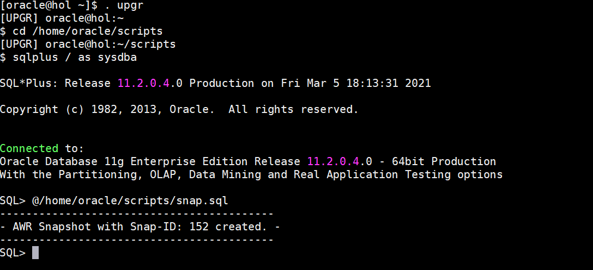
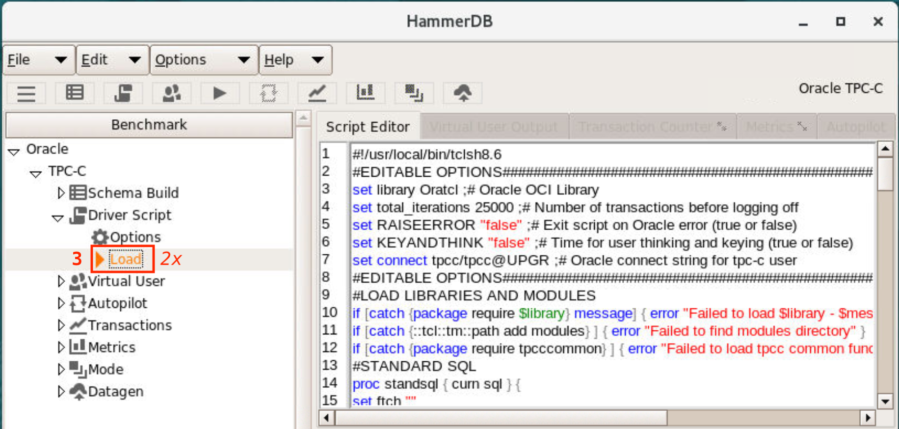
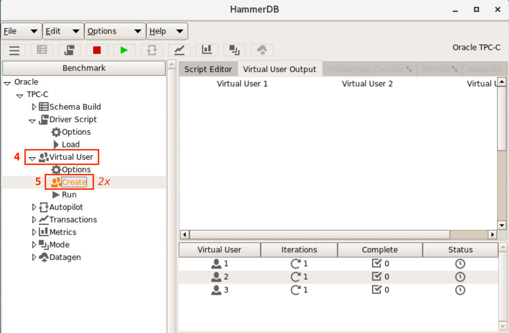
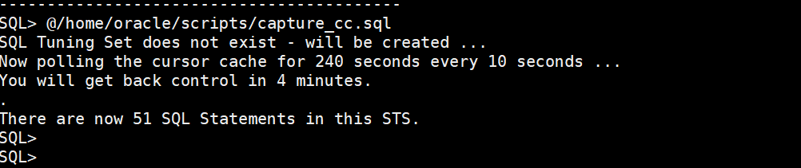
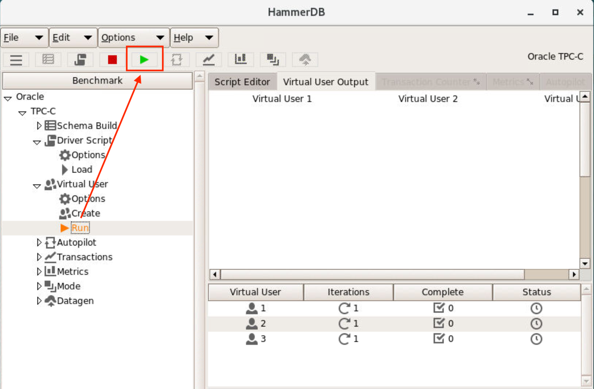
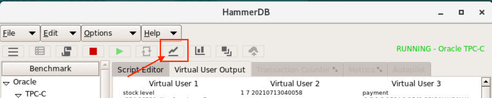
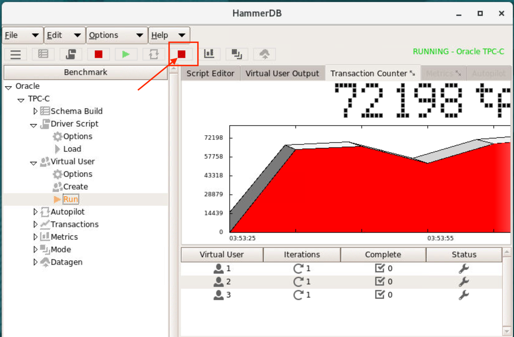
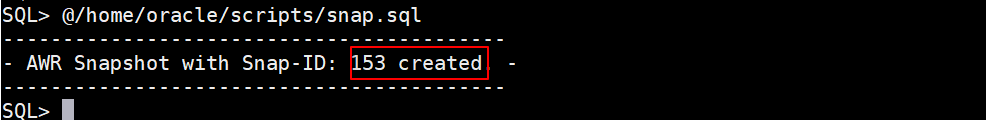

# Generate AWR Snapshot

## Introduction

In this lab, you will execute an application workload on the UPGR database before upgrade using an external load tool, HammerDB.  You will capture all SQL statements to be able to compare performance from before-upgrade to after-upgrade.

Estimated Time: 15 Minutes.

Watch the video below for a quick walk through of the lab.
[Watch the video](youtube:vK94YigW94Y)

### About AWR Snapshots

The Automatic Workload Repository (AWR) collects, processes, and maintains performance statistics for problem detection and self-tuning purposes. This data is both in memory and stored in the database. The gathered data can be displayed as both reports and views.

The statistics collected and processed by AWR include:
- Object statistics that determine both access and usage statistics of database segments
- Time model statistics based on time usage for activities, displayed in the `V$SYS_TIME_MODEL` and `V$SESS_TIME_MODEL` views
- A few system and session statistics collected in the `V$SYSSTAT` and `V$SESSTAT` views
- SQL statements that are producing the highest load on the system, based on criteria such as elapsed time and CPU time
- ASH statistics, representing the history of recent sessions activity

Snapshots are sets of historical data for specific time periods that are used for performance comparisons by ADDM. By default, Oracle Database automatically generates snapshots of the performance data once every hour and retains the statistics in the workload repository for 8 days. You can also manually create snapshots. In this lab we will manually create snapshots.

### Objectives

In this lab, you will:

- Generate an AWR snapshot
- Start HammerDB
- Load Driver Script and start virtual users
- Capture SQL, load test and monitor
- Generate another AWR snapshot

### Prerequisites

This lab assumes you have:

- An Oracle Cloud account
- You have completed:
    - Lab: Prepare Setup 
    - Lab: Environment Setup
    - Lab: Initialize Environment

## Task 1: Generate an AWR snapshot

1. Open a terminal session and set the environment to UPGR using *`. upgr`*, change directory to /home/oracle/scripts and startup the database in SQL*Plus:

    ```
    <copy>
    . upgr
    cd /home/oracle/scripts
    sqlplus / as sysdba
    startup
    </copy>
    ```
    

2.  Execute snap.sql which generates an AWR snapshot.  Please NOTE down the snapshot number (e.g.: 110)

    ```
    <copy>
    @snap.sql
    </copy>
    ```
    

3. Don’t exit from the terminal or SSH session. Keep SQL*Plus open.

4. On the remote desktop session, Double-Click on the *HammerDB* icon on the desktop to Launch it
    

## Task 2: Load driver script and start virtual Users

1. Click on the triangle “TPC-C“
    
2. Open the Driver Script setup with a Click
    
3. Then Double-Click on the Load option.
    
4. This will populate the script window with the driver script (ignore the error messages in the script window)
5. Click on Virtual Users.  Now Double-Click on Create – you should see then 3 Virtual Users being started below the script window.
    

## Task 3: Capture SQL, run workload and monitor

Please start the following script in your SQL*Plus window. With this script you will capture all the SQL statements directly from the cursor cache while HammerDB is running and generating load on your database.

1. Run the capture script. The capture is scheduled for 240 seconds. It polls the cache every 10 seconds.

    ```
    <copy>
    @capture_cc.sql
    </copy>
    ```
    

2. Start the TPC-C Load by clicking on the Run icon.
    

3. Click on the Graph / Transaction Counter icon in the top menu icon bar. You will see that the script window changes now waiting for data.
    

4. It will take a few seconds, then you will see the performance charts and the transactions-per-minute (tpm). The load run usually takes 2-3 minutes to complete.
    

5. Finally Exit HammerDB.

Please WAIT until the capture_cc.sql scripts returns control back to you – DON NOT CTRL-C it!

## Task 4: Generate another AWR snapshot

1. In the existing sqlplus create another AWR snapshot. Once the command prompt is visible execute the sql script below.
    Please NOTE down the snapshot number (e.g. 111). Be aware that your snapshot number may be different than the one in the screenshot.

    ```
    <copy>
    @snap.sql
    </copy>
    ```
    

## Appendix 1: Additional information on HammerDB

1. You can modify the standard parameters in either the GUI tool or as defaults in config.xml located in `/home/oracle/HammerDB-3.3`

You may now *proceed to the next lab*.

## Learn More

* [HammerDB](https://www.hammerdb.com/)
* [AWR Snapshots](https://docs.oracle.com/en/database/oracle/oracle-database/19/tgdba/gathering-database-statistics.html#GUID-144711F9-85AE-4281-B548-3E01280F9A56)

## Acknowledgements
* **Author** - Mike Dietrich, Database Product Management
* **Contributors** -  Roy Swonger, Kay Malcolm, Rene Fontcha
* **Last Updated By/Date** - Mike Dietrich, July 2021
