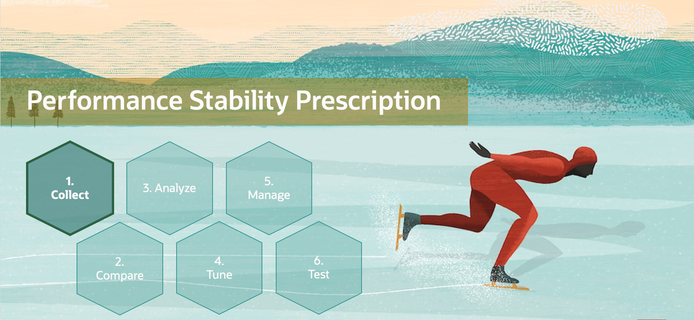
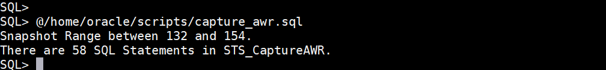
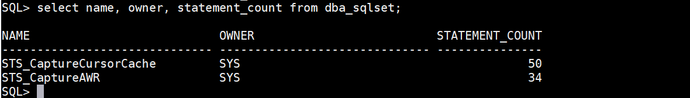
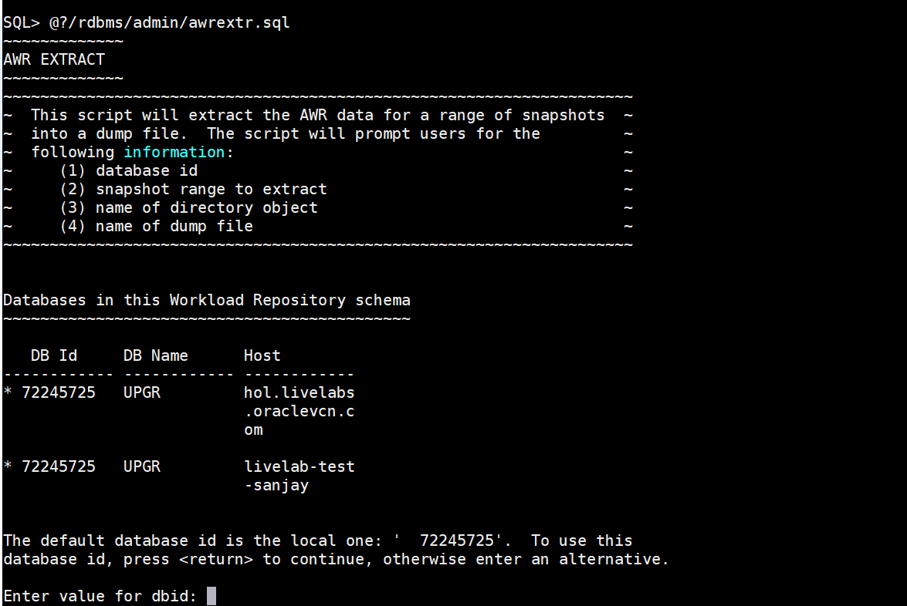
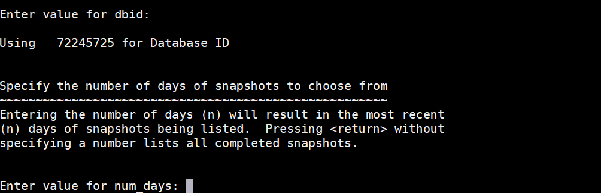
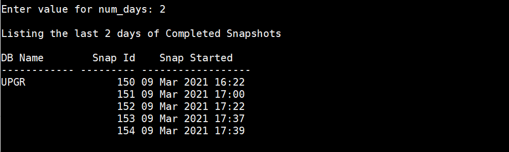
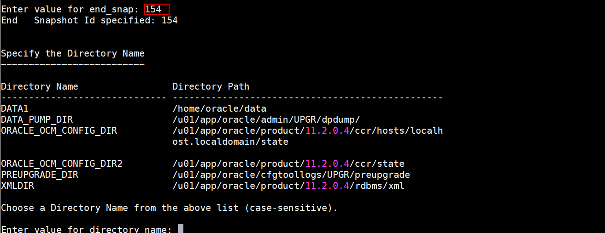
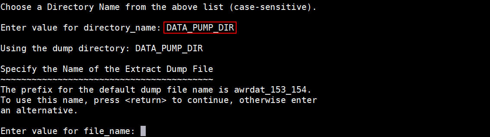
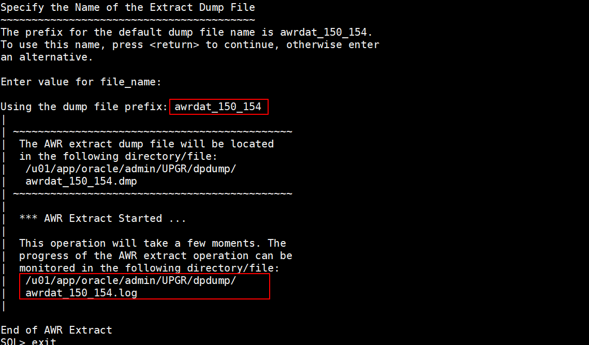

# Capture and Preserve SQL

## Introduction

In this lab, you will capture and preserve SQL statements and information as well as the AWR. We will use this collection later on following a performance stability method guideline.

Estimated Time:: 15 minutes



Watch the video below for a quick walk through of the lab.
[Watch the video](youtube:XTJC8yBDhkQ)

### About SQL Tuning Sets

A SQL tuning set (STS) is a database object that you can use as input to tuning tools.
An STS includes:

- A set of SQL statements
- Associated execution context, such as a user schema, application module name and action, list of bind values, and the environment for SQL compilation of the cursor
- Associated basic execution statistics, such as elapsed time, CPU time, buffer gets, disk reads, rows processed, cursor fetches, the number of executions, the number of complete executions, optimizer cost, and the command type
- Associated execution plans and row source statistics for each SQL statement (optional)

An STS allows you to transport SQL between databases. You can export SQL tuning sets from one database to another, enabling transfer of SQL workloads between databases for remote performance diagnostics and tuning.

### Objectives

In this lab, you will:

* Collect Statements from AWR
* Collect Statements from Cursor Cache
* Optional - Export AWR

### Prerequisites

This lab assumes you have:

- An Oracle Cloud account
- You have completed:
    - Lab: Prepare Setup 
    - Lab: Environment Setup
    - Lab: Initialize Environment

## Task 1: Collect statements from AWR

In order to collect SQL Statements directly from AWR (Automatic Workload Repository) you will call a SQL script which:
- Creates a SQL Tuning Set (STS)
- Populates the STS with SQL information stored in AWR

1.  In your open SQL*plus session connected to UPGR run the below script stored in the path- /home/oracle/scripts:

    ```
    <copy>
    @capture_awr.sql
    </copy>
    ```

2. The number of statements in SQL Tuning Set “STS_CaptureAWR” will be displayed.
    

## Task 2: Collect statements from Cursor Cache

You can also collect statements directly from the Cursor Cache. This is more resource intense but helpful in case of OLTP applications. Be careful when you poll the cursor cache too frequently.

1. This procedure:
      - Creates a SQL Tuning Set (STS)
      - Populates this STS with SQL statements/information from the cursor cache
      - It will poll the cursor cache for 240 seconds every 10 seconds.

2. The script is stored in /home/oracle/scripts:
        capture_cc.sql
   Since you've already used it while you ran HammerDB in the earlier lab, there is no need to run it again.

    *Don’t run it again!!!*

3. Please check how many statements you collected in each SQL Tuning Set.

    ```
    <copy>
    select name, owner, statement_count from dba_sqlset;
    </copy>
    ```
    

    It is very likely that you will get different statement counts. One of the reasons could be that often the capture from cursor cache will catch more statements compared to those written down from ASH (Active Session History) into AWR. And it does not play any role for the lab whether the number of statements matches the number in the screenshots or not.


## Task 3: Optional - export AWR

When you migrate databases, exporting and preserving the AWR is important. When you upgrade, the AWR remains in the database. This exercise is done for protection but it is not necessary for the flow of the lab. **You will specify a START and an END snapshot number** to export the AWR data between these two snapshots.

1. Export the AWR by running the sql stored in your Oracle home.

    ```
    <copy>
    @?/rdbms/admin/awrextr.sql
    </copy>
    ```
    

2. Hit **RETURN**.

    

3. Type **2** and Hit **RETURN**.
   

    

4. Type: 154. (Your snapshot number may be different.)  Hit RETURN.

    

5. Type: DATA\_PUMP\_DIR.  Hit RETURN

    
    Enter value for file_name:
    Hit **RETURN**
    
    This will take now a few minutes.

6. Exit from SQL*Plus.

    ```
    <copy>
    exit
    </copy>
    ```

You may now *proceed to the next lab*.

## Learn More

* [SQL Tuning Sets](https://docs.oracle.com/en/database/oracle/oracle-database/19/tgsql/managing-sql-tuning-sets.html#GUID-DD136837-9921-4C73-ABB8-9F1DC22542C5)

## Acknowledgements
* **Author** - Mike Dietrich, Database Product Management
* **Contributors** -  Roy Swonger, Database Product Management
* **Contributors** -  Roy Swonger, Kay Malcom, Database Product Management
* **Last Updated By/Date** - Mike Dietrich, July 2021
