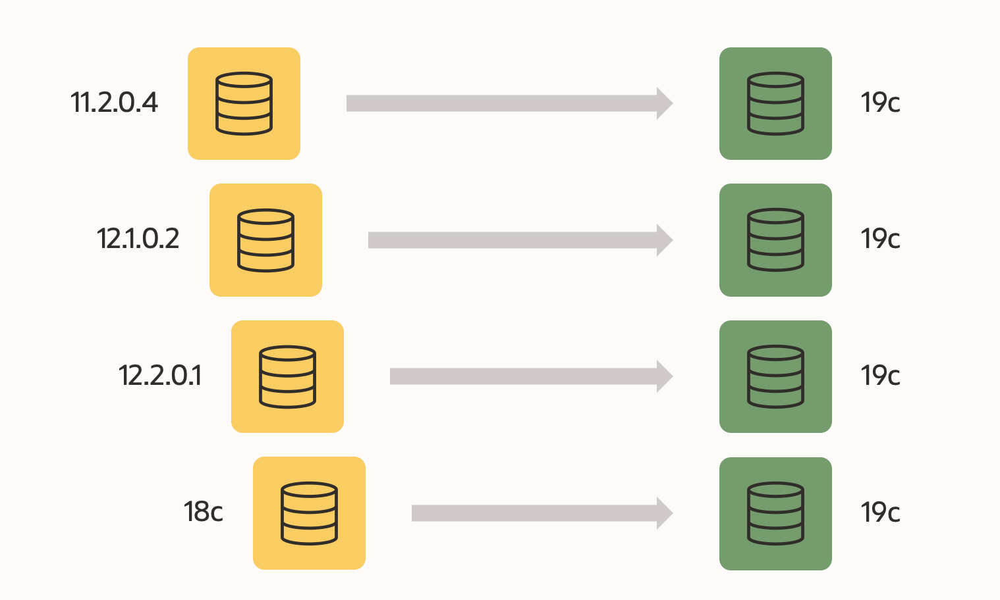
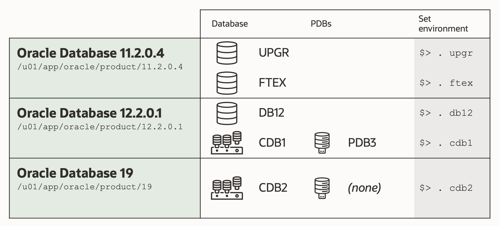
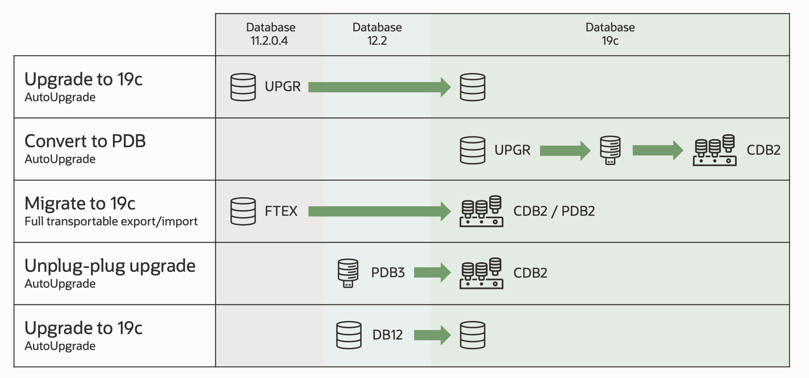

# Introduction

## About this Workshop

Oracle Database 19c is the *Long Term Support Release* for the Oracle Database 12.2 release family. It is available on all popular on-prem platforms, Oracle Exadata and Oracle Database Appliance, and in the Oracle Cloud. As the latest Long Term Support Release, it offers customers the highest levels of stability and the longest error correction support. And, by upgrading to Oracle Database 19c customers will have Premier Support until end of April 2024, and Extended Support until end of April 2027.  There is a direct upgrade path to Oracle Database 19c from Oracle Database 11.2.0.4, 12.1.0.2, 12.2.0.1 and 18c releases, regardless of the patch bundle applied.

Estimated Workshop Time: 600 minutes

Therefore in the interests of maintaining business continuity,  customers still running on prior releases (e.g. 11gR2, 12cR1, 12cR2, 18c) are encouraged to start planning their 19c upgrades before current support windows expire. Always refer to [MOS note #742060.1](https://support.oracle.com/epmos/faces/DocumentDisplay?id=742060.1&displayIndex=1) for the latest status of Oracle Database releases and support coverage.

[Watch the video](youtube:lOzL5irmuJo)

<if type="odbw">If you would like to watch us do the workshop, click [here](https://youtu.be/e3DaQ2LKCU4).</if>

### Objectives

In this workshop, you will:

* Setup your Upgrade Compute Instance in the Cloud
* Launch a workload on your database
* Capture the SQL statements
* Upgrade the database with AutoUpgrade
* Start the workload again
* Run an AWR Diff Report
* Use SQL Performance Analyzer
* Ensure plan stability with SQL Plan Management
* Tune with SQL Tuning Advisor
* Plugin your upgraded database into Multitenant
* Unplug/plug/upgrade a PDBs
* Migrate another database with Full Transportable Export/import

### Prerequisites

* An Oracle Cloud Account - Please view this workshop's LiveLabs landing page to see which environments are supported

  ## About the workshop contents

This workshop is preloaded with 3 different Oracle Homes and 5 databases.
You can switch between environments with the shortcuts shown in the last column of the below diagram.

The 3 different Oracle Homes are:

- Oracle 11.2.0.4 – /u01/app/oracle/product/11.2.0.4
- Oracle 12.2.0.1 – /u01/app/oracle/product/12.2.0.1
- Oracle 19.11.0 – /u01/app/oracle/product/19

The workshop also contains 5 different databases for running the various upgrade and migration scenarios in each lab.

- UPGR – 11.2.0.4 database (non-CDB)
- FTEX – 11.2.0.4 database (non-CDB)
- DB12 – 12.2.0.1 database (non-CDB)
- CDB1 – 12.2.0.1 database (CDB)
- CDB2 – 19.11.0 database (CDB)

These are the tasks you can complete in the lab.

## Upgrade and data migration methods and processes

### AutoUpgrade

- AutoUpgrade is the only recommended tool to upgrade Oracle databases. Whether only one or thousands of databases will be upgraded, AutoUpgrade performs not only the upgrade but also all the pre- and post-upgrade tasks. It can upgrade many databases in parallel and allows all sorts of customizations needed in today's complex environments. Furthermore, AutoUpgrade can also plugin your database into a precreated CDB, and does the conversion of a non-CDB into a PDB fully unattended. AutoUpgrade works on all Oracle supported platforms, for non-CDB and CDBs, for all or only selected pluggable databases.

### Migrating data using Oracle Data Pump

- Provides export and import capabilities. Oracle Data Pump can perform a full or partial export from your database, followed by a full, or partial import into the new release of Oracle Database. Data Pump allows to migrate directly into PDBs as well, and works independently of the source database version across versions and operating system platforms. In addition, Data Pump in conjunction with Transportable Tablespaces takes away the complexity of rebuilding all the meta objects with just one command as Full Transportable Export Import.

You may now *proceed to the next lab*.

## Learn More

* [Database Upgrade Guide Documentation - 19c](https://docs.oracle.com/en/database/oracle/oracle-database/19/upgrd/intro-to-upgrading-oracle-database.html#GUID-FA024F34-A61A-4C4B-AA60-C123A9191A16)
* [Database Upgrade Blog](https://MikeDietrichDE.coms)
* [Oracle Databases Release and Support Coverage](https://support.oracle.com/epmos/faces/DocumentDisplay?id=742060.1&displayIndex=1)

## Acknowledgements
* **Author** - Mike Dietrich, Database Product Management
* **Contributors** -  Roy Swonger, Sanjay Rupprel, Cristian Speranta, Kay Malcom
* **Last Updated By/Date** - Mike Dietrich, July 2021
