# Transportable Export/Import

## Introduction

In this lab, you will migrate the FTEX database directly into a PDB2 using Full Transportable Export/Import, an extension of Transportable Tablespaces where Data Pump takes over the manual work you have had to with plain TTS. It works cross-platform and cross-Endianness with at least an Oracle 11.2.0.3 source database.

As part of the lab, you will move an Oracle 11.2.0.4 database, FTEX, directly into an 19c PDB2 which is part of CDB2.

It is important to mention that this feature works cross-platform and cross-Endianness!

Estimated Time: 15 minutes

Watch the video below for a quick walk through of the lab.
[Watch the video](youtube:cIC9UBdnJ7Q)

### About Transportable Export/Import

You can use full transportable export/import to upgrade a database from an Oracle Database 11g Release 2 (11.2.0.3) or later to Oracle Database 19c.

To do so, install Oracle Database 19c and create an empty (pluggable) database. Next, use full transportable export/import to transport the Oracle Database 11g Release 2 (11.2.0.3) or later database into the Oracle Database 19c database.

### Objectives

In this lab, you will:

* Create a new PDB2
* Prepare FTEX
* Migrate FTEX into PDB2
* Migration to Oracle Cloud or Cloud Machine

### Prerequisites

This lab assumes you have:

- An Oracle Cloud account
- You have completed:
    - Lab: Prepare Setup 
    - Lab: Environment Setup
    - Lab: Initialize Environment

## Task 1: Create a new PDB2

At first, as with every other Transportable Tablespace migration, we need to create a database – or in our case, a PDB – as target as first.

1. Login to CDB2 and create a new PDB.

    ```
    <copy>
    . cdb2
    sqlplus / as sysdba
    </copy>
    ```

    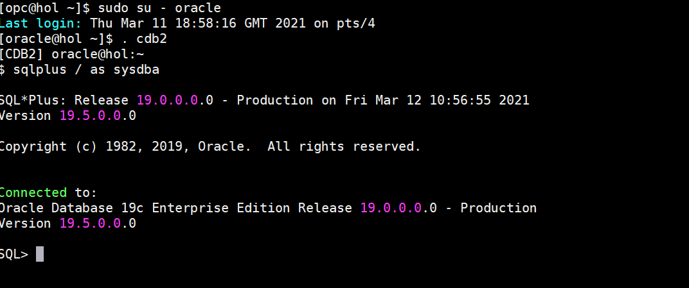

    ```
    <copy>
    create pluggable database PDB2 admin user adm identified by adm file_name_convert=('pdbseed', 'pdb2');
    </copy>
    ```

    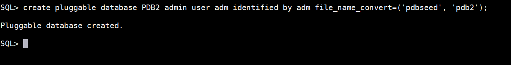

2.  The admin user needs to exist when a PDB gets created. You can delete it later on if desired. Once the PDB2 is created you need to start it up and create some additional objects for the migration.

    ```
    <copy>
    alter pluggable database PDB2 open;
    alter pluggable database PDB2 save state;
    alter session set container=PDB2;
    </copy>
    ```

    

    ```
    <copy>
    create directory mydir as '/u02/oradata/CDB2/mydir';
    grant read, write on directory mydir to system;
    create public database link SOURCEDB connect to system identified by oracle using 'FTEX';
    exit
    </copy>
    ```

    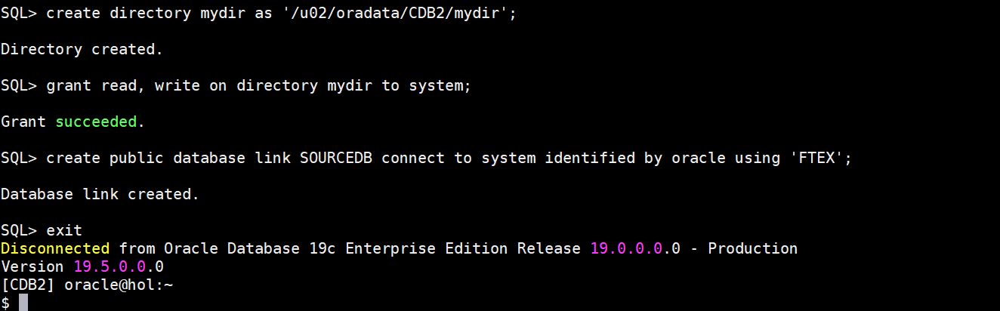

    We will use the database link to allow Data Pump pulling all information via the database link. The task can be done without the database link but then two operations are necessary, an expdp and an impdp.

## Task 2: Prepare FTEX

Before we can transport anything, we need to prepare the FTEX database.

1. You will switch the one tablespace we will migrate to Read-Only.

    ```
    <copy>
    . ftex
    sqlplus / as sysdba
    </copy>
    ```
    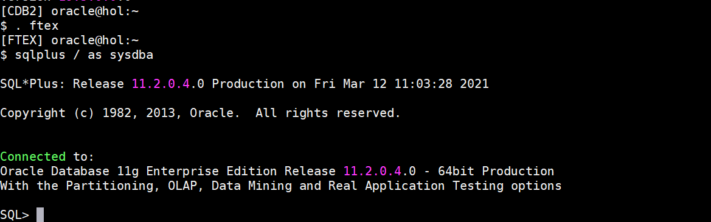

    ```
    <copy>
    alter tablespace USERS read only;
    exit
    </copy>
    ```
    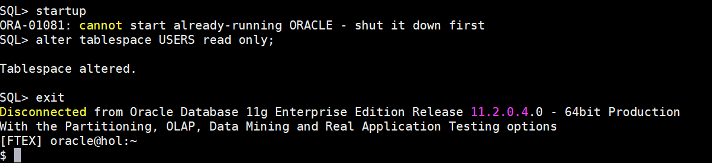

2. Migrate FTEX into PDB2.  At first of course you need to transfer the file (aka "copy") to the new environment.

    ```
    <copy>
    cp /u02/oradata/FTEX/users01.dbf /u02/oradata/CDB2/pdb2
    </copy>
    ```
    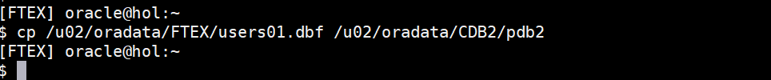

3. Then you need to initiate the transport operation. In this case Data Pump will take over the usual manual steps from Transportable Tablespaces. The keywords TRANSPORTABLE=ALWAYS and FULL=Y advice Data Pump to use the Full Transportable Export/Import feature. VERSION=12 is needed as we use an 11g database as source.

    ```
    <copy>
    . cdb2
    impdp system/oracle@pdb2 network_link=sourcedb version=12 full=y transportable=always metrics=y exclude=statistics directory=mydir logfile=pdb2.log transport_datafiles='/u02/oradata/CDB2/pdb2/users01.dbf'
    </copy>
    ```

    Please ignore the password warning errors: UDI-28002: operation generated ORACLE error 28002 and ORA-28002: the password will expire within 7 days.

    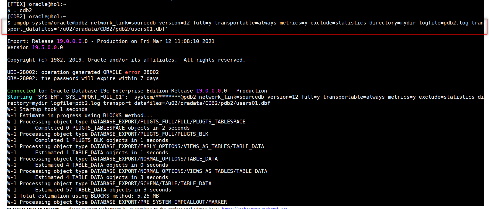

    THIS IS AN ALTERNATE OPTION ONLY - DON'T EXECUTE IT IF YOU HAVE RUN THE IMPDP ALREADY!
    In the /home/oracle/IMP directory you will find a file called ft.par . This is the parameter file for Data Pump containing the above parameters. You can use it instead of typing the long line above with:

    ```
    <copy>
    impdp system/oracle@pdb2 parfile=/home/oracle/IMP/ft.par
    </copy>
    ```


4. Once the operation is completed (it takes between 2 and 3 minutes) you can shutdown FTEX. You will find some error messages. This particular one can be safely ignored as the object belongs to Advanced Replication.
    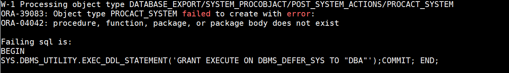

    <!-- ```
    W-1 Processing object type DATABASE_EXPORT/SYSTEM_PROCOBJACT/POST_SYSTEM_ACTIONS/PROCACT_SYSTEM
    ORA-39083: Object type PROCACT_SYSTEM failed to create with error:
    ORA-04042: procedure, function, package, or package body does not exist

    Failing sql is:
    BEGIN
    SYS.DBMS_UTILITY.EXEC_DDL_STATEMENT('GRANT EXECUTE ON DBMS_DEFER_SYS TO "DBA"');COMMIT; END;

    W-1      Completed 4 PROCACT_SYSTEM objects in 25 seconds
    ``` -->
5. Shutdown the FTEX database.

    ```
    <copy>
    . ftex
    sqlplus / as sysdba
    </copy>
    ```
    ```
    <copy>
    alter tablespace users read write;
    shutdown immediate
    exit
    </copy>
    ```
    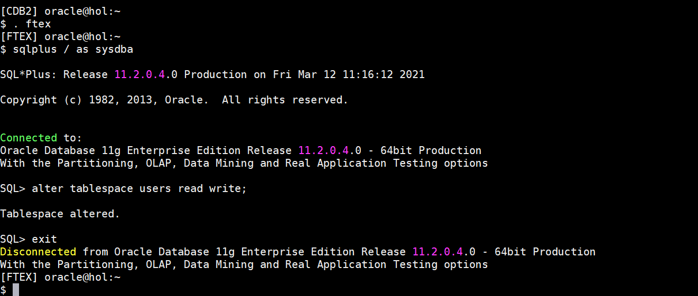

6. You can now connect to the migrated PDB.

    ```
    <copy>
    . cdb2
    sqlplus "system/oracle@PDB2"
    </copy>
    ```
    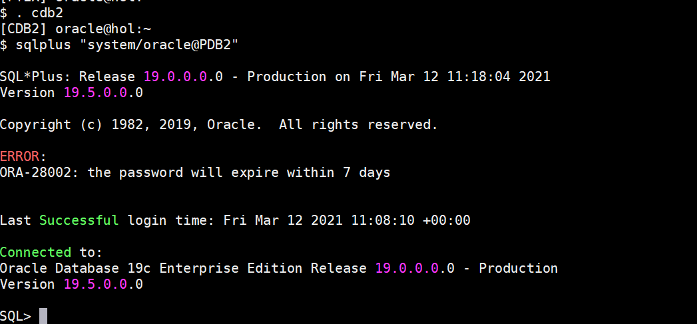

    ```
    <copy>
    show con_id
    show con_name
    exit
    </copy>
    ```
    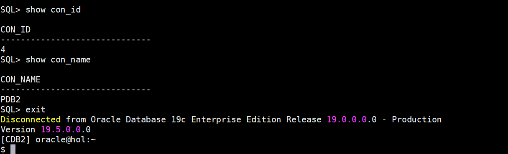

7. Note: You have to switch into the 19c environment to do this. If you execute the same “show” commands from the 11.2 SQL*Plus, you will receive errors.

## Task 3: Migration to Oracle Cloud or Cloud Machine

1. The Migration to Oracle Cloud or Cloud Machine feature can be used to migrate to Oracle Cloud or ExaCC machines.

You may now *proceed to the next lab*.

## Learn More

* [Transportable Whitepaper](https://www.google.com/url?sa=t&rct=j&q=&esrc=s&source=web&cd=&cad=rja&uact=8&ved=2ahUKEwjS_Z6SyPPuAhXxdM0KHV55AcoQFjADegQIARAD&url=https%3A%2F%2Fwww.oracle.com%2Ftechnetwork%2Fdatabase%2Fenterprise-edition%2Ffull-transportable-wp-18c-4394831.pdf&usg=AOvVaw3ya8bunmf1sanswdy5rDUL)
* [Transportable Export/Import](https://docs.oracle.com/en/database/oracle/oracle-database/19/admin/transporting-data.html#GUID-FA4AAD15-5305-45A9-9644-DB7D7DCD30D2)

## Acknowledgements

* **Author** - Mike Dietrich, Database Product Management
* **Contributors** -  Roy Swonger, Sanjay Rupprel, Cristian Speranta, Kay Malcolm
* **Last Updated By/Date** - Mike Dietrich, July 2021
