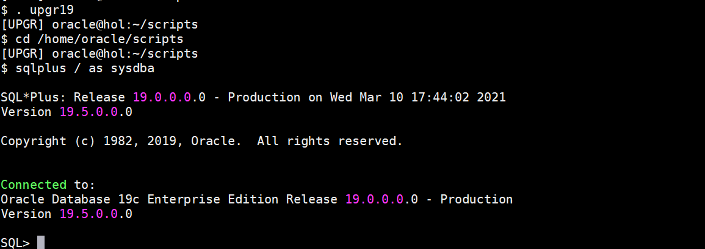
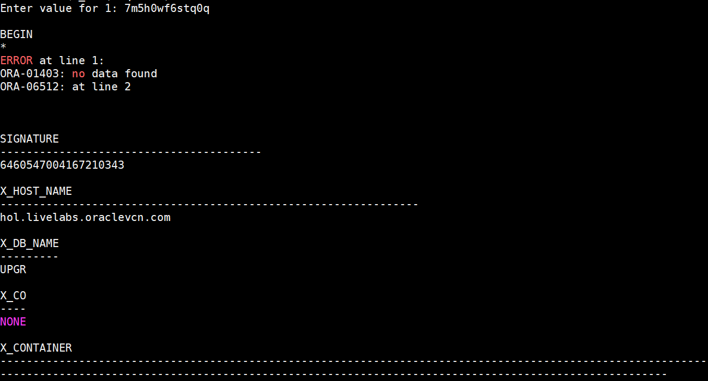
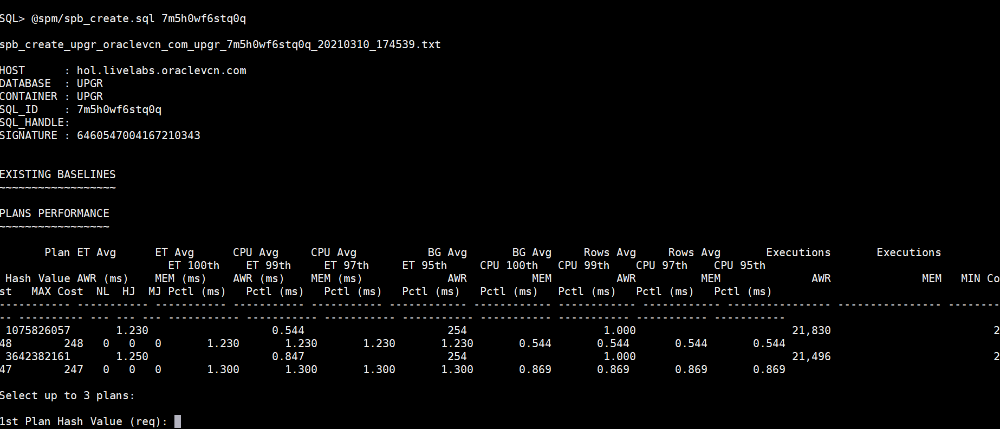
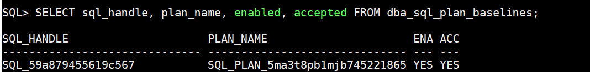
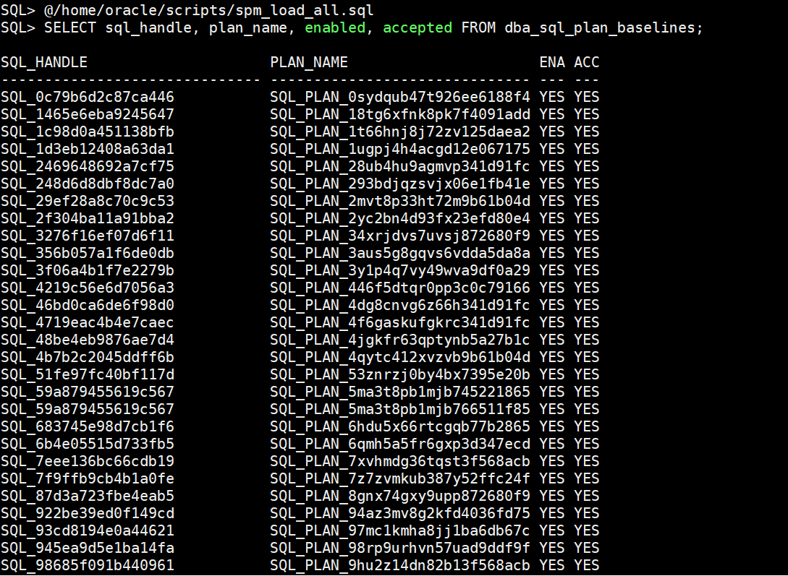

# SQL Plan Management

## Introduction

In the previous section you did find slow SQL statements with the SQL Performance Analyzer. Now we can use SQL Plan Management to fix the plans. The question is: Is this always necessary and useful?

The SQL Performance Analyzer reports overall showed good results for the run in Oracle 19c.

You could now try to fix a specific plan which has been changed or just write down all the plans from the SQL Tuning Set into the SQL Plan Baseline in Oracle 19c. Let us see if the results are good or if it is a better option to allow the optimizer to find newer paths.

Estimated Time: 20 minutes


In this lab we use scripts written by Carlos Sierra.

Watch the video below for a quick walk through of the lab.
[Watch the video](youtube:2_b-gRm09cU)

### About SQL Plan Management

SQL plan management is a preventative mechanism that enables the optimizer to automatically manage execution plans, ensuring that the database uses only known or verified plans.

SQL plan management uses a mechanism called a SQL plan baseline, which is a set of accepted plans that the optimizer is allowed to use for a SQL statement.

In this context, a plan includes all plan-related information (for example, SQL plan identifier, set of hints, bind values, and optimizer environment) that the optimizer needs to reproduce an execution plan. The baseline is implemented as a set of plan rows and the outlines required to reproduce the plan. An outline is a set of optimizer hints used to force a specific plan.

The main components of SQL plan management are as follows:

Plan capture
- This component stores relevant information about plans for a set of SQL statements.

Plan selection
- This component is the detection by the optimizer of plan changes based on stored plan history, and the use of SQL plan baselines to select appropriate plans to avoid potential performance regressions.

Plan evolution
- This component is the process of adding new plans to existing SQL plan baselines, either manually or automatically. In the typical use case, the database accepts a plan into the plan baseline only after verifying that the plan performs well.


### Objectives

In this lab, you will:
* Fix A Single Statement
* Fix All Statements

### Prerequisites

This lab assumes you have:

- An Oracle Cloud account
- You have completed:
    - Lab: Prepare Setup 
    - Lab: Environment Setup
    - Lab: Initialize Environment

## Task 1: Fix a single statement

1. Run the statements below.
      ```
      <copy>
      . upgr19
      cd /home/oracle/scripts
      sqlplus / as sysdba
      </copy>
      ```
      

2. Here we will use one of Carlos Sierra’s scripts: spb_create.sql:

      ```
      <copy>
      @spb_create.sql
      </copy>
      ```
      

3. *Please be aware that the following example often will show only one plan, and hence the script may not work as intended*
   The script asks you for the SQL_ID first.  Type in: **7m5h0wf6stq0q**.  Then it should display the potential plans:
      
      

    ```
      PLANS PERFORMANCE
      ~~~~~~~~~~~~~~~~~

            Plan ET Avg      ET Avg      CPU Avg     CPU Avg           BG Avg       BG Avg     Rows Avg     Rows Avg       Executions       Executions                                   ET 100th    ET 99th     ET 97th     ET 95th     CPU 100th   CPU 99th    CPU 97th    CPU 95th
      Hash Value AWR (ms)    MEM (ms)    AWR (ms)    MEM (ms)             AWR          MEM          AWR          MEM              AWR              MEM   MIN Cost   MAX Cost  NL  HJ  MJ Pctl (ms)   Pctl (ms)   Pctl (ms)   Pctl (ms)   Pctl (ms)   Pctl (ms)   Pctl (ms)   Pctl (ms)
      ----------- ----------- ----------- ----------- ----------- ------------ ------------ ------------ ------------ ---------------- ---------------- ---------- ---------- --- --- --- ----------- ----------- ----------- ----------- ----------- ----------- ----------- -----------
      3642382161       1.914                   1.241                      254                     1.000                        21,302                         244        244   0   0   0       1.914       1.914       1.914       1.914       1.241       1.241       1.241       1.241
      1075826057       3.839                   2.040                      254                     1.000                        21,555                         248        248   0   0   0       3.960       3.960       3.960       3.960       2.091       2.091       2.091       2.091

      The first plan is the better plan – found after upgrade. We will fix it now by accepting it as THE plan we’d like to be used for future executions of statement with SQL_ID: 7m5h0wf6stq0q

      Select up to 3 plans:
      1st Plan Hash Value (req): 3642382161
      2nd Plan Hash Value (opt): 1075826057
      ```

4. Hit RETURN, RETURN and again RETURN (and maybe a forth time).  Verify if the plans have been accepted. If there was only one plan listed above, the following query will return no rows.

      ```
      <copy>
      SELECT sql_handle, plan_name, enabled, accepted FROM dba_sql_plan_baselines;
      </copy>
      ```
      

      ```
      SQL_HANDLE                     PLAN_NAME                      ENA ACC
      -----------------------------  ------------------------------ --- ---
      SQL_59a879455619c567           SQL_PLAN_5ma3t8pb1mjb766511f85 YES YES

      ```

If you like to dig deeper “Why has this plan changed?”, Franck Pachot has done an excellent showcase on the basis of the lab to find out what exact optimizer setting has caused this plan change.

## Task 2: Fix all statements

Now we pin down all possible statements collected in the SQL Tuning Set STS_CaptureCursorCache – and verify with SQL Performance Analyzer again the effect.

1. Use spm\_load\_all.sql

      ```
      <copy>
      @spm_load_all.sql
      </copy>
      ```
      

2. Observe the changes that have taken place

      ```
      <copy>
      SELECT sql_handle, plan_name, enabled, accepted FROM dba_sql_plan_baselines;
      </copy>
      ```
      

3. You ACCEPTED all previous plans from before the upgrade and added them to the SQL Plan Baseline.  Once you “fixed” the plans, use the SQL Performance Analyzer to verify the plans and the performance.

      ```
      <copy>
      @spa_cpu.sql
      @spa_report_cpu.sql
      </copy>
      ```
      ```
      <copy>
      @spa_elapsed.sql
      @spa_report_elapsed.sql
      </copy>
      ```

4. Compare the two resulting reports again. Then compare them to the two examples from the previous run.

    ```
    <copy>
    cd /home/oracle/scripts
    firefox compare_spa_* &
    </copy>
    ```
    

    It may happen that "fixing" ALL statements results in worse CPU_TIME compared to 11.2.0.4 – the initial run in 19c may have been better!
    This is one of the reasons why you should test your plans instead of just “fixing them to behave as before”.

    What is the outcome?
    Allow the new release to find new, sometimes better plans. Even though your most critical statements should be stable at first, you should allow changes to benefit from better performance.

    The idea of testing is that you identify the really bad statements and plans, and fix them. But not all of them.

    Carlos Sierra: Plan Stability

You may now *proceed to the next lab*.

## Learn More

- MOS Note: 789888.1
[How to Load SQL Plans into SQL Plan Management (SPM) from the Automatic Workload Repository (AWR)](https://support.oracle.com/epmos/faces/DocumentDisplay?id=789888.1)

- MOS Note: 456518.1
[How to Use SQL Plan Management (SPM) – Plan Stability Worked Example](https://support.oracle.com/epmos/faces/DocumentDisplay?id=456518.1)

- White Paper:
[SQL Plan Management with Oracle Database 12c Release 2](http://www.oracle.com/technetwork/database/bi-datawarehousing/twp-sql-plan-mgmt-12c-1963237.pdf)

## Acknowledgements
* **Author** - Mike Dietrich - Scripts provided by: Carlos Sierra
* **Contributors** -  Roy Swonger, Sanjay Rupprel, Cristian Speranta, Kay Malcolm
* **Last Updated By/Date** - Mike Dietrich, July 2021
