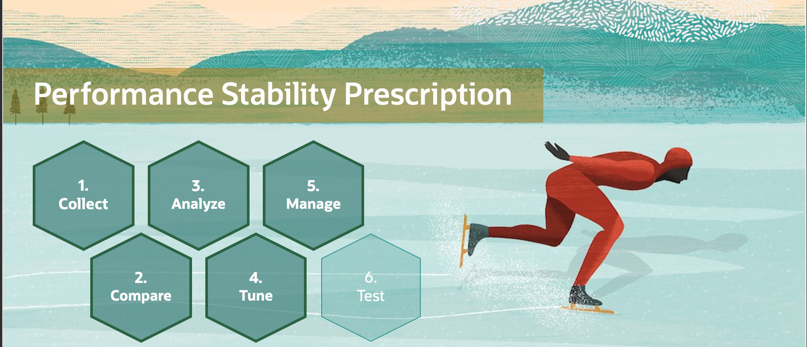
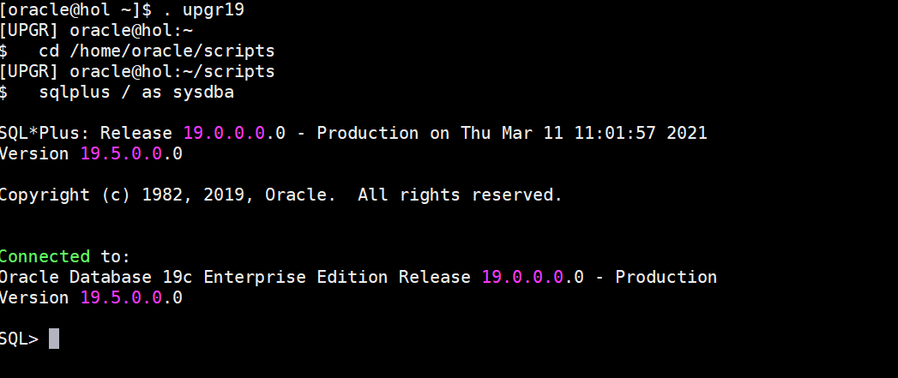
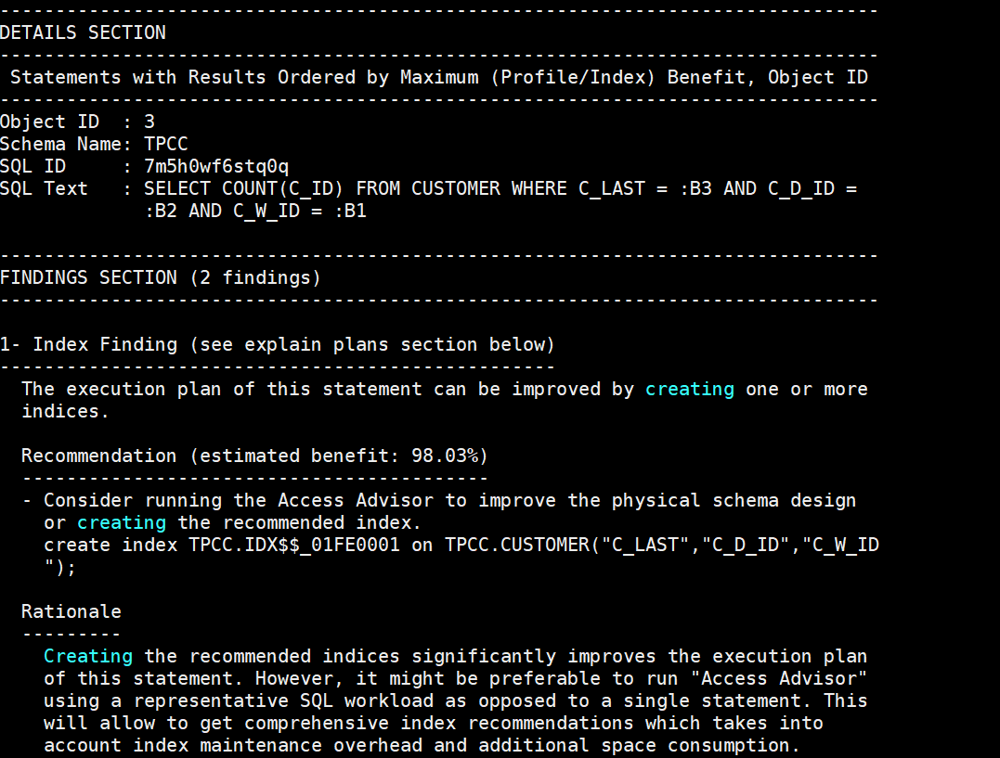
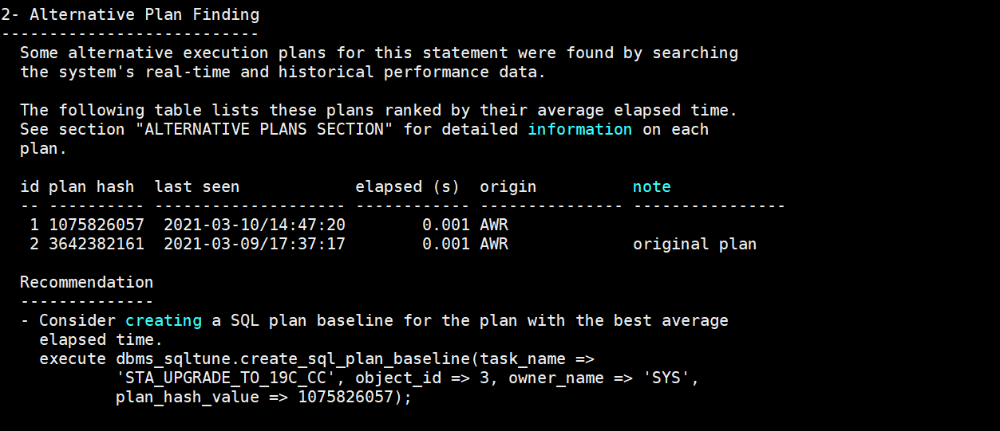
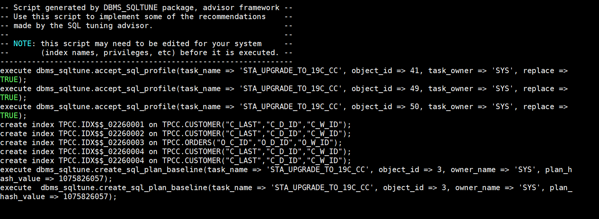
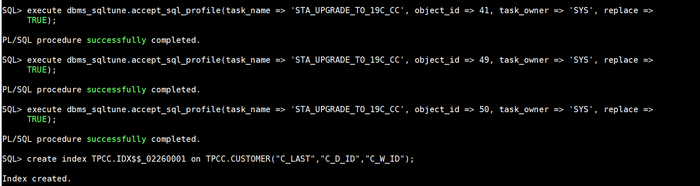
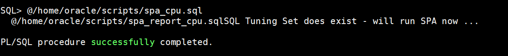
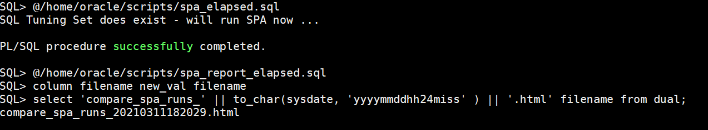

# SQL Tuning Advisor

## Introduction

In the previous section you fixed plans with SQL Plan Management. But let us see what else could be done and ask the SQL Tuning Advisor (STA).

Estimated Time: 10 minutes



You will pass the SQL Tuning Set from the “Load” exercise where you captured the HammerDB workload directly from Cursor Cache to the SQL Tuning Advisor and check the results.
Analyze the SQL Tuning Set and generate recommendations

A complete script is provided: `sta_cc.sql`.

Watch the video below for a quick walk through of the lab.
[Watch the video](youtube:lDID_2uPxaI)

### About SQL Tuning Advisor

SQL Tuning Advisor is SQL diagnostic software in the Oracle Database Tuning Pack.

You can submit one or more SQL statements as input to the advisor and receive advice or recommendations for how to tune the statements, along with a rationale and expected benefit.

### Objectives

In this lab, you will:

* Generate a tuning task with the SQL Tuning Set `STS_CaptureCursorCache`
* Run a tuning task where the SQL Tuning Advisor simulates the execution
* Generate a result report in TEXT format
* Generate statements to implement the findings

### Prerequisites

This lab assumes you have:

- An Oracle Cloud account
- You have completed:
    - Lab: Prepare Setup 
    - Lab: Environment Setup
    - Lab: Initialize Environment

## Task 1: Generate a tuning task

1. Execute the SQL Tuning Advisor script `sta_cc.sql` to create, execute and report a complete tuning task.

    ```
    <copy>
    . upgr19
    cd /home/oracle/scripts
    sqlplus / as sysdba
    </copy>
    ```
    

    ```
    <copy>
    @sta_cc.sql
    </copy>
    ```


2. It will take 30 seconds to check the output by scrolling up. Displayed below are the first two findings for a COUNT statement on the CUSTOMER table.
    
    

    You see that the SQL Tuning Advisor interacts with SQL Plan Management from the previous exercise as well.

  **And please note that your output may vary from the screenshots. So please read and interpret your own output rather than comparing it with the screenshots.**

  When you scroll to the end, you will find the implementation section:
    

3. Firstly, remove the duplicate recommendations. You will not need several identical indexes with different names on TPCC.CUSTOMER for sure.

   ** Please read your output and either copy&paste it into an editor, or copy&paste statements statement-by-statement into the session.**

    Try tp fix everything but eliminate duplicate recommendations.

    This is an exercise only. Please do not do this in a real environment without proper verification.

    But let us implement all the recommendations and see what happens.

    


4. Wait for a while until all statements have been executed. Subsequently, repeat the SQL Performance Analyzer runs from the previous exercise and verify the results.
    ```
    <copy>
    @spa_cpu.sql
    @spa_report_cpu.sql
    </copy>
    ```
    
    ```
    <copy>
    @spa_elapsed.sql
    @spa_report_elapsed.sql
    </copy>
    ```
    
    ```
    <copy>
    exit
    </copy>
    ```

5. Compare the two resulting reports again. Then compare them to the examples from the previous run. Firefox will open several tabs, one for each report.

    ```
    <copy>
    cd /home/oracle/scripts
    firefox compare_spa_* &
    </copy>
    ```
    

    It should look similar to the ones below. More isn not always better. Be careful just implementing recommendations. Test and verify them step by step.

You may now *proceed to the next lab*.

## Learn More

* [SQL Tuning Advisor](https://docs.oracle.com/en/database/oracle/oracle-database/19/tgsql/sql-tuning-advisor.html#GUID-8E1A39CB-A491-4254-8B31-9B1DF7B52AA1)

## Acknowledgements
* **Author** - Mike Dietrich
* **Contributors** -  Roy Swonger, Sanjay Rupprel, Cristian Speranta, Kay Malcolm
* **Last Updated By/Date** - Mike Dietrich, July 2021
