# AutoUpgrade

## Introduction

In this part of the Lab you will upgrade the UPGR database from Oracle 11.2.0.4 to Oracle 19c. You can find detailed steps including the output for an upgrade and migration to Multitenant with AutoUpgrade [here](https://mikedietrichde.com/2020/05/20/autoupgrade-and-plug-in-to-a-cdb-with-a-single-command/). This is for your information in case you cannot complete the lab here.

You will use the AutoUpgrade and upgrade your UPGR database unattended. The Oracle AutoUpgrade tool is the only recommended way to upgrade Oracle databases, fully unattended. You can call it the Hands-Free Upgrade. It will run all prechecks against multiple databases, fix potential issues, set a restore point in case something goes wrong – and then upgrade your databases. And of course, do the postupgrade, recompilation and time zone adjustment.

The only thing you need to provide is a config file in text format.

Estimated Time: 45 minutes

Watch the video below for a quick walk through of the lab.
[Watch the video](youtube:BRR3YjQL7Kc)

### About AutoUpgrade

The AutoUpgrade utility identifies issues before upgrades, performs pre- and postupgrade actions, deploys upgrades, performs postupgrade actions, and starts the upgraded Oracle database.

The AutoUpgrade utility is designed to automate the upgrade process, both before starting upgrades, during upgrade deployments, and during postupgrade checks and configuration migration. You use AutoUpgrade after you have downloaded binaries for the new Oracle Database release, and set up new release Oracle homes. When you use AutoUpgrade, you can upgrade multiple Oracle database deployments at the same time, using a single configuration file, customized as needed for each database deployment.

### Objectives

In this lab, you will:

* Prepare your environment
* Analyze
* Deploy

### Prerequisites

This lab assumes you have:

- An Oracle Cloud account
- You have completed:
    - Lab: Prepare Setup 
    - Lab: Environment Setup
    - Lab: Initialize Environment

## Task 1: Preparation

1. The only task you will have to do when using the AutoUpgrade is to prepare a config file for the database(s).
2. The environment variable $OH19 is created only for your convenience. It always points to the Oracle 19c Home.

    ```
    <copy>
    . upgr
    cd /home/oracle/scripts
    java -jar $OH19/rdbms/admin/autoupgrade.jar -create_sample_file config
    </copy>
    ```
3. This tells you that the sample file has been created at:
   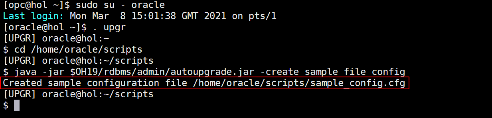

4. The created sample configuration file `/home/oracle/scripts/sample_config.cfg`
   You will need to edit it – and then pass it to the AutoUpgrade utility.

5. Open the file `/home/oracle/sample_config.cfg` in your preferred editor (text or graph mode)

    ```
    Text mode:
    <copy>
    vi /home/oracle/scripts/sample_config.cfg
    </copy>
    ```
    ```
    Graphical mode:
    <copy>
    kwrite /home/oracle/scripts/sample_config.cfg &
    </copy>
    ```
    

6. Make the following adjustments - only 6 lines (without comments) are needed - please remove the obsolete lines from the sample config file:

    ```
    <copy>
    # Global configurations
    # Autoupgrade's global directory, ...
    # temp files created and other ...

    global.autoupg_log_dir=/home/oracle/logs

    #
    # Database number 1
    #

    upg1.source_home=/u01/app/oracle/product/11.2.0.4
    upg1.target_home=/u01/app/oracle/product/19
    upg1.sid=UPGR
    upg1.log_dir=/home/oracle/logs
    upg1.restoration=no
    </copy>
    ```    
    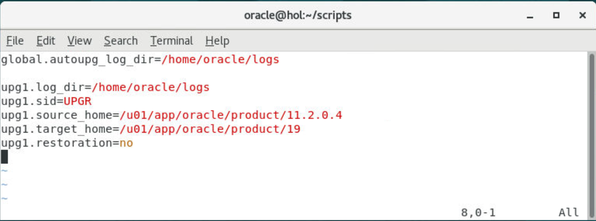


7. Save the file and name it as UPGR.cfg in /home/oracle/scripts.  If you saved it under its original name, `sample_config.cfg`, rename it as shown below:

    ```
    <copy>
    mv /home/oracle/scripts/sample_config.cfg /home/oracle/scripts/UPGR.cfg
    </copy>
    ```
    

## Task 2: Analyze phase

1. It is best practice to run AutoUpgrade in analyze mode at first. Once the analyze phase is passed without issues, the database can be upgraded automatically (the below command is a one-line command!).

    ```
    <copy>
    . upgr
    java -jar $OH19/rdbms/admin/autoupgrade.jar -config /home/oracle/scripts/UPGR.cfg -mode analyze
    </copy>
    ```
    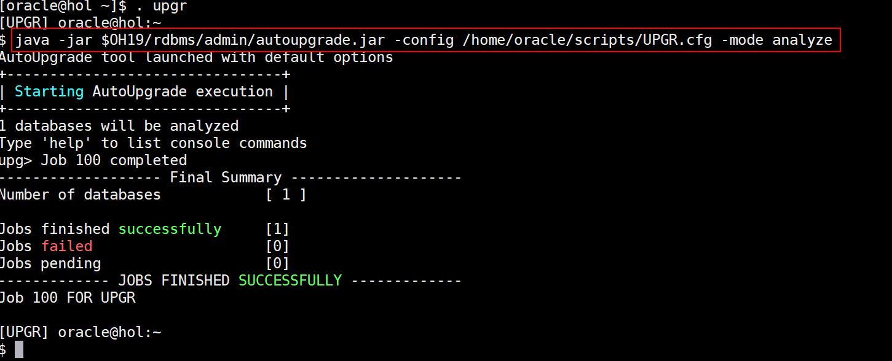

    <!--- This is an HTML comment in Markdown -->


2. You can try to monitor the analyze phase in the upg> job console – but you'll have to be very fast as the analyze run finishes within seconds:

    ```
    <copy>
    lsj
    </copy>
    ```

3. Please check also the HTML Output:

    ```
    <copy>
    firefox /home/oracle/logs/cfgtoollogs/upgrade/auto/status/status.html &
    </copy>
    ```

    Click on the "Precheck Report" link and browse through all the checks.
    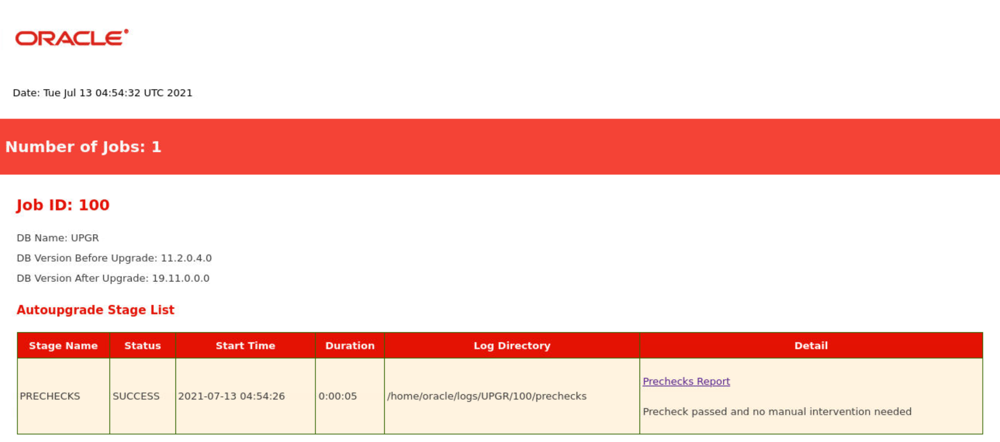

    You may see an ERROR - but please note that there is a FIXUP AVAILABLE which means that AutoUpgrade will fix this for you as otherwise the ERROR would prevent an upgrade.
    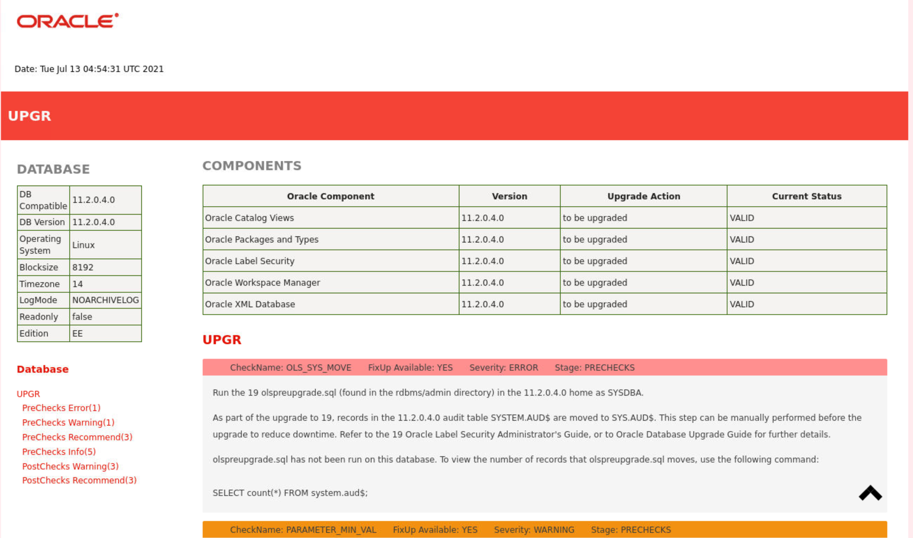

    Browse through the other checks as well.

    Then close Firefox.

## Task 3: Upgrade

1. When you initiate the upgrade with -mode deploy, the tool will repeat the analyze phase, but add the fixups, upgrade and postupgrade steps.

    ```
    <copy>
    java -jar $OH19/rdbms/admin/autoupgrade.jar -config /home/oracle/scripts/UPGR.cfg -mode deploy
    </copy>
    ```
    You will see the output below
    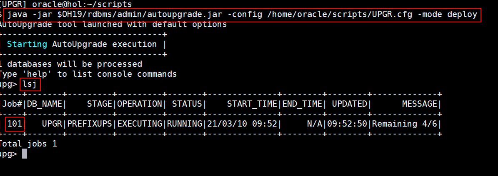


2. At this point you can monitor the upgrade now – enlarge the xterm‘s width a bit to see no line wraps.  Type 'help' on the upg> job console to see an overview of available commands.

    ```
    <copy>
    help
    </copy>
    ```

    ```
    upg> help
    exit                          // To close and exit
    help                          // Displays help
    lsj [(-r|-f|-p|-e) | -n ]     // list jobs by status up to n elements.
        -f Filter by finished jobs.
        -r Filter by running jobs.
        -e Filter by jobs with errors.
        -p Filter by jobs being prepared.
        -n  Display up to n jobs.
    lsr                           // Displays the restoration queue
    lsa                           // Displays the abort queue
    tasks                         // Displays the tasks running
    clear                         // Clears the terminal
    resume -job                   // Restarts a previous job that was running
    status [-job  [-long]]        // Lists all the jobs or a specific job
    restore -job                  // Restores the database to its state prior to the upgrade
    restore all_failed            // Restores all failed jobs to their previous states prior to the upgrade
    logs                          // Displays all the log locations
    abort -job                    // Aborts the specified job
    h[ist]                        // Displays the command line history
    /[]                           // Executes the command specified from the history. The default is the last command
    ```

3. The most important commands are:

    lsj – this lists the job number and overview information about each active job.
    Please note that the job number has now changed for the -mode deploy run.

    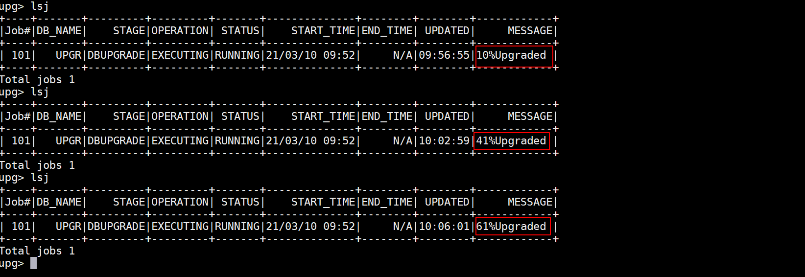

    ```
    <copy>
    lsj
    </copy>
    ```

    ```
    upg> lsj
    +----+-------+---------+---------+--------+--------------+--------+--------+-------------+
    |Job#|DB_NAME|    STAGE|OPERATION|  STATUS|    START_TIME|END_TIME| UPDATED|      MESSAGE|
    +----+-------+---------+---------+--------+--------------+--------+--------+-------------+
    | 101|   UPGR|PREFIXUPS|EXECUTING| RUNNING|19/10/17 23:15|     N/A|23:15:28|Remaining 3/3|
    +----+-------+---------+---------+--------+--------------+--------+--------+-------------+
    Total jobs 2

    status -job <number> – this gives you more information about a specific job.
    ```

4. And 'status -job jobnr' which tells you more details. It also displays where the log files are located.

    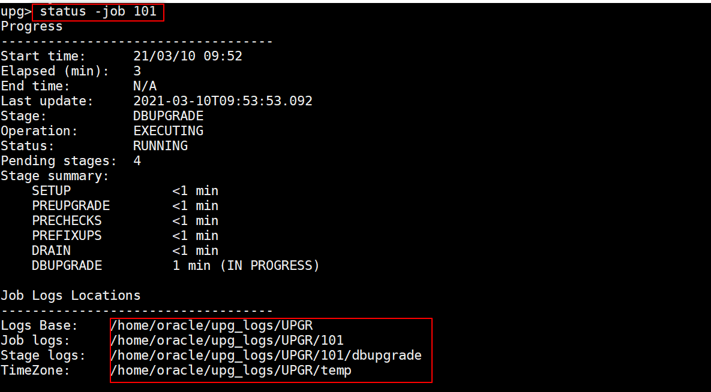
    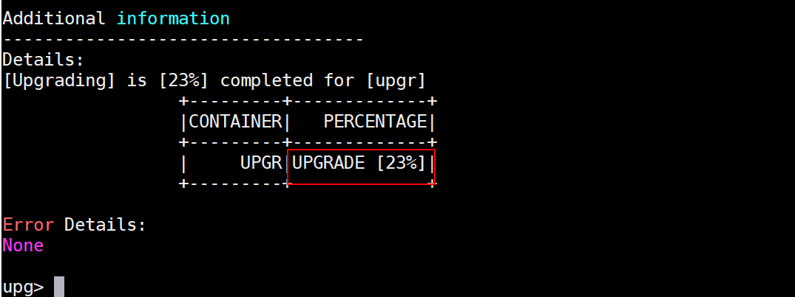

    ```
    <copy>
    status -job 101
    </copy>
    ```

    ```
    upg> status -job 101

    Progress
    -----------------------------------
    Start time:      19/10/17 23:16
    Elapsed (min):   1
    End time:        N/A
    Last update:     2019-10-17T23:16:58.468
    Stage:           PREFIXUPS
    Operation:       EXECUTING
    Status:          RUNNING
    Pending stages:  6
    Stage summary:
        SETUP             <1 min
        PREUPGRADE        <1 min
        PRECHECKS         <1 min
        GRP               <1 min
        PREFIXUPS         <1 min (IN PROGRESS)

    Job Logs Locations
    -----------------------------------
    Logs Base:    /home/oracle/upg_logs/UPGR
    Job logs:     /home/oracle/upg_logs/UPGR/101
    Stage logs:   /home/oracle/upg_logs/UPGR/101/prefixups
    TimeZone:     /home/oracle/upg_logs/UPGR/temp

    Additional information
    -----------------------------------
    Details:
    +--------+----------------+-------+
    |DATABASE|           FIXUP| STATUS|
    +--------+----------------+-------+
    |    UPGR|DICTIONARY_STATS|STARTED|
    +--------+----------------+-------+

    Error Details:
    None
    ```

5. Then 'logs' – displays the logs folder
   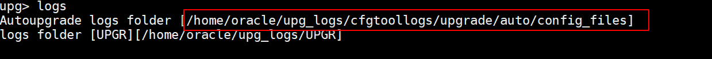

    ```
    <copy>
    logs
    </copy>    
    ```

6. Please open a second xterm tab and go to the logs folder.

    ```
    <copy>
    cd /home/oracle/logs/UPGR/
    </copy>
    ```

7. Explore the subdirectories, especially /home/oracle/upg\_logs/UPGR/101 and below. Check the /home/oracle/upg\_logs/UPGR/101/prechecks subdirectory. It contains the preupgrade.log:

    ```
    <copy>
    cd prechecks
    more upgr_preupgrade.log
    </copy>
    ```

8. Now change the directoy and see whether the dbupgrade directory has been created. This usually takes up to 4 minutes until the prechecks and fixups have been completed. You will find the 4 upgrade worker’s logs in cd` /home/oracle/upg_logs/UPGR/101/dbupgrade`. These 4 subdirectories get created before dbupgrade.

    ```
    prechecks
    prefixups
    preupgrade
    drain
    ```

9. You can now easily monitor the entire upgrade just within Firefox. The page will be refreshed automatically. You don't need to push the RELOAD button.
    ```
    <copy>
    firefox /home/oracle/logs/cfgtoollogs/upgrade/auto/state.html &
    </copy>
    ```
    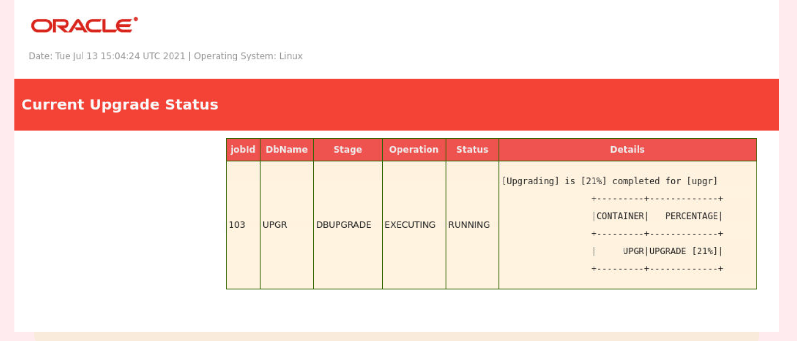

11. Wait until the upgrade completed. Depending on the hardware, the upgrade will take about 25-35 minutes.
*If you don't want to watch the screen this long, you could meanwhile approach Lab 13: Transportable Export Import as it uses another database, and then return to this lab stage here again - don't close the xterm, don't exit AutoUpgrade.*

    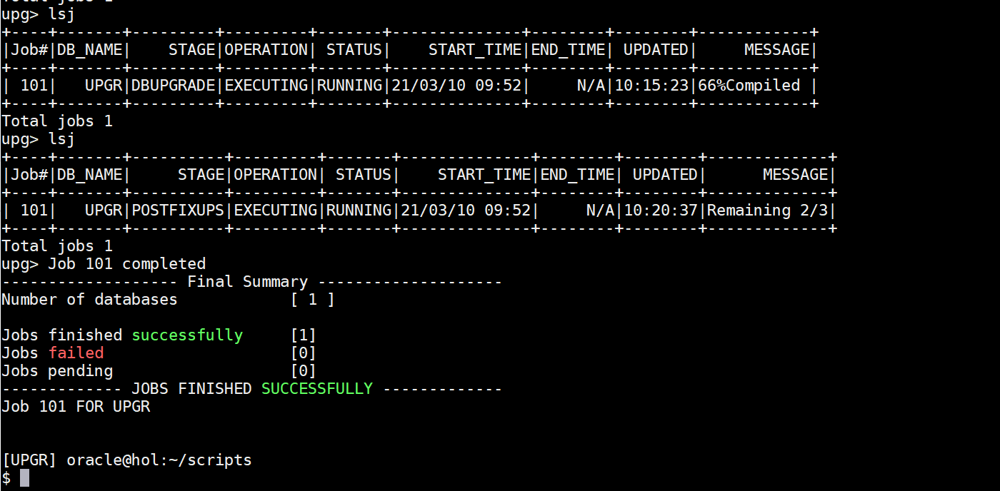

    ```
    <copy>
    exit
    </copy>
    ```
    If you accidentally closed the xterm or autoupgrade, then no panic please. Just open an xterm, set the environment with '. upgr19' and start AutoUpgrade with the exact same 'deploy' command again. It will resume from where it has been left of.

    Congratulations – you upgraded the UPGR database successfully from Oracle 11.2.0.4 to Oracle 19c.

You may now *proceed to the next lab*.

## Learn More

* [MOS Note: 2485457.1 Auto Upgrade Tool](https://support.oracle.com/epmos/faces/DocumentDisplay?id=2485457.1)
* [Using AutoUpgrade for Oracle Database Upgrades](https://docs.oracle.com/en/database/oracle/oracle-database/19/upgrd/using-autoupgrade-oracle-database-upgrades.html#GUID-71883C8C-7A34-4E93-8955-040CB04F2109)
* [AutoUpgrade Blog](https://mikedietrichde.com/2019/04/29/the-new-autoupgrade-utility-in-oracle-19c/)

## Acknowledgements
* **Author** - Mike Dietrich, Database Product Management
* **Contributors** -  Roy Swonger, Kay Malcolm, Database Product Management
* **Last Updated By/Date** - Mike Dietrich, July 2021
