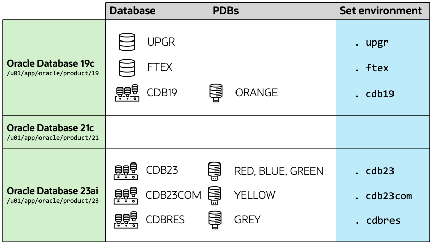
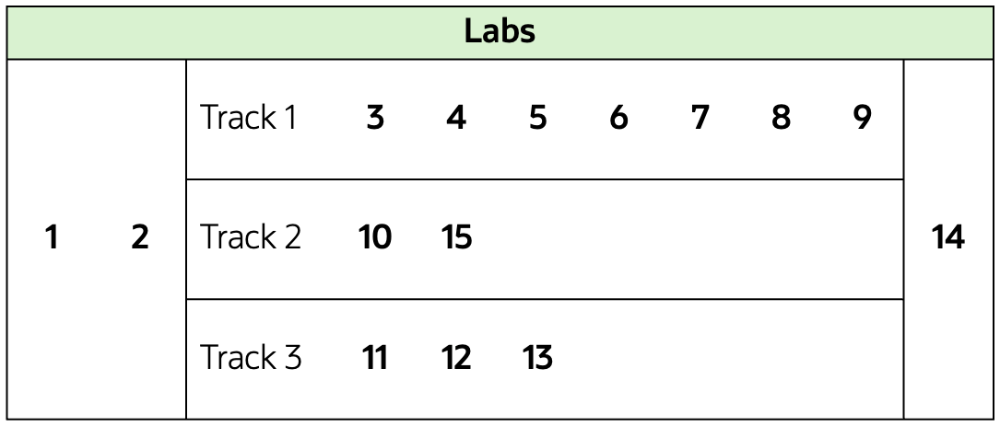

# Introduction

## About this Workshop

Oracle Database 23ai is a *Long Term Support Release*. It is available or will be available on all popular on-prem platforms, Oracle Exadata Database Machine, Oracle Database Appliance, and in Oracle Cloud Infrastructure. As the latest Long Term Support Release, it offers customers the highest levels of stability and the longest error correction support. And, by upgrading to Oracle Database 23ai, customers will have Premier Support until the end of April 2029 and Extended Support until end of April 2032.  There is a direct upgrade path to Oracle Database 23ai from Oracle Database 19c and 21c, regardless of the Release Update applied.

Estimated Workshop Time: 120 minutes

[Hitchhiker's Guide Introduction](youtube:lwvdaM4v4tQ)

### Objectives

In this workshop, you will:

* Upgrade databases
* Use Performance Stability Perscription to ensure performance stability
* Convert to multitenant architecture
* Migrate databases using Data Pump and transportable tablespaces

## About the workshop contents

This workshop comes with pre-installed Oracle homes and pre-created databases.
You can switch between environments with the shortcuts shown in the last column of the below diagram.

The lab contains 15 labs.

* You start by completing labs 1 and 2.
* Track 1 is the primary track. You should focus on labs 3 to 9.
* When time allows, you can work on tracks 2 and 3.
* In tracks 2 and 3, the order of the individual labs don't matter. You can perform the labs in any order, but only one lab from one track at a time.
* As the last lab, you can perform lab 14.

## Upgrade and data migration methods and processes

### AutoUpgrade

- AutoUpgrade is the only recommended tool to upgrade Oracle databases. Whether you want to upgrade only one or thousands of databases, AutoUpgrade performs not only the upgrade but also all the pre and post-upgrade tasks. It can upgrade many databases in parallel and allows all sorts of customizations needed in today's complex environments. Furthermore, AutoUpgrade can also plugin your database into a precreated CDB and does the conversion of a non-CDB into a PDB fully unattended. AutoUpgrade works on all supported platforms, for non-CDB and CDBs, for all or only selected pluggable databases.

### Migrating data using Oracle Data Pump

- Data Pump provides export and import capabilities. Oracle Data Pump can perform a full or partial export from your database, followed by a full or partial import into the new release of Oracle Database. Data Pump allows to migrate directly into PDBs as well and works independently of the source database version across versions and operating system platforms. In addition, Data Pump in conjunction with transportable tablespaces takes away the complexity of rebuilding all the metadata objects with just one command as Full Transportable Export/Import.

You may now *proceed to the next lab*.

## Learn More

* Documentation, [Database Upgrade Guide](https://docs.oracle.com/en/database/oracle/oracle-database/23/upgrd/intro-to-upgrading-oracle-database.html#GUID-FA024F34-A61A-4C4B-AA60-C123A9191A16)
* Blog, [Upgrade your Database - NOW!](https://MikeDietrichDE.com)
* My Oracle Support, [Oracle Databases Release and Support Coverage](https://support.oracle.com/epmos/faces/DocumentDisplay?id=742060.1&displayIndex=1)

## Acknowledgements
* **Author** - Daniel Overby Hansen
* **Contributors** - Klaus Gronau, Rodrigo Jorge, Alex Zaballa, Mike Dietrich
* **Last Updated By/Date** - Daniel Overby Hansen, June 2024
