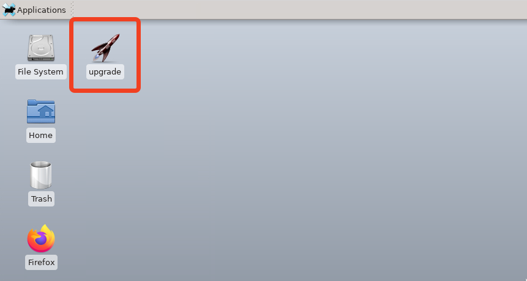
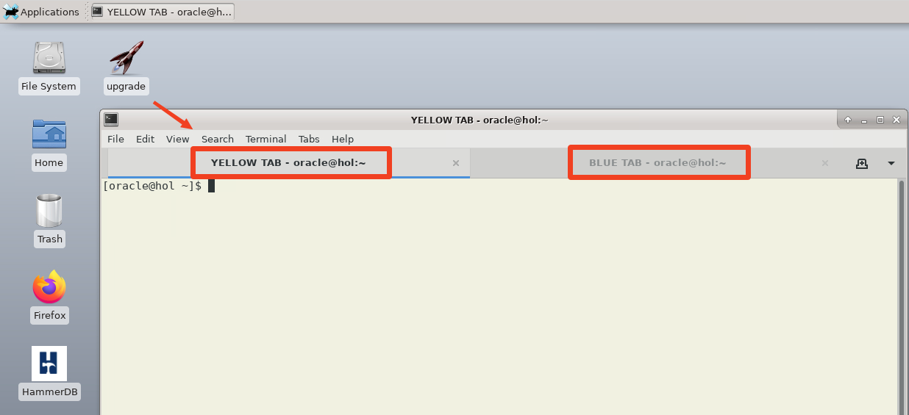

# Initialize Environment

## Introduction

In this lab, you will review and startup all components required to successfully run this workshop.

Estimated Time: 5 Minutes.

### Objectives

In this lab, you will:

* Familiarize yourself with the workshop environment
* Initialize the workshop environment

## Task 1: Familiarize yourself with the workshop environment

1. The easiest way to complete the lab is to copy/paste the lab instructions directly into a terminal. Be sure to execute all commands in a code block. After pasting you must hit RETURN.

2. Before copy/pasting take notice of the commands that you execute. It is important to understand what the commands will do.

3. Start a terminal by using the *upgrade* shortcut.

    

4. The upgrade terminal has two tabs (a yellow one and a blue one). Each tab is a terminal. Throughout the labs you will be instructed which terminal to use. The terminals are referred to as the *yellow terminal* and the *blue terminal*.

    

## Task 2: Initialize the workshop environment

1. Use the yellow terminal. When you start the lab, the following components should be started.

    - Database Listener
        - LISTENER
    - Database Server Instances
        - FTEX
        - UPGR
        - CDB23

3. Ensure the listener is started.

    ```
    <copy>
    ps -ef | grep LISTENER | grep -v grep
    </copy>
    ```

    <details>
    <summary>*click to see the output*</summary>
    ``` text
    $ ps -ef | grep LISTENER | grep -v grep
    oracle    2333     1  0 11:40 ?        00:00:00 /u01/app/oracle/product/19/bin/tnslsnr LISTENER -inherit
    ```
    </details>

4. Ensure that the databases (*FTEX*, *UPGR* and *CDB23*) are started.

    ```
    <copy>
    ps -ef | grep ora_ | grep pmon | grep -v grep
    </copy>
    ```

    <details>
    <summary>*click to see the output*</summary>
    ``` text
    $ ps -ef | grep ora_ | grep pmon | grep -v grep
    oracle      3851       1  0 20:19 ?        00:00:00 ora_pmon_UPGR
    oracle      5110       1  0 20:19 ?        00:00:00 ora_pmon_FTEX
    oracle      5345       1  0 20:19 ?        00:00:00 ora_pmon_CDB23
    ```
    </details>

You may now *proceed to the next lab*.

## Acknowledgements

* **Author** - Daniel Overby Hansen
* **Contributors** - Klaus Gronau, Rodrigo Jorge, Alex Zaballa, Mike Dietrich
* **Last Updated By/Date** - Daniel Overby Hansen, June 2024
