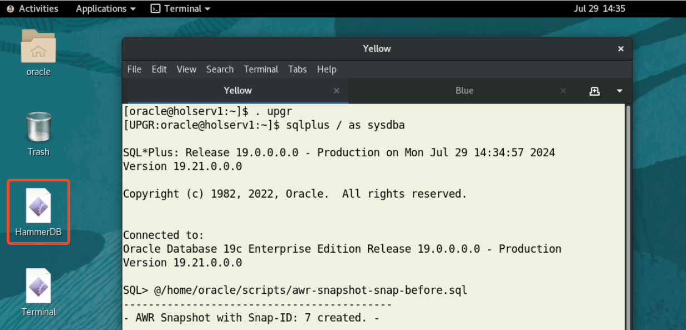
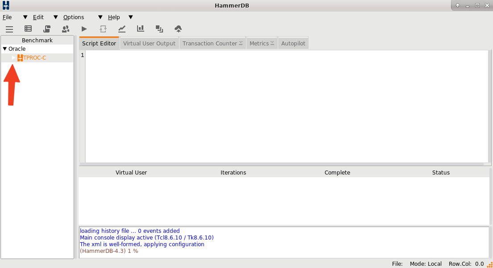
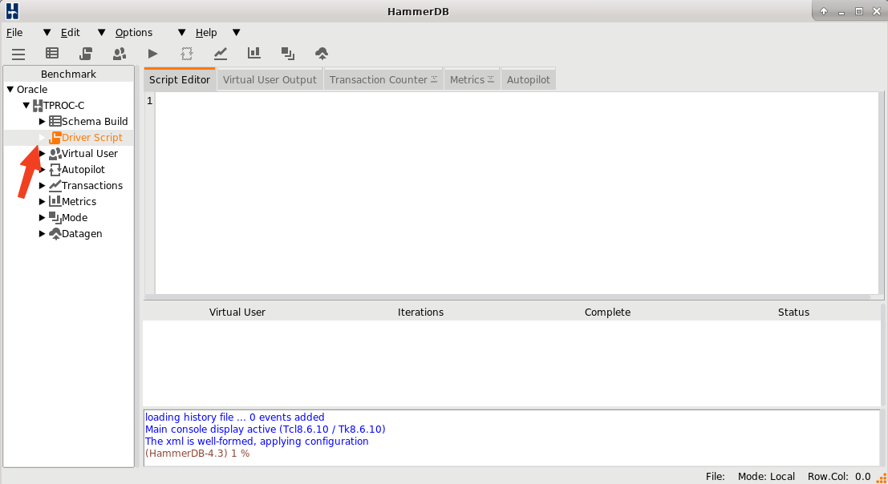
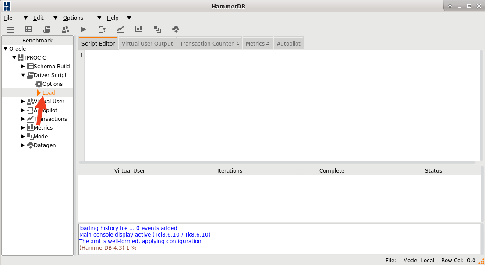
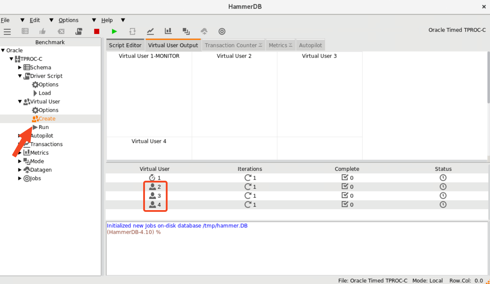
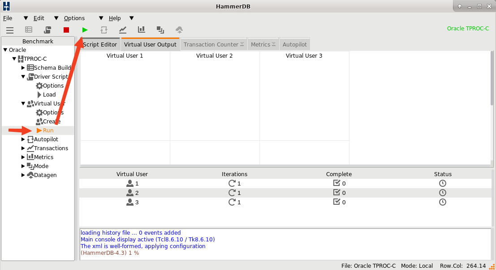
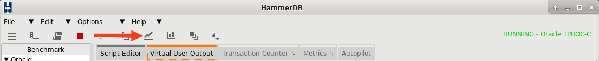

# Generate AWR Snapshot

## Introduction

In this lab, you will execute an application workload using HammerDB on the *UPGR* database. You will capture workload information that you can use later on to compare pre-upgrade performance to post-upgrade performance.

Estimated Time: 15 Minutes

[Hitchhiker's Guide Lab 3](youtube:lwvdaM4v4tQ?start=1290)

### Objectives

In this lab, you will:

- Generate an AWR snapshot
- Prepare workload
- Start workload
- Generate another AWR snapshot
- Export AWR (optional)

### Prerequisites

This lab assumes:

- You have completed Lab 1: Initialize Environment

## Task 1: Generate an AWR snapshot

1. Use the *yellow* terminal 🟨. Set the environment to the *UPGR* database and connect.

    ```
    <copy>
    . upgr
    sqlplus / as sysdba
    </copy>

    -- Be sure to hit RETURN
    ```

2. Use the script to generate an AWR snapshot. Take note of the snapshot ID (e.g.: 113). You need it later on.

    ```
    <copy>
    @/home/oracle/scripts/awr-snapshot-snap-before.sql
    </copy>
    ```

    <details>
    <summary>*click to see the output*</summary>
    ``` text
    SQL> @/home/oracle/scripts/awr-snapshot-snap-before.sql
    -------------------------------------------
    - AWR Snapshot with Snap-ID: 113 created. -
    -------------------------------------------
    ```
    </details>

    Your snapshot ID might differ from the one in the sample output.

3. Don’t exit the terminal. Keep SQL*Plus open.

4. Start HammerDB using the desktop shortcut. 

    

## Task 2: Prepare workload

1. In the benchmark list, expand *Oracle* / *TPROC-C*

    

2. Expand *Driver Script*.

    

3. Double-click on *Load*.

    

4. This populates the *Script Editor* tab with the driver script. Ignore any error messages.

5. Expand *Virtual Users* and double-click on *Create*. This creates three virtual users (users 2-4) for the workload. HammerDB creates an additional user for monitoring.
    

## Task 3: Start workload

Use HammerDB to start a workload. At the same time, capture workload information from the cursor cache into a SQL tuning set.

1. Back in the *yellow* terminal 🟨, run the capture script. The script polls the cursor cache every 10 seconds for three minutes. **Leave the script running and immediately proceed to the next step.** Do not press CTRL+C.

    ```
    <copy>
    @/home/oracle/scripts/capture_cc.sql
    </copy>
    ```

    <details>
    <summary>*click to see the output*</summary>
    ``` text
    SQL> @/home/oracle/scripts/capture_cc.sql
    Dropping SQL Tuning Set, if exists

    PL/SQL procedure successfully completed.

    Creating SQL Tuning Set

    PL/SQL procedure successfully completed.

    Now polling the cursor cache for 180 seconds every 10 seconds ...
    You get control back in 180 seconds.
    Do not press CTRL+C
    ```
    </details>

2. Click *Run* in the list. Start the load by clicking on the Run icon.

    

3. Click on the Graph / Transaction Counter icon in the top menu icon bar.
    

4. It will take a few seconds; then you will see the performance charts and the transactions-per-minute (tpm). The load run usually takes 2-3 minutes to complete.
    

5. Exit HammerDB.

6. Back in the *yellow* terminal 🟨, the script `capture_cc.sql` should be done by now. Examine the output. It lists how many statements it captured from the cursor cache and into the SQL Tuning Set.

    <details>
    <summary>*click to see the output*</summary>
    ``` text
    SQL> @/home/oracle/scripts/capture_cc.sql
    Dropping SQL Tuning Set, if exists

    PL/SQL procedure successfully completed.

    Creating SQL Tuning Set

    PL/SQL procedure successfully completed.

    Now polling the cursor cache for 180 seconds every 10 seconds ...
    You get control back in 180 seconds.
    Do not press CTRL+C

    There are now 38 SQL Statements in this STS.

    PL/SQL procedure successfully completed.
    ```
    </details>

## Task 4: Generate another AWR snapshot

1. Still in the *yellow* terminal 🟨, create another AWR snapshot. Take note of the snapshot ID (e.g.: 117). You need it later on.

    ```
    <copy>
    @/home/oracle/scripts/awr-snapshot-snap-after.sql
    </copy>
    ```

    <details>
    <summary>*click to see the output*</summary>
    ``` text
    SQL> @/home/oracle/scripts/awr-snapshot-snap-after.sql
    -------------------------------------------
    - AWR Snapshot with Snap-ID: 117 created. -
    -------------------------------------------
    ```
    </details>

    Your snapshot ID might differ from the one in the sample output.

2. Exit from SQL*Plus.

    ```
    <copy>
    exit
    </copy>
    ```

You may now *proceed to the next lab* or complete the next optional task.

## Task 5: Export AWR (optional)

When you migrate databases, preserving the AWR is important. When you upgrade, the AWR remains in the database. This exercise is done for protection but it is not necessary for the flow of the lab. You will specify a START and an END snapshot number to export the AWR data between these two snapshots.

1. Set the environment to the *UPGR* database and connect.

    ```
    <copy>
    . upgr
    sqlplus / as sysdba
    </copy>

    -- Be sure to hit RETURN
    ```

2. In `rdbms/admin` in your Oracle Home, you find a script to export AWR. Use the script to start the export. It runs for around two minutes.

    ```
    <copy>
    @?/rdbms/admin/awrextr.sql
    </copy>
    ```
    When prompted for:
    * *dbid*, hit RETURN.
    * *num_days*, type *2*, hit RETURN.
    * *begin_snap*, type the first *Snap Id*, hit RETURN.
    * *end_snap*, type the last *Snap Id*, hit RETURN.
    * *directory\_name*, type *DATA\_PUMP\_DIR*, hit RETURN.
    * *file_name*, hit RETURN.

    <details>
    <summary>*click to see the output*</summary>
    ``` text
    SQL> @?/rdbms/admin/awrextr.sql
    #############
    AWR EXTRACT
    #############
    ####################################################################
    #  This script will extract the AWR data for a range of snapshots  #
    #  into a dump file.  The script will prompt users for the         #
    #  following information:                                          #
    #     (1) database id                                              #
    #     (2) snapshot range to extract                                #
    #     (3) name of directory object                                 #
    #     (4) name of dump file                                        #
    ####################################################################


    Databases in this Workload Repository schema
    ############################################

    DB Id        DB Name      Host
    ------------ ------------ ------------
    * 310800000  UPGR         holserv1.liv
                              elabs.oracle
                              vn.com

    The default database id is the local one: '310800000'.  To use this
    database id, press <return> to continue, otherwise enter an alternative.

    Enter value for dbid:

    Using	310800000 for Database ID


    Specify the number of days of snapshots to choose from
    ######################################################
    Entering the number of days (n) will result in the most recent
    (n) days of snapshots being listed.  Pressing <return> without
    specifying a number lists all completed snapshots.


    Enter value for num_days: 2

    Listing the last 2 days of Completed Snapshots

    DB Name        Snap Id       Snap Started
    ------------ --------- ------------------
    UPGR               111  06 Jul 2023 06:35
                       112  06 Jul 2023 06:37
                       113  06 Jul 2023 06:38
                       114  06 Jul 2023 08:00
                       115  06 Jul 2023 09:00
                       116  06 Jul 2023 10:00
                       117  06 Jul 2023 10:07
                       118  06 Jul 2023 11:00
                       119  06 Jul 2023 12:00
                       120  06 Jul 2023 12:15


    Specify the Begin and End Snapshot Ids
    ~~~~~~~~~~~~~~~~~~~~~~~~~~~~~~~~~~~~~~
    Enter value for begin_snap: 111
    Begin Snapshot Id specified: 111

    Enter value for end_snap: 120
    End   Snapshot Id specified: 120


    Specify the Directory Name
    ~~~~~~~~~~~~~~~~~~~~~~~~~~

    Directory Name        Directory Path
    --------------------- --------------------------------------------
    DATA_PUMP_DIR         /u01/app/oracle/product/19/rdbms/log/
    ...
    (outout truncated)

    Choose a Directory Name from the above list (case-sensitive).

    Enter value for directory_name: DATA_PUMP_DIR

    Using the dump directory: DATA_PUMP_DIR

    Specify the Name of the Extract Dump File
    #########################################
    The prefix for the default dump file name is awrdat_111_120.
    To use this name, press <return> to continue, otherwise enter
    an alternative.

    Enter value for file_name:

    Using the dump file prefix: awrdat_111_120
    |
    | #############################################
    |  The AWR extract dump file will be located
    |  in the following directory/file:
    |   /u01/app/oracle/product/19/rdbms/log/
    |   awrdat_111_120.log
    | #############################################
    |
    |  *** AWR Extract Started ...
    |
    |  This operation will take a few moments. The
    |  progress of the AWR extract operation can be
    |  monitored in the following directory/file:
    |   /u01/app/oracle/product/19/rdbms/log/
    |   awrdat_111_120.log
    |

    End of AWR Extract
    ```
    </details>

3. Exit from SQL*Plus.

    ```
    <copy>
    exit
    </copy>
    ```

4. Data Pump has now exported the AWR data to a dump file.

    ```
    <copy>
    ls -l /u01/app/oracle/product/19/rdbms/log/awr*
    </copy>
    ```

    <details>
    <summary>*click to see the output*</summary>
    ``` text
    $ ls -l /u01/app/oracle/product/19/rdbms/log/awr*
    total 8940
    -rw-r-----. 1 oracle dba 9138176 Jul  6 12:28 awrdat_111_120.dmp
    -rw-r--r--. 1 oracle dba   14009 Jul  6 12:28 awrdat_111_120.log
    ```
    </details>

5. Examine the Data Pump log file.

    ```
    <copy>
    cat /u01/app/oracle/product/19/rdbms/log/awrdat*.log
    </copy>
    ```

    <details>
    <summary>*click to see the output*</summary>
    ``` text
    $ cat /u01/app/oracle/product/19/rdbms/log/awrdat*.log
    Starting "SYS"."SYS_EXPORT_TABLE_01":
    Startup took 1 seconds
    Estimate in progress using BLOCKS method...
    Processing object type TABLE_EXPORT/TABLE/TABLE_DATA
        Estimated 158 TABLE_DATA objects in 1 seconds
    Total estimation using BLOCKS method: 17.18 MB
    Processing object type TABLE_EXPORT/TABLE/TABLE
        Completed 133 TABLE objects in 10 seconds
    Processing object type TABLE_EXPORT/TABLE/CONSTRAINT/CONSTRAINT
        Completed 125 CONSTRAINT objects in 1 seconds
    Processing object type TABLE_EXPORT/TABLE/CONSTRAINT/REF_CONSTRAINT
        Completed 1 REF_CONSTRAINT objects in 0 seconds
    . . exported "SYS"."WRH$_SQL_PLAN"                       1.085 MB    2755 rows
    . . exported "SYS"."WRH$_SYSMETRIC_HISTORY"              313.7 KB    6420 rows
    . . exported "SYS"."WRH$_SQLTEXT"                        322.2 KB     293 rows
    . . exported "SYS"."WRH$_LATCH":"WRH$_LATCH_72245725_104"  293.0 KB    5820 rows
    . . exported "SYS"."WRH$_SQLSTAT":"WRH$_SQLSTA_72245725_104"  265.2 KB     892 rows
    . . exported "SYS"."WRH$_SYSMETRIC_SUMMARY"              128.7 KB    1580 rows
    . . exported "SYS"."WRH$_SYSSTAT":"WRH$_SYSSTA_72245725_104"  183.3 KB    6790 rows
    . . exported "SYS"."WRH$_PARAMETER":"WRH$_PARAME_72245725_104"  147.2 KB    3540 rows
    . . exported "SYS"."WRH$_ENQUEUE_STAT"                   42.17 KB     678 rows
    . . exported "SYS"."WRH$_EVENT_HISTOGRAM":"WRH$_EVENT__72245725_104"  78.17 KB    2384 rows
    . . exported "SYS"."WRH$_EVENT_NAME"                     102.7 KB    1367 rows
    . . exported "SYS"."WRH$_PARAMETER_NAME"                 121.9 KB    2923 rows
    . . exported "SYS"."WRH$_SEG_STAT":"WRH$_SEG_ST_72245725_104"  87.89 KB     556 rows
    . . exported "SYS"."WRH$_SQL_BIND_METADATA"              64.94 KB    1004 rows
    . . exported "SYS"."WRM$_SNAPSHOT_DETAILS"               38.50 KB     731 rows
    . . exported "SYS"."WRH$_ACTIVE_SESSION_HISTORY":"WRH$_ACTIVE_72245725_104"  90.96 KB     203 rows
    . . exported "SYS"."WRH$_BG_EVENT_SUMMARY"               22.57 KB     442 rows
    . . exported "SYS"."WRH$_MVPARAMETER":"WRH$_MVPARA_72245725_104"  36.62 KB     700 rows
    . . exported "SYS"."WRH$_ROWCACHE_SUMMARY":"WRH$_ROWCAC_72245725_104"  45.28 KB     570 rows
    . . exported "SYS"."WRH$_SERVICE_STAT":"WRH$_SERVIC_72245725_104"  44.30 KB    1120 rows
    . . exported "SYS"."WRH$_SHARED_POOL_ADVICE"             24.69 KB     307 rows
    . . exported "SYS"."WRH$_SYSTEM_EVENT":"WRH$_SYSTEM_72245725_104"  37.17 KB     668 rows
    . . exported "SYS"."WRH$_BUFFER_POOL_STATISTICS"         14.86 KB      10 rows
    . . exported "SYS"."WRH$_DATAFILE"                       8.109 KB       5 rows
    . . exported "SYS"."WRH$_DB_CACHE_ADVICE":"WRH$_DB_CAC_72245725_104"  23.40 KB     210 rows
    . . exported "SYS"."WRH$_DISPATCHER"                     8.960 KB      10 rows
    . . exported "SYS"."WRH$_FILESTATXS":"WRH$_FILEST_72245725_104"  13.34 KB      50 rows
    . . exported "SYS"."WRH$_INSTANCE_RECOVERY"              13.88 KB      10 rows
    . . exported "SYS"."WRH$_IOSTAT_DETAIL"                  15.07 KB      91 rows
    . . exported "SYS"."WRH$_IOSTAT_FILETYPE"                18.80 KB     120 rows
    . . exported "SYS"."WRH$_IOSTAT_FILETYPE_NAME"           6.148 KB      12 rows
    . . exported "SYS"."WRH$_IOSTAT_FUNCTION"                16.25 KB     140 rows
    . . exported "SYS"."WRH$_IOSTAT_FUNCTION_NAME"           6.132 KB      14 rows
    . . exported "SYS"."WRH$_JAVA_POOL_ADVICE"               13.21 KB     100 rows
    . . exported "SYS"."WRH$_LATCH_MISSES_SUMMARY":"WRH$_LATCH__72245725_104"  26.58 KB     332 rows
    . . exported "SYS"."WRH$_LATCH_NAME"                     31.11 KB     582 rows
    . . exported "SYS"."WRH$_LIBRARYCACHE"                   19.41 KB     167 rows
    . . exported "SYS"."WRH$_LOG"                            11.12 KB      30 rows
    . . exported "SYS"."WRH$_MEMORY_RESIZE_OPS"              10.25 KB       4 rows
    . . exported "SYS"."WRH$_MEM_DYNAMIC_COMP"               20.43 KB     160 rows
    . . exported "SYS"."WRH$_METRIC_NAME"                    31.12 KB     283 rows
    . . exported "SYS"."WRH$_MUTEX_SLEEP"                    10.39 KB      60 rows
    . . exported "SYS"."WRH$_OPTIMIZER_ENV"                  10.60 KB      19 rows
    . . exported "SYS"."WRH$_OSSTAT":"WRH$_OSSTAT_72245725_104"  12.18 KB     230 rows
    . . exported "SYS"."WRH$_OSSTAT_NAME"                    6.453 KB      23 rows
    . . exported "SYS"."WRH$_PGASTAT"                        12.74 KB     140 rows
    . . exported "SYS"."WRH$_PGA_TARGET_ADVICE"              15.62 KB     140 rows
    . . exported "SYS"."WRH$_PLAN_OPERATION_NAME"            9.507 KB     131 rows
    . . exported "SYS"."WRH$_PLAN_OPTION_NAME"               11.10 KB     188 rows
    . . exported "SYS"."WRH$_PROCESS_MEMORY_SUMMARY"         11.79 KB      40 rows
    . . exported "SYS"."WRH$_RESOURCE_LIMIT"                 10.13 KB      40 rows
    . . exported "SYS"."WRH$_SEG_STAT_OBJ"                   23.84 KB     163 rows
    . . exported "SYS"."WRH$_SERVICE_NAME"                   6.335 KB       4 rows
    . . exported "SYS"."WRH$_SERVICE_WAIT_CLASS":"WRH$_SERVIC_72245725_104"  18.03 KB     219 rows
    . . exported "SYS"."WRH$_SGA"                            8.031 KB      40 rows
    . . exported "SYS"."WRH$_SGASTAT":"WRH$_SGASTA_72245725_104"  17.65 KB     232 rows
    . . exported "SYS"."WRH$_SGA_TARGET_ADVICE"              9.773 KB      74 rows
    . . exported "SYS"."WRH$_SHARED_SERVER_SUMMARY"          13.32 KB      10 rows
    . . exported "SYS"."WRH$_SQLCOMMAND_NAME"                10.42 KB     165 rows
    . . exported "SYS"."WRH$_SQL_SUMMARY"                    7.773 KB      10 rows
    . . exported "SYS"."WRH$_SQL_WORKAREA_HISTOGRAM"         11.07 KB      76 rows
    . . exported "SYS"."WRH$_STAT_NAME"                      37.06 KB     696 rows
    . . exported "SYS"."WRH$_SYS_TIME_MODEL":"WRH$_SYS_TI_72245725_104"  11.93 KB     190 rows
    . . exported "SYS"."WRH$_TABLESPACE"                     7.679 KB       6 rows
    . . exported "SYS"."WRH$_TABLESPACE_SPACE_USAGE"         10.44 KB      60 rows
    . . exported "SYS"."WRH$_TABLESPACE_STAT":"WRH$_TABLES_72245725_104"  11.60 KB      50 rows
    . . exported "SYS"."WRH$_TEMPFILE"                       7.843 KB       1 rows
    . . exported "SYS"."WRH$_TEMPSTATXS"                     11.07 KB      10 rows
    . . exported "SYS"."WRH$_THREAD"                         8.609 KB      10 rows
    . . exported "SYS"."WRH$_TOPLEVELCALL_NAME"              9.718 KB     151 rows
    . . exported "SYS"."WRH$_UNDOSTAT"                       18.39 KB      34 rows
    . . exported "SYS"."WRH$_WAITSTAT":"WRH$_WAITST_72245725_104"  13.17 KB     180 rows
    . . exported "SYS"."WRM$_DATABASE_INSTANCE"              8.734 KB       1 rows
    . . exported "SYS"."WRM$_SNAPSHOT"                       10.80 KB      10 rows
    . . exported "SYS"."WRM$_WR_CONTROL"                     12.15 KB       1 rows
    . . exported "SYS"."WRH$_ACTIVE_SESSION_HISTORY":"WRH$_ACTIVE_SES_MXDB_MXSN"      0 KB       0 rows
    . . exported "SYS"."WRH$_ACTIVE_SESSION_HISTORY_BL"          0 KB       0 rows
    . . exported "SYS"."WRH$_BUFFERED_QUEUES"                    0 KB       0 rows
    . . exported "SYS"."WRH$_BUFFERED_SUBSCRIBERS"               0 KB       0 rows
    . . exported "SYS"."WRH$_CLUSTER_INTERCON"                   0 KB       0 rows
    . . exported "SYS"."WRH$_COMP_IOSTAT"                        0 KB       0 rows
    . . exported "SYS"."WRH$_CR_BLOCK_SERVER"                    0 KB       0 rows
    . . exported "SYS"."WRH$_CURRENT_BLOCK_SERVER"               0 KB       0 rows
    . . exported "SYS"."WRH$_DB_CACHE_ADVICE":"WRH$_DB_CACHE_AD_MXDB_MXSN"      0 KB       0 rows
    . . exported "SYS"."WRH$_DB_CACHE_ADVICE_BL"                 0 KB       0 rows
    . . exported "SYS"."WRH$_DLM_MISC":"WRH$_DLM_MISC_MXDB_MXSN"      0 KB       0 rows
    . . exported "SYS"."WRH$_DLM_MISC":"WRH$_DLM_MI_72245725_0"      0 KB       0 rows
    . . exported "SYS"."WRH$_DLM_MISC_BL"                        0 KB       0 rows
    . . exported "SYS"."WRH$_DYN_REMASTER_STATS"                 0 KB       0 rows
    . . exported "SYS"."WRH$_EVENT_HISTOGRAM":"WRH$_EVENT_HISTO_MXDB_MXSN"      0 KB       0 rows
    . . exported "SYS"."WRH$_EVENT_HISTOGRAM_BL"                 0 KB       0 rows
    . . exported "SYS"."WRH$_FILEMETRIC_HISTORY"                 0 KB       0 rows
    . . exported "SYS"."WRH$_FILESTATXS":"WRH$_FILESTATXS_MXDB_MXSN"      0 KB       0 rows
    . . exported "SYS"."WRH$_FILESTATXS_BL"                      0 KB       0 rows
    . . exported "SYS"."WRH$_IC_CLIENT_STATS"                    0 KB       0 rows
    . . exported "SYS"."WRH$_IC_DEVICE_STATS"                    0 KB       0 rows
    . . exported "SYS"."WRH$_INST_CACHE_TRANSFER":"WRH$_INST_CACHE_MXDB_MXSN"      0 KB       0 rows
    . . exported "SYS"."WRH$_INST_CACHE_TRANSFER":"WRH$_INST_C_72245725_0"      0 KB       0 rows
    . . exported "SYS"."WRH$_INST_CACHE_TRANSFER_BL"             0 KB       0 rows
    . . exported "SYS"."WRH$_INTERCONNECT_PINGS":"WRH$_IC_PINGS_MXDB_MXSN"      0 KB       0 rows
    . . exported "SYS"."WRH$_INTERCONNECT_PINGS":"WRH$_INTERC_72245725_0"      0 KB       0 rows
    . . exported "SYS"."WRH$_INTERCONNECT_PINGS_BL"              0 KB       0 rows
    . . exported "SYS"."WRH$_LATCH":"WRH$_LATCH_MXDB_MXSN"       0 KB       0 rows
    . . exported "SYS"."WRH$_LATCH_BL"                           0 KB       0 rows
    . . exported "SYS"."WRH$_LATCH_CHILDREN":"WRH$_LATCH_CHILD_MXDB_MXSN"      0 KB       0 rows
    . . exported "SYS"."WRH$_LATCH_CHILDREN":"WRH$_LATCH__72245725_0"      0 KB       0 rows
    . . exported "SYS"."WRH$_LATCH_CHILDREN_BL"                  0 KB       0 rows
    . . exported "SYS"."WRH$_LATCH_MISSES_SUMMARY":"WRH$_LATCH_MISSE_MXDB_MXSN"      0 KB       0 rows
    . . exported "SYS"."WRH$_LATCH_MISSES_SUMMARY_BL"            0 KB       0 rows
    . . exported "SYS"."WRH$_LATCH_PARENT":"WRH$_LATCH_PAREN_MXDB_MXSN"      0 KB       0 rows
    . . exported "SYS"."WRH$_LATCH_PARENT":"WRH$_LATCH__72245725_0"      0 KB       0 rows
    . . exported "SYS"."WRH$_LATCH_PARENT_BL"                    0 KB       0 rows
    . . exported "SYS"."WRH$_MEMORY_TARGET_ADVICE"               0 KB       0 rows
    . . exported "SYS"."WRH$_MTTR_TARGET_ADVICE"                 0 KB       0 rows
    . . exported "SYS"."WRH$_MVPARAMETER":"WRH$_MVPARAMETER_MXDB_MXSN"      0 KB       0 rows
    . . exported "SYS"."WRH$_MVPARAMETER_BL"                     0 KB       0 rows
    . . exported "SYS"."WRH$_OSSTAT":"WRH$_OSSTAT_MXDB_MXSN"      0 KB       0 rows
    . . exported "SYS"."WRH$_OSSTAT_BL"                          0 KB       0 rows
    . . exported "SYS"."WRH$_PARAMETER":"WRH$_PARAMETER_MXDB_MXSN"      0 KB       0 rows
    . . exported "SYS"."WRH$_PARAMETER_BL"                       0 KB       0 rows
    . . exported "SYS"."WRH$_PERSISTENT_QMN_CACHE"               0 KB       0 rows
    . . exported "SYS"."WRH$_PERSISTENT_QUEUES"                  0 KB       0 rows
    . . exported "SYS"."WRH$_PERSISTENT_SUBSCRIBERS"             0 KB       0 rows
    . . exported "SYS"."WRH$_ROWCACHE_SUMMARY":"WRH$_ROWCACHE_SU_MXDB_MXSN"      0 KB       0 rows
    . . exported "SYS"."WRH$_ROWCACHE_SUMMARY_BL"                0 KB       0 rows
    . . exported "SYS"."WRH$_RSRC_CONSUMER_GROUP"                0 KB       0 rows
    . . exported "SYS"."WRH$_RSRC_PLAN"                          0 KB       0 rows
    . . exported "SYS"."WRH$_RULE_SET"                           0 KB       0 rows
    . . exported "SYS"."WRH$_SEG_STAT":"WRH$_SEG_STAT_MXDB_MXSN"      0 KB       0 rows
    . . exported "SYS"."WRH$_SEG_STAT_BL"                        0 KB       0 rows
    . . exported "SYS"."WRH$_SERVICE_STAT":"WRH$_SERVICE_STAT_MXDB_MXSN"      0 KB       0 rows
    . . exported "SYS"."WRH$_SERVICE_STAT_BL"                    0 KB       0 rows
    . . exported "SYS"."WRH$_SERVICE_WAIT_CLASS":"WRH$_SERVICE_WAIT_MXDB_MXSN"      0 KB       0 rows
    . . exported "SYS"."WRH$_SERVICE_WAIT_CLASS_BL"              0 KB       0 rows
    . . exported "SYS"."WRH$_SESSMETRIC_HISTORY"                 0 KB       0 rows
    . . exported "SYS"."WRH$_SESS_TIME_STATS"                    0 KB       0 rows
    . . exported "SYS"."WRH$_SGASTAT":"WRH$_SGASTAT_MXDB_MXSN"      0 KB       0 rows
    . . exported "SYS"."WRH$_SGASTAT_BL"                         0 KB       0 rows
    . . exported "SYS"."WRH$_SQLSTAT":"WRH$_SQLSTAT_MXDB_MXSN"      0 KB       0 rows
    . . exported "SYS"."WRH$_SQLSTAT_BL"                         0 KB       0 rows
    . . exported "SYS"."WRH$_STREAMS_APPLY_SUM"                  0 KB       0 rows
    . . exported "SYS"."WRH$_STREAMS_CAPTURE"                    0 KB       0 rows
    . . exported "SYS"."WRH$_STREAMS_POOL_ADVICE"                0 KB       0 rows
    . . exported "SYS"."WRH$_SYSSTAT":"WRH$_SYSSTAT_MXDB_MXSN"      0 KB       0 rows
    . . exported "SYS"."WRH$_SYSSTAT_BL"                         0 KB       0 rows
    . . exported "SYS"."WRH$_SYSTEM_EVENT":"WRH$_SYSTEM_EVEN_MXDB_MXSN"      0 KB       0 rows
    . . exported "SYS"."WRH$_SYSTEM_EVENT_BL"                    0 KB       0 rows
    . . exported "SYS"."WRH$_SYS_TIME_MODEL":"WRH$_SYS_TIME_MO_MXDB_MXSN"      0 KB       0 rows
    . . exported "SYS"."WRH$_SYS_TIME_MODEL_BL"                  0 KB       0 rows
    . . exported "SYS"."WRH$_TABLESPACE_STAT":"WRH$_TABLESPACE_MXDB_MXSN"      0 KB       0 rows
    . . exported "SYS"."WRH$_TABLESPACE_STAT_BL"                 0 KB       0 rows
    . . exported "SYS"."WRH$_WAITCLASSMETRIC_HISTORY"            0 KB       0 rows
    . . exported "SYS"."WRH$_WAITSTAT":"WRH$_WAITSTAT_MXDB_MXSN"      0 KB       0 rows
    . . exported "SYS"."WRH$_WAITSTAT_BL"                        0 KB       0 rows
    . . exported "SYS"."WRM$_BASELINE_DETAILS"                   0 KB       0 rows
    . . exported "SYS"."WRM$_BASELINE_TEMPLATE"                  0 KB       0 rows
    . . exported "SYS"."WRM$_COLORED_SQL"                        0 KB       0 rows
    . . exported "SYS"."WRM$_SNAP_ERROR"                         0 KB       0 rows
        Completed 158 TABLE_EXPORT/TABLE/TABLE_DATA objects in 8 seconds
    Master table "SYS"."SYS_EXPORT_TABLE_01" successfully loaded/unloaded
    ******************************************************************************
    Dump file set for SYS.SYS_EXPORT_TABLE_01 is:
    /u01/app/oracle/product/19/rdbms/log/awrdat_111_120.dmp
    Job "SYS"."SYS_EXPORT_TABLE_01" successfully completed at Thu Jul 6 12:28:31 2023 elapsed 0 00:00:22
    ```
    </details>

You may now *proceed to the next lab*.

## Learn More

The Automatic Workload Repository (AWR) collects, processes, and maintains performance statistics for problem detection and self-tuning purposes. This data is both in memory and stored in the database. You can display the gathered data as both reports and views.

Snapshots are sets of historical data for specific periods that are used for performance comparisons by ADDM. By default, Oracle Database automatically generates snapshots of the performance data once every hour and retains the statistics in the workload repository for 8 days. You can also manually create snapshots. In this lab, we will manually create snapshots.

* [HammerDB](https://www.hammerdb.com/)
* Documentation, [Managing AWR Snapshots](https://docs.oracle.com/en/database/oracle/oracle-database/19/tgdba/gathering-database-statistics.html#GUID-144711F9-85AE-4281-B548-3E01280F9A56)
* Webinar, [Performance Stability Perscription #1: Collect SQL Tuning Sets](https://www.youtube.com/watch?v=qCt1_Fc3JRs&t=3969s)

## Acknowledgements
* **Author** - Daniel Overby Hansen
* **Contributors** - Klaus Gronau, Rodrigo Jorge, Alex Zaballa, Mike Dietrich
* **Last Updated By/Date** - Daniel Overby Hansen, January 2025
