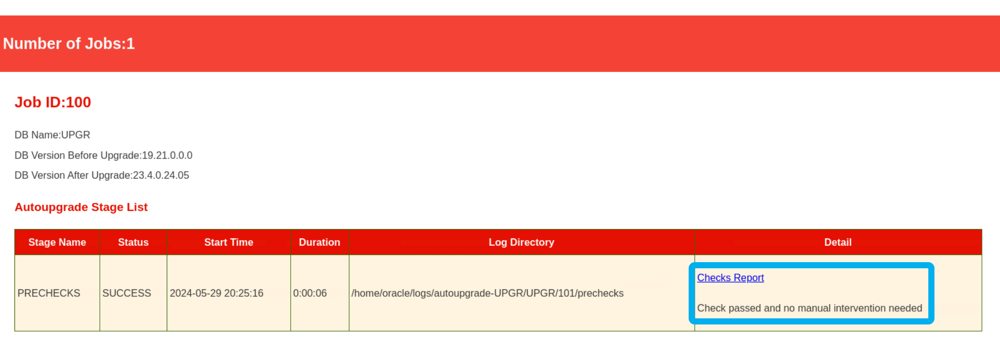
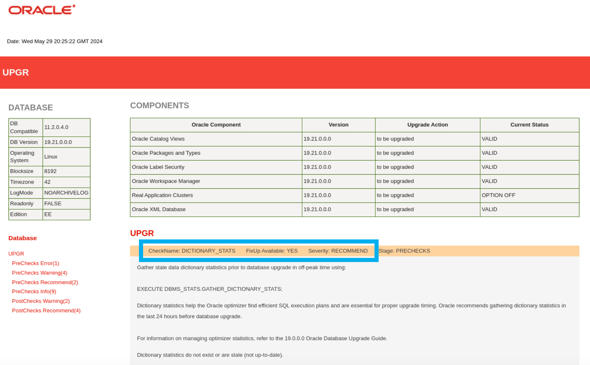

# AutoUpgrade

## Introduction

In this lab, you will upgrade the *UPGR* database from Oracle Database 19c to 23ai. You will use AutoUpgrade.

Estimated Time: 45 minutes

[Hitchhiker's Guide Lab 5](youtube:lwvdaM4v4tQ?start=1966)

### Objectives

In this lab, you will:

* Prepare your environment
* Analyze your database
* Upgrade your database

### Prerequisites

This lab assumes:

* You have completed Lab 4: Capture and Preserve SQL

## Task 1: Prepare your environment

It is strongly recommended to always use the latest version of AutoUpgrade. To use AutoUpgrade, you must create a config file.

1. Use the *yellow* terminal 🟨. Set the environment to the *UPGR* database and check the AutoUpgrade version.

    ``` bash
    <copy>
    . upgr
    cd
    java -jar autoupgrade.jar -version
    </copy>

    # Be sure to hit RETURN
    ```

    <details>
    <summary>*click to see the output*</summary>

    ``` text
    build.version 25.4.250730
    build.date 2025/07/30 16:33:06 +0000
    build.hash d12ffb74e
    build.hash_date 2025/07/24 14:59:09 +0000
    build.supported_target_versions 12.2,18,19,21,23
    build.type production
    build.label (HEAD, tag: v25.4, origin/stable_devel, stable_devel)
    build.MOS_NOTE 2485457.1
    build.MOS_LINK https://support.oracle.com/epmos/faces/DocumentDisplay?id=2485457.1
    ```

    </details>

    You use AutoUpgrade from the user's home directory. In fact, you can use AutoUpgrade from any location. It does not matter.

    Check the version. If a newer version is available, you can download it from:
    * My Oracle Support ([AutoUpgrade Tool (Doc ID 2485457.1)](https://support.oracle.com/epmos/faces/DocumentDisplay?id=2485457.1))
    * Oracle.com ([Database Upgrades and Migrations](https://www.oracle.com/database/upgrades/))
    Don't do this now.

2. To show the many capabilities of AutoUpgrade, create a sample config file. Examine the file to get an idea of the many options in AutoUpgrade. In this lab, you will not use the sample config file.

    ``` bash
    <copy>
    java -jar autoupgrade.jar -create_sample_file config
    more sample_config.cfg
    </copy>

    # Be sure to hit RETURN
    ```

    * Hit *SPACE* to scroll through the output.
    * Some parameters are mandatory.
    * Others are optional and prefixed with a comment sign `#`.

    <details>
    <summary>*click to see the output*</summary>

    ``` text
    ################################################################
    #
    # :::  Sample config file for upgrade :::
    #
    # Build version 25.4.250730
    # Build date    2025/07/30 16:33:06 +0000
    #
    # # Directory includes the following:
    #   (1) upgrade's global directory
    #   (2) Any logs tied to a job
    #
    ################################################################
    
    ################################################################
    #
    # ::: MANDATORY PARAMETERS :::
    #
    # global.global_log_dir
    # 	The base logging directory of upgrade
    #	Each instance of upgrade must write to a unique directory
    # <prefix>.sid
    # 	The SID of the non-CDB or CDB to upgrade
    # <prefix>.source_home
    # 	Path to the Oracle home of the database
    # <prefix>.target_home
    # 	Path to the Oracle home to which you want to upgrade
    #
    ################################################################
    global.global_log_dir=<$ORACLE_BASE/cfgtoollogs/upgrade or /tmp/upgrade>
    upg1.sid=<$ORACLE_SID or {SID}}>
    upg1.source_home=<$ORACLE_HOME or /u01/app/oracle/product/12.2/dbhome_1>
    upg1.target_home=<$ORACLE_TARGET_HOME or /u01/app/oracle/product/23/dbhome_1>
    
    ################################################################
    #
    # global.keystore
    # 	Location where upgrade can store its keystore
    #	Needed for most operations on encrypted databases
    #
    ################################################################
    #global.keystore=/u01/app/oracle/admin/ORCL/keystore
    
    ################################################################
    #
    # <prefix>.drop_grp_after_upgrade
    # 	Drop the restore point after successful upgrade
    #	Accepted values: YES, NO
    #
    ################################################################
    #upg1.drop_grp_after_upgrade=
    
    ################################################################
    #
    # <prefix>.restoration
    # 	Create a guaranteed restore point before upgrade
    #	Accepted values: YES, NO
    #
    ################################################################
    #upg1.restoration=
    
    ################################################################
    #
    # <prefix>.add_after_upgrade_pfile
    # 	Path to file containing parameters to add after upgrade
    #	Example: /u01/app/oracle/admin/ORCL/init_add.ora
    #
    ################################################################
    #upg1.add_after_upgrade_pfile=
    
    ################################################################
    #
    # <prefix>.drop_after_upgrade_pfile
    # 	Path to file containing parameters to remove after upgrade
    #	Example: /u01/app/oracle/admin/ORCL/init_drop.ora
    #
    ################################################################
    #upg1.drop_after_upgrade_pfile=
    
    ################################################################
    #
    # <prefix>.before_action
    # 	Path to script to execute before starting upgrade flow
    #
    ################################################################
    #upg1.before_action=/u01/app/oracle/admin/ORCL/before_upgrade.sh
    
    ################################################################
    #
    # <prefix>.after_action
    # 	Path to script to execute after the upgrade flow
    #
    ################################################################
    #upg1.after_action=/u01/app/oracle/admin/ORCL/after_upgrade.sh
    
    ################################################################
    #
    # <prefix>.drop_win_src_service
    # 	Windows only: Drop the Windows service after registering the new service
    #	Accepted values: YES, NO
    #
    ################################################################
    #upg1.drop_win_src_service=
    
    ################################################################
    #
    # <prefix>.wincredential
    # 	Location of a Microsoft Windows credential object file that you have previously generated with the upgrade command-line parameter        load_win_credential.
    #
    ################################################################
    #upg1.wincredential=C:Usersoraclecred
    
    ################################################################
    #
    # <prefix>.log_dir
    # 	Location of database-specific log files created during the upgrade
    #	If not specified, global.global_log_dir is used
    #
    ################################################################
    #upg1.log_dir=/u01/app/oracle/admin/ORCL/upgrade_logs
    
    ################################################################
    #
    # <prefix>.raise_compatible
    # 	Raise compatible parameter to the default value of the new release
    #	Requires <prefix>.drop_grp_after_upgrade=yes
    #	Accepted values: YES, NO
    #
    ################################################################
    #upg1.raise_compatible=
    
    ################################################################
    #
    # <prefix>.run_dictionary_health
    # 	Perform a dictionary check as part of the pre-upgrade analysis
    #	Accepted values: YES, NO
    #
    ################################################################
    #upg1.run_dictionary_health=
    
    ################################################################
    #
    # <prefix>.timezone_upg
    # 	Upgrade the time zone file after upgrade
    #	Accepted values: YES, NO
    #
    ################################################################
    #upg1.timezone_upg=
    ```
    </details>

3. If you set the environment, AutoUpgrade can create a more precise config file.

    ``` bash
    <copy>
    . upgr
    java -jar autoupgrade.jar -auto_config
    head -n40 /home/oracle/auto_config.cfg
    </copy>

    # Be sure to hit RETURN
    ```

    * Notice how AutoUpgrade used the environment settings to fill the parameters *sid* and *source\_home*.
    * AutoUpgrade doesn't know the target Oracle home, but has made some suggestions. You can set `TARGET_ORACLE_HOME` and AutoUpgrade uses that.
    * This is a very convenient way of creating a config file for a specific database.

    <details>
    <summary>*click to see the output*</summary>
    ``` text
    ################################################################
    #
    # :::  Sample config file for upgrade :::
    #
    # Build version 25.4.250730
    # Build date    2025/07/30 16:33:06 +0000
    #
    # # Directory includes the following:
    #   (1) upgrade's global directory
    #   (2) Any logs tied to a job
    #
    ################################################################
    
    ################################################################
    #
    # ::: MANDATORY PARAMETERS :::
    #
    # global.global_log_dir
    # 	The base logging directory of upgrade
    #	Each instance of upgrade must write to a unique directory
    # <prefix>.sid
    # 	The SID of the non-CDB or CDB to upgrade
    # <prefix>.source_home
    # 	Path to the Oracle home of the database
    # <prefix>.target_home
    # 	Path to the Oracle home to which you want to upgrade
    # <prefix>.log_dir
    # 	Location of database-specific log files created during the upgrade
    #	If not specified, global.global_log_dir is used
    #
    ################################################################
    global.global_log_dir=/home/oracle/autoConfig
    upg1.sid=UPGR
    upg1.source_home=/u01/app/oracle/product/19
    #upg1.target_home=/u01/app/oracle/product/21
    #upg1.target_home=/u01/app/oracle/product/23
    upg1.log_dir=/home/oracle/autoConfig
    
    ################################################################
    #
    ```
    </details>    

3. For this lab, you will use a pre-created config file. Examine the pre-created config file.

    ``` bash
    <copy>
    cat /home/oracle/scripts/upg-05-UPGR.cfg
    </copy>
    ```

    * `global.autoupg_log_dir` defines the base logging directory where AutoUpgrade stores all logs and other files.
    * `source_home` and `target_home` specify the path to the source and target Oracle home.
    * `sid` contains the SID of the database that you want to upgrade/convert.
    * By specifying `target_cdb` you instruct AutoUpgrade to also perform a non-CDB to PDB conversion.
    * `restoration` defines whether a guaranteed restore point is created before the upgrade.
    * `add_after_upgrade_pfile` points to a file containing the initialization parameters you want to add after upgrade.
    * `timezone_upg` skips the timezone file upgrade.

    <details>
    <summary>*click to see the output*</summary>

    ``` text
    global.autoupg_log_dir=/home/oracle/logs/autoupgrade-UPGR
    upg1.source_home=/u01/app/oracle/product/19
    upg1.target_home=/u01/app/oracle/product/23
    upg1.sid=UPGR
    upg1.target_cdb=CDB23
    upg1.restoration=no
    upg1.add_after_upgrade_pfile=/home/oracle/scripts/upg-05-upgr_after_addinit.ora
    upg1.timezone_upg=NO
    ```

    </details>

    To simulate regression SQLs and to prove our method, this lab changes optimizer behavior using `optimizer_index_cost_adj`. The parameter is added after the upgrade using `add_after_upgrade_pfile`. In a later lab, you will see the effect of this change, and what you can do about it.

## Task 2: Analyze your database

It is best practice to first analyze your database for upgrade readiness. It is a lightweight, non-intrusive check that you can run on a live database.

1. Start AutoUpgrade in *analyze* mode. The check usually completes very fast. Wait for it to complete.

    ``` bash
    <copy>
    java -jar autoupgrade.jar -config /home/oracle/scripts/upg-05-UPGR.cfg -mode analyze
    </copy>
    ```

    <details>
    <summary>*click to see the output*</summary>

    ``` text
    AutoUpgrade 25.4.250730 launched with default internal options
    Processing config file ...
    +--------------------------------+
    | Starting AutoUpgrade execution |
    +--------------------------------+
    1 Non-CDB(s) will be analyzed
    Type 'help' to list console commands
    upg> Job 100 completed
    ------------------- Final Summary --------------------
    Number of databases            [ 1 ]

    Jobs finished                  [1]
    Jobs failed                    [0]

    Please check the summary report at:
    /home/oracle/logs/autoupgrade-UPGR/cfgtoollogs/upgrade/auto/status/status.html
    /home/oracle/logs/autoupgrade-UPGR/cfgtoollogs/upgrade/auto/status/status.log
    ```

    </details>

2. AutoUpgrade prints the path to the summary report. Check it.

    ``` bash
    <copy>
    cat /home/oracle/logs/autoupgrade-UPGR/cfgtoollogs/upgrade/auto/status/status.log
    </copy>
    ```

    <details>
    <summary>*click to see the output*</summary>

    ``` text
    ==========================================
              Autoupgrade Summary Report
    ==========================================
    [Date]           Wed May 29 16:33:23 GMT 2024
    [Number of Jobs] 1
    ==========================================
    [Job ID] 100
    ==========================================
    [DB Name]                UPGR
    [Version Before Upgrade] 19.21.0.0.0
    [Version After Upgrade]  23.9.0.25.07
    ------------------------------------------
    [Stage Name]    PRECHECKS
    [Status]        SUCCESS
    [Start Time]    2024-05-29 16:33:16
    [Duration]
    [Log Directory] /home/oracle/logs/autoupgrade-UPGR/UPGR/100/prechecks
    [Detail]        /home/oracle/logs/autoupgrade-UPGR/UPGR/100/prechecks/upgr_preupgrade.log
                    Check passed and no manual intervention needed
    ------------------------------------------
    ```

    </details>

    * The report states: *Check passed and no manual intervention needed*. AutoUpgrade found no severe issues that it couldn't fix automatically.

3. Check the summary report in HTML format. Also, click on *Checks Report* for even more details. Firefox might print warnings to the console. You can safely ignore those.

    ``` bash
    <copy>
    firefox /home/oracle/logs/autoupgrade-UPGR/cfgtoollogs/upgrade/auto/status/status.html &
    </copy>
    ```

    
    

    * Examine the Checks Report.
    * Notice how a specific check has severity *ERROR*, but **AutoUpgrade has a fixup available**.
    * For most checks, AutoUpgrade has a fixup. Often, you'll see that there's no manual action needed.
    * Then close Firefox.

## Task 3: Upgrade your database

You determined that the database is ready to upgrade. Start AutoUpgrade in *deploy* mode. One command is all it takes to perform the upgrade and PDB conversion; including all pre- and post-upgrade tasks.

1. Start AutoUpgrade in *deploy* mode to perform the upgrade and conversion. Notice you are re-using the same config file and command, but this time `-mode` is set to `deploy`.

    ``` bash
    <copy>
    java -jar autoupgrade.jar -config /home/oracle/scripts/upg-05-UPGR.cfg -mode deploy
    </copy>
    ```

    <details>
    <summary>*click to see the output*</summary>

    ``` text
    AutoUpgrade 25.4.250730 launched with default internal options
    Processing config file ...
    +--------------------------------+
    | Starting AutoUpgrade execution |
    +--------------------------------+
    1 Non-CDB(s) will be processed
    Type 'help' to list console commands
    upg>
    ```

    </details>

2. You are now in the AutoUpgrade console. The upgrade job is running in the background. Examine the list of available commands.

    ``` bash
    <copy>
    help
    </copy>
    ```

    <details>
    <summary>*click to see the output*</summary>

    ``` text
     exit                                    To close and exit
     help                                    Displays help
     lsj [<option>] [-a <number>]            Lists jobs by status up to n elements
         -f                                  - Filter by finished jobs
         -r                                  - Filter by running jobs
         -e                                  - Filter by jobs with errors
         -p                                  - Filter by jobs being prepared
         -n <number>                         - Display up to n jobs
         -a <number>                         - Repeats the command (in <number>
                                               seconds)
     lsr                                     Displays the restoration queue
     lsa                                     Displays the stop queue
     tasks                                   Displays the tasks running
     clear                                   Clears the terminal
     resume -job <number> [-ignore_errors=<ORA-#####,ORA-#####>]
                                             Restarts a job with option to ignore
                                             errors
     status [<option>] [-a <number>]         Summary of current execution
         -config                             - Show Config Information
         -job <number>                       - Summary of a given job
         -job <number> -c <dbname>           - Show details of container
         -a [<number>]                       - Repeats the command (in <number>
                                               seconds)
     restore -job <number>                   Restores the database to its state
                                             prior to the upgrade
     restore all_failed                      Restores all failed jobs to their
                                             previous states prior to the upgrade
     logs                                    Displays all log locations
     stop -job <number>                      Stops the specified job
     h[ist]                                  Displays the command line history
     /[<number>]                             Executes the command specified from
                                             the history. The default is the last
                                             command
     meta                                    Displays Internal latch count
     hwinfo                                  Displays hardware information along
                                             with tools uptime
     fxlist -job <number> [<option>]         Fixup summary
         -c <dbname>                         - Container specific FixUps
         -c <dbname> alter <check> run <yes|no|skip>
                                             - Update Run Configuration
     proceed -job <number>                   Alter predefined start time on
                                             scheduled jobs. Starts 1 minute
                                             from when the command was executed
         -newStartTime [dd/mm/yyyy hh:mm:ss, +<#>h<#>m]
                                             - Starts on an specific date or
                                               given time from command execution
    ```

    </details>

3. Get an overview of the current jobs.

    ``` bash
    <copy>
    lsj
    </copy>
    ```

    <details>
    <summary>*click to see the output*</summary>

    ``` text
    +----+-------+---------+---------+-------+----------+-------+-------+
    |Job#|DB_NAME|    STAGE|OPERATION| STATUS|START_TIME|UPDATED|MESSAGE|
    +----+-------+---------+---------+-------+----------+-------+-------+
    | 101|   UPGR|PREFIXUPS|EXECUTING|RUNNING|  20:25:15|71s ago|       |
    +----+-------+---------+---------+-------+----------+-------+-------+
    Total jobs 1
    ```

    </details>

    * Notice the job number (`Job#`).

4. Get details about your upgrade job. Use the `status` command. Your job number should be *101*. If that's not the case, replace it with your value.

    ``` bash
    <copy>
    status -job 101
    </copy>
    ```

    <details>
    <summary>*click to see the output*</summary>

    ``` text
    Details

    	Job No           101
    	Oracle SID       UPGR
    	Start Time       24/05/29 20:25:15
    	Elapsed (min):   2
    	End time:        N/A

    Logfiles

    	Logs Base:    /home/oracle/logs/autoupgrade-UPGR/UPGR
    	Job logs:     /home/oracle/logs/autoupgrade-UPGR/UPGR/101
    	Stage logs:   /home/oracle/logs/autoupgrade-UPGR/UPGR/101/dbupgrade
    	TimeZone:     /home/oracle/logs/autoupgrade-UPGR/UPGR/temp
    	Remote Dirs:

    Stages
    	SETUP            <1 min
    	PREUPGRADE       <1 min
    	PRECHECKS        <1 min
    	PREFIXUPS        1 min
    	DRAIN            <1 min
    	DBUPGRADE        ~0 min (RUNNING)
    	NONCDBTOPDB
    	POSTCHECKS
    	POSTFIXUPS
    	POSTUPGRADE
    	SYSUPDATES

    Stage-Progress Per Container

    	+--------+---------+
    	|Database|DBUPGRADE|
    	+--------+---------+
    	|    UPGR|    0  % |
    	+--------+---------+

    upg>
    ```

    </details>

    Notice the *Logfiles* section. This is the location of the relevant log files. Note the *Logs Base* location.

5. Switch to the *blue* terminal 🟦. Do not exit AutoUpgrade.

6. Go to the *Logs Base* location.

    ``` bash
    <copy>
    cd /home/oracle/logs/autoupgrade-UPGR/UPGR
    ls -l
    </copy>

    # Be sure to hit RETURN
    ```

    * Explore the subdirectories.
    * Notice how each job number has its own dedicated directory.

    <details>
    <summary>*click to see the output*</summary>

    ``` text
    total 8
    drwxr-x---. 3 oracle oinstall  119 Jun  2 06:06 100
    drwxr-x---. 6 oracle oinstall 4096 Jun  2 06:09 101
    drwxr-x---. 2 oracle oinstall 4096 Jun  2 06:09 temp
    ```

    </details>

7. Explore the directory of your current upgrade job. If your job number is different, you must change it (from `101`).

    ``` bash
    <copy>
    cd /home/oracle/logs/autoupgrade-UPGR/UPGR/101
    ls -l
    </copy>

    # Be sure to hit RETURN
    ```

    <details>
    <summary>*click to see the output*</summary>

    ``` text
    total 904
    -rw-r-----. 1 oracle oinstall 519348 May 29 20:29 autoupgrade_20240529.log
    -rw-r-----. 1 oracle oinstall      0 May 29 20:25 autoupgrade_20240529.log.lck
    -rw-r-----. 1 oracle oinstall   1904 May 29 20:29 autoupgrade_20240529_user.log
    -rw-r-----. 1 oracle oinstall      0 May 29 20:25 autoupgrade_20240529_user.log.lck
    -rw-r-----. 1 oracle oinstall      0 May 29 20:25 autoupgrade_err.log
    -rw-r-----. 1 oracle oinstall      0 May 29 20:25 autoupgrade_err.log.lck
    drwxr-x---. 2 oracle oinstall   4096 May 29 20:29 dbupgrade
    drwxr-x---. 2 oracle oinstall     80 May 29 20:27 drain
    drwxr-x---. 2 oracle oinstall    185 May 29 20:26 prechecks
    drwxr-x---. 2 oracle oinstall    180 May 29 20:26 prefixups
    drwxr-x---. 2 oracle oinstall     28 May 29 20:25 preupgrade
    ```

    </details>

    * Notice that each phase (*preupgrade*, *prefixups*, *drain*, *dbupgrade*, etc.) has its own subdirectory. Explore the subdirectories and log files.

8. Switch back to the *yellow* terminal 🟨. Do not close the *blue* terminal 🟦.

9. You are still connected to the AutoUpgrade console. Monitor the upgrade using the `status` command. The `-a` parameter instructs AutoUpgrade upgrade to refresh the information at a given interval.

    ``` bash
    <copy>
    status -job 101 -a 30
    </copy>
    ```

    <details>
    <summary>*click to see the output*</summary>

    ``` text
    Details

    	Job No           101
    	Oracle SID       UPGR
    	Start Time       24/05/29 20:25:15
    	Elapsed (min):   5
    	End time:        N/A

    Logfiles

    	Logs Base:    /home/oracle/logs/autoupgrade-UPGR/UPGR
    	Job logs:     /home/oracle/logs/autoupgrade-UPGR/UPGR/101
    	Stage logs:   /home/oracle/logs/autoupgrade-UPGR/UPGR/101/dbupgrade
    	TimeZone:     /home/oracle/logs/autoupgrade-UPGR/UPGR/temp
    	Remote Dirs:

    Stages
    	SETUP            <1 min
    	PREUPGRADE       <1 min
    	PRECHECKS        <1 min
    	PREFIXUPS        1 min
    	DRAIN            <1 min
    	DBUPGRADE        ~2 min (RUNNING)
    	NONCDBTOPDB
    	POSTCHECKS
    	POSTFIXUPS
    	POSTUPGRADE
    	SYSUPDATES

    Stage-Progress Per Container

    	+--------+---------+
    	|Database|DBUPGRADE|
    	+--------+---------+
    	|    UPGR|    10 % |
    	+--------+---------+

    The command status is running every 30 seconds. PRESS ENTER TO EXIT
    ```

    </details>

10. Wait until the upgrade completes. Depending on the lab platform, the upgrade will take about 15-25 minutes. Don't exit from the AutoUpgrade console. Leave it running.

11. Optionally, you can complete some of the labs from tracks 2 and 3. Check *Introduction* for details

12. When the upgrade completes, AutoUpgrade prints a message saying *Job 101 completed* and exits from the AutoUpgrade console.

**Congratulations! You upgraded the UPGR database successfully from Oracle Database 19c to 23ai and converted your database to a PDB.**

You may now [*proceed to the next lab*](#next).

## Learn More

AutoUpgrade completely automates upgrades and incorporates our best practices. AutoUpgrade run all prechecks against multiple databases, fix potential issues, set a restore point in case something goes wrong, before it finally upgrade and convert your databases. And of course, do the postupgrade checks, recompilation and time zone adjustment. The only thing you need to provide is a config file in text format.

* My Oracle Support, [AutoUpgrade Tool (Doc ID 2485457.1)](https://support.oracle.com/epmos/faces/DocumentDisplay?id=2485457.1)
* Documentation, [Using AutoUpgrade for Oracle Database Upgrades](https://docs.oracle.com/en/database/oracle/oracle-database/23/upgrd/using-autoupgrade-oracle-database-upgrades.html#GUID-71883C8C-7A34-4E93-8955-040CB04F2109)
* Webinar, [Move to Oracle Database 23ai – Everything you need to know about Oracle Multitenant – Part 1](https://youtu.be/k0wCWbp-htU)
* Blog post, [Upgrade to Oracle Database 23ai](https://dohdatabase.com/upgrade23)

## Acknowledgements

* **Author** - Daniel Overby Hansen
* **Contributors** - Klaus Gronau, Rodrigo Jorge, Alex Zaballa, Mike Dietrich
* **Last Updated By/Date** - Rodrigo Jorge, August 2025
