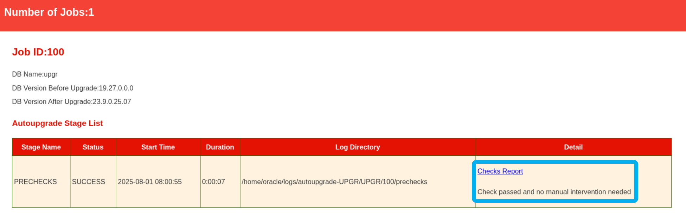

# AutoUpgrade

## Introduction

In this lab, you will upgrade the UPGR database from Oracle Database 11.2.0.4 to Oracle Database 19c. You will use AutoUpgrade. 

Estimated Time: 45 minutes

[](videohub:1_fbj8umwn)

### Objectives

In this lab, you will:

* Prepare your environment
* Analyze your database
* Upgrade your database

### Prerequisites

This lab assumes:

- You have completed Lab 3: Capture and Preserve SQL

## Task 1: Prepare your environment

It is strongly recommended to always use the latest version of AutoUpgrade. To use AutoUpgrade, you must create a config file.

1. Use the yellow terminal. 
   

2. Set the environment to the UPGR database and check the AutoUpgrade version.

    ```
    <copy>
    . upgr
    java -jar $OH19/rdbms/admin/autoupgrade.jar -version
    </copy>
    ```

    <details>
    <summary>*click to see the output*</summary>
    ``` text
    $ java -jar $OH19/rdbms/admin/autoupgrade.jar -version
    build.version 23.2.230626
    build.date 2023/06/26 17:18:24 -0400
    build.hash 1ed12c06
    build.hash_date 2023/06/26 11:55:17 -0400
    build.supported_target_versions 12.2,18,19,21
    build.type production
    build.label (HEAD, tag: v23.2, origin/stable_devel, stable_devel)
    ```
    </details>

    You use AutoUpgrade from an Oracle Database 19c home (`$OH`). You can use AutoUpgrade from any location. It does not matter.

    The current version is *23.2.230626*. If a newer version is available, you can download it from My Oracle Support ([AutoUpgrade Tool (Doc ID 2485457.1)](https://support.oracle.com/epmos/faces/DocumentDisplay?id=2485457.1)). Don't do this now.

2. To show the many capabilities of AutoUpgrade, create a sample config file. Examine the file to get an idea of the many options in AutoUpgrade. In this lab, you will not use the samle config file.

    ```
    <copy>
    java -jar $OH19/rdbms/admin/autoupgrade.jar -create_sample_file config
    cat sample_config.cfg
    </copy>
    ```

    <details>
    <summary>*click to see the output*</summary>
    ``` text
    $ java -jar $OH19/rdbms/admin/autoupgrade.jar -create_sample_file config
    Created sample configuration file /home/oracle/sample_config.cfg
    [UPGR] oracle@hol:~
    $ cat sample_config.cfg
    #
    # Sample config file for AutoUpgrade
    #
    # build version 23.2.230626
    # build date    2023/06/26 17:18:24 -0400
    #
    #
    # Global configurations
    #
    # This directory will include the following:
    #   (1) AutoUpgrade''s global directory
    #   (2) Any logs, not directly tied to a job
    #   (3) Config files
    #   (4) progress.json and status.json
    global.autoupg_log_dir=/u01/app/oracle/cfgtoollogs/autoupgrade

    #
    # Database number 1 - Full DB/CDB upgrade
    #
    upg1.log_dir=/u01/app/oracle/cfgtoollogs/autoupgrade/employee             # Path of the log directory for the upgrade job
    upg1.sid=emp                                              # ORACLE_SID of the source DB/CDB
    upg1.source_home=/u01/app/oracle/product/12.2.0/dbhome_1  # Path of the source ORACLE_HOME
    upg1.target_home=/u01/app/oracle/product/21.1.0/dbhome_1  # Path of the target ORACLE_HOME
    upg1.start_time=NOW                                       # Optional. [NOW | +XhYm (X hours, Y minutes after launch) | dd/mm/yyyy hh:mm:ss]
    upg1.upgrade_node=hol                                # Optional. To find out the name of your node, run the hostname utility. Default is ''localhost''
    #upg1.run_utlrp=[yes|no]                                  # Optional. Whether or not to run utlrp after upgrade
    #upg1.timezone_upg=[yes|no]                               # Optional. Whether or not to run the timezone upgrade
    #upg1.target_version=[12.2|18|19|21]                      # Oracle version of the target ORACLE_HOME.  Only required when the target Oracle database version is 12.2

    #
    # Database number 2 - Unplug/Plug upgrade
    #
    #upg2.log_dir=/u01/app/oracle/cfgtoollogs/autoupgrade/cdb12
    #upg2.sid=cdb12
    #upg2.source_home=/u01/app/oracle/product/12.2.0/dbhome_1
    #upg2.target_cdb=cdb19
    #upg2.target_home=/u01/app/oracle/product/21/dbhome_1
    #upg2.pdbs=mypdb1,mypdb2                    # Comma delimited list of pdb names that will be upgraded and moved to the target CDB
    #upg2.target_pdb_name.mypdb1=altpdb1        # Optional. Name of the PDB to be created on the target CDB
    #upg2.target_pdb_copy_option.mypdb1=file_name_convert=('mypdb1', 'altpdb1')  # Optional. file_name_convert option used when creating the PDB on the target CDB
    #upg2.target_pdb_name.mypdb2=altpdb2
    #upg2.start_time=06/07/2023 16:57:00        # Optional. [NOW | +XhYm (X hours, Y minutes after launch) | dd/mm/yyyy hh:mm:ss]
    #upg2.upgrade_node=localhost                # Optional. To find out the name of your node, run the hostname utility. Default is ''localhost''
    #upg2.run_utlrp=[yes|no]                   # Optional. Whether or not to run utlrp after upgrade
    #upg2.timezone_upg=[yes|no]                # Optional. Whether or not to run the timezone upgrade
    #upg2.target_version=[12.2|18|19|21]       # Oracle version of the target ORACLE_HOME.  Only required when the target Oracle database version is 12.2

    #
    # Database number 3 - Noncdb to PDB upgrade
    #
    #upg3.log_dir=/u01/app/oracle/cfgtoollogs/autoupgrade/employee
    #upg3.sid=emp
    #upg3.source_home=/u01/app/oracle/product/11.2.0/dbhome_1
    #upg3.target_cdb=cdb21
    #upg3.target_home=/u01/app/oracle/product/19.8.0/dbhome_1
    #upg3.target_pdb_name=pdb12
    #upg3.target_pdb_copy_option=file_name_convert=('emp', 'emppdb')
    #upg3.start_time=+10m                  # Optional. 10 Minutes from now
    #upg3.upgrade_node=localhost           # Optional. To find out the name of your node, run the hostname utility. Default is ''localhost''
    #upg3.run_utlrp=[yes|no]              # Optional. Whether or not to run utlrp after upgrade
    #upg3.timezone_upg=[yes|no]           # Optional. Whether or not to run the timezone upgrade
    #upg3.target_version=[12.2|18|19|21]  # Oracle version of the target ORACLE_HOME.  Only required when the target Oracle database version is 12.2

    #
    # You can have as many databases as desired
    #
    # ----- Unplug/Plug Upgrade -----
    # To perform an Unplug/Plug operation that upgrades and moves one or more PDBs
    # from a source CDB into a target CDB, use the target_cdb and pdbs parameters.
    # The target_pdb_name and target_pdb_copy_option parameters can be used
    # to determine how each PDB is created on the target CDB.
    #
    # ----- NonCDB to PDB conversion -----
    # To upgrade and convert an existing NonCDB database into a PDB of a target CDB,
    # use the target_cdb parameter to specify the destination CDB.
    # The target_pdb_name and target_pdb_copy_option parameters can be used
    # to determine how each PDB is created on the target CDB.
    #
    # When neither of these options are used, a full upgrade of the source DB/CDB is performed.
    #

    #upgN.log_dir=<Path of the log directory for the upgrade job>
    #upgN.sid=<ORACLE_SID of the source DB/CDB>
    #upgN.source_home=<Path of the source ORACLE_HOME>
    #upgN.target_home=<Path of the target ORACLE_HOME>
    #upgN.target_version=<Oracle version of the target ORACLE_HOME.  Only required when the target Oracle database version is 12.2>
    #upgN.start_time=<Optional. [NOW | +XhYm (X hours, Y minutes after launch) | dd/mm/yyyy hh:mm:ss]>
    #upgN.upgrade_node=<Optional. To find out the name of your node, run the hostname utility. Default is ''localhost''>
    #upgN.run_utlrp=[yes|no]    # Optional. Whether or not to run utlrp after upgrade
    #upgN.timezone_upg=[yes|no] # Optional. Whether or not to run the timezone upgrade

    ### Unplug/Plug parameters ###
    #upgN.target_cdb=<ORACLE_SID of the target CDB>
    #upgN.pdbs=<Comma delimited list of pdb names that will be upgraded and moved to the target CDB>
    #upgN.<pdb_name>.target_pdb_name=<Optional. Name of the PDB to be created on the target CDB>
    #upgN.<pdb_name>.target_pdb_copy_option=<Optional. file_name_convert option used when creating the PDB on the target CDB>

    ### NonCDB to PDB parameters ###
    #upgN.target_cdb=<ORACLE_SID of the target CDB>
    #upgN.target_pdb_name=<Optional. Name of the PDB to be created on the target CDB>
    #upgN.target_pdb_copy_option=<Optional. file_name_convert option used when creating the PDB on the target CDB>
    ```
    </details>

3. For this lab, you will use a pre-created config file. Examine the pre-created config file.

    ```
    <copy>
    cat /home/oracle/scripts/UPGR.cfg
    </copy>
    ```

    <details>
    <summary>*click to see the output*</summary>
    ``` text
    $ cat /home/oracle/scripts/UPGR.cfg
    global.autoupg_log_dir=/home/oracle/logs/lab4
    upg1.source_home=/u01/app/oracle/product/11.2.0.4
    upg1.target_home=/u01/app/oracle/product/19
    upg1.sid=UPGR
    upg1.restoration=no
    ```
    </details>

## Task 2: Analyze your database

It is best practice to first analyze your database for upgrade readiness. It is a lightweight, non-intrusive check that you can run on a live database.

1. Start AutoUpgrade in *analyze* mode. The check usually completes very fast. Wait for it to complete.

    ```
    <copy>
    java -jar $OH19/rdbms/admin/autoupgrade.jar -config /home/oracle/scripts/UPGR.cfg -mode analyze
    </copy>
    ```

    <details>
    <summary>*click to see the output*</summary>
    ``` text
    $ java -jar $OH19/rdbms/admin/autoupgrade.jar -config /home/oracle/scripts/UPGR.cfg -mode analyze
    AutoUpgrade 23.2.230626 launched with default internal options
    Processing config file ...
    +--------------------------------+
    | Starting AutoUpgrade execution |
    +--------------------------------+
    1 Non-CDB(s) will be analyzed
    Type 'help' to list console commands
    upg> Job 100 completed
    ------------------- Final Summary --------------------
    Number of databases            [ 1 ]

    Jobs finished                  [1]
    Jobs failed                    [0]

    Please check the summary report at:
    /home/oracle/logs/lab4/cfgtoollogs/upgrade/auto/status/status.html
    /home/oracle/logs/lab4/cfgtoollogs/upgrade/auto/status/status.log
    ```
    </details>

3. AutoUpgrade prints the path to the summary report. Check it.

    ```
    <copy>
    cat /home/oracle/logs/lab4/cfgtoollogs/upgrade/auto/status/status.log
    </copy>
    ```

    <details>
    <summary>*click to see the output*</summary>
    ``` text
    $ cat /home/oracle/logs/lab4/cfgtoollogs/upgrade/auto/status/status.log
    ==========================================
            Autoupgrade Summary Report
    ==========================================
    [Date]           Thu Jul 06 16:03:21 CEST 2023
    [Number of Jobs] 1
    ==========================================
    [Job ID] 100
    ==========================================
    [DB Name]                UPGR
    [Version Before Upgrade] 11.2.0.4.0
    [Version After Upgrade]  19.18.0.0.0
    ------------------------------------------
    [Stage Name]    PRECHECKS
    [Status]        SUCCESS
    [Start Time]    2023-07-06 16:03:12
    [Duration]       
    [Log Directory] /home/oracle/logs/lab4/UPGR/100/prechecks
    [Detail]        /home/oracle/logs/lab4/UPGR/100/prechecks/upgr_preupgrade.log
                    Check passed and no manual intervention needed
    ------------------------------------------
    ```
    </details>
    
    * The report states: *Check passed and no manual intervention needed*. AutoUpgrade found no severe issues that it couldn't fix automatically. 

4. Check the summary report in HTML format. Also, click on *Checks Report* for even more details. Firefox might print warnings to the console. You can safely ignore those.

    ```
    <copy>
    firefox /home/oracle/logs/lab4/cfgtoollogs/upgrade/auto/status/status.html &
    </copy>
    ```
    
    

    * Examine the Checks Report.
    * Notice how a specific check has severity *ERROR*, but AutoUpgrade has a fixup available. 
    * Then close Firefox.

## Task 3: Upgrade your database

You determined that the database is ready to upgrade. Start AutoUpgrade in *deploy* mode. One command is all it takes to perform the upgrade - including all pre- and post-upgrade tasks. 

1. Start AutoUpgrade in *deploy* mode to perform the upgrade. Notice you are re-using the same command, but this time `-mode` is set to `deploy`.

    ```
    <copy>
    java -jar $OH19/rdbms/admin/autoupgrade.jar -config /home/oracle/scripts/UPGR.cfg -mode deploy
    </copy>
    ```
    <details>
    <summary>*click to see the output*</summary>
    ``` text
    $ java -jar $OH19/rdbms/admin/autoupgrade.jar -config /home/oracle/scripts/UPGR.cfg -mode deploy
    AutoUpgrade 23.2.230626 launched with default internal options
    Processing config file ...
    +--------------------------------+
    | Starting AutoUpgrade execution |
    +--------------------------------+
    1 Non-CDB(s) will be processed
    Type 'help' to list console commands
    upg> 
    ```
    </details>

2. You are now in the AutoUpgrade console. The upgrade job is running in the background. Examine the list of available commands.

    ```
    <copy>
    help
    </copy>
    ```

    <details>
    <summary>*click to see the output*</summary>
    ``` text
    upg> help
    exit                            // To close and exit
    help                            // Displays help
    lsj [<option>] [-a <number>]    // list jobs by status up to n elements.
        -f                Filter by finished jobs.
        -r                Filter by running jobs.
        -e                Filter by jobs with errors.
        -p                Filter by jobs being prepared.
        -n <number>       Display up to n jobs.
        -a <number>       Repeats the command (in <number> seconds).
    lsr                             // Displays the restoration queue
    lsa                             // Displays the stop queue
    tasks                           // Displays the tasks running
    clear                           // Clears the terminal
    resume -job <number> [-ignore_errors=<ORA-#####,ORA-#####>] // Restarts a job with option to ignore errors
    status [<option>] [-a <number>] // Summary of current execution
        -config                     Show Config Information
        -job <number>               Summary of a given job
        -job <number> -c <dbname>   Show details of container
        -a [<number>]               Repeats the command (in <number> seconds).
    restore -job <number>           // Restores the database to its state prior to the upgrade
    restore all_failed              // Restores all failed jobs to their previous states prior to the upgrade
    logs                            // Displays all the log locations
    stop -job <number>              // Stops the specified job
    h[ist]                          // Displays the command line history
    /[<number>]                     // Executes the command specified from the history. The default is the last command
    meta                            // Displays Internal latch count
    hwinfo                          // Displays additional information
    fxlist -job <number> [<option>]                // FixUps summary
        -c <dbname>                                  Container specific FixUps
        -c <dbname> alter <check> run <yes|no|skip>  Update Run Configuration
    ```
    </details>
    
3. Get an overview of the current jobs.

    ```
    <copy>
    lsj
    </copy>
    ```

    <details>
    <summary>*click to see the output*</summary>
    ``` text
    upg> lsj
    +----+-------+-----+---------+-------+----------+-------+----------------------+
    |Job#|DB_NAME|STAGE|OPERATION| STATUS|START_TIME|UPDATED|               MESSAGE|
    +----+-------+-----+---------+-------+----------+-------+----------------------+
    | 101|   UPGR|DRAIN|EXECUTING|RUNNING|  16:18:37| 6s ago|Shutting down database|
    +----+-------+-----+---------+-------+----------+-------+----------------------+
    Total jobs 1
    ```
    </details>

    * Notice the job number (`Job#`).  

4. Get details about your upgrade job. Use the `status` command. Your job number should be 101. If that's not the case, replace it with your value.

    ```
    <copy>
    status -job 101
    </copy>
    ```

    <details>
    <summary>*click to see the output*</summary>
    ``` text
    upg> status -job 101
    Details

        Job No           101
        Oracle SID       UPGR
        Start Time       23/07/06 16:18:37
        Elapsed (min):   2
        End time:        N/A

    Logfiles

        Logs Base:    /home/oracle/logs/lab4/UPGR
        Job logs:     /home/oracle/logs/lab4/UPGR/101
        Stage logs:   /home/oracle/logs/lab4/UPGR/101/dbupgrade
        TimeZone:     /home/oracle/logs/lab4/UPGR/temp
        Remote Dirs:  

    Stages
        SETUP            <1 min
        PREUPGRADE       <1 min
        PRECHECKS        <1 min
        PREFIXUPS        1 min
        DRAIN            <1 min
        DBUPGRADE        ~0 min (RUNNING)
        POSTCHECKS      
        POSTFIXUPS      
        POSTUPGRADE     
        SYSUPDATES      

    Stage-Progress Per Container

        +--------+---------+
        |Database|DBUPGRADE|
        +--------+---------+
        |    UPGR|    0  % |
        +--------+---------+
    ```
    </details>

    Notice the *Logfiles* section. This is the location of the relevant log files. Note the *Logs Base* location.

5. Switch to the blue terminal. 
   

6. Go to the *Logs Base* location.

    ```
    <copy>
    cd /home/oracle/logs/lab4/UPGR
    </copy>
    ```

    * Explore the subdirectories.
    * Notice how each job number has its own dedicated directory.

6. Explore the directory of your current upgrade job. If your job number is different, you must change it (from `101`).

    ```
    <copy>
    cd /home/oracle/logs/lab4/UPGR/101
    ls -l
    </copy>
    ```

    <details>
    <summary>*click to see the output*</summary>
    ``` text
    $ cd /home/oracle/logs/lab4/UPGR/101
    $ ls -l
    total 720
    -rw-------. 1 oracle dba 501646 Jul  6 16:32 autoupgrade_20230706.log
    -rw-------. 1 oracle dba      0 Jul  6 16:18 autoupgrade_20230706.log.lck
    -rw-------. 1 oracle dba   1673 Jul  6 16:32 autoupgrade_20230706_user.log
    -rw-------. 1 oracle dba      0 Jul  6 16:18 autoupgrade_20230706_user.log.lck
    -rw-------. 1 oracle dba      0 Jul  6 16:18 autoupgrade_err.log
    -rw-------. 1 oracle dba      0 Jul  6 16:18 autoupgrade_err.log.lck
    drwx------. 2 oracle dba   4096 Jul  6 16:33 dbupgrade
    drwx------. 2 oracle dba     49 Jul  6 16:20 drain
    drwx------. 2 oracle dba   4096 Jul  6 16:18 prechecks
    drwx------. 2 oracle dba   4096 Jul  6 16:19 prefixups
    drwx------. 2 oracle dba     28 Jul  6 16:18 preupgrade
    ```
    </details>

    * Notice that each phase (*preupgrade*, *prefixups*, *drain*, *dbupgrade*, etc.) has its own subdirectory. Explore the subdirectories and log files.

7. Switch back to the yellow terminal.
   

8. You are still connected to the AutoUpgrade console. Monitor the upgrade using the `status` command. The `-a` parameter instructs AutoUpgrade upgrade to refresh the information at a given interval.

    ```
    <copy>
    status -job 101 -a 30
    </copy>
    ```    

    <details>
    <summary>*click to see the output*</summary>
    ``` text
    upg> status -job 101 -a 30
    upg> Details

        Job No           101
        Oracle SID       UPGR
        Start Time       23/07/06 16:18:37
        Elapsed (min):   5
        End time:        N/A

    Logfiles

        Logs Base:    /home/oracle/logs/lab4/UPGR
        Job logs:     /home/oracle/logs/lab4/UPGR/101
        Stage logs:   /home/oracle/logs/lab4/UPGR/101/dbupgrade
        TimeZone:     /home/oracle/logs/lab4/UPGR/temp
        Remote Dirs:  

    Stages
        SETUP            <1 min
        PREUPGRADE       <1 min
        PRECHECKS        <1 min
        PREFIXUPS        1 min
        DRAIN            <1 min
        DBUPGRADE        ~4 min (RUNNING)
        POSTCHECKS      
        POSTFIXUPS      
        POSTUPGRADE     
        SYSUPDATES      

    Stage-Progress Per Container

        +--------+---------+
        |Database|DBUPGRADE|
        +--------+---------+
        |    UPGR|    1  % |
        +--------+---------+

    The command status is running every 30 seconds. PRESS ENTER TO EXIT
    ```
    </details>
    
9. Wait until the upgrade completes. Depending on the hardware, the upgrade will take about 25-35 minutes. Don't exit from the AutoUpgrade console. Leave it running.

10. The following video shows an upgrade to Oracle Database 23ai including conversion to the mulitenant architecture.

   [23aipreview](videohub:1_n5cyl2xg:large)

11. Optionally, you can move to lab 10 *Full Transportable Export/Import* and do it while the upgrade completes.

10. When the upgrade completes, AutoUpgrade prints a message saying *Job 101 completed* and exits from the AutoUpgrade console.

    **Congratulations! You upgraded the UPGR database successfully from Oracle Database 11.2.0.4 to Oracle Database 19c.**

You may now *proceed to the next lab*.

## Learn More

AutoUpgrade completely automates upgrades and incorporates our best practices. AutoUpgrade run all prechecks against multiple databases, fix potential issues, set a restore point in case something goes wrong, before it finally upgrade your databases. And of course, do the postupgrade checks, recompilation and time zone adjustment. The only thing you need to provide is a config file in text format.

It is the only recommended way to upgrade Oracle Database. 

* My Oracle Support, [AutoUpgrade Tool (Doc ID 2485457.1)](https://support.oracle.com/epmos/faces/DocumentDisplay?id=2485457.1)
* Documentation, [Using AutoUpgrade for Oracle Database Upgrades](https://docs.oracle.com/en/database/oracle/oracle-database/19/upgrd/using-autoupgrade-oracle-database-upgrades.html#GUID-71883C8C-7A34-4E93-8955-040CB04F2109)
* Webinar, [AutoUpgrade to Oracle Database 19c](https://youtu.be/ok2xOYXeH1Q)
* Webinar, [AutoUpgrade 2.0 – New Features and Best Practices](https://youtu.be/69Hx1WoJ_HE)
* Blog post series, [The new AutoUpgrade utility in Oracle 19c](https://mikedietrichde.com/2019/04/29/the-new-autoupgrade-utility-in-oracle-19c/)
* Blog post, [AutoUpgrade and Plug In to a CDB – with a single command (and video)](https://mikedietrichde.com/2020/05/20/autoupgrade-and-plug-in-to-a-cdb-with-a-single-command/)

## Acknowledgements
* **Author** - Daniel Overby Hansen
* **Contributors** - Klaus Gronau
* **Last Updated By/Date** - Daniel Overby Hansen, June 2024
