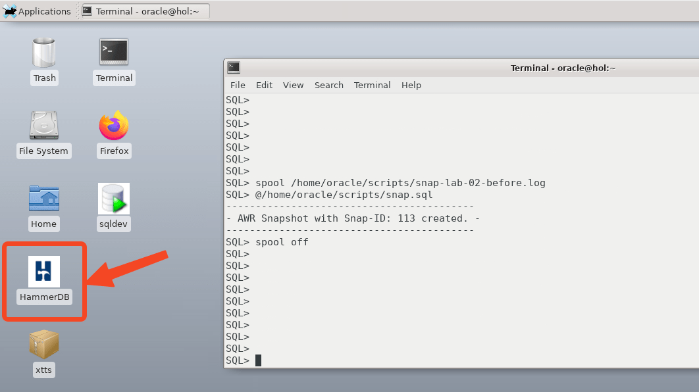
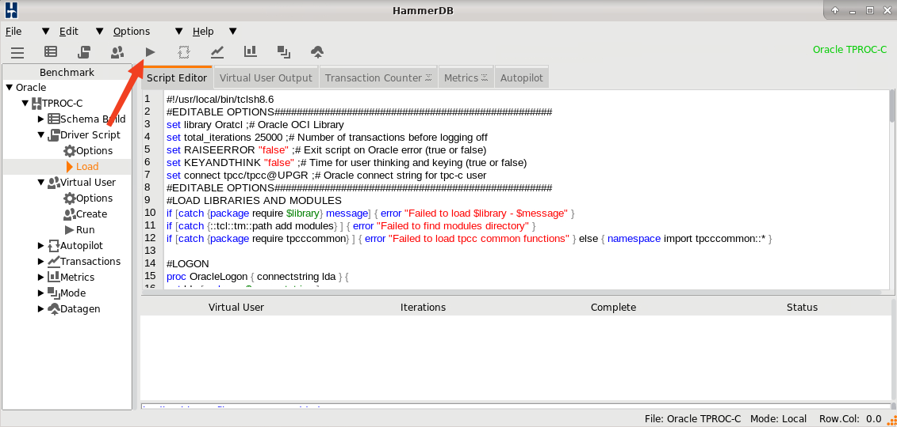
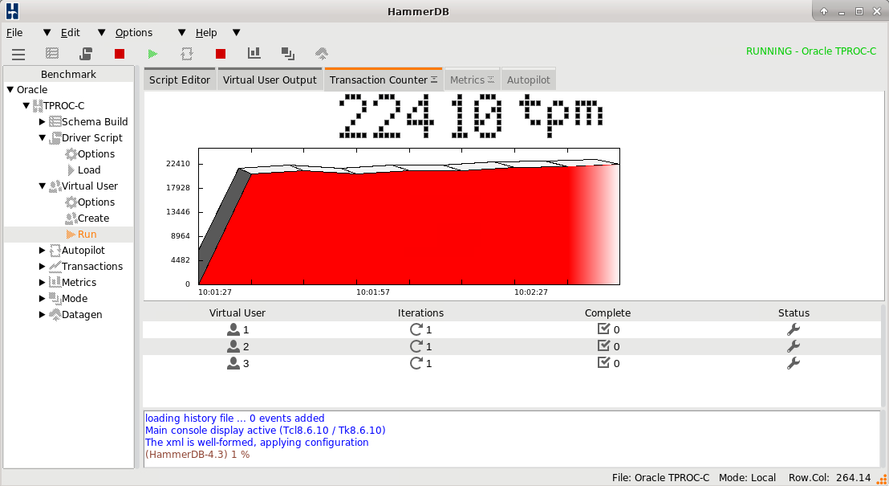
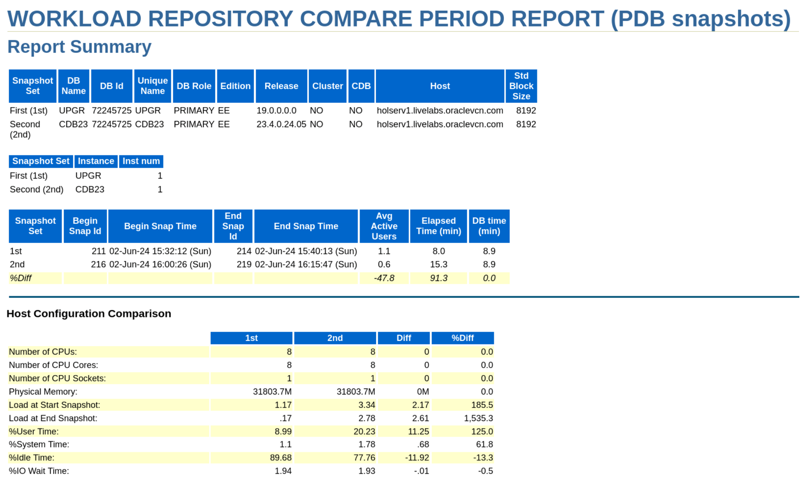

# AWR Compare Periods

## Introduction

In this lab, you will run the same workload that you ran before the upgrade. Then you can compare the performance of the database - before and after upgrade - by creating AWR diff reports.

Those reports give you a first indication of issues you may see (or performance improvements). It is important to compare periods that have roughly the same load and duration.

Estimated Time: 10 minutes

[Hitchhiker's Guide Lab 6](youtube:lwvdaM4v4tQ?start=2782)

### Objectives

In this lab, you will:

* Generate load
* Create an *AWR Diff* report

### Prerequisites

This lab assumes:

- You have completed Lab 5: AutoUpgrade

## Task 1: Generate load

Use HammerDB to create a workload.

1. Use the *yellow* terminal 🟨. Set the environment to the *CDB23* database. Now, since you upgraded the *UPGR* database and plugged into *CDB23*, the environment needs to be set to the CDB.

      ```
      <copy>
      . cdb23
      sqlplus / as sysdba
      alter session set container=UPGR;
      </copy>

      -- Be sure to hit RETURN
      ```

2. Create an AWR snapshot. Take note of the snapshot ID (e.g., 130). You need it later on.

	```
    <copy>
    @/home/oracle/scripts/awr-compare-snap-before.sql
    </copy>
	```

    <details>
    <summary>*click to see the output*</summary>
    ``` text
    SQL> @/home/oracle/scripts/awr-compare-snap-before.sql
    -------------------------------------------
    - AWR Snapshot with Snap-ID: 130 created. -
    -------------------------------------------
    ```
    </details>

3. Don’t exit the terminal. Keep SQL*Plus open.

4. Start HammerDB using the desktop shortcut. 

    

5. In the benchmark list, expand *Oracle* / *TPROC-C*

    

6. Expand *Driver Script*.

    

7. Double-click on *Load*.

    

8. This populates the *Script Editor* tab with the driver script. Ignore any error messages.

9. Click *Run* in the list. Start the load by clicking on the Run icon.

    

10. Click on the Graph / Transaction Counter icon in the top menu icon bar.
    

11. It will take a few seconds; then you will see the performance charts and the transactions-per-minute (tpm). The load run usually takes 2-3 minutes to complete.
    

12. Exit HammerDB. 

13. Switch back to the *yellow* terminal 🟨. SQL*Plus is still running. Create another AWR snapshot. Take note of the snapshot ID (e.g., 131). You need it later on.

    ```
    <copy>
    @/home/oracle/scripts/awr-compare-snap-after.sql
    </copy>
    ```

    <details>
    <summary>*click to see the output*</summary>
    ``` text
    SQL> @/home/oracle/scripts/awr-compare-snap-after.sql
    ------------------------------------------
    - AWR Snapshot with Snap-ID: 131 created. -
    ------------------------------------------
    ```
    </details>

## Task 2: Create an AWR Diff report

In the AWR Diff Report, you will compare a snapshot period **before** upgrade to a similar snapshot period **after** upgrade.

1. Call the AWR Diff script awrddrpt.sql:

	```
	<copy>
	@?/rdbms/admin/awrddrpt.sql
	</copy>
	```
   When prompted for:
    * *report_type*, hit RETURN.
    * *awr_location*, type *AWR\_PDB*, hit RETURN.
    * *num_days*, type *2*, hit RETURN.
    * *begin_snap* (first pair), type the first *Snap Id* from lab 3, hit RETURN. If you can't remember, check the file `/home/oracle/logs/awr-snapshot-snap-before.log`.
    * *end_snap* (first pair), type the last *Snap Id* from lab 3, hit RETURN. If you can't remember, check the file `/home/oracle/logs/awr-snapshot-snap-after.log`.
    * *num_days*, type *2*, hit RETURN.
    * *begin_snap* (second pair), type the first *Snap Id* from this lab, hit RETURN. If you can't remember, check the file `/home/oracle/logs/awr-compare-snap-before.log`.
    * *end_snap* (second pair), type the last *Snap Id* from this lab, hit RETURN. If you can't remember, check the file `/home/oracle/logs/awr-compare-snap-after.log`.
    * *report_name*, hit RETURN.

2. Wait until the HTML output has been generated, then exit SQL*Plus.

	```
	<copy>
	exit
	</copy>
	```

9. Open the AWR diff report in Firefox.

	```
	<copy>
	firefox awrdiff*.html &
	</copy>
	```
	

10. Examine the AWR Diff Report.
   * The first table shows that the two AWR periods are from difference database releases, 19c and 23ai.
   * Next, look at *Top Timed Events* to see what the database spent time on during the two runs.
   * Then, look at *Wait Events* and look for big differences. A negative value in the column *Diff* means the database spent less time on that wait event in the second run, i.e., after the upgrade.
   * Overall, you will not see any significant differences. The purpose of this lab exercise is to recognize and remember how easily AWR Diff Reports can be generated when you have comparable workloads.

11. Close Firefox.

You may now *proceed to the next lab*.

## Learn More

Performance degradation of the database occurs when your database was performing optimally in the past, but over time has gradually degraded to a point where it becomes noticeable to the users. AWR Compare Periods report enables you to compare database performance over time.

An AWR Compare Periods report, shows the difference between two periods in time (or two AWR reports, which equates to four snapshots). Using AWR Compare Periods reports helps you to identify detailed performance attributes and configuration settings that differ between two time periods: before upgrade and after upgrade.

* [Comparing Database Performance Over Time](https://docs.oracle.com/en/database/oracle/oracle-database/19/tgdba/comparing-database-performance-over-time.html#GUID-BEDBF986-1A69-459A-90F5-350B8A407516)
* Webinar, [Performance Stability Perscription #2: Compare AWR](https://www.youtube.com/watch?v=qCt1_Fc3JRs&t=4282s)


## Acknowledgements
* **Author** - Daniel Overby Hansen
* **Contributors** - Klaus Gronau, Rodrigo Jorge, Alex Zaballa, Mike Dietrich
* **Last Updated By/Date** - Daniel Overby Hansen, November 2024
