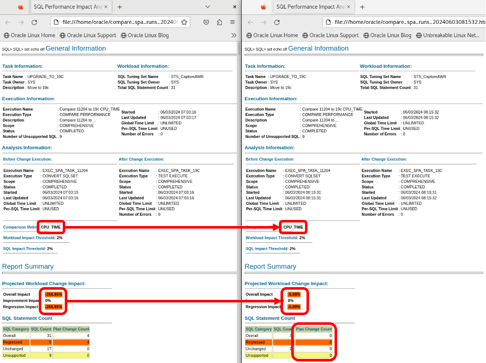
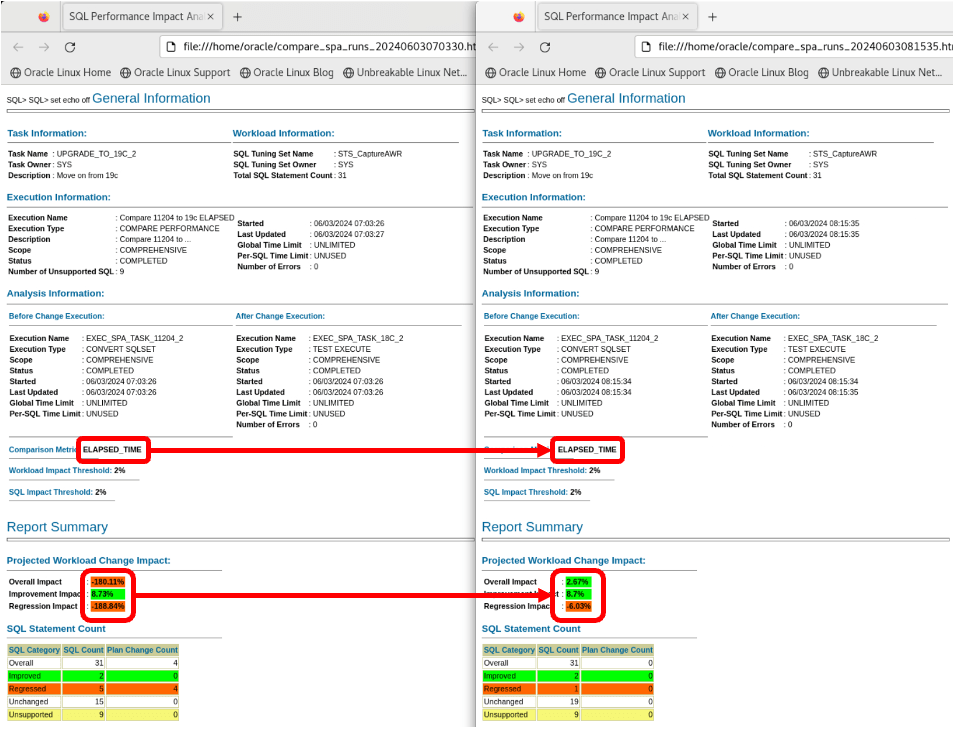

# SQL Plan Management

## Introduction

In this lab, you use SQL Plan Management to ensure that certain SQLs always use a specified plan. When you have identified plan regressions with SQL Performance Analyzer, one of the options you have, is to fix a previous, better plan. You can use SQL Plan Management for that.

Credits: You will use scripts written by Carlos Sierra.

Estimated Time: 15 minutes

### Objectives

In this lab, you will:
* Create SQL Plan Baseline for one statement
* Fix all before-upgrade statements

### Prerequisites

This lab assumes:

- You have completed Lab 7: SQL Performance Analyzer

## Task 1: Create SQL Plan Baseline for one statement

In the previous lab, you found a statement that changed plan after upgrade (SQL ID *4wg725nwpxb1z*). You saw that the index path was better than a full table scan. Now, you want to create a SQL Plan Baseline for that SQL, so the optimizer will only consider the index plan.

1. Ensure that the SQL (*4wg725nwpxb1z*) and both plans are in the cursor cache. Due to transient nature of the shared pool, the two plans might have aged out. The script runs the same SQL with and without the *optimizer\_index\_cost\_adj* hack. This ensures both plans are in the cursor cache.

    ```
    <copy>
    . cdb23
    sqlplus -L tpcc/tpcc@localhost/upgr @/home/oracle/scripts/spm_load_4wg725nwpxb1z_into_cc.sql
    </copy>```

2. Connect to the upgraded UPGR database.

      ```
      <copy>
      . cdb23
      sqlplus / as sysdba
      alter session set container=UPGR;
      </copy>

      -- Be sure to hit RETURN
      ```

3. Get a list of plans for the SQL (*4wg725nwpxb1z*).

    ```
    <copy>
    col operation format a16
    col options format a22
    col object_name format a12
    select PLAN_HASH_VALUE phv, child_number child, operation, options, object_name 
    from v$sql_plan 
    where sql_id='4wg725nwpxb1z' 
    order by 1, child_number, position desc;
    </copy>
    
    -- Be sure to hit RETURN
    ```

    * The plan with hash value *612465046* is the good plan. It uses an index access path. You want this plan in your SQL Plan Baseline.
    * The plan with hash value *4040750106* is a bad plan.  It uses a full table scan.

    <details>
    <summary>*click to see the output*</summary>
    ``` text
    SQL> select PLAN_HASH_VALUE phv, child_number child, operation, options, object_name from v$sql_plan where sql_id='4wg725nwpxb1z' order by 1, child_number, position desc;
    
    PHV        CHILD OPERATION        OPTIONS                OBJECT_NAME
    ---------- ----- ---------------- ---------------------- -----------
    612465046      0 SELECT STATEMENT
    612465046      0 TABLE ACCESS     BY INDEX ROWID BATCHED CUSTOMER
    612465046      0 SORT             ORDER BY
    612465046      0 INDEX            RANGE SCAN             CUSTOMER_I1
    4040750106     1 SELECT STATEMENT
    4040750106     1 TABLE ACCESS     FULL                   CUSTOMER
    4040750106     1 SORT             ORDER BY
    
    11 rows selected.
    ```
    </details>

2. Create a SQL Plan Baseline. You will use a script created by Carlos Sierra. When prompted for:
      - *SQL_ID* (*1*), enter *4wg725nwpxb1z*.
      - *1st Plan Hash Value*, enter *612465046*.
      - *2nd Plan Hash Value*, hit RETURN.
      - *3rd Plan Hash Value*, hit RETURN.
      - *FIXED*, hit RETURN.

      ```
      <copy>
      @/home/oracle/scripts/spb_create.sql
      </copy>
      ```
    <details>
    <summary>*click to see the output*</summary>
    ``` text
    SQL> @spm/spb_create.sql 4wg725nwpxb1z
    
    spb_create_cdb23_oraclevcn_com_upgr_4wg725nwpxb1z_20240603_080908.txt
    
    HOST      : holserv1.livelabs.oraclevcn.com
    DATABASE  : CDB23
    CONTAINER : UPGR
    SQL_ID    : 4wg725nwpxb1z
    SQL_HANDLE:
    SIGNATURE : 9146269246847507225
    
    EXISTING BASELINES
    ~~~~~~~~~~~~~~~~~~
    
    PLANS PERFORMANCE
    ~~~~~~~~~~~~~~~~~
    
           Plan ET Avg      ET Avg      CPU Avg     CPU Avg           BG Avg       BG Avg     Rows Avg     Rows Avg       Executions       Executions                                   ET 100th    ET 99th     ET 97th         ET 95th     CPU 100th   CPU 99th    CPU 97th    CPU 95th
     Hash Value AWR (ms)    MEM (ms)    AWR (ms)    MEM (ms)             AWR          MEM          AWR          MEM              AWR              MEM   MIN Cost   MAX Cost  NL  HJ  MJ Pctl (ms)   Pctl (ms)   Pctl (ms)       Pctl (ms)   Pctl (ms)   Pctl (ms)   Pctl (ms)   Pctl (ms)
    ----------- ----------- ----------- ----------- ----------- ------------ ------------ ------------ ------------ ---------------- ---------------- ---------- ---------- --- --- --- ----------- ----------- -----------     ----------- ----------- ----------- ----------- -----------
      612465046       0.854      29.442       0.835      28.794          254          615        7.265        1.000          187,680                3        262        269   0   0   0      29.442      29.442      29.    442      29.442      28.794      28.794      28.794      28.794
     4040750106      40.745      40.745      40.466      40.466        7,245        7,245        1.000        1.000                1                1      1,982      1,982   0   0   0      40.745      40.745      40.    745      40.745      40.466      40.466      40.466      40.466
    
    Select up to 3 plans:
    
    1st Plan Hash Value (req): 612465046
    2nd Plan Hash Value (opt):
    3rd Plan Hash Value (opt):
    
    FIXED (opt):
    
    FIX
    ---
    NO
    Plans created from memory for PHV 612465046
    
         PLANS
    ----------
             1
    
    Plans created from memory for PHV
    
         PLANS
    ----------
             0
    
    Plans created from memory for PHV
    
         PLANS
    ----------
             0
    
    SQLSET_NAME
    --------------------------------
    S_4WG725NWPXB1Z
    
    dropping sqlset: S_4WG725NWPXB1Z
    created sqlset: S_4WG725NWPXB1Z
    DECLARE
    *
    ERROR at line 1:
    ORA-13767: End snapshot ID must be greater than begin snapshot ID.
    ORA-06512: at "SYS.DBMS_SQLTUNE", line 7963
    ORA-06512: at "SYS.DBMS_SQLTUNE", line 6066
    ORA-06512: at "SYS.DBMS_SQLTUNE_INTERNAL", line 17344
    ORA-06512: at "SYS.DBMS_SQLTUNE", line 9887
    ORA-06512: at "SYS.DBMS_SQLTUNE", line 9409
    ORA-06512: at "SYS.DBMS_SYS_ERROR", line 79
    ORA-06512: at "SYS.DBMS_SQLTUNE_UTIL2", line 90
    ORA-06512: at "SYS.DBMS_SQLTUNE", line 9312
    ORA-06512: at line 1
    ORA-06512: at "SYS.DBMS_SQLTUNE", line 9817
    ORA-06512: at "SYS.DBMS_SQLTUNE_INTERNAL", line 17090
    ORA-06512: at "SYS.DBMS_SQLTUNE_INTERNAL", line 17241
    ORA-06512: at "SYS.DBMS_SQLTUNE", line 6031
    ORA-06512: at "SYS.DBMS_SQLTUNE", line 7929
    ORA-06512: at line 34
    Help: https://docs.oracle.com/error-help/db/ora-13767/
    
    Plans created from AWR for PHVs 612465046
    
         PLANS
    ----------
    
    PLANS:0
    
    RESULTING BASELINES
    ~~~~~~~~~~~~~~~~~~~
    
    CREATED             PLAN_NAME                      ENA ACC FIX REP ADA ORIGIN                        LAST_EXECUTED       LAST_MODIFIED       DESCRIPTION
    ------------------- ------------------------------ --- --- --- --- --- ----------------------------- ------------------- -------------------     ------------------------------------------------------------------------------------------------------------------------------------------------------
    2024-06-03T08:09:15 SQL_PLAN_7xvhmdg36tqst9b7dfa5f YES YES NO  YES NO  MANUAL-LOAD-FROM-CURSOR-CACHE                     2024-06-03T08:09:15
    
    CREATED             PLAN_NAME                      ENA ACC FIX REP ADA ORIGIN                          ET_PER_EXEC_MS  CPU_PER_EXEC_MS BUFFERS_PER_EXEC   READS_PER_EXEC    ROWS_PER_EXEC   EXECUTIONS         ELAPSED_TIME         CPU_TIME      BUFFER_GETS       DISK_READS   ROWS_PROCESSED
    ------------------- ------------------------------ --- --- --- --- --- ----------------------------- ---------------- ---------------- ---------------- ---------------- ---------------- ------------ ----------------     ---------------- ---------------- ---------------- ----------------
    2024-06-03T08:09:15 SQL_PLAN_7xvhmdg36tqst9b7dfa5f YES YES NO  YES NO  MANUAL-LOAD-FROM-CURSOR-CACHE           29.442           28.794              615                6                1            3           88,    325           86,383            1,846               18                3
    
    CREATED             PLAN_NAME                      ENA ACC FIX REP ADA    PLAN_ID PLAN_HASH_2  PLAN_HASH PLAN_HASH_FULL DESCRIPTION
    ------------------- ------------------------------ --- --- --- --- --- ---------- ----------- ---------- --------------     ------------------------------------------------------------------------------------------------------------------------------------------------------
    2024-06-03T08:09:15 SQL_PLAN_7xvhmdg36tqst9b7dfa5f YES YES NO  YES NO  2608724575  2608724575  612465046     2608724575
    
    SQL PLAN BASELINES
    ~~~~~~~~~~~~~~~~~~
    Error: neither SQL handle nor plan name specified
    
    RESULTING BASELINES
    ~~~~~~~~~~~~~~~~~~~
    
    CREATED             PLAN_NAME                      ENA ACC FIX REP ADA ORIGIN                        LAST_EXECUTED       LAST_MODIFIED       DESCRIPTION
    ------------------- ------------------------------ --- --- --- --- --- ----------------------------- ------------------- -------------------     ------------------------------------------------------------------------------------------------------------------------------------------------------
    2024-06-03T08:09:15 SQL_PLAN_7xvhmdg36tqst9b7dfa5f YES YES NO  YES NO  MANUAL-LOAD-FROM-CURSOR-CACHE                     2024-06-03T08:09:15
    
    CREATED             PLAN_NAME                      ENA ACC FIX REP ADA ORIGIN                          ET_PER_EXEC_MS  CPU_PER_EXEC_MS BUFFERS_PER_EXEC   READS_PER_EXEC    ROWS_PER_EXEC   EXECUTIONS         ELAPSED_TIME         CPU_TIME      BUFFER_GETS       DISK_READS   ROWS_PROCESSED
    ------------------- ------------------------------ --- --- --- --- --- ----------------------------- ---------------- ---------------- ---------------- ---------------- ---------------- ------------ ----------------     ---------------- ---------------- ---------------- ----------------
    2024-06-03T08:09:15 SQL_PLAN_7xvhmdg36tqst9b7dfa5f YES YES NO  YES NO  MANUAL-LOAD-FROM-CURSOR-CACHE           29.442           28.794              615                6                1            3           88,    325           86,383            1,846               18                3
    
    CREATED             PLAN_NAME                      ENA ACC FIX REP ADA    PLAN_ID PLAN_HASH_2  PLAN_HASH PLAN_HASH_FULL DESCRIPTION
    ------------------- ------------------------------ --- --- --- --- --- ---------- ----------- ---------- --------------     ------------------------------------------------------------------------------------------------------------------------------------------------------
    2024-06-03T08:09:15 SQL_PLAN_7xvhmdg36tqst9b7dfa5f YES YES NO  YES NO  2608724575  2608724575  612465046     2608724575
    
    spb_create_cdb23_oraclevcn_com_upgr_4wg725nwpxb1z_20240603_080908.txt    
    ```
    </details>

4. What happened in the script?
      - The script asks for an SQL ID.
      - The scripts then display all available plans for that SQL.
      - You choose the one good plan, that you want to add to a SQL Plan Baseline for that SQL. In a realistic scenario, there could be more good plans for an SQL. You could select more plans for the baseline.
      - Optionally, you can *fix* one of the plans. A fixed plan is always used by the optimizer. Normally, the optimizer will choose the best of the *available* plans, but if there is a *fixed* plan, the optimizer will always use that.

4. Verify that the script created a SQL Plan Baseline.

      ```
      <copy>
      col sql_handle format a20
      col plan_name format a30
      col enabled format a7
      col accepted format a8
      SELECT sql_handle, plan_name, enabled, accepted FROM dba_sql_plan_baselines;
      </copy>
      ```

      <details>
      <summary>*click to see the output*</summary>
      ``` text
      SQL> col sql_handle format a20
      SQL> col plan_name format a30
      SQL> col enabled format a7
      SQL> col accepted format a8
      SQL> SELECT sql_handle, plan_name, enabled, accepted FROM dba_sql_plan_baselines;

      SQL_HANDLE           PLAN_NAME                      ENABLED ACCEPTED
      -------------------- ------------------------------ ------- --------
      SQL_7eee136bc66cdb19 SQL_PLAN_7xvhmdg36tqst9b7dfa5f YES     YES
      ```
      </details>

## Task 2: Fix all before-upgrade statements

In this task, you will ensure that the optimizer can only use plans from before the upgrade.

In lab 2, you created a workload using HammerDB. At the same time, you were sampling from cursor cache and into a SQL Tuning Set. Now, you take all the plans from this SQL Tuning Set, load them into a SQL Plan Baseline and set the plans as *fixed* plans. Now, the optimizer may only choose from the *fixed* plans that you captured before the upgrade.

1. Load all plans from the SQL Tuning Set *STS_CaptureCursorCache*. Mark them as *fixed*.

      * **Caution:** Oracle does not recommend this approach for a real database upgrade. Fixing before-upgrade plans after upgrade ensures that the same plans are used, however, it also prevents the optimizer from using new and improved plans. You do this in the lab to prove a point.

      ```
      <copy>
      SET SERVEROUT ON
      DECLARE
         l_plans_loaded  PLS_INTEGER;
      BEGIN
         l_plans_loaded := DBMS_SPM.load_plans_from_sqlset(
                              sqlset_name  => 'STS_CaptureCursorCache',
                              fixed        => 'YES',
                              enabled      => 'YES'
                           );
         DBMS_OUTPUT.PUT_LINE('Plans loaded: ' || l_plans_loaded);
      END;
      /
      </copy>
      ```

      <details>
      <summary>*click to see the output*</summary>
      ``` text
      SQL> SET SERVEROUT ON
      SQL> DECLARE
              l_plans_loaded  PLS_INTEGER;
            BEGIN
               l_plans_loaded := DBMS_SPM.load_plans_from_sqlset(
                                    sqlset_name  => 'STS_CaptureCursorCache',
                                    fixed        => 'YES',
                                    enabled      => 'YES'
                                 );
               DBMS_OUTPUT.PUT_LINE('Plans loaded: ' || l_plans_loaded);
            END;
      /SQL>   2    3    4    5    6    7    8    9   10   11
      Plans loaded: 28

      PL/SQL procedure successfully completed.
      ```
      </details>

2. List all the SQL Plan Baselines.

      ```
      <copy>
      col sql_handle format a20
      col plan_name format a30
      col enabled format a3
      col accepted format a3
      col fixed format a3
      SELECT sql_handle, plan_name, enabled, accepted, fixed FROM dba_sql_plan_baselines;
      </copy>
      ```

      <details>
      <summary>*click to see the output*</summary>
      ``` text
      SQL> col sql_handle format a20
      SQL> col plan_name format a30
      SQL> col enabled format a3
      SQL> col accepted format a3
      SQL> col fixed format a3
      SQL> SELECT sql_handle, plan_name, enabled, accepted FROM dba_sql_plan_baselines;

      SQL_HANDLE           PLAN_NAME                      ENA ACC FIX
      -------------------- ------------------------------ --- --- ---
      SQL_0c79b6d2c87ca446 SQL_PLAN_0sydqub47t926ee6188f4 YES YES YES
      SQL_1465e6eba9245647 SQL_PLAN_18tg6xfnk8pk7f4091add YES YES YES
      SQL_1d3eb12408a63da1 SQL_PLAN_1ugpj4h4acgd12e067175 YES YES YES
      SQL_2469648692a7cf75 SQL_PLAN_28ub4hu9agmvp341d91fc YES YES YES
      SQL_248d6d8dbf8dc7a0 SQL_PLAN_293bdjqzsvjx06e1fb41e YES YES YES
      SQL_3276f16ef07d6f11 SQL_PLAN_34xrjdvs7uvsj872680f9 YES YES YES
      SQL_356b057a1f6de0db SQL_PLAN_3aus5g8gqvs6vdda5da8a YES YES YES
      SQL_3f06a4b1f7e2279b SQL_PLAN_3y1p4q7vy49wva9df0a29 YES YES YES
      SQL_46bd0ca6de6f98d0 SQL_PLAN_4dg8cnvg6z66h341d91fc YES YES YES
      SQL_4719eac4b4e7caec SQL_PLAN_4f6gaskufgkrc341d91fc YES YES YES
      SQL_48be4eb9876ae7d4 SQL_PLAN_4jgkfr63qptynb5a27b1c YES YES YES
      SQL_59a879455619c567 SQL_PLAN_5ma3t8pb1mjb745221865 YES YES YES
      SQL_683745e98d7cb1f6 SQL_PLAN_6hdu5x66rtcgqb77b2865 YES YES YES
      SQL_6b4e05515d733fb5 SQL_PLAN_6qmh5a5fr6gxp3d347ecd YES YES YES
      SQL_7eee136bc66cdb19 SQL_PLAN_7xvhmdg36tqst3f568acb YES YES YES
      SQL_87d3a723fbe4eab5 SQL_PLAN_8gnx74gxy9upp872680f9 YES YES YES
      SQL_922be39ed0f149cd SQL_PLAN_94az3mv8g2kfd4036fd75 YES YES YES
      SQL_945ea9d5e1ba14fa SQL_PLAN_98rp9urhvn57uad9ddf9f YES YES YES
      SQL_98685f091b440961 SQL_PLAN_9hu2z14dn82b13f568acb YES YES YES
      SQL_9ade74d66fd8cd75 SQL_PLAN_9prmnutrxjmbp4036fd75 YES YES YES
      SQL_a4621efe3a403847 SQL_PLAN_a8shyzsx40f273e83d5c2 YES YES YES
      SQL_cba8d9b390654cbf SQL_PLAN_cra6tqf86am5z452bbf3f YES YES YES
      SQL_cbeeaa37269264a6 SQL_PLAN_crvpa6wm94t56702cc8e9 YES YES YES
      SQL_e6de372a14bff12f SQL_PLAN_fdrjr58abzw9g95d362e3 YES YES YES
      SQL_eb19550280bd4f5d SQL_PLAN_fq6ap0a0bumux198236ef YES YES YES
      SQL_f59c951fdf367160 SQL_PLAN_gb74p3zgmcwb0872680f9 YES YES YES
      SQL_f7db40080b18fe6a SQL_PLAN_ggqu0105jjzma6d5a2ea5 YES YES YES
      SQL_fc5efaa8ffabe508 SQL_PLAN_gsrrup3zurt88e90e4d55 YES YES YES

      28 rows selected.
      ```
      </details>

      * Notice all plans are now *fixed*. The one baseline you created in the previous task is now also *fixed*, because that plan was also in the SQL Tuning Set.

3. Previously, when you used SQL Performance Analyzer, you compared the performance before and after upgrade. After upgrade the optimizer could choose whatever plan it wanted. Now, since you have *fixed* the "before upgrade" plans, you have limited the optimizer, so it can only use the same plans. Re-introduce *optimizer\_index\_cost\_adj* to simulate bad performance.

    ```
    <copy>
    alter system set optimizer_index_cost_adj=10000;
    show parameter optimizer_index_cost_adj
    </copy>

    -- Be sure to hit RETURN
    ```

    <details>
    <summary>*click to see the output*</summary>
    ``` text
    SQL> alter system set optimizer_index_cost_adj=10000;

    System altered.

    NAME                                 TYPE        VALUE
    ------------------------------------ ----------- ------------------------------
    optimizer_index_cost_adj             integer     10000
    ```
    </details>

4. Analyze performance using SQL Performance Analyzer. 

      ```
      <copy>
      @/home/oracle/scripts/spa_cpu.sql
      @/home/oracle/scripts/spa_report_cpu.sql
      @/home/oracle/scripts/spa_elapsed.sql
      @/home/oracle/scripts/spa_report_elapsed.sql
      </copy>

      -- Be sure to hit RETURN
      ```

4. Exit SQL*Plus.

    ```
    <copy>
    exit
    </copy>
    ```

5. Compare the SQL Performance Analyzer reports. First, you compare the SPA run from lab 6 with the SPA run from this lab - based on *CPU\_TIME*.

      ```
      <copy>
      firefox $(ls -t compare_spa_runs*html | head -5 | tail -1 )  $(ls -t compare_spa_runs*html | head -2 | tail -1 ) &
      </copy>
      ```

      * If you made additional SPA runs using the script, then the above command won't select the right reports.

      

      * Both reports compare *CPU\_TIME* after upgrade.
      * Both reports are made with `optimizer_index_cost_adj=10000` to simulate bad performance.
      * The left report is when the optimizer was not restricted. It chooses full table scans.
      * The right report is when you restrict the optimizer to use only before-upgrade plans. Here the optimizer chooses index access.
      * There are no plan changes in the right report because you fixed all the old plans. For this workload, there is a SQL Plan Baseline with a fixed plan for all SQLs.
      * On the right side, even when simulating bad performance, the optimizer still uses the same plans as before upgrade. Performance of the workload is similar to before upgrade. There might still be a regressing SQL, but it is not caused by plan changes.
      * In a realistic upgrade project, you would identify the regressing SQLs and create SQL Plan Baselines for those SQLs only. This allows the optimizer to use the newest optimizer features to bring better performance to other plans.
      
5. Compare the SQL Performance Analyzer reports based on *ELAPSED\_TIME*.

      ```
      <copy>
      firefox $(ls -t compare_spa_runs*html | head -4 | tail -1 )  $(ls -t compare_spa_runs*html | head -1) &
      </copy>
      ```

      

      * Both reports now compare *ELAPSED\_TIME*.
      * Again, the right side is much better because the optimizer uses the before-upgrade plans.
      * Performance after upgrade with before-plan plans (the right side) is better than before the upgrade. Most likely, the database is using new functionality which out-of-the-box brings better performance.

6. Reset the optimizer hack.

    ```
    <copy>
    alter system reset optimizer_index_cost_adj scope=spfile;
    alter system set optimizer_index_cost_adj=100;
    </copy>
    ```

You may now *proceed to the next lab*.

## Learn More

SQL Plan Management is a preventative mechanism that enables the optimizer to automatically manage execution plans, ensuring that the database uses only known or verified plans.

SQL Plan Management uses a mechanism called a SQL plan baseline, which is a set of accepted plans that the optimizer is allowed to use for a SQL statement.

In this context, a plan includes all plan-related information (for example, SQL plan identifier, set of hints, bind values, and optimizer environment) that the optimizer needs to reproduce an execution plan. The baseline is implemented as a set of plan rows and the outlines required to reproduce the plan. An outline is a set of optimizer hints used to force a specific plan.

- My Oracle Support, [How to Load SQL Plans into SQL Plan Management (SPM) from the Automatic Workload Repository (AWR) (Doc ID 789888.1)](https://support.oracle.com/epmos/faces/DocumentDisplay?id=789888.1)

- My Oracle Support, [How to Use SQL Plan Management (SPM) – Plan Stability Worked Example (Doc ID 456518.1)](https://support.oracle.com/epmos/faces/DocumentDisplay?id=456518.1)

- Technical brief, [SQL Plan Management with Oracle Database 12c Release 2](http://www.oracle.com/technetwork/database/bi-datawarehousing/twp-sql-plan-mgmt-12c-1963237.pdf)

- Webinar, [Performance Stability Perscription #5: SQL Plan Management](https://www.youtube.com/watch?v=qCt1_Fc3JRs&t=5489s)

## Acknowledgements
* **Author** - Daniel Overby Hansen - Scripts provided by: Carlos Sierra
* **Contributors** - Klaus Gronau, Rodrigo Jorge, Alex Zaballa, Mike Dietrich
* **Last Updated By/Date** - Daniel Overby Hansen, June 2024