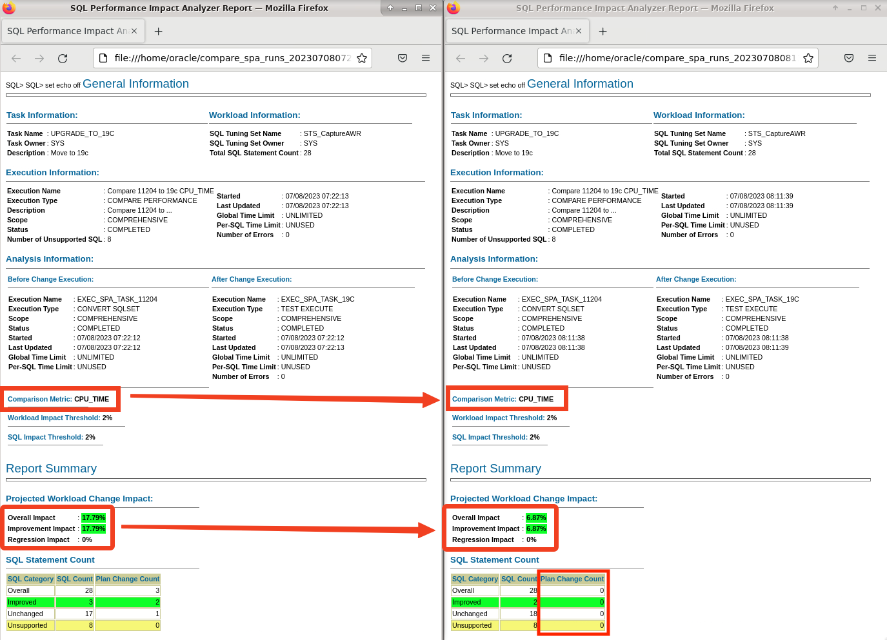

# SQL Plan Management

## Introduction

In this lab, you use SQL Plan Management to ensure that certain SQLs always use a specified plan. When you have identified plan regressions with SQL Performance Analyzer, one of the options you have, is to fix the previous, better plan. You can use SQL Plan Management for that.

Credits: You will use scripts written by Carlos Sierra.

Estimated Time: 15 minutes

[](videohub:1_s7vzto6m)

### Objectives

In this lab, you will:
* Create SQL Plan Baseline for one statement
* Fix all before-upgrade statements

### Prerequisites

This lab assumes:

- You have completed Lab 6: SQL Performance Analyzer

## Task 1: Create SQL Plan Baseline for one statement

In the previous lab, you found a statement that changed plan after upgrade (SQL ID *7m5h0wf6stq0q*). You saw in the SQL Performance Analyzer report that the optimizer used a different access method. You determined that the new plan works better. Now, you want to create a SQL Plan Baseline for that SQL, so the optimizer will only consider the new, better plan.

1. Use the yellow terminal. Connect to the upgraded UPGR database.
      ```
      <copy>
      . upgr19
      sqlplus / as sysdba
      </copy>
      ```
2. Create a SQL Plan Baseline. You will use a script created by Carlos Sierra. When prompted for:
      - *SQL_ID* (*1*), enter *7m5h0wf6stq0q*.
      - *1st Plan Hash Value*, enter *3642382161*.
      - *2nd Plan Hash Value*, if *1075826057* is listed as a known plan, enter *1075826057*, else hit RETURN.
      - *3rd Plan Hash Value*, hit RETURN.
      - *FIXED*, hit RETURN.

      ```
      <copy>
      @/home/oracle/scripts/spb_create.sql
      </copy>
      ```
      <details>
      <summary>*click to see the output*</summary>
      ``` text
      SQL> @/home/oracle/scripts/spb_create.sql

      PL/SQL procedure successfully completed.

      PL/SQL procedure successfully completed.

      1. Enter SQL_ID (required)
      Enter value for 1: 7m5h0wf6stq0q

      BEGIN
      *
      ERROR at line 1:
      ORA-01403: no data found
      ORA-06512: at line 2

      SIGNATURE
      ----------------------------------------
      6460547004167210343

      X_HOST_NAME
      ----------------------------------------------------------------
      hol.localdomain

      X_DB_NAME
      ---------
      UPGR

      X_CO
      ----
      NONE

      X_CONTAINER
      ----------------------------------------------------------------------------
      UPGR

      SQL> @spm/spb_create.sql 7m5h0wf6stq0q

      spb_create_upgr_hol_localdomain_upgr_7m5h0wf6stq0q_20230708_072334.txt

      HOST      : hol.localdomain
      DATABASE  : UPGR
      CONTAINER : UPGR
      SQL_ID    : 7m5h0wf6stq0q
      SQL_HANDLE:
      SIGNATURE : 6460547004167210343


      EXISTING BASELINES
      ##################

      PLANS PERFORMANCE
      #################

            Plan ET Avg      ET Avg      CPU Avg     CPU Avg           BG Avg       BG Avg     Rows Avg     Rows Avg       Executions       Executions                                   ET 100th    ET 99th     ET 97th     ET 95th     CPU 100th   CPU 99th    CPU 97th    CPU 95th
      Hash Value AWR (ms)    MEM (ms)    AWR (ms)    MEM (ms)             AWR          MEM          AWR          MEM              AWR              MEM   MIN Cost   MAX Cost  NL  HJ  MJ Pctl (ms)   Pctl (ms)   Pctl (ms)   Pctl (ms)   Pctl (ms)   Pctl (ms)   Pctl (ms)   Pctl (ms)
      ----------- ----------- ----------- ----------- ----------- ------------ ------------ ------------ ------------ ---------------- ---------------- ---------- ---------- --- --- --- ----------- ----------- ----------- ----------- ----------- ----------- ----------- -----------
      3642382161       2.028                   1.237                      254                     1.000                        15,156                         263        263   0   0   0       2.079       2.079       2.079       2.079       1.254       1.254       1.254       1.254

      Select up to 3 plans:

      1st Plan Hash Value (req): 3642382161
      2nd Plan Hash Value (opt): 
      3rd Plan Hash Value (opt): 

      FIXED (opt): 

      FIX
      ---
      NO
      Plans created from memory for PHV 3642382161

      PLANS
      ----------
            0

      Plans created from memory for PHV

      PLANS
      ----------
            0

      Plans created from memory for PHV

      PLANS
      ----------
            0

      SQLSET_NAME
      --------------------------------
      S_7M5H0WF6STQ0Q

      dropping sqlset: S_7M5H0WF6STQ0Q
      ORA-13754: "SQL Tuning Set" "S_7M5H0WF6STQ0Q" does not exist for user "SYS". while trying to drop STS: S_7M5H0WF6STQ0Q (safe to ignore)
      created sqlset: S_7M5H0WF6STQ0Q
      loaded sqlset: S_7M5H0WF6STQ0Q
      Plans created from AWR for PHVs 3642382161

      PLANS
      ----------
            1

      PLANS:0

      RESULTING BASELINES
      ###################

      CREATED             PLAN_NAME                      ENA ACC FIX REP ADA ORIGIN                        LAST_EXECUTED       LAST_MODIFIED       DESCRIPTION
      ------------------- ------------------------------ --- --- --- --- --- ----------------------------- ------------------- ------------------- ------------------------------------------------------------------------------------------------------------------------------------------------------
      2023-07-08T07:24:45 SQL_PLAN_5ma3t8pb1mjb745221865 YES YES NO  YES NO  MANUAL-LOAD-FROM-STS                              2023-07-08T07:24:45

      CREATED             PLAN_NAME                      ENA ACC FIX REP ADA ORIGIN                          ET_PER_EXEC_MS  CPU_PER_EXEC_MS BUFFERS_PER_EXEC   READS_PER_EXEC    ROWS_PER_EXEC   EXECUTIONS     ELAPSED_TIME         CPU_TIME      BUFFER_GETS       DISK_READS   ROWS_PROCESSED
      ------------------- ------------------------------ --- --- --- --- --- ----------------------------- ---------------- ---------------- ---------------- ---------------- ---------------- ------------ ---------------- ---------------- ---------------- ---------------- ----------------
      2023-07-08T07:24:45 SQL_PLAN_5ma3t8pb1mjb745221865 YES YES NO  YES NO  MANUAL-LOAD-FROM-STS                     1.643            1.106              254                0                1        1,753        2,879,566        1,939,022          444,702               12            1,753

      CREATED             PLAN_NAME                      ENA ACC FIX REP ADA    PLAN_ID PLAN_HASH_2  PLAN_HASH PLAN_HASH_FULL DESCRIPTION
      ------------------- ------------------------------ --- --- --- --- --- ---------- ----------- ---------- -------------- ------------------------------------------------------------------------------------------------------------------------------------------------------
      2023-07-08T07:24:45 SQL_PLAN_5ma3t8pb1mjb745221865 YES YES NO  YES NO  1159862373  1159862373 3642382161

      SQL PLAN BASELINES
      ##################
      Error: neither SQL handle nor plan name specified

      RESULTING BASELINES
      ###################

      CREATED             PLAN_NAME                      ENA ACC FIX REP ADA ORIGIN                        LAST_EXECUTED       LAST_MODIFIED       DESCRIPTION
      ------------------- ------------------------------ --- --- --- --- --- ----------------------------- ------------------- ------------------- ------------------------------------------------------------------------------------------------------------------------------------------------------
      2023-07-08T07:24:45 SQL_PLAN_5ma3t8pb1mjb745221865 YES YES NO  YES NO  MANUAL-LOAD-FROM-STS                              2023-07-08T07:24:45

      CREATED             PLAN_NAME                      ENA ACC FIX REP ADA ORIGIN                          ET_PER_EXEC_MS  CPU_PER_EXEC_MS BUFFERS_PER_EXEC   READS_PER_EXEC    ROWS_PER_EXEC   EXECUTIONS     ELAPSED_TIME         CPU_TIME      BUFFER_GETS       DISK_READS   ROWS_PROCESSED
      ------------------- ------------------------------ --- --- --- --- --- ----------------------------- ---------------- ---------------- ---------------- ---------------- ---------------- ------------ ---------------- ---------------- ---------------- ---------------- ----------------
      2023-07-08T07:24:45 SQL_PLAN_5ma3t8pb1mjb745221865 YES YES NO  YES NO  MANUAL-LOAD-FROM-STS                     1.643            1.106              254                0                1        1,753        2,879,566        1,939,022          444,702               12            1,753

      CREATED             PLAN_NAME                      ENA ACC FIX REP ADA    PLAN_ID PLAN_HASH_2  PLAN_HASH PLAN_HASH_FULL DESCRIPTION
      ------------------- ------------------------------ --- --- --- --- --- ---------- ----------- ---------- -------------- ------------------------------------------------------------------------------------------------------------------------------------------------------
      2023-07-08T07:24:45 SQL_PLAN_5ma3t8pb1mjb745221865 YES YES NO  YES NO  1159862373  1159862373 3642382161

      spb_create_upgr_hol_localdomain_upgr_7m5h0wf6stq0q_20230708_072334.txt
      ```
      </details>
                     
      * The script might produce `ORA-01403` if the SQL is not in memory, don't worry about it. The script then takes from AWR instead.
      * In this lab, most of the times, there is only one available plan. In a realistic scenario, you will have multiple plans to choose from.
      * If you get an error saying *Error: neither SQL handle nor plan name specified*: Run the script again and ensure you input the plan hash values that are displayed.
      * You also have the option of *fixing* a plan. A fixed plan is always used by the optimizer. Normally, the optimizer will choose the best of the *available* plans, but if there is a *fixed* plan, the optimizer will always use that.

4. What happened in the script?
      - The script asks for an SQL ID.
      - The scripts then display all available plans for that SQL.
      - You choose one or more plans, that you want to add to a SQL Plan Baseline for that SQL.
      - Optionally, you can *fix* one of the plans.

4. Verify that the script created a SQL Plan Baseline.

      ```
      <copy>
      col sql_handle format a20
      col plan_name format a30
      col enabled format a7
      col accepted format a8
      SELECT sql_handle, plan_name, enabled, accepted FROM dba_sql_plan_baselines;
      </copy>
      ```

      <details>
      <summary>*click to see the output*</summary>
      ``` text
      SQL> col sql_handle format a20
      SQL> col plan_name format a30
      SQL> col enabled format a7
      SQL> col accepted format a8
      SQL> SELECT sql_handle, plan_name, enabled, accepted FROM dba_sql_plan_baselines;

      SQL_HANDLE           PLAN_NAME                      ENABLED ACCEPTED
      -------------------- ------------------------------ ------- --------
      SQL_59a879455619c567 SQL_PLAN_5ma3t8pb1mjb745221865 YES     YES  
      ```
      </details>
      
## Task 2: Fix all before-upgrade statements

In this task, you will ensure that the optimizer can only use plans from before the upgrade. 

In lab 2, you created a workload using HammerDB. At the same time, you were sampling from cursor cache and into a SQL Tuning Set. Now, you take all the plans from this SQL Tuning Set, load them into a SQL Plan Baseline and set the plans as *fixed* plans. Now, the optimizer may only choose from the *fixed* plans that you captured before the upgrade.

1. Load all plans from the SQL Tuning Set *STS_CaptureCursorCache*. Mark them as *fixed*.

      ```
      <copy>
      SET SERVEROUT ON
      DECLARE
         l_plans_loaded  PLS_INTEGER;
      BEGIN
         l_plans_loaded := DBMS_SPM.load_plans_from_sqlset(
                              sqlset_name  => 'STS_CaptureCursorCache',
                              fixed        => 'YES',
                              enabled      => 'YES'
                           );
         DBMS_OUTPUT.PUT_LINE('Plans loaded: ' || l_plans_loaded);
      END;
      /
      </copy>
      ```

      <details>
      <summary>*click to see the output*</summary>
      ``` text
      SQL> SET SERVEROUT ON
      SQL> DECLARE
              l_plans_loaded  PLS_INTEGER;
            BEGIN
               l_plans_loaded := DBMS_SPM.load_plans_from_sqlset(
                                    sqlset_name  => 'STS_CaptureCursorCache',
                                    fixed        => 'YES',
                                    enabled      => 'YES'
                                 );
               DBMS_OUTPUT.PUT_LINE('Plans loaded: ' || l_plans_loaded);
            END;
      /SQL>   2    3    4    5    6    7    8    9   10   11  
      Plans loaded: 28
      
      PL/SQL procedure successfully completed.
      ```
      </details>

2. List all the SQL Plan Baselines. 

      ```
      <copy>
      col sql_handle format a20
      col plan_name format a30
      col enabled format a3
      col accepted format a3
      col fixed format a3
      SELECT sql_handle, plan_name, enabled, accepted, fixed FROM dba_sql_plan_baselines;
      </copy>
      ```

      <details>
      <summary>*click to see the output*</summary>
      ``` text
      SQL> col sql_handle format a20
      SQL> col plan_name format a30
      SQL> col enabled format a3
      SQL> col accepted format a3
      SQL> col fixed format a3
      SQL> SELECT sql_handle, plan_name, enabled, accepted FROM dba_sql_plan_baselines;

      SQL_HANDLE           PLAN_NAME                      ENA ACC FIX
      -------------------- ------------------------------ --- --- ---
      SQL_0c79b6d2c87ca446 SQL_PLAN_0sydqub47t926ee6188f4 YES YES YES
      SQL_1465e6eba9245647 SQL_PLAN_18tg6xfnk8pk7f4091add YES YES YES
      SQL_1d3eb12408a63da1 SQL_PLAN_1ugpj4h4acgd12e067175 YES YES YES
      SQL_2469648692a7cf75 SQL_PLAN_28ub4hu9agmvp341d91fc YES YES YES
      SQL_248d6d8dbf8dc7a0 SQL_PLAN_293bdjqzsvjx06e1fb41e YES YES YES
      SQL_3276f16ef07d6f11 SQL_PLAN_34xrjdvs7uvsj872680f9 YES YES YES
      SQL_356b057a1f6de0db SQL_PLAN_3aus5g8gqvs6vdda5da8a YES YES YES
      SQL_3f06a4b1f7e2279b SQL_PLAN_3y1p4q7vy49wva9df0a29 YES YES YES
      SQL_46bd0ca6de6f98d0 SQL_PLAN_4dg8cnvg6z66h341d91fc YES YES YES
      SQL_4719eac4b4e7caec SQL_PLAN_4f6gaskufgkrc341d91fc YES YES YES
      SQL_48be4eb9876ae7d4 SQL_PLAN_4jgkfr63qptynb5a27b1c YES YES YES
      SQL_59a879455619c567 SQL_PLAN_5ma3t8pb1mjb745221865 YES YES YES
      SQL_683745e98d7cb1f6 SQL_PLAN_6hdu5x66rtcgqb77b2865 YES YES YES
      SQL_6b4e05515d733fb5 SQL_PLAN_6qmh5a5fr6gxp3d347ecd YES YES YES
      SQL_7eee136bc66cdb19 SQL_PLAN_7xvhmdg36tqst3f568acb YES YES YES
      SQL_87d3a723fbe4eab5 SQL_PLAN_8gnx74gxy9upp872680f9 YES YES YES
      SQL_922be39ed0f149cd SQL_PLAN_94az3mv8g2kfd4036fd75 YES YES YES
      SQL_945ea9d5e1ba14fa SQL_PLAN_98rp9urhvn57uad9ddf9f YES YES YES
      SQL_98685f091b440961 SQL_PLAN_9hu2z14dn82b13f568acb YES YES YES
      SQL_9ade74d66fd8cd75 SQL_PLAN_9prmnutrxjmbp4036fd75 YES YES YES
      SQL_a4621efe3a403847 SQL_PLAN_a8shyzsx40f273e83d5c2 YES YES YES
      SQL_cba8d9b390654cbf SQL_PLAN_cra6tqf86am5z452bbf3f YES YES YES
      SQL_cbeeaa37269264a6 SQL_PLAN_crvpa6wm94t56702cc8e9 YES YES YES
      SQL_e6de372a14bff12f SQL_PLAN_fdrjr58abzw9g95d362e3 YES YES YES
      SQL_eb19550280bd4f5d SQL_PLAN_fq6ap0a0bumux198236ef YES YES YES
      SQL_f59c951fdf367160 SQL_PLAN_gb74p3zgmcwb0872680f9 YES YES YES
      SQL_f7db40080b18fe6a SQL_PLAN_ggqu0105jjzma6d5a2ea5 YES YES YES
      SQL_fc5efaa8ffabe508 SQL_PLAN_gsrrup3zurt88e90e4d55 YES YES YES

      28 rows selected.
      ```
      </details>

      * Notice all plans are now *fixed*. The one baseline you created in the previous task is now also *fixed*, because that plan was also in the SQL Tuning Set.

3. Analyze performance using SQL Performance Analyzer. Previously, when you used SQL Performance Analyzer, you compared the performance before and after upgrade. After upgrade the optimizer could choose whatever plan it wanted. Now, since you have *fixed* the "before upgrade" plans, you have limited the optimizer, so it can only use the same plans. Remember you saw one plan that benefitted from a different access method? This is no longer possible, because the optimizer can only use the old plans.

      ```
      <copy>
      @/home/oracle/scripts/spa_cpu.sql
      @/home/oracle/scripts/spa_report_cpu.sql
      @/home/oracle/scripts/spa_elapsed.sql
      @/home/oracle/scripts/spa_report_elapsed.sql
      </copy>
       
      Be sure to hit RETURN
      ```

4. Exit SQL*Plus.

    ```
    <copy>
    exit
    </copy>
    ```      

5. Compare the SQL Performance Analyzer reports. First, you compare the SPA run from lab 6 with the SPA run from this lab - based on *CPU\_TIME*.

      ```
      <copy>
      firefox $(ls -t compare_spa_runs*html | head -5 | tail -1 )  $(ls -t compare_spa_runs*html | head -2 | tail -1 ) &
      </copy>
      ```

      * If you made additional SPA runs using the script, then the above command won't select the right reports.

      

      * Both reports compare *CPU\_TIME*. 
      * The left report is when the optimizer was not restricted. The right report is when you restrict the optimizer to use only before-upgrade plans.
      * There are no plan changes in the right report because you fixed all the old plans.
      * Notice how the performance improvement is greater when the optimizer is not restricted (the left side).
      * This proves that it is not a good idea to force the optimizer to **only** use plans from before the upgrade.
      * Instead, you should use SPA to identify regressing statements. Create a SQL Plan Baseline for that SQL. Then load the better plans from the SQL Tuning Set you captured before the upgrade. Add the plans as *accepted* plans. You should only use *fixed* plans when you really want to restrain the optimizer.

5. Compare the SQL Performance Analyzer reports based on *ELAPSED\_TIME*.

      ```
      <copy>
      firefox $(ls -t compare_spa_runs*html | head -4 | tail -1 )  $(ls -t compare_spa_runs*html | head -1) &
      </copy>
      ```

You may now *proceed to the next lab*.

## Learn More

SQL plan management is a preventative mechanism that enables the optimizer to automatically manage execution plans, ensuring that the database uses only known or verified plans.

SQL plan management uses a mechanism called a SQL plan baseline, which is a set of accepted plans that the optimizer is allowed to use for a SQL statement.

In this context, a plan includes all plan-related information (for example, SQL plan identifier, set of hints, bind values, and optimizer environment) that the optimizer needs to reproduce an execution plan. The baseline is implemented as a set of plan rows and the outlines required to reproduce the plan. An outline is a set of optimizer hints used to force a specific plan.

- My Oracle Support, [How to Load SQL Plans into SQL Plan Management (SPM) from the Automatic Workload Repository (AWR) (Doc ID 789888.1)](https://support.oracle.com/epmos/faces/DocumentDisplay?id=789888.1)

- My Oracle Support, [How to Use SQL Plan Management (SPM) – Plan Stability Worked Example (Doc ID 456518.1)](https://support.oracle.com/epmos/faces/DocumentDisplay?id=456518.1)

- Technical brief, [SQL Plan Management with Oracle Database 12c Release 2](http://www.oracle.com/technetwork/database/bi-datawarehousing/twp-sql-plan-mgmt-12c-1963237.pdf)

- Webinar, [Performance Stability Perscription #5: SQL Plan Management](https://www.youtube.com/watch?v=qCt1_Fc3JRs&t=5489s)

## Acknowledgements
* **Author** - Mike Dietrich - Scripts provided by: Carlos Sierra
* **Contributors** - Daniel Overby Hansen, Roy Swonger, Sanjay Rupprel, Cristian Speranta, Kay Malcolm
* **Last Updated By/Date** - Daniel Overby Hansen, July 2023
