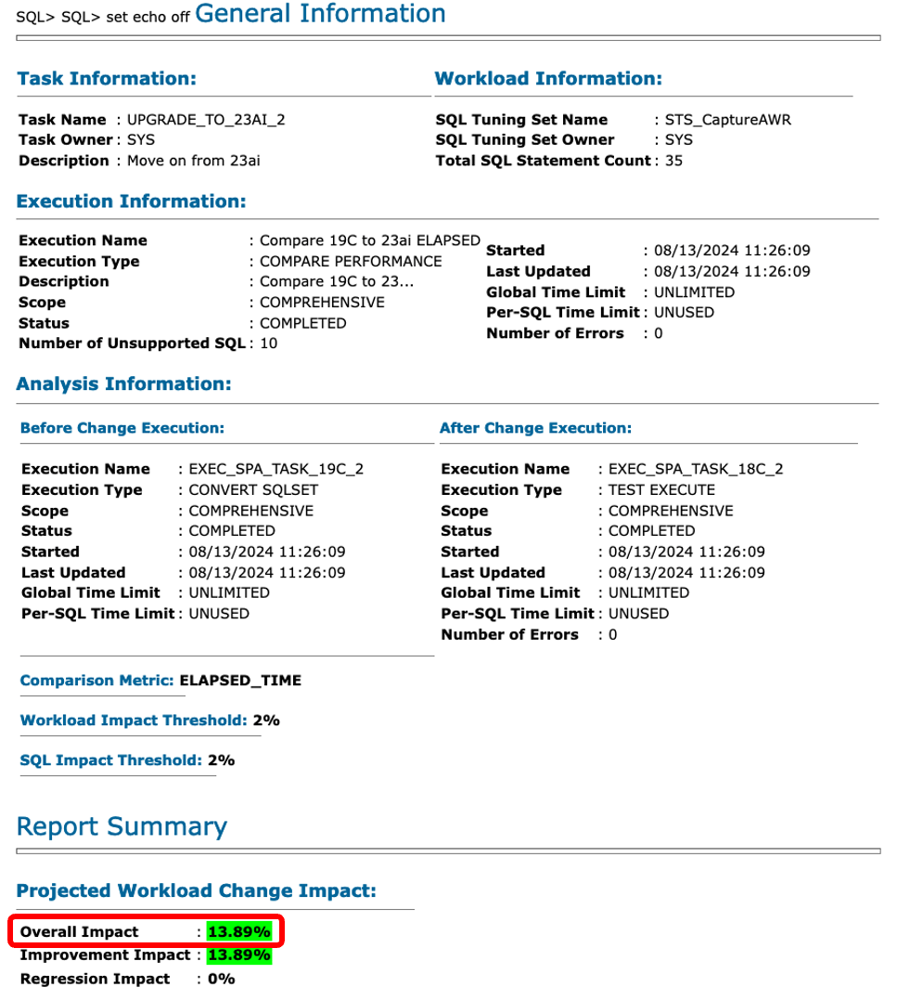

# SQL Tuning Advisor

## Introduction

In this lab, you will use SQL Tuning Advisor (STA) to find suggestions for improving SQLs.

Estimated Time: 10 minutes

[Hitchhiker's Guide Lab 9](youtube:lwvdaM4v4tQ?start=4242)

### Objectives

In this lab, you will:

* Create a tuning task
* Implement recommendations
* Validate recommendations using SQL Performance Analyzer

### Prerequisites

This lab assumes:

- You have completed Lab 8: SQL Plan Management

## Task 1: Create a tuning task

You use the SQL Tuning Set *STS_CaptureCursorCache* as input to the advisor. The SQL Tuning Set contains the workload you generated with HammerDB. SQL Tuning Advisor will look at each of the statements and come up with tuning suggestions.

1. Use the *yellow* terminal 🟨. Connect to the upgraded UPGR database.

      ```
      <copy>
      . cdb23
      sqlplus / as sysdba
      alter session set container=UPGR;
      </copy>

      -- Be sure to hit RETURN
      ```

2. Create a SQL Tuning Advisor task.

    ```
    <copy>
    @/home/oracle/scripts/sta_cc.sql
    </copy>
    ```

3. Optionally, you can look at the script to understand how you use the SQL Tuning Advisor API.

4. First, a few words about the SQL Tuning Advisor. 

    * The SQL Tuning Advisor provides many recommendations. Some are more useful than others. 
    * Generally, you need to use your knowledge of the application using the database to determine which recommendations to apply.
    * Do not blindly accept all recommendations made by the SQL Tuning Advisor.

5. Examine the output of SQL Tuning Advisor. Scroll to the top of the output. Your output may vary from the sample output below. Read and interpret your own report.

    * General information contains basic information on the SQL Tuning Advisor task. You can see it was created based on a SQL Tuning Set.

    <details>
    <summary>*click to see the output*</summary>
    ``` text
    ------------------------------------------------------
    GENERAL INFORMATION SECTION
    ------------------------------------------------------
    Tuning Task Name                : STA_UPGRADE_TO_23AI_CC
    Tuning Task Owner               : SYS
    Workload Type                   : SQL Tuning Set
    Scope                           : COMPREHENSIVE
    Time Limit(seconds)             : 360
    Completion Status               : COMPLETED
    Started at                      : 06/03/2024 08:56:45
    Completed at                    : 06/03/2024 08:57:06
    SQL Tuning Set (STS) Name       : STS_CaptureCursorCache
    SQL Tuning Set Owner            : SYS
    Number of Statements in the STS : 37
    ```
    </details>

    * The Details section contains the findings made by the advisor. Below you can find two of the findings.

    <details>
    <summary>*click see to an example of a finding*</summary>
    ``` text
    -------------------------------------------------------------------------------
    DETAILS SECTION
    -------------------------------------------------------------------------------
     Statements with Results Ordered by Maximum (Profile/Index) Benefit, Object ID
    -------------------------------------------------------------------------------
    Object ID     : 5
    Schema Name   : TPCC
    Container Name: UPGR
    SQL ID	      : f90zn75aphu4w
    SQL Text      : SELECT COUNT(DISTINCT (S_I_ID)) FROM ORDER_LINE, STOCK,
    		DISTRICT WHERE D_ID=:B3 AND D_W_ID=:B2 AND D_ID = OL_D_ID AND
    		D_W_ID = OL_W_ID AND OL_I_ID = S_I_ID AND OL_W_ID = S_W_ID
    		AND S_QUANTITY < :B1 AND OL_O_ID BETWEEN (D_NEXT_O_ID - 20)
    		AND (D_NEXT_O_ID - 1)
    
    -------------------------------------------------------------------------------
    FINDINGS SECTION (3 findings)
    -------------------------------------------------------------------------------
    
    1- Statistics Finding
    ---------------------
      Optimizer statistics for table "TPCC"."ORDER_LINE" are stale.
    
      Recommendation
      --------------
      - Consider collecting optimizer statistics for this table.
        BEGIN
         dbms_stats.gather_table_stats(
          ownname => 'TPCC',
          tabname => 'ORDER_LINE',
          estimate_percent => DBMS_STATS.AUTO_SAMPLE_SIZE,
          method_opt => 'FOR ALL COLUMNS SIZE AUTO');
        END;
        /
    
      Rationale
      ---------
        The optimizer requires up-to-date statistics for the table in order to
        select a good execution plan.
    
    2- Index Finding (see explain plans section below)
    --------------------------------------------------
      The execution plan of this statement can be improved by creating one or more
      indices.
    
      Recommendation (estimated benefit: 99.7%)
      -----------------------------------------
      - Consider running the Access Advisor to improve the physical schema design
        or creating the recommended index.
        create index TPCC.IDX$$_00650001 on TPCC.STOCK("S_W_ID","S_QUANTITY","S_I_I
        D");
    
      Rationale
      ---------
        Creating the recommended indices significantly improves the execution plan
        of this statement. However, it might be preferable to run "Access Advisor"
        using a representative SQL workload as opposed to a single statement. This
        will allow to get comprehensive index recommendations which takes into
        account index maintenance overhead and additional space consumption.
    
    3- Alternative Plan Finding
    ---------------------------
      Some alternative execution plans for this statement were found by searching
      the system's real-time and historical performance data.
    
      The following table lists these plans ranked by their average elapsed time.
      See section "ALTERNATIVE PLANS SECTION" for detailed information on each
      plan.
    
      id plan hash	last seen	     elapsed (s)  origin	  note
      -- ---------- -------------------- ------------ --------------- ----------------
       1 3526939835  2024-08-13/08:38:17	    0.001 Cursor Cache
       2  395199281  2024-08-12/20:52:07	    0.001 AWR		  original plan
    
      Recommendation
      --------------
      - Consider creating a SQL plan baseline for the plan with the best average
        elapsed time.
        BEGIN
         dbms_sqltune.create_sql_plan_baseline(
          task_name => 'STA_UPGRADE_TO_23AI_CC',
          object_id => 5,
          owner_name => 'SYS',
          plan_hash_value => 3526939835);
        END;
        /
    ```
    </details>

    * In the end, there is a summary of the findings that you can use to implement all the recommendations.

    <details>
    <summary>*click to see the output*</summary>
    ``` text
    -- Script generated by DBMS_SQLTUNE package, advisor framework --
    -- Use this script to implement some of the recommendations    --
    -- made by the SQL tuning advisor.			       --
    --							       --
    -- NOTE: this script may need to be edited for your system     --
    --	 (index names, privileges, etc) before it is executed. --
    -----------------------------------------------------------------
    .
    (output truncated)
    .
    create index TPCC.IDX$$_00650001 on TPCC.STOCK("S_W_ID","S_QUANTITY","S_I_ID");
    BEGIN
    dbms_sqltune.create_sql_plan_baseline(
     task_name => 'STA_UPGRADE_TO_23AI_CC',
     object_id => 5,
     owner_name => 'SYS',
     plan_hash_value => 3526939835);
    END;
    /
    BEGIN
    dbms_sqltune.create_sql_plan_baseline(
     task_name => 'STA_UPGRADE_TO_23AI_CC',
     object_id => 5,
     owner_name => 'SYS',
     plan_hash_value => 3526939835);
    END;
    /
    ```
    </details>

## Task 2: Implement recommendations

In this lab, you will implement some of the recommendations. Namely, those about creating indexes. Then, you can use SQL Performance Analyzer to determine the impact.

1. Implement the index recommendation. Be sure to remove duplicate recommendations. Your recommendations may vary from the sample output. Copy/paste the recommendations from your own report.

    ```
    <copy>
    create index TPCC.IDX$$_00650001 on TPCC.STOCK("S_W_ID","S_QUANTITY","S_I_ID");
    </copy>
    ```

    * Do not implement any of the other recommendations.

    <details>
    <summary>*click to see the output*</summary>
    ``` text
    SQL> create index TPCC.IDX$$_00650001 on TPCC.STOCK("S_W_ID","S_QUANTITY","S_I_ID");

    Index created.

    SQL> create index TPCC.IDX$$_02ED0002 on TPCC.ORDERS("O_C_ID","O_D_ID","O_W_ID");

    Index created.
    ```
    </details>

    * This is an exercise only. In a real environment, don't accept the recommendations without thorough consideration.
    * In this lab, the recommendations are to create indexes. Although the effect on your workload might be positive, remember that indexes also affect DMLs.

## Task 3: Validate recommendations using SQL Performance Analyzer

1. Evaluate the effect on your workload. Use SPA to test based on *ELAPSED\_TIME* and generate reports.

    ```
    <copy>
    @/home/oracle/scripts/spa_elapsed.sql
    @/home/oracle/scripts/spa_report_elapsed.sql
    </copy>

    -- Be sure to hit RETURN
    ```

2. Exit SQL*Plus

    ```
    <copy>
    exit
    </copy>
    ```

3. Examine the SQL Performance Analyzer report based on *ELAPSED\_TIME*.

    ```
    <copy>
    firefox $(ls -t compare_spa_runs*html | head -1) &
    </copy>
    ```

    * If you made additional SPA runs using the script, then the above command won't select the right report.

    

    * After creating the index, SPA shows there is almost a 14 % improvement. The number might vary in your environment.
    * This is based on the entire workload from the SQL Tuning Set. It doesn't tell whether the improvement came from the index.    
    
4. Scroll down to the Top SQLs. If the new index is used, you will see SQLs with a plan change.

    

    * One of SQLs use a new plan. Here there is almost a 2% improvement from creating the index.
    * Because the improvement is so small and depending on underlying hardware in the lab environment, you might see a different improvement or even a minor regression. The point is that the index creation leads to a change of execution plan.
    * Remember that adding an index most likely have a negative effect on DMLs. 
    * Generally, exercise caution when implementing recommendations from SQL Tuning Advisor. One change might have a positive effect on one SQL, but a negative elsewhere. This is where SQL Performance Analyzer can help. 

**Congratulations! You have completed the Performance Stability Prescription.**

This is the end of track 1. You can proceed with any lab from tracks 2 or 3. 

You may now *proceed to the next lab*.

## Learn More

SQL Tuning Advisor is SQL diagnostic software in the Oracle Database Tuning Pack.

You can submit one or more SQL statements as input to the advisor and receive advice or recommendations for how to tune the statements, along with a rationale and expected benefit.

* Documentation, [SQL Tuning Advisor](https://docs.oracle.com/en/database/oracle/oracle-database/19/tgsql/sql-tuning-advisor.html#GUID-8E1A39CB-A491-4254-8B31-9B1DF7B52AA1)
* Webinar, [Performance Stability Perscription #4: SQL Tuning Advisor, SQL profiles and SQL patches](https://www.youtube.com/watch?v=qCt1_Fc3JRs&t=4923s)

## Acknowledgements
* **Author** - Daniel Overby Hansen
* **Contributors** - Klaus Gronau, Rodrigo Jorge, Alex Zaballa, Mike Dietrich
* **Last Updated By/Date** - Daniel Overby Hansen, January 2025
