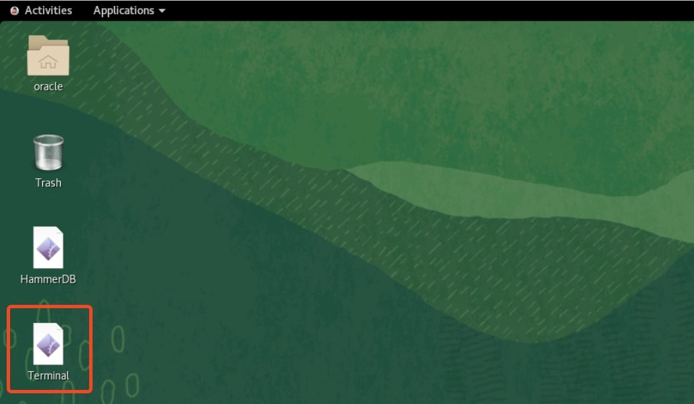
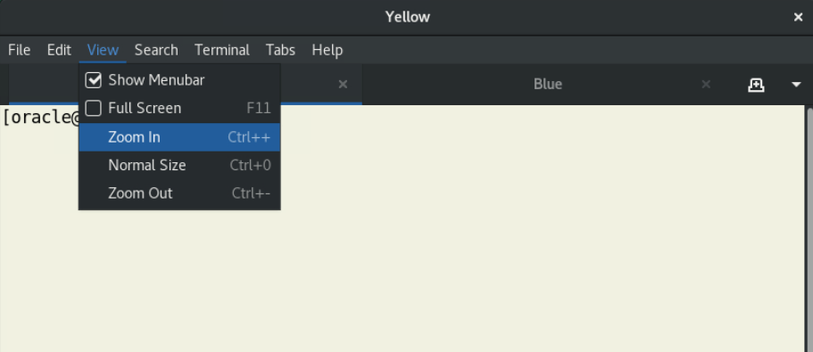
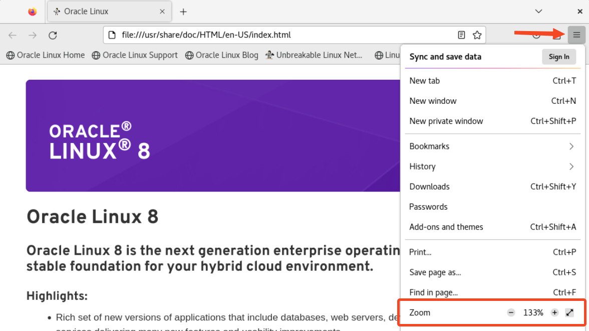

# Initialize Environment

## Introduction

In this lab, ou will verify that all components required to run this workshop are available and running.

Estimated Time: 5 minutes

### Objectives

In this lab, you will:

* Familiarize yourself with the workshop environment
* Initialize the workshop environment

## Task 1: Familiarize yourself with the workshop environment

1. The easiest way to complete the lab is to copy and paste the commands directly into a terminal. Be sure to execute all commands shown in a code block. After pasting, you must press *RETURN*.

2. Before copying and pasting commands, review them; it is important to understand what each the commands does.

3. Double-click the *Terminal* shortcut on the desktop.

    

4. The terminal has two tabs, *yellow* 🟨 and *blue* 🟦. The instructions may specify which tab to use. If not, you can use either of them. All labs start by setting up the appropriate environment.

5. If needed, zoom in within the terminal to make the text larger.

    

6. You also find *VS Code* on the desktop. It has the *Oracle SQL Developer Extension* installed (the new SQL Developer). You won't use it in this lab, but it is installed for convenience.

7. If you want to open HTML documents, you can use the Firefox browser. If the text is too small, zoom in as needed.

    

## Task 2: Initialize the workshop environment

1. When you start the lab, the following components should be running.

    * Database Listener
        * LISTENER
    * Database Instances
        * BEIGE
        * UPGR
        * CDB19
        * CDB26

2. Ensure the listener is running. Use the *yellow* terminal 🟨.

    ``` bash
    <copy>
    ps -ef | grep LISTENER | grep -v grep
    </copy>
    ```

    <details>
    <summary>*click to see the output*</summary>

    ``` text
    $ ps -ef | grep LISTENER | grep -v grep
    oracle    2333     1  0 11:40 ?        00:00:00 /u01/app/oracle/product/26/bin/tnslsnr LISTENER -inherit
    ```

    </details>

3. Ensure that the databases (*BEIGE*, *UPGR*, *CDB19* and *CDB26*) are running.

    ``` bash
    <copy>
    ps -ef | grep ora_ | grep pmon | grep -v grep
    </copy>
    ```

    <details>
    <summary>*click to see the output*</summary>

    ``` text
    $ ps -ef | grep ora_ | grep pmon | grep -v grep
    oracle      5505       1  0 05:09 ?        00:00:00 ora_pmon_UPGR
    oracle      5505       1  0 05:09 ?        00:00:00 ora_pmon_BEIGE
    oracle      5964       1  0 05:09 ?        00:00:00 ora_pmon_CDB19
    oracle      6467       1  0 05:09 ?        00:00:01 ora_pmon_CDB26
    ```

    </details>

You may now [*proceed to the next lab*](#next).

## Acknowledgements

* **Author** - Daniel Overby Hansen
* **Contributors** - Rodrigo Jorge, Alex Zaballa, Mike Dietrich, Alejandro Diaz
* **Last Updated By/Date** - Daniel Overby Hansen, August 2026
