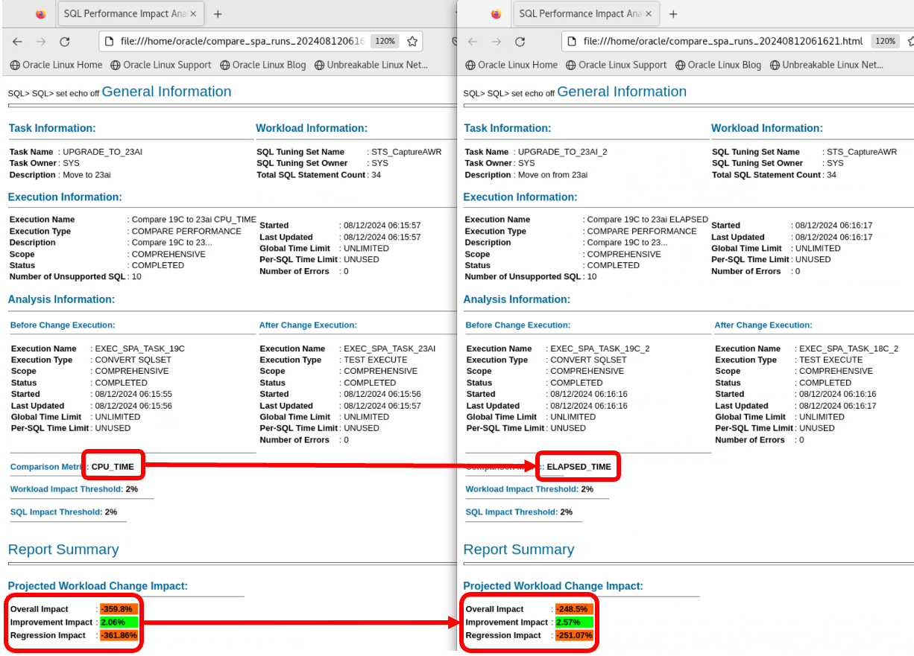
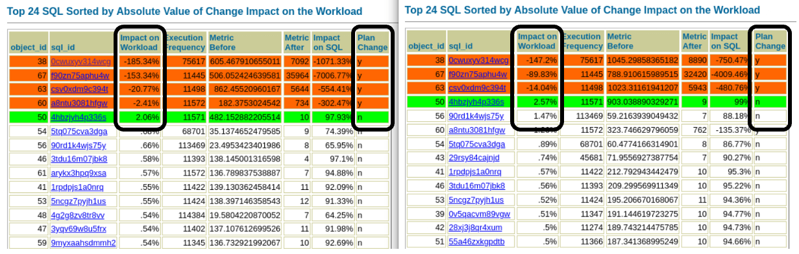
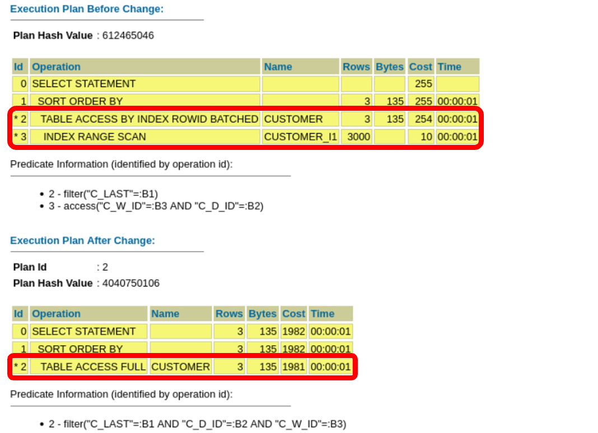
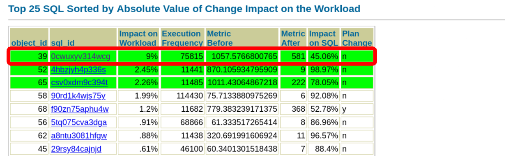

# SQL Performance Analyzer

## Introduction

In this lab, you will use the SQL Performance Analyzer (SPA) that is a part of the Real Application Testing (RAT) option. You will compare statements collected before the upgrade to a simulation of these statements after upgrade. You will use the SQL Tuning Sets collected earlier in the workshop.

Estimated Time: 10 minutes

[Lab 7 walk-through](videohub:1_9v29sxht)

### Objectives

In this lab, you will:

* Check statements

### Prerequisites

This lab assumes:

* You have completed Lab 6: AWR Compare Periods

## Task 1: Check statements

1. Use the *yellow* terminal 🟨. Set the environment to *CDB26* and connect.

    ``` sql
    <copy>
    . cdb26
    sql / as sysdba
    </copy>

    -- Be sure to hit RETURN
    ```

2. Switch to *UPGR*, then check the SQL Tuning Sets and the number of statements in them:

    ``` sql
    <copy>
    alter session set container=UPGR;

    select count(*), sqlset_name
    from dba_sqlset_statements
    where sqlset_name like 'STS_Capture%'
    group by sqlset_name order by 2;
    </copy>

    -- Be sure to hit RETURN
    ```

    <details>
    <summary>*click to see the output*</summary>

    ``` text
    COUNT(*)   SQLSET_NAME
    ---------- ----------------------------------------
    34         STS_CaptureAWR
    43         STS_CaptureCursorCache
    ```

    </details>

3. The next exercises require the SQL ID *0cwuxyv314wcg* to be present in AWR. However, depending on the environment, this statement may not appear because it can execute very quickly. Let’s verify whether it is available.:

    ``` sql
    <copy>
    select sql_text
    from dba_sqlset_statements
    where sqlset_name = 'STS_CaptureAWR'
    and sql_id = '0cwuxyv314wcg';
    </copy>
    ```

    <details>
    <summary>*click to see the output*</summary>

    ``` text
    SQL_TEXT
    ________________________________________________________________________________
    SELECT ROWID FROM CUSTOMER WHERE C_W_ID = :B3 AND C_D_ID = :B2 AND C_LAST = :B1
    ```

    </details>

    If the previous query returned **“no rows selected”**, run the following script to explicitly load the required SQL into the SQL Tuning Set.:

    ``` sql
    <copy>
    @/home/oracle/scripts/upg-07-sts-load.sql
    </copy>
    ```

    <details>
    <summary>*click to see the output*</summary>

    ``` text
    Table SYSTEM.STAGE_TABLE_SQLSET dropped.


    Directory STG_DIR dropped.


    Directory STG_DIR created.

    Loading STS staging table. Please wait..

    Import: Release 23.26.0.0.0 - for Oracle Cloud and Engineered Systems on Fri Jan 2 00:25:11 2026
    Version 23.26.0.0.0

    Copyright (c) 1982, 2025, Oracle and/or its affiliates.  All rights reserved.

    Connected to: Oracle AI Database 26ai Enterprise Edition Release 23.26.0.0.0 - for Oracle Cloud and Engineered  Systems
    Master table "SYSTEM"."SYS_IMPORT_TABLE_01" successfully loaded/unloaded
    Starting "SYSTEM"."SYS_IMPORT_TABLE_01":  system/********@localhost/upgr directory=stg_dir dumpfile=upg-07-sts. dmp tables=system.stage_table_sqlset nologfile=yes
    Processing object type TABLE_EXPORT/TABLE/TABLE
    Processing object type TABLE_EXPORT/TABLE/TABLE_DATA
    . . imported "SYSTEM"."STAGE_TABLE_SQLSET"                26.3 KB     234 rows
    Processing object type TABLE_EXPORT/TABLE/INDEX/STATISTICS/INDEX_STATISTICS
    Processing object type TABLE_EXPORT/TABLE/STATISTICS/TABLE_STATISTICS
    Job "SYSTEM"."SYS_IMPORT_TABLE_01" successfully completed at Fri Jan 2 00:25:42 2026 elapsed 0 00:00:28


    NAME                   COUNT(DISTINCTSQL_ID)
    ______________________ _____________________
    STS_CaptureCursorCache                    43
    STS_CaptureAWR                            34


    PL/SQL procedure successfully completed.


    PL/SQL procedure successfully completed.


    PL/SQL procedure successfully completed.


    PL/SQL procedure successfully completed.


    PL/SQL procedure successfully completed.


    PL/SQL procedure successfully completed.


    Directory STG_DIR dropped.


    Table SYSTEM.STAGE_TABLE_SQLSET dropped.


    COUNT(*) SQLSET_NAME
    ________ ______________________
          34 STS_CaptureAWR
          43 STS_CaptureCursorCache
    ```

    </details>

4. The idea of the *Performance Stability Prescription* is to identify bad performance after upgrade. However, the workload in this lab runs faster in the new version of Oracle AI Database. To get the best benefit out of the lab, you simulate bad performance. This lab changes optimizer behavior (*optimizer\_index\_cost\_adj*) which has a negative impact on the workload.

    You should imagine that this workload performs bad without any changes after the upgrade.

    Verify *optimizer\_index\_cost\_adj* is set to *10000*. This causes the optimizer to disregard index scans and perform full table scan. This causes bad performance.

    ``` sql
    <copy>
    show parameter optimizer_index_cost_adj
    </copy>
    ```

    <details>
    <summary>*click to see the output*</summary>

    ``` text
    SQL> show parameter optimizer_index_cost_adj

    NAME                                 TYPE        VALUE
    ------------------------------------ ----------- ------------------------------
    optimizer_index_cost_adj             integer     10000
    ```

    </details>

    If you see any **value different from 10000** for the *optimizer\_index\_cost\_adj*, adjust it.

    ``` sql
    <copy>
    alter system set optimizer_index_cost_adj=10000;
    show parameter optimizer_index_cost_adj
    </copy>

    -- Be sure to hit RETURN
    ```

    <details>
    <summary>*click to see the output*</summary>

    ``` text
    SQL> alter system set optimizer_index_cost_adj=10000;

    System altered.

    NAME                                 TYPE        VALUE
    ------------------------------------ ----------- ------------------------------
    optimizer_index_cost_adj             integer     10000
    ```

    </details>

5. Analyze performance in the upgraded database. Using the workload captured in SQL Tuning Sets before the upgrade as a baseline, the database now *test executes* the workload stored in the SQL Tuning Sets, but this time in an upgraded database. Now you can see the effect of the new optimizer. First, you compare *CPU\_TIME*.

    ``` sql
    <copy>
    @/home/oracle/scripts/upg-07-spa_cpu.sql
    </copy>
    ```

    The script will:

    * Simulate the execution of all statements in `STS_CaptureAWR`.
    * Compare before/after.
    * Report on the results based on *CPU\_TIME*.

    <details>
    <summary>*click to see the output*</summary>

    ``` text
    SQL> @/home/oracle/scripts/upg-07-spa_cpu.sql
    SQL Tuning Set does exist - will run SPA now ...
    SQL Performance Analyzer Task does not exist - will be created ...

    PL/SQL procedure successfully completed.
    ```

    </details>

6. Generate the HTML Report containing the results below.

    ``` sql
    <copy>
    @/home/oracle/scripts/upg-07-spa_report_cpu.sql
    </copy>
    ```

7. Then repeat this for *ELAPSED\_TIME*. First, analyze performance.

    ``` sql
    <copy>
    @/home/oracle/scripts/upg-07-spa_elapsed.sql
    </copy>
    ```

8. Next, generate a report.

    ``` sql
    <copy>
    @/home/oracle/scripts/upg-07-spa_report_elapsed.sql
    </copy>
    ```

9. Exit SQLcl.

    ``` sql
    <copy>
    exit
    </copy>
    ```

10. Open the two SPA reports. Put them side-by-side.

    ``` bash
    <copy>
    firefox compare_spa_* &
    </copy>
    ```

    

    Notice:

    * The comparison method used in the two reports - *CPU\_TIME* and *ELAPSED\_TIME*.
    * Check the *Overall Impact* metric in the two reports. The test executions show that after upgrade the database performs much worse than before upgrade.
        * For *CPU\_TIME* there is more than 350% regression in performance.
        * For *ELAPSED\_TIME* there is around 250% regression in performance.
        * Numbers might vary in your database.
    * *Conclusion:* The workload runs much slower in the upgraded database.

11. Scroll down to *Top nn SQL ...*. The list shows the SQLs sorted by impact.

    

    * The first table, on the left, shows the SQLs that are using more CPU time after upgrade. These are the red rows.
    * The green row is a SQL using less CPU time after upgrade.
    * The rows without a color are using the same CPU time after upgrade. The threshold in the SPA comparison is set to 2 %. Only SQLs changing more than that are highlighted.
    * All regressing SQLs (the red rows) have a plan change.
    * The second table, on the right, uses elapsed time as metric instead of CPU time.

12. In the first report, find the details on SQL ID *0cwuxyv314wcg* and see the difference in execution plans.

    

    * Notice how the plan changes. Before upgrade, the optimizer used an index to find the rows. After upgrade, the optimizer chooses a full table scan. This is a consequence of the change to *optimizer\_index\_cost\_adj*.
    * Since only a few rows are needed, an index lookup is much faster than the full table scan

13. Examine the other parts of the SPA reports.

14. Close Firefox.

15. Reconnect to the database.

    ``` sql
    <copy>
    . cdb26
    sql / as sysdba
    </copy>

    -- Be sure to hit RETURN
    ```

16. Switch to the *UPGR* database, then implement a change and re-test workload. Imagine you have found the root cause of the bad performance. In this case, you know it is *optimizer\_index\_cost\_adj*. Now, you change the parameter back to the default value (100) and repeat the test.

    ``` sql
    <copy>
    alter session set container=UPGR;

    alter system reset optimizer_index_cost_adj scope=both;

    show parameter optimizer_index_cost_adj
    </copy>

    -- Be sure to hit RETURN
    ```

    * In a real situation, you could make many other changes. Change statistics preferences, gather new statistics, toggle optimizer fixes with `DBMS_OPTIM_BUNDLE`, or many other things.

17. Re-analyze the workload based on *ELAPSED\_TIME*. This allows you to see the impact of the change on the database.

    ``` sql
    <copy>
    @/home/oracle/scripts/upg-07-spa_elapsed.sql
    </copy>
    ```

18. Generate a new report.

    ``` sql
    <copy>
    @/home/oracle/scripts/upg-07-spa_report_elapsed.sql
    </copy>
    ```

19. Exit SQLcl.

    ``` sql
    <copy>
    exit
    </copy>
    ```

20. Open it with Firefox.

    ``` bash
    <copy>
    firefox $(ls -t compare_spa_runs*html | head -1) &
    </copy>
    ```

21. Find the details on SQL ID *0cwuxyv314wcg* again.

    

    * Notice that the plan no longer changes. Without *optimizer\_index\_cost\_adj* the optimizer chooses the same plan after upgrade.
    * The new SPA report focuses on elapsed time. In this case, there is an improvement in the test execution (it is a green row).

22. Close Firefox.

Normally, you would focus on the SQLs with a negative impact on your workload. The idea of such SPA runs is to accept the better plans and identify and cure the ones which are regressing.

You may now [*proceed to the next lab*](#next).

## Learn More

You can run SQL Performance Analyzer on a production system or a test system that closely resembles the production system. It's highly recommended to execute the SQL Performance Analyzer runs on a test system rather than directly on the production system.

* Documentation, [SQL Performance Analyzer](https://docs.oracle.com/en/database/oracle/oracle-database/26/ratug/introduction-to-sql-performance-analyzer.html)
* Webinar, [Performance Stability Prescription #3: SQL Performance Analyzer](https://www.youtube.com/watch?v=qCt1_Fc3JRs&t=4463s)

## Acknowledgements

* **Author** - Daniel Overby Hansen
* **Contributors** - Klaus Gronau, Rodrigo Jorge, Alex Zaballa, Mike Dietrich, Alejandro Diaz
* **Last Updated By/Date** - Rodrigo Jorge, January 2026
