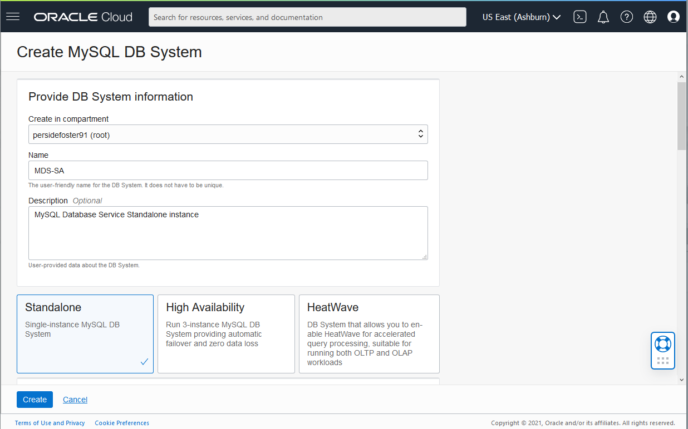
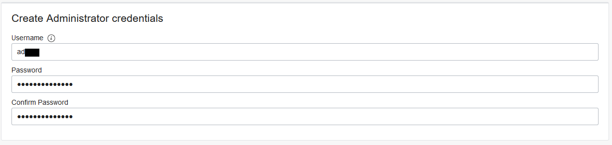

# Create MySQL Database System and HeatWave Cluster

## Introduction

In this lab, you will create and configure the ywo MySQL HeatWave DB Systems. 

_Estimated Time:_ 10 minutes

### Objectives

In this lab, you will be guided through the following tasks:

- Create Stand Alone  MySQL Database instances 
- Create HeatWave  MySQL Database instances 


### Prerequisites

- An Oracle Trial or Paid Cloud Account
- Some Experience with MySQL Shell
- Must complete Lab1

## Task 1: Create a MySQL DB System - Standalone.

In this Task, you will create and configure a MySQL Standalone DB System.

1. Open the navigation menu. Under Databases ->MySQL, click DB Systems
    

2. Click Create MySQL DB System
    

3. Create MySQL DB System dialog complete the fields in each section

    - Provide basic information for the DB System
    - Setup your required DB System
    - Create Administrator credentials
    - Configure Networking
    - Configure placement
    - Configure hardware
    - Exclude Backups

4. Provide basic information for the DB System:

    Select Compartment **(root)**

    Enter Name
        ````
        <copy>MDS-SA</copy>
        ````
    Enter Description
        ````
        <copy>MySQL Database Service Standalone instance</copy>
        ````

    Select **Standalone** to specify a Standalone DB System
        

5. Create Administrator credentials

    **Enter Username** (write username to notepad for later use)

    **Enter Password** (write password to notepad for later use)

    **Confirm Password** (value should match password for later use)

    

6. Configure networking Keep default values

    Virtual Cloud Network: **MDS-VCN**

    Subnet: **Private Subnet-MDS-VCN (Regional)**

    

7. Configure placement  keep checked  "Availability Domain"

    Do not check "Choose a Fault Domain" for this DB System. Oracle will chooses the best placement for you.
    

8. Configure hardware keep default shape  **MySQL.VM.Standard.E3.1.8GB**

    Data Storage Size (GB) keep default value **50**
    

9. Configure Backups, "Enable Automatic Backups"

    Turn off button to disable automatic backup

    

    Click the **Create button**
    

10. The New MySQL DB System will be ready to use after a few minutes.

    The state will be shown as Creating during the creation
    

11. The state Active indicates that the DB System is ready to use.

    Check the MySQL endpoint (Address) under Instances in the MySQL DB System Details page.

    

## Task 2: Create a MySQL DB System - HeatWave 

In this Task, you will create and configure a MySQL HeatWave DB System. 

1. Go to Navigation Menu
         Databases
         MySQL
         DB Systems
    

2. Click 'Create MySQL DB System'
    

3. Create MySQL DB System dialog complete the fields in each section

    - Provide basic information for the DB System
    - Setup your required DB System
    - Create Administrator credentials
    - Configure Networking
    - Configure placement
    - Configure hardware
    - Exclude Backups
    - Advanced Options - Data Import

4. Provide basic information for the DB System:

    Select Compartment **(root)**

    Enter Name
        ```
        <copy>MDS-HW</copy>
        ```
    Enter Description
        ```
        <copy>MySQL Database Service HeatWave instance</copy>
        ```

    Select **HeatWave** to specify a HeatWave DB System
        

5. Create Administrator credentials

    **Enter Username** (write username to notepad for later use)

    **Enter Password** (write password to notepad for later use)

    **Confirm Password** (value should match password for later use)

    

6. On Configure networking, keep the default values

    Virtual Cloud Network: **MDS-VCN**

    Subnet: **Private Subnet-MDS-VCN (Regional)**

    

7. On Configure placement under 'Availability Domain'

    Select AD-3

    Do not check 'Choose a Fault Domain' for this DB System.

    

8. On Configure hardware, keep default shape as **MySQL.HeatWave.VM.Standard.E3**

    Data Storage Size (GB) Set value to:  **1024**

    ```
    <copy>1024</copy>
    ```
    

9. On Configure Backups, disable 'Enable Automatic Backup'

    

10. Click on Show Advanced Options

11. Go to the Networking tab, in the Hostname field enter (same as DB System Name):

	```
	<copy>mdshw</copy> 
	```

12. Review **Create MySQL DB System**  Screen

    

    Click the '**Create**' button

13. The New MySQL DB System will be ready to use after a few minutes

    The state will be shown as 'Creating' during the creation
    

14. The state 'Active' indicates that the DB System is ready for use

    On MDS-HW Page, check the MySQL Endpoint (Private IP Address)

    

## Acknowledgements

- **Author** - Perside Foster, MySQL Solution Engineering

- **Contributors** - Mandy Pang, Principal Product Manager, Salil Pradhan, Principal Product Manager, Nick Mader, MySQL Global Channel Enablement & Strategy Manager
- **Last Updated By/Date** - Perside Foster, MySQL Solution Engineering, May 2022

