# Use Oracle Analytics Cloud with HeatWave

## Introduction

MySQL HeatWave can easily be used for development tasks with existing Oracle services, such as Oracle Cloud Analytics.

_Estimated Lab Time:_ 20 minutes

### Objectives

In this lab, you will be guided through the following tasks:

- Create Oracle Analytics Cloud and connect to MySQL HeatWave
- Create a dashboard on OAC for the airportdb

### Prerequisites

- An Oracle Trial or Paid Cloud Account
- Some Experience with MySQL Shell
- Completed Lab 5

## **TASK 1:**  Create an Oracle Analytic Cloud Service

1. From the OCI console, navigate to Analytics & AI-> Analytics Clouds
 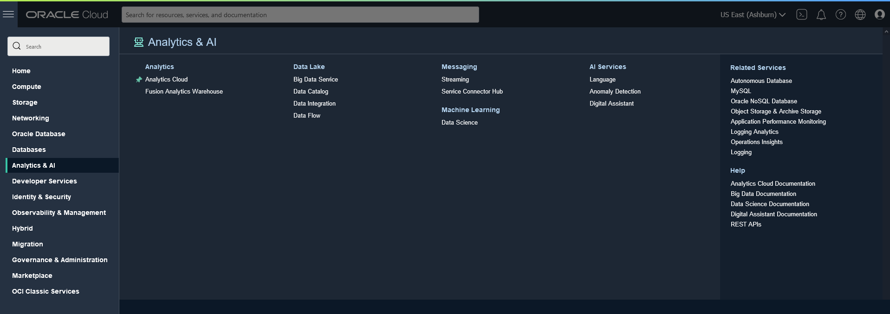

2. Click Create Instance
 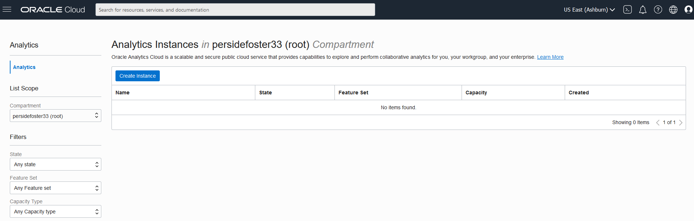

3. On the Create Analytics Instance enter the required information as shown below

    Name:

    ````
    <copy>mdsoac</copy> 
    ````

    Description:

    ````
        <copy>Oracle Analytics Cloud HeatWave Test</copy>
    ````

    Capacity: select **OCPU** and select **1**

    License Type: select **License Included**

4. Click the **Create** button

    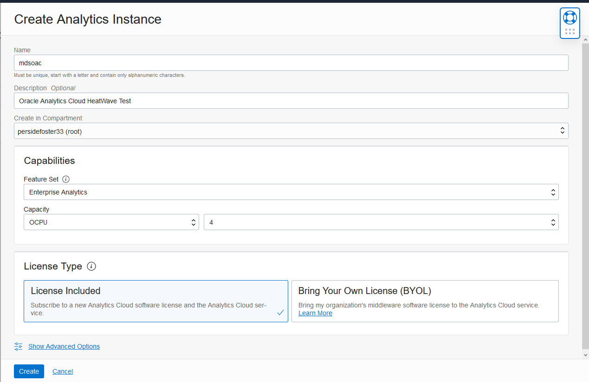

5. Wait 30 minutes for OAC instance creation to complete.

    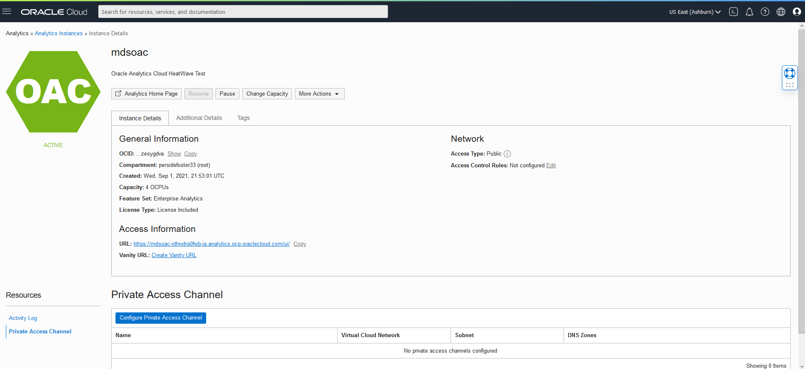

## **TASK 2:**  Configure Private Access Channel

1. Go down to the resources page and click on the **Configure Private Access Channel**  button

2. Click the create Private Access Channel button

3. On the create Private Access Channel page enter the following:

    Name:

    ````
         <copy>mdsoacpac</copy>
    ````

    DNS Zones:
    **Check Virtual Cloud Network's domain name as DNS zone (mdsvcn.oraclevcn.com)**

    Description:

    ````
        <copy>Testing</copy>
    ````

    **Remove second  DNS Zone entry**

4. Click the **Create** button

    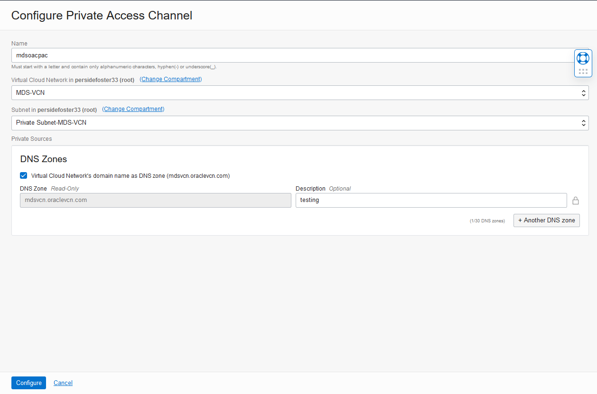

5. Wait 30 minutes for the process to finish, then continue to Subtask 3


## **TASK 3:** Get HeatWave DB Hostname **

1. Before starting go to Menu Databases > DB Systems

2. Select HeatWave database: MDS-HW  

3. Go to Resources and click on the Endpoinst Link and  copy the Internal FQDN and save it to notepad

    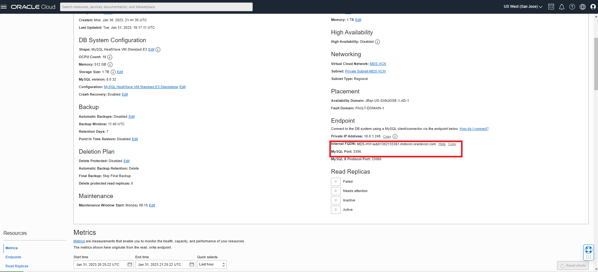

4. Save the Hostname for use with OAC

    Example : **mdshw.sub09012.....mdsvcn.oraclevcn.com**

## **TASK 4:** - Build OAC Dashboard**

1. Navigate to hamburger->Analytics->Analytics Clouds

2. Select the OAC instance you provisioned to access the OAC console by clicking on Analytics Home Page

    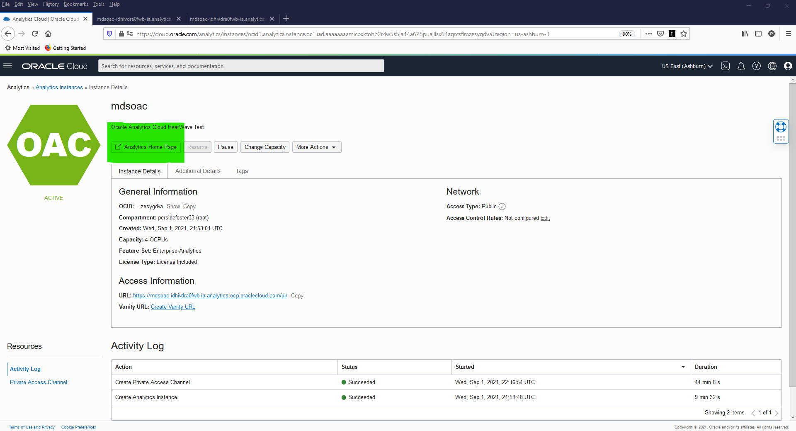

3. Create a Connection to HeatWave to build a dashboard

    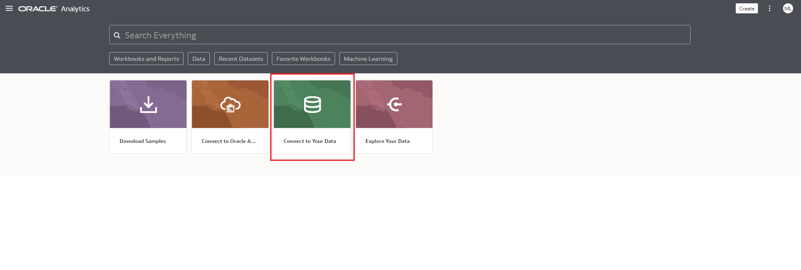

4. Search for mysql and select mysql as the database

    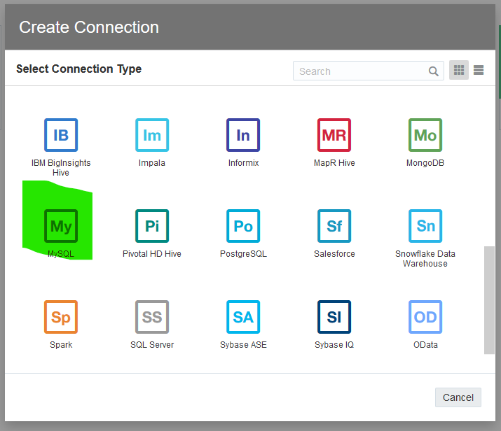

5. Specify the connections details

    - Specify the hostname of MDS in FQDN such as mysql-xxx.oraclevpn.com

    - be sure to use the oacadmin mysql user and password Welcome#123

    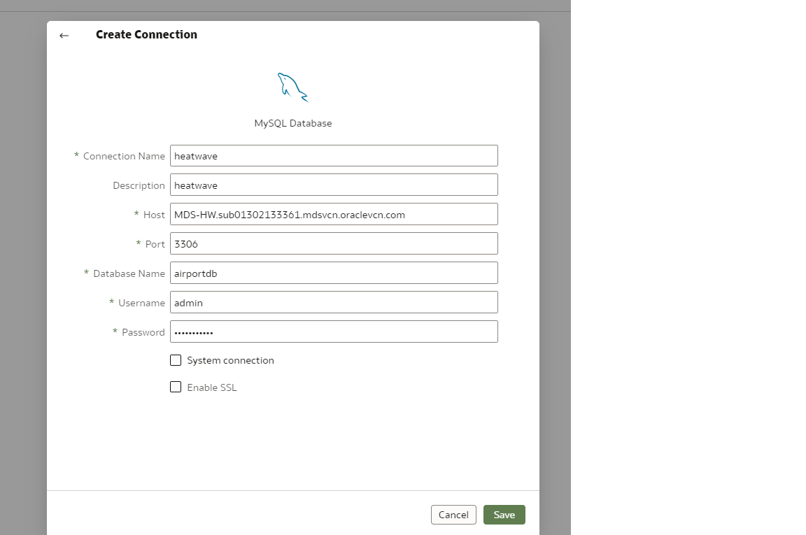

6. Next build the dashboard on MDS HeatWave by selecting Create->Data Set
7. Select the MySQL Connection created earlier
    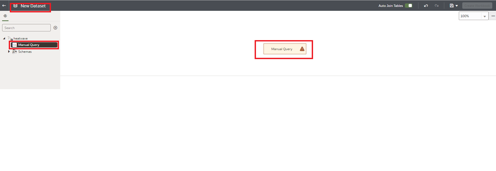

8. Double click "Manual Query" and add the following SQL query to find per-company average age of passengers from Switzerland, Italy and France. Click on the “Enter SQL and type in the following sql statement:

    ````  
    <copy> SELECT
        airline.airlinename,
        AVG(datediff(departure,birthdate)/365.25) as avg_age,
        count(*) as nbpeople
    FROM
        booking, flight, airline, passengerdetails
    WHERE
        booking.flight_id=flight.flight_id AND
        airline.airline_id=flight.airline_id AND
        booking.passenger_id=passengerdetails.passenger_id AND
        country IN ("SWITZERLAND", "FRANCE", "ITALY")
    GROUP BY
        airline.airlinename
    ORDER BY
        airline.airlinename, avg_age
    LIMIT 10;</copy>
    ````

9. Dataset screen
    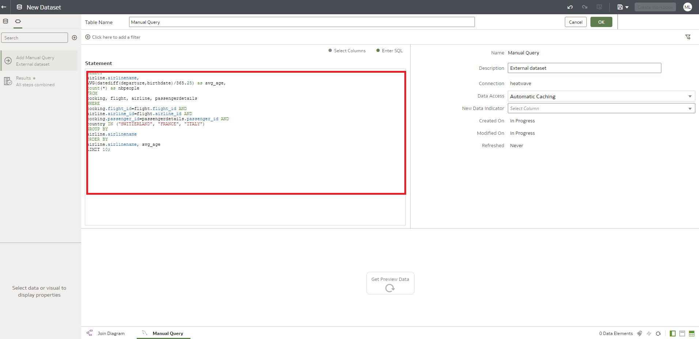

10. Click the  save button and set the DataSet name to Passengers then click Create workbook button
    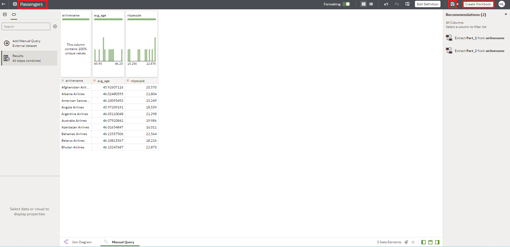

11. On new display page  click on the Dataset icon, select airline and nbrpeople
12. Right click and select "Create Best Visualization".
    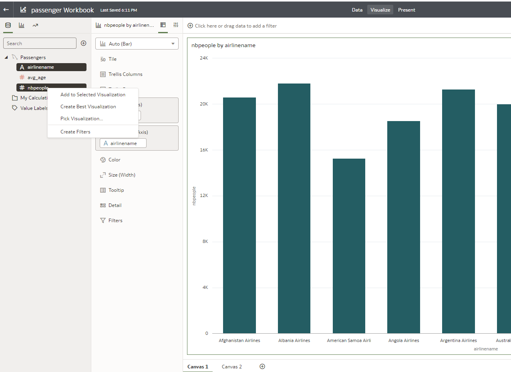

13. Click on the bottom + sign to add Canvas 2 , select airline and avg_age
14. Right click and select "Pick Visualization" and select pie chart.
    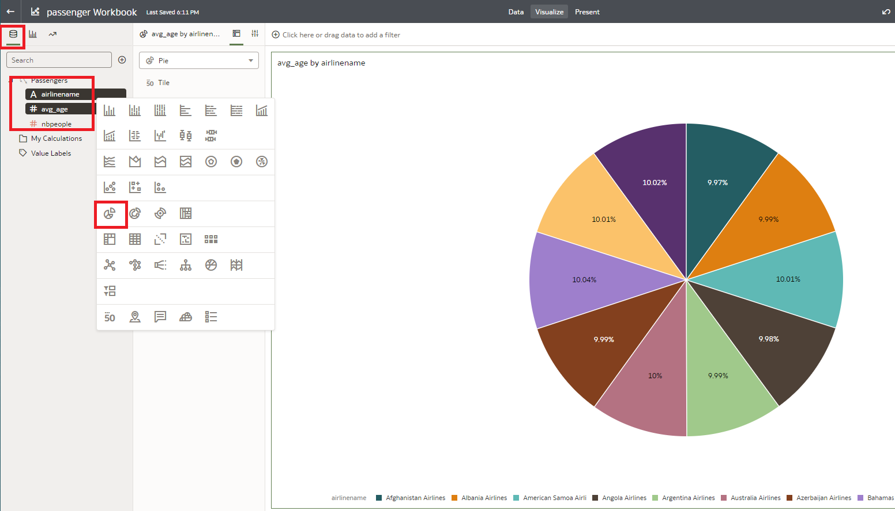

15. Save Workbook as "passenger Workbook" and close OAC application


## Learn More

- If you want to discover more on how to use Oracle Analytics Cloud check our **[Tutorials](https://docs.oracle.com/en/cloud/paas/analytics-cloud/tutorials.html)** and **[Live Labs!](https://apexapps.oracle.com/pls/apex/dbpm/r/livelabs/livelabs-workshop-cards?p100_focus_area=28&me=117&clear=100&session=107258786260970)**

## Acknowledgements
* **Author** - Perside Foster, MySQL Solution Engineering, Harsh Nayak , MySQL Solution Engineering 
* **Contributors** - Salil Pradhan, MySQL Principal Product Manager,  Nick Mader, MySQL Global Channel Enablement & Strategy Manager
* **Last Updated By/Date** - Perside Foster, MySQL Solution Engineering, Sept 2022