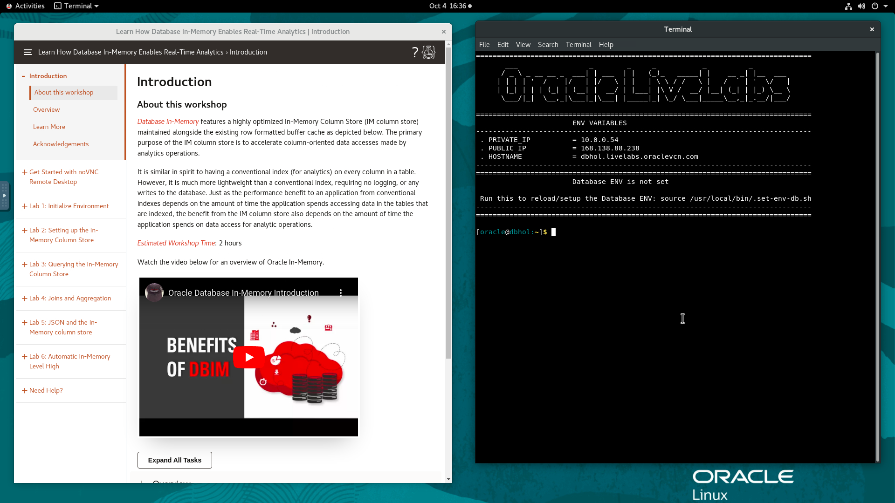

# Initialize Environment

## Introduction

In this lab we will review and startup all components required to successfully run this workshop.

*Estimated Lab Time:* 15 Minutes.

### Video Preview
Watch the video below to get an explanation of enabling the In-Memory column store.

[Youtube video](youtube:dZ9cnIL6KKw)

Watch the video below for a walk through of the lab.
[Youtube video](youtube:7rbgF8Z6hc4)


### Objectives
- Initialize the workshop environment.

### Prerequisites
This lab assumes you have:
- A Free Tier, Paid or LiveLabs Oracle Cloud account
- You have completed:
    - Lab: Prepare Setup (*Free-tier* and *Paid Tenants* only)
    - Lab: Environment Setup

**NOTE:** *When doing Copy/Paste using the convenient* **Copy** *function used throughout the guide, you must hit the* **ENTER** *key after pasting. Otherwise the last line will remain in the buffer until you hit* **ENTER!**

## Task 1: Validate That Required Processes are Up and Running.

1. Now with access to your remote desktop session, proceed as indicated below to validate your environment before you start executing the subsequent labs. The following Processes should be up and running:

    - Database Listeners
        - LISTENER (1521)
        - LISTCDB2 (1522)
    - Database Server Instances
        - CDB1
        - CDB2

    

2. Click the *Terminal* icon on the desktop to launch a session, then run the following to validate that expected processes are up.

    ```
    <copy>
    ps -ef|grep LIST|grep -v grep
    ps -ef|grep ora_|grep pmon|grep -v grep
    systemctl status oracle-database oracle-db-listener
    </copy>
    ```

    
    
    

    If all expected processes are shown in your output as seen above, then your environment is ready for the next task.  

3. If you see questionable output(s), failure or down component(s), refer to the appendix section to restart the service accordingly

4. Follow the (3) steps shown below to launch *SQL Developer*:

    

5. Test database connectivity by clicking on the *+* sign next to each CDB or PDB listed as shown below

    

  
## Task 2: Initialize Database for In-Memory Use Cases

1. From your remote desktop session as user *oracle*, run the block below

    ```
    <copy>
    clear
    cd ~oracle/labs
    rm -rf ~oracle/labs/*
    wget -O novnc-inmemory-21c.zip https://objectstorage.us-ashburn-1.oraclecloud.com/p/7lzqJmKirEWwAc-e4XbZhV0A9ZYzqv7jU6HRhADWpR5zbhHb3x3rKjZV3m5ktDD0/n/c4u04/b/livelabsfiles/o/labfiles/novnc-inmemory-21c.zip
    unzip -qo novnc-inmemory-21c.zip
    rm -f novnc-inmemory-21c.zip
    cd inmemory
    ls -ltrh
    </copy>
    ```

    

2. This workshop will use CDB1 exclusively. As a result, run the following to disable *CDB2* from auto-startup and shut it down.

    ```
    <copy>
    sudo systemctl stop oracle-database
    sudo sed -i -e 's|CDB2.*$|CDB2:/opt/oracle/product/21c/dbhome_1:N|g' /etc/oratab 
    sudo systemctl start oracle-database
    </copy>
    ```

3. Confirm that only **CDB1** database is running on the host.

    ```
    <copy>
    ps -ef|grep ora_|grep pmon|grep -v grep
    </copy>
    ```

## Task 3: Enable In-Memory

1.  Set your oracle environment and connect to **CDB1** database using SQLcl.

    Run the commands below

    ```
    <copy>. ~/.set-env-db.sh CDB1</copy>
    ```

    ```
    <copy>
    sql / as sysdba
    </copy>
    ```

    Output:
    ```
    [CDB1:oracle@dbhol:~]$ . ~/.set-env-db.sh CDB1
    ================================================================================
        ___                 _        _     _           _          _
        / _ \ _ __ __ _  ___| | ___  | |   (_)_   _____| |    __ _| |__  ___
        | | | | '__/ _` |/ __| |/ _ \ | |   | \ \ / / _ \ |   / _` | '_ \/ __|
        | |_| | | | (_| | (__| |  __/ | |___| |\ V /  __/ |__| (_| | |_) \__ \
        \___/|_|  \__,_|\___|_|\___| |_____|_| \_/ \___|_____\__,_|_.__/|___/

    ================================================================================
                        ENV VARIABLES
    --------------------------------------------------------------------------------
    . ORACLE_BASE         = /opt/oracle
    . ORACLE_BASE_HOME    = /opt/oracle/homes/OraDBHome21cEE
    . ORACLE_HOME         = /opt/oracle/product/21c/dbhome_1
    . ORACLE_SID          = CDB1
    . PRIVATE_IP          = 10.0.0.54
    . PUBLIC_IP           = xxx.xxx.88.238
    . HOSTNAME            = dbhol.livelabs.oraclevcn.com
    --------------------------------------------------------------------------------
                        Database ENV set for CDB1

    Run this to reload/setup the Database ENV: source /usr/local/bin/.set-env-db.sh
    --------------------------------------------------------------------------------
    ================================================================================

    [CDB1:oracle@dbhol:~]$ sql / as sysdba

    SQLcl: Release 21.2 Production on Wed Oct 05 02:50:39 2022

    Copyright (c) 1982, 2022, Oracle.  All rights reserved.

    Connected to:
    Oracle Database 21c Enterprise Edition Release 21.0.0.0.0 - Production
    Version 21.7.0.0.0

    SQL>
    ```
2. Update **CDB1** database system parameters

    Run the commands below

    ```
    <copy>
    alter system set heat_map=ON scope=spfile;
    alter system set sga_max_size=8G scope=spfile;
    alter system set sga_target=8G scope=spfile;
    alter system set db_keep_cache_size=3000M scope=spfile;
    alter system set pga_aggregate_target=2500M scope=spfile;
    alter system set inmemory_size=3300M scope=spfile;
    alter system set inmemory_max_populate_servers=4 scope=spfile;
    alter system set inmemory_virtual_columns=enable scope=spfile;
    alter system set "_inmemory_64k_percent"=5 scope=spfile;
    alter system set "_inmemory_small_segment_threshold"=0 scope=spfile;
    alter system set "_optimizer_use_feedback"=FALSE scope=spfile;
    alter system set "_imado_enable_coloptim"=FALSE scope=spfile;
    </copy>
    ```

    Output:

    ```
    SQL> alter system set heat_map=ON scope=spfile;
    2  alter system set sga_max_size=8G scope=spfile;
    3  alter system set sga_target=8G scope=spfile;
    4  alter system set db_keep_cache_size=3000M scope=spfile;
    5  alter system set pga_aggregate_target=2500M scope=spfile;
    6  alter system set inmemory_size=3300M scope=spfile;
    7  alter system set inmemory_max_populate_servers=4 scope=spfile;
    8  alter system set inmemory_virtual_columns=enable scope=spfile;
    9  alter system set "_inmemory_64k_percent"=5 scope=spfile;
    10  alter system set "_inmemory_small_segment_threshold"=0 scope=spfile;
    11  alter system set "_optimizer_use_feedback"=FALSE scope=spfile;
    12* alter system set "_imado_enable_coloptim"=FALSE scope=spfile;

    System SET altered.
    System SET altered.
    System SET altered.
    System SET altered.
    System SET altered.
    System SET altered.
    System SET altered.
    System SET altered.
    System SET altered.
    ```

3. Restart **CDB1** database

    Run the commands below

    ```
    <copy>
    shutdown immediate
    startup
    exit
    </copy>
    ```

    Output:
    
    ```
    SQL> shutdown immediate
    2  startup
    3* exit
    Database closed.
    Database dismounted.
    ORACLE instance shut down.
    ORACLE instance started.

    Total System Global Area   8589933480 bytes
    Fixed Size                    9706408 bytes
    Variable Size               553648128 bytes
    Database Buffers           4546625536 bytes
    Redo Buffers                  7069696 bytes
    In-Memory Area             3472883712 bytes
    Database mounted.
    Database opened.
    Disconnected from Oracle Database 21c Enterprise Edition Release 21.0.0.0.0 - Production
    Version 21.7.0.0.0
    ```

You may now **proceed to the next lab**.

## Appendix 1: Managing Startup Services

The following is a list of the commands to start, stop and determine the status of each of the Lab database services.

1. Database service (All databases and Standard Listener).

    - Start

    ```
    <copy>
    sudo systemctl start oracle-database
    </copy>
    ```
    - Stop

    ```
    <copy>
    sudo systemctl stop oracle-database
    </copy>
    ```

    - Status

    ```
    <copy>
    systemctl status oracle-database
    </copy>
    ```

    - Restart

    ```
    <copy>
    sudo systemctl restart oracle-database
    </copy>
    ```

2. Database service (Non-Standard Listeners).

    - Start

    ```
    <copy>
    sudo systemctl start oracle-db-listener
    </copy>
    ```
    - Stop

    ```
    <copy>
    sudo systemctl stop oracle-db-listener
    </copy>
    ```

    - Status

    ```
    <copy>
    systemctl status oracle-db-listener
    </copy>
    ```

    - Restart

    ```
    <copy>
    sudo systemctl restart oracle-db-listener
    </copy>
    ```

## Acknowledgements
* **Author** - Rene Fontcha, LiveLabs Platform Lead, NA Technology
* **Contributors** - Kay Malcolm, Didi Han, Andy Rivenes
* **Last Updated By/Date** - Rene Fontcha, LiveLabs Platform Lead, NA Technology, October 2022
