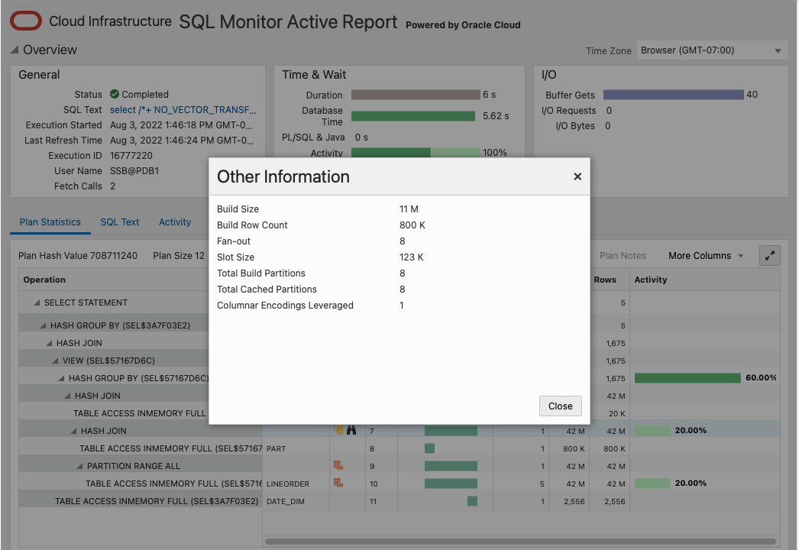

# In-Memory Join Groups

## Introduction

Watch a preview video of creating In-Memory Column Store

[YouTube video](youtube:U9BmS53KuGs)

Watch the video below for a walk through of the In-memory Join Groups lab.

[In-Memory Join Groups](videohub:1_ohs9hpw0)

*Estimated Lab Time:* 10 Minutes.

### Objectives

-   Learn how to enable In-Memory Join Groups

### Prerequisites

This lab assumes you have:
- A Free Tier, Paid or LiveLabs Oracle Cloud account
- You have completed:
- You have completed:
    - Get Started with noVNC Remote Desktop
    - Lab: Initialize Environment
    - Lab: Setting up the In-Memory Column Store

**NOTE:** *When doing Copy/Paste using the convenient* **Copy** *function used throughout the guide, you must hit the* **ENTER** *key after pasting. Otherwise the last line will remain in the buffer until you hit* **ENTER!**

## Task 1: In-Memory Join Groups

To further improve in-memory join performance, starting in 12.2 a new feature called Join Groups was introduced. A Join Group is created explicitly with a DDL statement and tells Oracle that the named columns will be used in joins. When a Join Group is created the compression dictionary entries for the specified columns will be shared and this allows the join to be performed directly on the dictionary entries rather than the data values themselves. This saves CPU by not having to decompress and hash the data to perform the join. This use of a common dictionary requires that the segments be re-populated in the IM column store after the Join Group has been created.

This lab will show Join Groups in action.

Let's switch to the join-groups folder and log back in to the PDB:

```
<copy>
cd /home/oracle/labs/inmemory/join-groups
sqlplus ssb/Ora_DB4U@localhost:1521/pdb1
</copy>
```

And adjust the sqlplus display:

```
<copy>
set pages 9999
set lines 100
</copy>
```

```
[CDB1:oracle@dbhol:~/labs/inmemory]$ cd /home/oracle/labs/inmemory/join-groups
[CDB1:oracle@dbhol:~/labs/inmemory/queries]$ sqlplus ssb/Ora_DB4U@localhost:1521/pdb1

SQL*Plus: Release 21.0.0.0.0 - Production on Fri Aug 19 18:33:55 2022
Version 21.7.0.0.0

Copyright (c) 1982, 2021, Oracle.  All rights reserved.

Last Successful login time: Thu Aug 18 2022 21:37:24 +00:00

Connected to:
Oracle Database 21c Enterprise Edition Release 21.0.0.0.0 - Production
Version 21.7.0.0.0

SQL> set pages 9999
SQL> set lines 150
SQL>
```

1. First let's run a query without Join Groups created as a baseline.

	Run the script *01\_use\_nojg.sql*

	```
	<copy>
	@01_use_nojg.sql
	</copy>    
	```

	or run the query below:  

	```
	<copy>
	set numwidth 16
	set timing on
	select  /*+ NO_VECTOR_TRANSFORM monitor */
		d.d_year, sum(l.lo_revenue) rev
	from
		 lineorder l,
		 date_dim d,
		 part p,
		 supplier s
	where
		 l.lo_orderdate = d.d_datekey
		 and l.lo_partkey = p.p_partkey
		 and l.lo_suppkey = s.s_suppkey
	group by
		d.d_year;
	set timing off
	</copy>
	```

	Query result:

	```
	SQL> @01_use_nojg.sql
	Connected.
	SQL>
	SQL> -- In-Memory Column Store query
	SQL>
	SQL> select   /*+ NO_VECTOR_TRANSFORM monitor */
		2    d.d_year, sum(l.lo_revenue) rev
		3  from
		4     lineorder l,
		5     date_dim d,
		6     part p,
		7     supplier s
		8  where
		9     l.lo_orderdate = d.d_datekey
	 10     and l.lo_partkey = p.p_partkey
	 11     and l.lo_suppkey = s.s_suppkey
	 12  group by
	 13    d.d_year;

						D_YEAR              REV
	---------------- ----------------
							1994   33081281533357
							1995   33057575392153
							1996   33154803309628
							1997   33045133480210
							1998   19372756982278

	Elapsed: 00:00:16.13
	SQL>
	```

2. The following commands will create the Join Groups we want for this query:

	Run the script *02\_create\_jg.sql*

	```
	<copy>
	@02_create_jg.sql
	</copy>    
	```

	or run the statements below:

	```
	<copy>
	alter table lineorder no inmemory;
	alter table part      no inmemory;
	alter table supplier  no inmemory;
	alter table date_dim  no inmemory;
	CREATE INMEMORY JOIN GROUP lineorder_jg1 ( lineorder(lo_orderdate), date_dim(d_datekey));
	CREATE INMEMORY JOIN GROUP lineorder_jg2 ( lineorder(lo_partkey), part(p_partkey));
	CREATE INMEMORY JOIN GROUP lineorder_jg3 ( lineorder(lo_suppkey), supplier(s_suppkey));
	alter table LINEORDER inmemory;
	alter table PART      inmemory;
	alter table SUPPLIER  inmemory;
	alter table DATE_DIM  inmemory;
	select /*+ full(LINEORDER) noparallel(LINEORDER) */ count(*) from LINEORDER;
	select /*+ full(PART) noparallel(PART) */ count(*) from PART;
	select /*+ full(CUSTOMER) noparallel(CUSTOMER) */ count(*) from CUSTOMER;
	select /*+ full(SUPPLIER) noparallel(SUPPLIER) */ count(*) from SUPPLIER;
	select /*+ full(DATE_DIM) noparallel(DATE_DIM) */ count(*) from DATE_DIM;
	</copy>
	```

	Query result:

	```
	SQL> @02_create_jg.sql
	Connected.
	SQL>
	SQL> -- This script will create Join Groups in the In-Memory Column Store
	SQL>
	SQL> alter table lineorder no inmemory;

	Table altered.

	SQL> alter table part      no inmemory;

	Table altered.

	SQL> alter table supplier  no inmemory;

	Table altered.

	SQL> alter table date_dim  no inmemory;

	Table altered.

	SQL>
	SQL> CREATE INMEMORY JOIN GROUP lineorder_jg1 ( lineorder(lo_orderdate), date_dim(d_datekey));

	Join group created.

	SQL> CREATE INMEMORY JOIN GROUP lineorder_jg2 ( lineorder(lo_partkey), part(p_partkey));

	Join group created.

	SQL> CREATE INMEMORY JOIN GROUP lineorder_jg3 ( lineorder(lo_suppkey), supplier(s_suppkey));

	Join group created.

	SQL>
	SQL> alter table LINEORDER inmemory;

	Table altered.

	SQL> alter table PART      inmemory;

	Table altered.

	SQL> alter table SUPPLIER  inmemory;

	Table altered.

	SQL> alter table DATE_DIM  inmemory;

	Table altered.

	SQL>
	SQL> select /*+ full(LINEORDER) noparallel(LINEORDER) */ count(*) from LINEORDER;

					COUNT(*)
	----------------
					41760941

	SQL> select /*+ full(PART) noparallel(PART) */ count(*) from PART;

					COUNT(*)
	----------------
						800000

	SQL> select /*+ full(CUSTOMER) noparallel(CUSTOMER) */ count(*) from CUSTOMER;

					COUNT(*)
	----------------
						300000

	SQL> select /*+ full(SUPPLIER) noparallel(SUPPLIER) */ count(*) from SUPPLIER;

					COUNT(*)
	----------------
						 20000

	SQL> select /*+ full(DATE_DIM) noparallel(DATE_DIM) */ count(*) from DATE_DIM;

					COUNT(*)
	----------------
							2556

	SQL>
	```

	The commands above un-populate tables from the column store, create the join groups, and then re-populate that tables back into the IM column store.

3. Next we need to verify that all of the tables have been re-populated.

	Run the script *03\_im\_populated.sql*

	```
	<copy>
	@03_im_populated.sql
	</copy>    
	```

	or run the query below:

	```
	<copy>
	column owner format a10;
	column segment_name format a20;
	column partition_name format a15;
	column populate_status format a15;
	column bytes heading 'Disk Size' format 999,999,999,999
	column inmemory_size heading 'In-Memory|Size' format 999,999,999,999
	column bytes_not_populated heading 'Bytes|Not Populated' format 999,999,999,999
	select owner, segment_name, partition_name, populate_status, bytes,
		 inmemory_size, bytes_not_populated
	from v$im_segments
	order by owner, segment_name, partition_name;
	</copy>
	```

	Query result:

	```
	SQL> @03_im_populated.sql
	Connected.
	SQL>
	SQL> -- Query the view v$IM_SEGMENTS to shows what objects are in the column store
	SQL> -- and how much of the objects were populated. When the BYTES_NOT_POPULATED is 0
	SQL> -- it indicates the entire table was populated.
	SQL>
	SQL> select owner, segment_name, partition_name, populate_status, bytes,
		2         inmemory_size, bytes_not_populated
		3  from   v$im_segments
		4  order by owner, segment_name, partition_name;

																																													In-Memory            Bytes
	OWNER      SEGMENT_NAME         PARTITION_NAME  POPULATE_STATUS        Disk Size             Size    Not Populated
	---------- -------------------- --------------- --------------- ---------------- ---------------- ----------------
	SSB        CUSTOMER                             COMPLETED             24,928,256       23,199,744                0
	SSB        DATE_DIM                             COMPLETED                122,880        1,179,648                0
	SSB        LINEORDER            PART_1994       COMPLETED            563,601,408      497,156,096                0
	SSB        LINEORDER            PART_1995       COMPLETED            563,470,336      496,107,520                0
	SSB        LINEORDER            PART_1996       COMPLETED            565,010,432      497,156,096                0
	SSB        LINEORDER            PART_1997       COMPLETED            563,314,688      496,107,520                0
	SSB        LINEORDER            PART_1998       COMPLETED            329,015,296      290,127,872                0
	SSB        PART                                 COMPLETED             56,893,440       19,070,976                0
	SSB        SUPPLIER                             COMPLETED              1,769,472        2,228,224                0

	9 rows selected.

	SQL>
	```

	Verify that the segments have been fully populated (i.e. BYTES_NOT_POPULATED is zero).

4. Now let's review the Join Groups that we created:

	Run the script *04\_query\_jg.sql*

	```
	<copy>
	@04_query_jg.sql
	</copy>
	```

	or run the query below:

	```
	<copy>
	col joingroup_name  format a18;
	col table_name      format a15;
	col column_name     format a15;
	select
		joingroup_name,
		table_name,
		column_name,
		gd_address
	from
		user_joingroups
	order by
		joingroup_name;
	</copy>
	```

	Query result:

	```
	SQL> @04_query_jg.sql
	Connected.
	USER_JOINGROUP QUERY

	JOINGROUP_NAME     TABLE_NAME      COLUMN_NAME     GD_ADDRESS
	------------------ --------------- --------------- ----------------
	LINEORDER_JG1      DATE_DIM        D_DATEKEY       0000000235EFFF40
	LINEORDER_JG1      LINEORDER       LO_ORDERDATE    0000000235EFFF40
	LINEORDER_JG2      LINEORDER       LO_PARTKEY      0000000234FFFF40
	LINEORDER_JG2      PART            P_PARTKEY       0000000234FFFF40
	LINEORDER_JG3      SUPPLIER        S_SUPPKEY       0000000235CFFF40
	LINEORDER_JG3      LINEORDER       LO_SUPPKEY      0000000235CFFF40

	6 rows selected.

	SQL>
	```

	Notice that there are two tables/columns defined for each join group listed along with a single global dictionary address for each one.

5. Now we'll run the same query we ran in Step 1 again in this step and see what the difference is. Note that there are really two queries being run in this step. The first runs the query and the second creates a SQL Monitor active report. This is done because currently SQL Monitor information is the only way to verify that you have used Join Groups in your query.

	It is also possible to display the "Columnar Encodings …" values in the actual XML so that you don't have to run a SQL Monitor active report. This technique is documented in the In-Memory Guide and you can run this version of the script in the next step if you want.

	Run the script *05\_use\_jg.sql*

	```
	<copy>
	@05_use_jg.sql
	</copy>    
	```

	or run the queries below:

	```
	<copy>
	set numwidth 16
	set timing on
	select   /*+ NO_VECTOR_TRANSFORM monitor */
		d.d_year, sum(l.lo_revenue) rev
	from
		lineorder l,
		date_dim d,
		part p,
		supplier s
	where
		l.lo_orderdate = d.d_datekey
		and l.lo_partkey = p.p_partkey
		and l.lo_suppkey = s.s_suppkey
	group by
		d.d_year;
	set timing off
	</copy>
	```

	```
	<copy>
	set trimspool on
	set trim on
	set pages 0
	set linesize 1000
	set long 1000000
	set longchunksize 1000000
	spool sqlmon_joingroup.html
	select dbms_sql_monitor.report_sql_monitor(type=>'active') from dual;
	spool off
	</copy>
	```

	Query result:

	```
	SQL> @05_use_jg.sql
	Connected.
	SQL>
	SQL> -- In-Memory Column Store query
	SQL>
	SQL> select   /*+ NO_VECTOR_TRANSFORM monitor */
		2    d.d_year, sum(l.lo_revenue) rev
		3  from
		4     lineorder l,
		5     date_dim d,
		6     part p,
		7     supplier s
		8  where
		9     l.lo_orderdate = d.d_datekey
	 10     and l.lo_partkey = p.p_partkey
	 11     and l.lo_suppkey = s.s_suppkey
	 12  group by
	 13    d.d_year;

						D_YEAR              REV
	---------------- ----------------
							1994   33081281533357
							1995   33057575392153
							1996   33154803309628
							1997   33045133480210
							1998   19372756982278

	Elapsed: 00:00:05.68
	SQL>

	SQL> set echo off

	Hit enter ...

	<html>
	 <head>
		<meta http-equiv="Content-Type" content="text/html; charset=utf-8"/>
		<script language="javascript" type="text/javascript">
		 <!--
				var version = "21.0.0.0.0";
			 var swf_base_path = "http://download.oracle.com/otn_software/omx/";

					 document.write('<script language="javascript" type="text/javascript" ' +
													'src="' + swf_base_path + 'emsaasui/emcdbms-dbcsperf/active-report/scripts/activeReportInit.js?' +
													Math.floor((new Date()).getTime()/(7*24*60*60*1000)) +
												 '"></' + 'script>');
				-->
		</script>
	 </head>
	 <body onload="sendXML();">
		<script type="text/javascript">
				 writeIframe();
			 </script>
		<script id="fxtmodel" type="text/xml">
		 <!--FXTMODEL-->
		 <report db_version="21.0.0.0.0" elapsed_time="1.91" cpu_time="1.73" cpu_cores="2" hyperthread="N" con_id="3" con_name="PDB1" timezone_offset="0" packs="2" service_type="0" encode="base64" compress="zlib">
			<report_id><![CDATA[/orarep/sqlmonitor/main]]></report_id>
									eAHtXXtz20aS/z+fYg51dXFya4ngWzmKFT1oR7t6rSg7ldvaQoEkJDEmCRoAbWk/
	/f163gDxoqw89spJKiKAnumenu6enp5uYBB/XHjLcDVPwsiLgnUYJexTEMXzcHXo
	tPcaDouf4pmfBIdOo7/faO03G80mazZ+aHd+6DSc4TeMDUQzb+1H/jJI0Jju4v5k
	M/0QJN403KySYW+wn7oWIPMV4D/5Cy9O/CgZbqFodwb7GZhMw2A1227Wca1mBEFk
	7ufSOQDi+yBh8xVIWE0Dbz47dFwMO4iJCfyyTWyQ13EQzf3FodPvtXq4C+5Rg8mn
	xofm5POv/U8fpw/idvAYTMWwcljX7lhAHGO31+s13QNxe73wV96DHz8cOr1Gv+e6
	TU4CkN1tFgvPetzsdg56nWa733bYbOJtVvOPm8BbYSIOnZPTYwwEdwGf3IXRUt5/
	7He9bnv/fL7aPLLmXnvv8dFhkjkPYZxIsNnkIVzwGQbzNhg3Rjp0G5hIdSGmgq6G
	4/GxuC/nfspZN2wN9uUvAUsXRNzwGrSJZ/xSPF1H4T1kaAiurheb+EdOwd5i/ilY
	+JN4L4z86SL4NF3tTcMle3V7OWbv3dfvW98N9lVL0c8ynG0WwXD89/Pvr9HPYF/e
	EE9B7qf5NBiuZxOQoK7kM8niJHiESMSc3YfOL84wDhbBNIFU73//3+zyyns/Orm9
	uvFub44ux2+ubi6Y1CH2/T56mu3NvKfAj/7C4s3y1WJvEUK3PgWrTfAdGP3pm7so
	XBLCxXwVhNEsiNjiL3RNiubN5ks245fQqISt+c94s14v5gCMv/n8EEQBb0398ubU
	jh1ytPTzQ/BEz/3VjHHc1A/uAWK9tyY9pasUBHUvIOK92JNX39xH4WbNJgSqRgSG
	WSySkw3NSTbx8PTqcsReHZ2fs5urn8eYFXmfMJGVuIuC+MGYg/QNAXQ3jyB/6kky
	h6Tk2oQcONHBwq9s32kM9rfBRPPZJvITqP0Qdkf/lvQv56u7kEXL6f2hc3X70+jG
	e3tz9e567OxLNoRrEDz/FxQlWH0S9zBubhaZ0EjPgEBrvLsgmE386QdneOcv4gBi
	TCY0t6U/TaAGnrZS3Kg6QwhwcRvIbxRMN5F3t/DvY2eIcRcD05PFIlh4/iYJZ+G6
	LvhsRuvHLHCGwcqfLIJZLSRoNVvCuNQjaRbcRwEw1IMmw7uhScQ0cIqcYRJtSrmr
	B7/0Hz2FrVlrJDC30RPa3PmbReLtwDjRsD7r7n3Pvwcf7slGiEXLGbaarWav22d/
	g/UtntskTLDETtcboXzOMD20wb4RSym5g32BgWRxQGocs+RpjTVFmjm1LNAjKduw
	0es4mHmktM6w0+20ugcw/wQh9cMCJloUYLvbcrGo5AOGCayd99mfJxIey263CJiv
	S3dBMpVWhg80v9/J5u4OHWPlh2K0IVgKTPziLsyAK908efJif7mGaMtxqNtsCjMS
	Y51dbxxG5j05dOYrtgyWYfTEdVNBljQctgf7Npi5srEaUmZB4s8XDORGgiUF3gW8
	Hs6xnMcdeAXCgIpxFcG1uw7jhrIcDG4gU7by0CHHhnMLtkr4dtydkr5f3j1uyuDo
	OEwCmc5wT0gtVo5Dp+kwW5LVvQcIZpQ8RIEPR+xSSaboi602y0kQUVsxBxBnxe3y
	6eNrM0iHjwsjq9rIiZSurLzKoGpVoKJFn4a7a7/tWv0Cakd6O79Rv90X6dfwHkaW
	RJ+YPiAPWHI/xOzzNVvaofHoHL4ZG98e3Y4uRpe3DiP/mmQ0WCdwqPFrHUKa4G/T
	5PLFHT1OwxibFLpHbil+i1UfplF2X4Dup6PxTw4jAxqu0Ct3CdjxLwIrud8CK35x
	rK6F0Y9mtC2a0l9FxuQpCeJhs4U5FD/Vg3z6QPg8hFUn2tsH3QNse+SlbsetPp73
	Xbdz0HXdRqMPnOquAhOuVuOHBv5rY6/Er9XDj5NFOP0wBGf/s3XUe9NojbCAyJsK
	RhjqxyWfH3L4iDRymMS6sYKLMJ/tr5Ur0mg0QAn9HxwgOMWBymaNg+pm2Dp5fDFI
	/IkzfAqwBSjGgQ2S3PFivXD3GvRvGTzWWfhu8fQhWPrOcPAf/zg5Pbo9+oeDLZDz
	z38OS5uqfR3fWACd3r3VauUM9W6wFrwHq1eCgpY8ta5jR7WeY5sIKdYSyueQgKRm
	Te7TSyWfZMgK78eav48T+J338ziJnsxdzOtHFsIQG7Mg268MD0nCTo/bnePR8Qln
	pVRyAYku1mlYlwOtbSwkP+lr3LGkS3eVDN8cQc6zsID+ZJA4586PDlHliqnVbr3u
	Zn+r7y/Adv27Yhvvig1Cl2bX4C59DeY9ZO/gXmIYespnLI/rsQHiDOeAMpSkuI2+
	9rcQVKF8/7P39vjEc3t1UacksJqCwX6KC7CMNguE1LdbcLkOnSeHYQWCbyitphjX
	IKMBysZyen9TDbit1oDzH81sfIH018B0/bthGu+E6avUQ0y39K6O1BunO1/QhfnO
	SnhKm6hhlYL/ATblvK4tEUOsNiLVo7z+/VGOXxplHaFxsYPkprLcSHZ6brd32q3l
	JqQMetZb2Fncvs699nnN0lAt4WVzT7uJHJ9xEG4S2i17CGr7tjgMHhBIMP7C2dvL
	q5uRd3V9e3bhjS6OR6eno1Pvp7PLWyHBHNpacjPNebuz/0VA983o6PbdzWjsjS6P
	js9Hr77FfgA7gm+/44pQ0c3pMU4FbsZnV5e7tQN67/ro5uji1bcF8eFv2bc8QFyP
	DgTgPQrA16H56t3t+dnlyDsfHb15JTxdpVhOrUHndKDcl3odXJ8fnYxEJN07/kXS
	gN3yK2b53lgEHOMb05XxXdl3zO3tQqvEoYxCPTLlODV9tRDinOjo5GQ0HstmmjPM
	0U6p9MF3o+bNu/Pz7T5PtT9fizrM+enZ5dvtfgppY86OKN6NRx4FSLZxPLMj7+jt
	25vR26Nb0jIhr4apPPYCIao1eouFWuJtIfuCTsye8Qs6MQJeq5P0ZOaOKKVQlgLV
	6j8zkxaCHUdb3NGOIx7/fHTt/fXq7NI7u7x+d6t0zKJsxw4VZTkyZjotkzGco+Su
	V3y5QTzKvw9Si1hqnwgHcJdt4APFUkYXmZ0kOnk0y2LOMTVfEx5tKtAkvaVO7V/x
	DCttmnYMkx/K6FgfnR9VB0kZzZUIiyKQL8Oi+JUbFoVvhxPYnMhop9OkJ/mx0Qbi
	nyZ2i5GpYGiN2GjzwD3oHDQJ606x0XUUzOZTnMmpSJo/nSJVxBn+18dNmPzPGYLQ
	nit+H4o/p+LPnrzyThGo/tvoF3GJYzzdoZimau6+Pxv9LBiLKINkLH5lGRtOfkUK
	w1Bbd3Qs7qgQLmd3IedbHfeZnEe8WU2ERqV4jKh0s9dqdLruzpy3otJKP7ej0nyE
	nr+Y+7GcET1+wfAfxR/yZNUarGZCsEc25pRXz0XpcQDl6IjjAPzKTk859zvdA8pb
	eIbc/1Hcr8cryypg3ye5g1+53Gm77YNOq4ezkRzL4LbdRr/d7Lo4UM1jEx19lJiH
	Mja1Wr1+p987wPFQhXlowZqmjk6MNsuDkLR5OBeyJm3B+ZU3fnd9rY2BNBjjFNA4
	DfMcg3FLmxsmXFPr7Ors8mJ0cXXzCyPfSBgUnADLOcGv7JxI80Ekn5+NbvLtSZNO
	a/InjJ7kyzRPG1NncJYdx/1CS4J1oSNQKduijI19tuVmJ+iZVkTOiWU9pJFXXNjd
	bFiqgHPvDNtNKG3AZb/t9rqNg3aBKjQh691es4/1MK0KSbBce/HaR/qb2+o2epxh
	1k3FMnGiiPNCssr6NNSaCVpR8ax4Ng66jVa7BSp+c5XB3vk2qzLXKZW5pv21gflt
	Vaav5w6zWKAyRI4SFOWMiXntk07k60ubP8pXGO4t5c4TJKRwkly32+j+jkojZ+Wl
	lIa4eEY7QYYszLcjy5IhBCLsF/JppSKpydhNkRrIdu42O/38NaXVPyjSjxZUsITz
	yKLutPt9t9Wvcnu2DBaOn5M5ndMyngMkkpWTcE2pNyoTsdIhr78CIEdCsRCSXSDP
	FEO6ujktWgPKjdW/J49hC5+5dMg1/6W0YIepNOkoantgaYNczWk34p2eXeSbp2an
	g+y7HO+LLD2SQtKrDV85aInKs0xl6tHrt9pdsoLPXcpVUKjOhkDux541H1hKZCYS
	T0lSlRSM8khVzphIujx0wHO6DWscBR+RKgTFkteca+bG8qNqggkjEMEGVFHoTnhC
	pEyck/2ITTllZ+v7cgOpd+cqE0okI2PLk0mUkqZSZEhxG8OJij/AuFipUnbeCC9F
	SCeF8iM7K21EpBpyblAO73YViUm+pKZQLKsxzz98ZluVR8gz4qhPtdSmUVAyPiaO
	541PkcTJ84wrwInNpsAD6a5lY0BfEaWZQuKLuyWdmq+wUU2QHpDpLpViA8UsjLbI
	2hUsERgHL0zBXIrZLtyYykkXCWpy0nGRnXSdImwx0aJZJbLJIVhAwiRsZ7RhEoSX
	mc254yKgNb80bQ19KOcmP8QDAO79Y/1ObcvAQ1xTrr6iNJXl/FWqIbFbYphWm5eV
	avQdfY5JPWLGy0649DZNuiQAUFzmb50EUhNu1yCzQtJvKdudXfLEXxbesZvwc0xp
	3nBj4umhIx6LvGB6HInHqMuZBiixmDGyB2yzQlXO4mm+ukdl2HqTIPWY57+7ysfi
	lkqaKlI7RDIFeomOfZ4nD2y0moZQa1RfSOyGLIWXwwUGrgIPVpE0nnNknkf+PVFa
	AxvqpxR0fZyIVhXiHKNwEIFtdiRrEyiBsHCsFvZYtlM1DeTQrjfxwyz8jA5ymIAq
	rq35FyuFsHpDRHDyzKuYnLKnSNjOtEWtoBRGYR6qbC6FsY3N1ZJINlfu6qWVFfHu
	51tZE50tMrR5AXLojjK12RA5PVJOFsViC6PgAPxqatViAWZwuyO04k/oQAg5yVMH
	QTJ5lbpOpddrdbpbGkCNdVZHnnE2HiHYsa2bikfSJxF4jzfzxYyNsfAqI0G/yQzj
	SAn1H/SU21v8H4WHOFVRtgA2iOeO035XbnMLTbDAAkPMTqj2WKFK216GiliDVaHR
	e+hs59ruvvFXr3HOt92p3pjHDLnnM9SqsBg1mwmbwDUXo9KjKUSjTe14ESa5jPJX
	6Ou1mDxGNcKvfw3BrBjwlYNAYF3Mg1gEBZ+uVUAB1OUvkWJezPgUnsKZQLDYxnPi
	I1l+xnZHxBbBHZVmq+FOAkxawFDtO8F6V0kGYj6CjAvU5s1fr1GtZYjALxSbFg1Z
	DxaGHWCEko71MIql7qsSPwImNhvGyLBHFRm7BvkBd0uKsJNvIPwQUgsabgBZEq0h
	VrN5/IG9Ch6niw05F9AbKmbDr+8qSUJATJB0Ei42y5UfGaeBSU8imBWRpT0GzAt3
	IzAY0iI5H1QFRuQIeteQTWh5zkqesgx6g5JD0NWEqrPr0BNKyGeRoNfr0yBYvw+m
	7CdoFfsrtEqLhzEdCoY0j5HmxUwUnBKZVYPVTqLqRWNib3iNrlRAfsFZqwDHU5+o
	EQhatgWs9IsO+q2GXeGYtWyIARUvF2S9t/0jewap4KzZ7PcRrslbb6gDVJhllhe7
	AxSElDyVBXh217t6Z62Ud6bnQBybS8eMYMK4xDHjB8mS/7yl5QuQRtnn6vxaHaVk
	T9m3dp7ghb2Rrnbx8k7iqROEMKiCrcrFKzxuRx+2i4dJUZdyLAD4upvGNvFPESPa
	1tmdwkRwNLDGqTARxF8sC1VhImpWqifZuMrO0p2X6fD/W7rbOCK17RtGS5dyRl4m
	AooAWDGKl9jAIPhfjABPdoyAbkt3miupDUzHddvNzAhTyoC2akNfGF3iLBebFayH
	LRCQPyIC4UvmNkh2YQJafQggXyEgDu0KK+7hMZYV7sNZUkFtfhQgI/3Q3rk5NABQ
	5nggfX6Qc1CQqbLPragnt0EPx66dp5f8qGGqRdHcsd9igA4qgteU+WOskt4MbQdS
	RIpQyXpdYYfSqURFwZTCnCKMRCy321lF9EhFVEoThwCo1lcKXhcvt+Dv7xu8/mqQ
	+PuzLK8Mhc864abYzKWMUr/dbdKRqA1ewyiloiq2TarhxstcKxsjhEx38of68Qdb
	519Za1llGygDzdgGE8qolcwm3XyRxVZiNmw3n5+sWxnWA4Sm1avOxE/jF3OX32TC
	fdEOwEqZKzRMMk0odd6ujFIme842SIVJcpYx2k6yw0NugHCA+e9jiMqNmFpGt6QS
	Y+UKI9zhbc8I3MnTLws8ezacsQFpBOhrR88oR8lrmBXovhHWmsHa0WJ+P8crvVQg
	1g4OcsFjgYKgKFB4d7cI/eooiN6Av5kv8IYgxJBkoHe7/yhINtEKEP4dIGtj0LuZ
	k2CxgNHAueJDtGFnV3mYpgUwFbEc7Zvk44CfFlAE+OMG71VbJShiTAfVBP8Qt9XU
	0ZvA8lpV0KHtYHq2ePAoXkK4MOw81KmpM4AV2HRgd2+Pjc/wpic6MC2cPvUYTq84
	JJzjVPVRRbEKo8c6bAskOio4pRhybYRTFd3kzSox6kAtMF5TOBwHyDhtQIRPoKU3
	KfKga+FQ+UsZScI++wgWiy4WT4y/jIyipHSmnNdjJWk6YAvSEBbUJBVSUoSyEhNl
	+gkztod/2NkFO/GRKYyElOIZRqhXhsXJAthNXjNSrGqkOviqkP6dXqi3A0YBXxed
	Nj4c3WVIb2ujd9/gZWJxXaSrdKu6qLVVOqZzLebPZhAMOiRKK8e2FSyCrNBVV5so
	zMs6XG/E630QtJ7EeC/pZDlPkuLYemEDInmKl63hjaPod0dFo+J+IWPc7J7Rm1Oh
	NEiI2wQxUj+QBMC1JG2xbAiuSbyxga1ihLZaBintkBk5Mxole7WJcX5is5+TlwOp
	aagWb23LDGp7NBgD2ZUsWsMQjYroFKBVo9XGzKBMjUGcHtUYLAfUBFSPVZuqY3pd
	WMFyy18lZj2rGE1TG6ULmf2R1lJ1fKxcmq1z49RZifK9eAxHW57TJ4jkfMrojIXd
	+vEHLoe3/I2CambMAdBMQscEnXBoMiALvPmalkIcKdObCHO5tX1Us+seiLLYc/ZA
	2/GR1EYHRm/XdD6z3bV2wZYLyZcfHPwUFJqA0SI+sl1CQo9UfKRZViUCQDs+gpxI
	dWk8WSpdyVSyWETyzcrX6MlzElpfeNNixKl482RHT5rNRqd94GaoqLHPKQyfuG7v
	oNsuO6VEUFdV3+QRSTYDuyg39fZZHhQlaJ6CWO8otKwHnIWWPa4OokBpVCxWRV4r
	Qs4wKSUh5zYeq70yLzWRIWcYz7ohZ4C+eMgZkQg1TKXv5o4auHhSFVbCcmmZVL1e
	1yurkGElMsulp2JfFFYS1WLkNpmxZkq3qw6VlWCXGfP8+jJjydN1HLYZL6kjs434
	dsUHnn4NLMkD5T88sKRkxDZ+NSyudrCqFA3uYZ6iVVTx5WlYjj/Dt9z8pe8gH18S
	gaxlb0mvgV7ILwro8HWOcE21Fpk7CrBKqcyiVqZWeM1tfg2h0qztKkJbt0orBS3t
	yi04/LfUL3rPgS2DGARfYcW+US1GOJEpA6Nty5cW9WS8jzQdXMziivCxJRdFJ0gp
	DatSIQrRQFhV1obecO20WNGC99stVlYpaOmKZevcV4VVC/sfp7AFbq1QOvm5lfBz
	Tv1e+TnLy2SvZOrh0pr4EqqO5aLY5ChVL6ViV1XHGHJSUvRiisfKwVXubIUfjx1/
	mR+Px8p0FvvxcNUpVGQqSGViCC89he15aT++zlczwAnt6ytW1PPsXQzHspY69LuT
	tUTU1ljLHMdDOOIyMXTnE2NTbV1qLKs8EVOWXXRgnFefDc7yIA2En/81YRUdoCkq
	xEZTFYz5E3n15Z7Dy5iiUkvxEqao1MooU1RKRcoUCdGwjVvK48BElpmhjEMiyt1V
	lTtpIXfNKIYrw/qIw0bzaZz9bktuRhlvi8/EmI8/CEdPJOHJDlcTKn83Ce8GROsz
	QOjrfHkw+syFYrKgCt/HQxE96qfRYprXQJ+ZfI7mvPqosoU+0SAU3oeJQsIjpJ5C
	xe5gzkN8iMZtNNt5iPUZBUf8/H50AIN/amf6/I7MMQKdvD6/H+2krvEFqwx7UNNV
	wRZzKJngzUW1mgv5tuRKfogS53vig5TlHyHiKlaYoInZLlll6ctKZpXFJ37UVlJ+
	IkgRgFBiqrKZ1JNHEMF0fA1zg+8DIaXViInUMw4CfkqQZqfRNTB4+QYfXglO87YP
	u0PQLDvca/dNfzaIIavfslDaIIasVqvfbZh+atCVSk7RvDB0pTIFjAEwVLUKIFJE
	dQ52IgrBXLMg5hC1Z3VnM8JQ5RZwM02VVQpYg1XmY002zh1Y5TYNF+wu0kRZY6tB
	lP1JFzM9hqi9ruXX2kgNr3DOZ1V1mk4MWU0UJ/cMUJosdcULVoUBoEVp+A1+41Ud
	6Q/cDr/5P9o4i0w=
							</report>
		 <!--FXTMODEL-->
		</script>
	 </body>
	</html>


	SQL>
	```

	To verify that join groups were used you can view the SQL Monitor active report that was created. It is located in the join-groups directory in a file called sqlmon_joingroup.html. If you open the file in a browser you can display the SQL Monitor active report. In the report you can click on the eye glasses icon for one of the hash joins (the third one on Line 7 in this case) and we see that "Columnar Encodings Leveraged" is set to 1. This means we used a Join Group. If it was any other value then we would not have used a Join Group. It is also possible to see "Columnar Encodings Observed" and other non-zero values for "Columnar Encodings Leveraged" and these are used for a new type of hash join that was introduced and is not associated with Join Groups.

	The following image shows the pop-up window:

	

6. You can optionally run the following script to show the status of join group usage without having to create a SQL Monitor active report. This script runs the query and extracts the usage information directly from the SQL Monitor XML information and displays it along with the execution plan.

Run the script *06\_use\_jg\_xml.sql*

	```
	<copy>
	@06_use_jg_xml.sql
	</copy>    
	```

	or run the queries below:

	```
	<copy>
	set numwidth 16
	set timing on
	select   /*+ NO_VECTOR_TRANSFORM monitor */
		d.d_year, sum(l.lo_revenue) rev
	from
		lineorder l,
		date_dim d,
		part p,
		supplier s
	where
		l.lo_orderdate = d.d_datekey
		and l.lo_partkey = p.p_partkey
		and l.lo_suppkey = s.s_suppkey
	group by
		d.d_year;
	set timing off
	</copy>
	```

	```
	<copy>
	select * from table(dbms_xplan.display_cursor());
	set trimspool on
	set trim on
	set pages 0
	set linesize 1000
	set long 1000000
	set longchunksize 1000000
	PROMPT Join Group Usage: ;
	PROMPT ----------------- ;
	PROMPT ;
	SELECT
		'   ' || encoding_hj.rowsource_id || ' - ' row_source_id,
			CASE
				WHEN encoding_hj.encodings_observed IS NULL
				AND encoding_hj.encodings_leveraged IS NOT NULL
				THEN
					'join group was leveraged on ' || encoding_hj.encodings_leveraged || ' process(es)'
				WHEN encoding_hj.encodings_observed IS NOT NULL
				AND encoding_hj.encodings_leveraged IS NULL
				THEN
					'join group was observed on ' || encoding_hj.encodings_observed || ' process(es)'
				WHEN encoding_hj.encodings_observed IS NOT NULL
				AND encoding_hj.encodings_leveraged IS NOT NULL
				THEN
					'join group was observed on ' || encoding_hj.encodings_observed || ' process(es)' ||
					', join group was leveraged on ' || encoding_hj.encodings_leveraged || ' process(es)'
				ELSE
					'join group was NOT leveraged'
			END columnar_encoding_usage_info
	FROM
		(SELECT EXTRACT(DBMS_SQL_MONITOR.REPORT_SQL_MONITOR_XML,
			q'#//operation[@name='HASH JOIN' and @parent_id]#') xmldata
		 FROM   DUAL) hj_operation_data,
		XMLTABLE('/operation'
			PASSING hj_operation_data.xmldata
			COLUMNS
			 "ROWSOURCE_ID"        VARCHAR2(5) PATH '@id',
			 "ENCODINGS_LEVERAGED" VARCHAR2(5) PATH 'rwsstats/stat[@id="9"]',
			 "ENCODINGS_OBSERVED"  VARCHAR2(5) PATH 'rwsstats/stat[@id="10"]') encoding_hj;
	set pages 9999
	@../imstats.sql
	</copy>
	```

	Query result:

	```
	SQL> @06_use_jg_xml.sql
	Connected.
	SQL>
	SQL> -- In-Memory Column Store query
	SQL>
	SQL> select   /*+ NO_VECTOR_TRANSFORM monitor */
		2    d.d_year, sum(l.lo_revenue) rev
		3  from
		4     lineorder l,
		5     date_dim d,
		6     part p,
		7     supplier s
		8  where
		9     l.lo_orderdate = d.d_datekey
	 10     and l.lo_partkey = p.p_partkey
	 11     and l.lo_suppkey = s.s_suppkey
	 12  group by
	 13    d.d_year;

						D_YEAR              REV
	---------------- ----------------
							1994   33081281533357
							1995   33057575392153
							1996   33154803309628
							1997   33045133480210
							1998   19372756982278

	Elapsed: 00:00:05.85
	SQL>
	SQL> set echo off
	Hit enter ...


	PLAN_TABLE_OUTPUT
	------------------------------------------------------------------------------------------------------------------------------------------------------
	SQL_ID  bv0k2bwj8vqch, child number 0
	-------------------------------------
	select   /*+ NO_VECTOR_TRANSFORM monitor */   d.d_year,
	sum(l.lo_revenue) rev from    lineorder l,    date_dim d,    part p,
	supplier s where    l.lo_orderdate = d.d_datekey    and l.lo_partkey =
	p.p_partkey    and l.lo_suppkey = s.s_suppkey group by   d.d_year

	Plan hash value: 708711240

	-----------------------------------------------------------------------------------------------------------------------
	| Id  | Operation                         | Name      | Rows  | Bytes |TempSpc| Cost (%CPU)| Time     | Pstart| Pstop |
	-----------------------------------------------------------------------------------------------------------------------
	|   0 | SELECT STATEMENT                  |           |       |       |       | 77710 (100)|          |       |       |
	|   1 |  HASH GROUP BY                    |           |     7 |   231 |       | 77710   (4)| 00:00:04 |       |       |
	|*  2 |   HASH JOIN                       |           |  1675 | 55275 |       | 77709   (4)| 00:00:04 |       |       |
	|   3 |    VIEW                           | VW_GBC_17 |  1675 | 35175 |       | 77709   (4)| 00:00:04 |       |       |
	|   4 |     HASH GROUP BY                 |           |  1675 | 56950 |       | 77709   (4)| 00:00:04 |       |       |
	|*  5 |      HASH JOIN                    |           |    41M|  1345M|       | 76110   (2)| 00:00:03 |       |       |
	|   6 |       TABLE ACCESS INMEMORY FULL  | SUPPLIER  | 20000 |    97K|       |     3   (0)| 00:00:01 |       |       |
	|*  7 |       HASH JOIN                   |           |    41M|  1154M|    12M| 75965   (2)| 00:00:03 |       |       |
	|   8 |        TABLE ACCESS INMEMORY FULL | PART      |   800K|  3906K|       |    75   (6)| 00:00:01 |       |       |
	|   9 |        PARTITION RANGE ALL        |           |    41M|   955M|       |  3895  (18)| 00:00:01 |     1 |     5 |
	|  10 |         TABLE ACCESS INMEMORY FULL| LINEORDER |    41M|   955M|       |  3895  (18)| 00:00:01 |     1 |     5 |
	|  11 |    TABLE ACCESS INMEMORY FULL     | DATE_DIM  |  2556 | 30672 |       |     1   (0)| 00:00:01 |       |       |
	-----------------------------------------------------------------------------------------------------------------------

	Predicate Information (identified by operation id):
	---------------------------------------------------

		 2 - access("ITEM_1"="D"."D_DATEKEY")
		 5 - access("L"."LO_SUPPKEY"="S"."S_SUPPKEY")
		 7 - access("L"."LO_PARTKEY"="P"."P_PARTKEY")


	33 rows selected.

	Join Group Usage:
	-----------------

		 2 -      join group was observed on 1 process(es)
		 5 -      join group was leveraged on 1 process(es)
		 7 -      join group was leveraged on 1 process(es)

	Hit enter ...


	NAME                                                              VALUE
	-------------------------------------------------- --------------------
	CPU used by this session                                            600
	IM scan CUs columns accessed                                        317
	IM scan CUs memcompress for query low                                82
	IM scan rows                                                   42583497
	IM scan rows projected                                         42583497
	IM scan rows valid                                             42583497
	physical reads                                                        1
	session logical reads                                            323274
	session logical reads - IM                                       322656
	session pga memory                                             34343160
	table scans (IM)                                                      8

	11 rows selected.

	SQL>
	```

7. The final step is to run this Lab's cleanup script.

	Run the script *07\_jg\_cleanup.sql*

	```
	<copy>
	@7_jg_cleanup.sql
	</copy>    
	```

	or run the queries below:

	```
	<copy>
	alter table lineorder no inmemory;
	DROP INMEMORY JOIN GROUP lineorder_jg1;
	DROP INMEMORY JOIN GROUP lineorder_jg2;
	DROP INMEMORY JOIN GROUP lineorder_jg3;
	exec dbms_inmemory.populate(USER,'LINEORDER');
	</copy>
	```

	Query result:

	```
	SQL> @07_jg_cleanup.sql
	Connected.

	Join group deleted.


	Join group deleted.


	Join group deleted.

	SQL>
	```

## Conclusion

This lab demonstrated how Join Groups work. It showed you how to create them and how to determine if they were used.

You may now **proceed to the next lab**.

## Acknowledgements

- **Author** - Andy Rivenes, Product Manager,  Database In-Memory
- **Contributors** -
- **Last Updated By/Date** - Andy Rivenes, August 2022
