# In-Memory Joins and Aggregations

## Introduction
Watch the video below to get an overview of joins using Database In-Memory.

[](youtube:y3tQeVGuo6g)

Watch the video below for a walk through of the In-memory Joins and Aggregations lab.
[](youtube:PC1kWntRrqg)

### Objectives

-   Learn how to enable In-Memory on the Oracle Database
-   Perform various queries on the In-Memory Column Store

### Prerequisites
This lab assumes you have:
- A Free Tier, Paid or LiveLabs Oracle Cloud account
- You have completed:
    - Lab: Prepare Setup (*Free-tier* and *Paid Tenants* only)
    - Lab: Environment Setup
    - Lab: Initialize Environment
    - Lab: Querying the In-Memory Column Store

**NOTE:** *When doing Copy/Paste using the convenient* **Copy** *function used throughout the guide, you must hit the* **ENTER** *key after pasting. Otherwise the last line will remain in the buffer until you hit* **ENTER!**

## Task 1: In-Memory Joins and Aggregation

Up until now we have been focused on queries that scan only one table, the LINEORDER table. Let’s broaden the scope of our investigation to include joins and parallel execution. This section executes a series of queries that begin with a single join between the fact table, LINEORDER, and one or more dimension tables and works up to a 5 table join. The queries will be executed in both the buffer cache and the column store, to demonstrate the different ways the column store can improve query performance above and beyond just the basic performance benefits of scanning data in a columnar format.

Let's switch to the Lab03-JoinsAggr folder and log back in to the PDB:

```
<copy>
cd /home/oracle/labs/inmemory/joins-aggr
sqlplus ssb/Ora_DB4U@localhost:1521/pdb1
</copy>
```

And adjust the sqlplus display:

```
<copy>
set pages 9999
set lines 150
</copy>
```

Query result:

```
[CDB1:oracle@dbhol:~/labs/inmemory]$ cd /home/oracle/labs/inmemory/joins-aggr
[CDB1:oracle@dbhol:~/labs/inmemory/AIM-High]$ sqlplus ssb/Ora_DB4U@localhost:1521/pdb1

SQL*Plus: Release 21.0.0.0.0 - Production on Fri Aug 19 18:33:55 2022
Version 21.4.0.0.0

Copyright (c) 1982, 2021, Oracle.  All rights reserved.

Last Successful login time: Thu Aug 18 2022 21:37:24 +00:00

Connected to:
Oracle Database 21c Enterprise Edition Release 21.0.0.0.0 - Production
Version 21.4.0.0.0

SQL> set pages 9999
SQL> set lines 150
SQL>
```

1. We will start by joining the LINEORDER and DATE\_DIM tables in a "What If" style query that calculates the amount of revenue increase that would have resulted from eliminating certain company-wide discounts in a given percentage range for products shipped on a given day (Christmas eve 1996).  

    Run the script *01\_join\_im.sql*

    ```
    <copy>
    @01_join_im.sql
    </copy>    
    ```

    or run the query below:  

    ```
    <copy>
    set timing on
    SELECT SUM(lo_extendedprice * lo_discount) revenue
    FROM   lineorder l, date_dim d
    WHERE  l.lo_orderdate = d.d_datekey
    AND    l.lo_discount BETWEEN 2 AND 3
    AND    l.lo_quantity < 24
    AND    d.d_date='December 24, 1996';
    set timing off
    select * from table(dbms_xplan.display_cursor());
    @../imstats.sql
    </copy>
    ```

    Query result:

    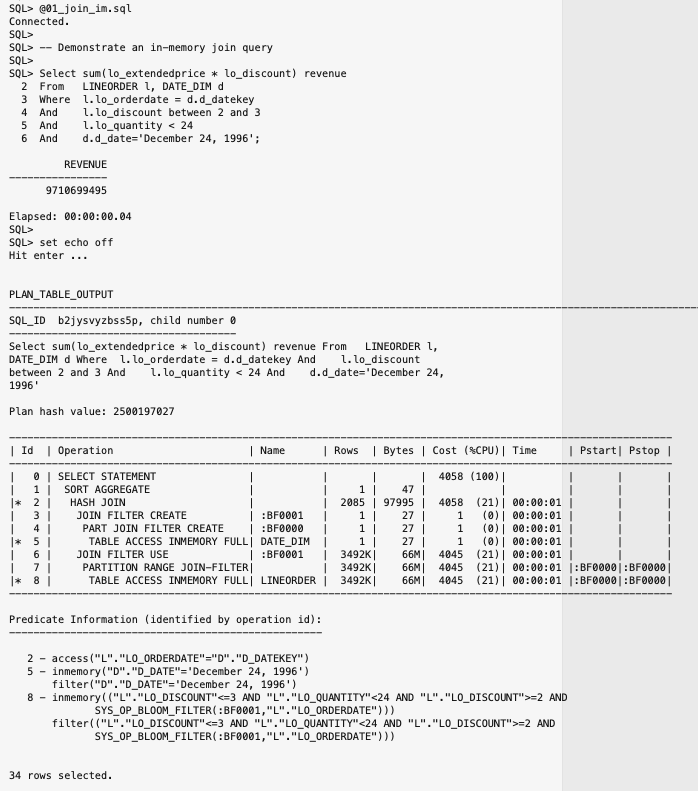
    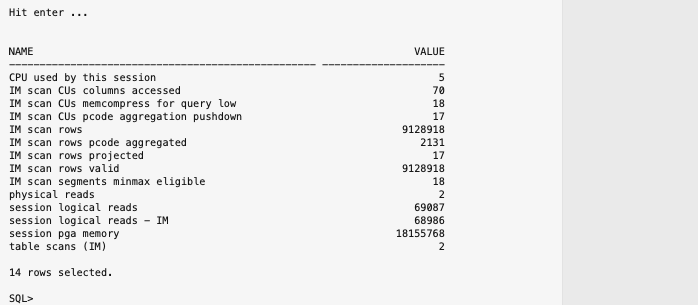

    Database In-Memory has no problem executing a query with a join, and in fact can optimize hash joins by being able to take advantage of Bloom filters. It’s easy to identify Bloom filters in the execution plan. They will appear in two places, at creation time (i.e. JOIN FILTER CREATE) and again when they are applied (i.e. JOIN FILTER USE). Look at Id 3 and Id 6 in the plan above. You can also see what join condition was used to build the Bloom filter by looking at the predicate information under the plan.

2. Let's run the query using the buffer cache.

    Run the script *02\_join\_buffer.sql*

    ```
    <copy>
    @02_join_buffer.sql
    </copy>    
    ```

    or run the query below:

    ```
    <copy>
    set timing on
    select /*+ NO_INMEMORY NO_VECTOR_TRANSFORM */
      sum(lo_extendedprice * lo_discount) revenue
    from LINEORDER l, DATE_DIM d
    where l.lo_orderdate = d.d_datekey
    and l.lo_discount between 2 and 3
    and l.lo_quantity < 24
    and d.d_date='December 24, 1996';
    set timing off
    select * from table(dbms_xplan.display_cursor());
    @../imstats.sql
    </copy>
    ```

    Query result:

    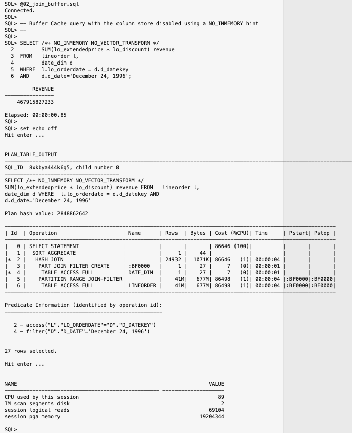

    You might notice that we added a hint to specify NO\_INMEMORY. This is an easy way to tell the optimizer to not use the IM column store. You might also notice that there is a NO\_VECTOR\_TRANSFORM hint as well. Vector transformation is available when Database In-Memory is enabled, and we will cover its advantages later in this Lab. For now, we have disabled it to make it easier to compare this execution plan with the execution plan from the previous step.

3. Now let’s try a more complex query that encompasses three joins and an aggregation. This time our query will compare the revenue for different product classes, from suppliers in a certain region for the year 1997.

    Run the script *03\_3join\_im.sql*

    ```
    <copy>
    @03_3join_im.sql
    </copy>    
    ```

    or run the query below:

    ```
    <copy>
    set timing on
    SELECT /*+ NO_VECTOR_TRANSFORM */
       d.d_year, p.p_brand1,SUM(lo_revenue) rev
    FROM lineorder l,
      date_dim d,
      part p,
      supplier s
    WHERE  l.lo_orderdate = d.d_datekey
    AND    l.lo_partkey = p.p_partkey
    AND    l.lo_suppkey = s.s_suppkey
    AND    p.p_category = 'MFGR#12'
    AND    s.s_region   = 'AMERICA'
    AND    d.d_year     = 1997
    GROUP  BY d.d_year,p.p_brand1;
    set timing off
    select * from table(dbms_xplan.display_cursor());
    @../imstats.sql
    </copy>
    ```

    Query result:

    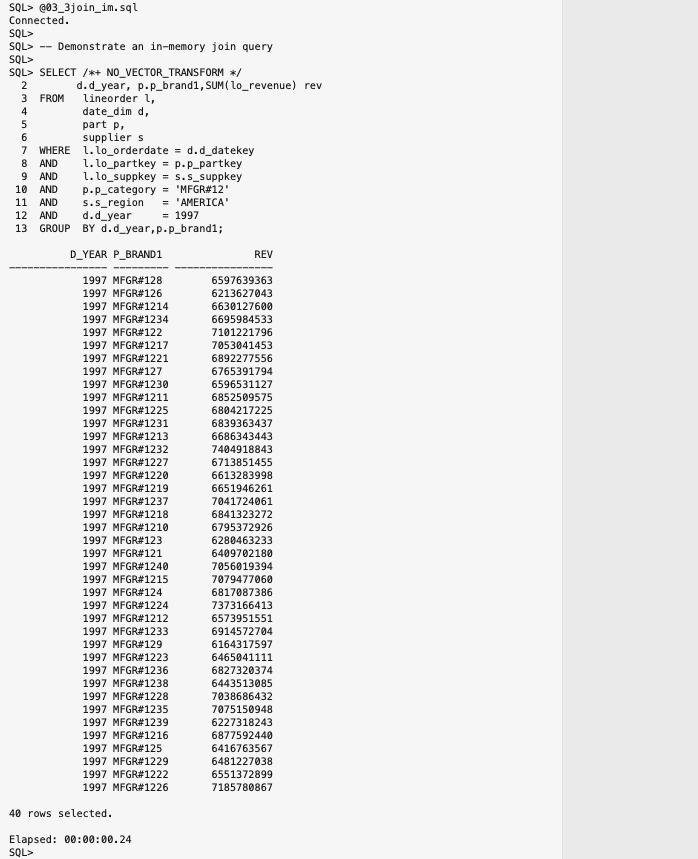
    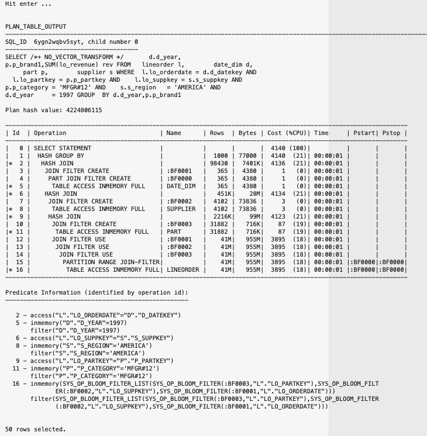
    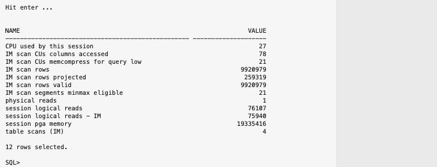


    In this query, three Bloom filters have been created and applied to the scan of the LINEORDER table, one for the join to the DATE\_DIM table, one for the join to the PART table, and one for the join to the SUPPLIER table. How is Oracle able to apply three Bloom filters when normally a  join only involves two tables at a time?

    This is where Oracle’s 30 plus years of database innovation kick in. By embedding the column store into Oracle Database we can take advantage of all of the optimizations that have been added to the database. In this case, the Optimizer has switched from its typical left deep tree execution to a right deep tree execution plan using an optimization called ‘swap\_join\_inputs’. What this means for the IM column store is that we are able to generate multiple Bloom filters by scanning the three "dimension" tables before we scan the necessary columns in the "fact" table, meaning we are able to benefit by eliminating rows during the scan rather than waiting for the join to do it.


4. Now let’s execute the same query using the buffer cache.

    Run the script *04\_3join\_buffer.sql*

    ```
    <copy>
    @04_3join_buffer.sql
    </copy>    
    ```

    or run the query below:

    ```
    <copy>
    set timing on
    alter session set inmemory_query = disable;
    SELECT /*+ NO_VECTOR_TRANSFORM */
      d.d_year, p.p_brand1,SUM(lo_revenue) rev
    FROM lineorder l,
         date_dim d,
         part p,
         supplier s
    WHERE l.lo_orderdate = d.d_datekey
    AND   l.lo_partkey = p.p_partkey
    AND   l.lo_suppkey = s.s_suppkey
    AND   p.p_category = 'MFGR#12'
    AND   s.s_region   = 'AMERICA'
    AND   d.d_year     = 1997
    GROUP BY d.d_year,p.p_brand1;
    set timing off
    select * from table(dbms_xplan.display_cursor());
    @../imstats.sql
    </copy>
    ```

    Query result:

    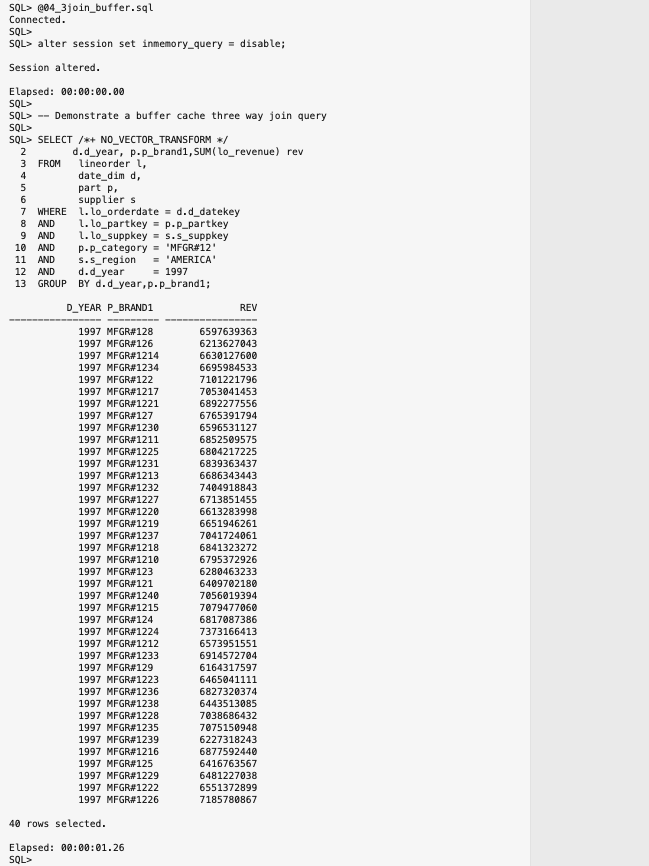
    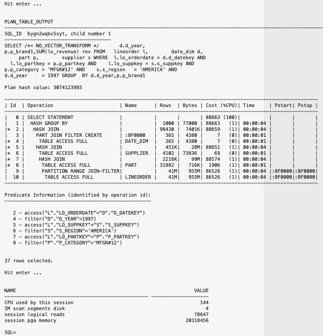

    As you can see, the IM column store continues to out-perform the buffer cache query.

5. Up until this point we have only seen hash joins used with our in-memory queries. While it is true that hash joins are a further optimization with Database In-Memory and it's ability to use Bloom filters to effectively perform the join as a scan and filter operation, but what about a nested loops join? Is it possible for Database In-Memory to work with a nested loops join? Perhaps one table is not in memory or an index access will have less cost. Let's see how that might work.

    Run the script *05\_join\_nl\_im.sql*

    ```
    <copy>
    @05_join_nl_im.sql
    </copy>    
    ```

    or run the query below:

    ```
    <copy>
    set timing on
    -- Enable the use of invisible indexes
    alter session set optimizer_use_invisible_indexes=true;
    -- Execute query
    select /*+ NO_VECTOR_TRANSFORM INDEX(l, lineorder_i1) */
       sum(lo_extendedprice * lo_discount) revenue
    from   LINEORDER l, DATE_DIM d
    where  l.lo_orderdate = d.d_datekey
    and    d.d_date='December 24, 1996';
    set timing off
    select * from table(dbms_xplan.display_cursor());
    @../imstats.sql
    </copy>
    ```

    Query result:

    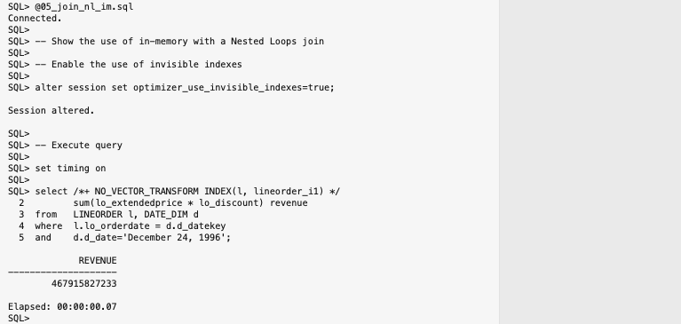
    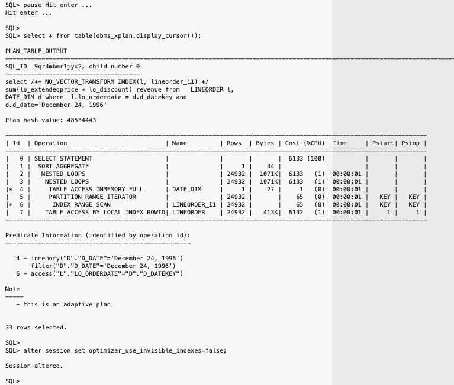

    Notice that we have told the optimizer that it can use invisible indexes and we just happen to have an index that can be used on the LINEORDER table. This results in the optimizer choosing to perform a nested loops join by first accessing the DATE\_DIM table in-memory and then accessing the LINEORDER table through an index. The optimizer chooses this join, rather than a hash join, based on cost. This is another big advantage with Database In-Memory, the ability of the optimizer to choose the lowest cost methods to run queries with or without accessing object in-memory.


6. Up until this point we have been focused on joins and how the IM column store can execute them incredibly efficiently. Let’s now turn our attention to more OLAP style “What If” queries.  In this case our query examines the yearly profits from a specific region and manufacturer over our complete data set.

    Oracle has introduced a new optimizer transformation, called vector transformation. This is also known as In-Memory Aggregation and results in a new group by method called Vector Group By. This transformation is a two-part process not dissimilar to that of star transformation.  First, the dimension tables are scanned and any WHERE clause predicates are applied. A new data structure called a key vector is created based on the results of these scans. The key vector is similar to a Bloom filter as it allows the join predicates to be applied as additional filter predicates during the scan of the fact table, but it also enables us to conduct the group by or aggregation during the scan of the fact table instead of having to do it afterwards.

    The second part of the execution plan sees the results of the fact table scan being joined back to the temporary tables created as part of the scan of the dimension tables, that is defined by the lines that start with LOAD AS SELECT. These temporary tables contain the payload columns (columns needed in the select list) from the dimension table(s). In Release 12.2 and above these tables are now pure in-memory tables as evidenced by the addition of the (CURSOR DURATION MEMORY) phrase that is appended to the LOAD AS SELECT phrases. The combination of these two features dramatically improves the efficiency of a multiple table join with complex aggregations. Both features are visible in the execution plan of our queries.

    To see this in action execute the query *06\_vgb\_im.sql*

    ```
    <copy>
    @06_vgb_im.sql
    </copy>    
    ```

    or run the query below:     

    ```
    <copy>
    set timing on
    SELECT
      d.d_year, c.c_nation, sum(lo_revenue - lo_supplycost) profit
    from
      LINEORDER l, DATE_DIM d, PART p, SUPPLIER s, CUSTOMER C
    where
      l.lo_orderdate = d.d_datekey
      and l.lo_partkey = p.p_partkey
      and l.lo_suppkey = s.s_suppkey
      and l.lo_custkey = c.c_custkey
      and s.s_region = 'AMERICA'
      and c.c_region = 'AMERICA'
    group by
          d.d_year, c.c_nation
    order by
      d.d_year, c.c_nation;
    set timing off
    select * from table(dbms_xplan.display_cursor());
    </copy>
    ```

    Query result:

    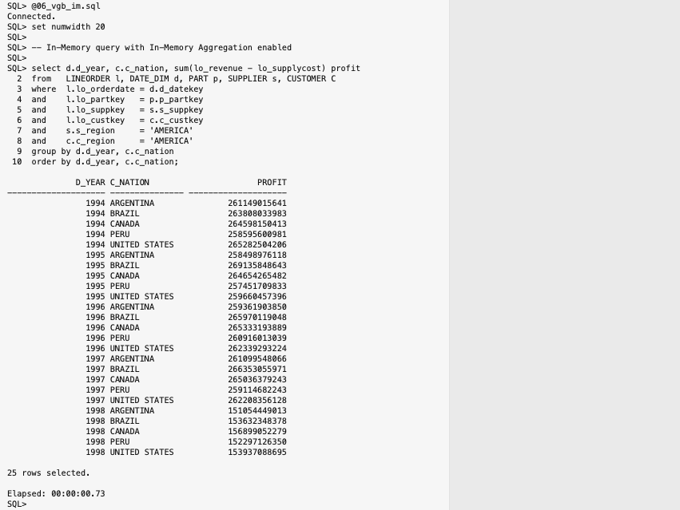
    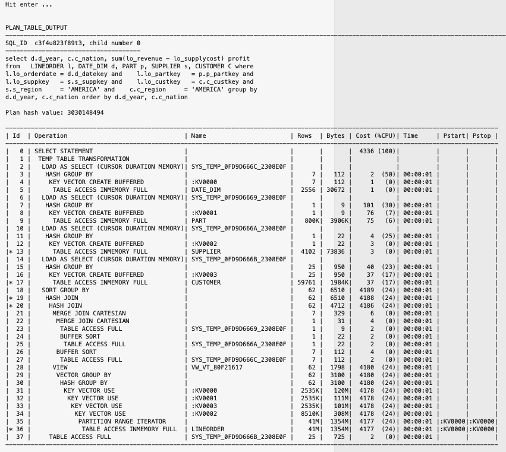
    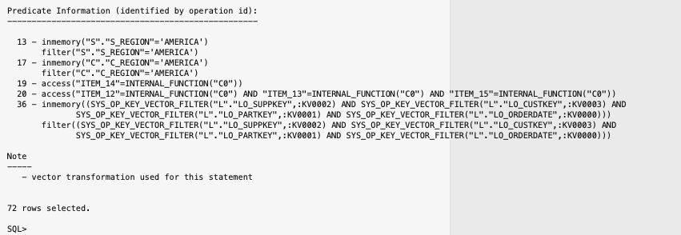

    Our query is more complex now and if you look closely at the execution plan you will see the creation and use of :KV000n structures which are the Key Vectors along with the Vector Group By operation.

7. To see how dramatic the difference really is we can run the same query but we will disable the vector group by operation.

    Run the *script 07\_novgb\_im.sql*

    ```
    <copy>
    @07_novgb_im.sql
    </copy>    
    ```

    or run the query below:

    ```
    <copy>
    set timing on
    SELECT /*+ NO_VECTOR_TRANSFORM */
      d.d_year, c.c_nation, sum(lo_revenue - lo_supplycost) profit
    from
      LINEORDER l, DATE_DIM d, PART p, SUPPLIER s, CUSTOMER C
    where
      l.lo_orderdate = d.d_datekey
      and l.lo_partkey = p.p_partkey
      and l.lo_suppkey = s.s_suppkey
      and l.lo_custkey = c.c_custkey
      and s.s_region = 'AMERICA'
      and c.c_region = 'AMERICA'
    group by
      d.d_year, c.c_nation
    order by
      d.d_year, c.c_nation;
    set timing off
    select * from table(dbms_xplan.display_cursor());
    </copy>
    ```

    Query result:

    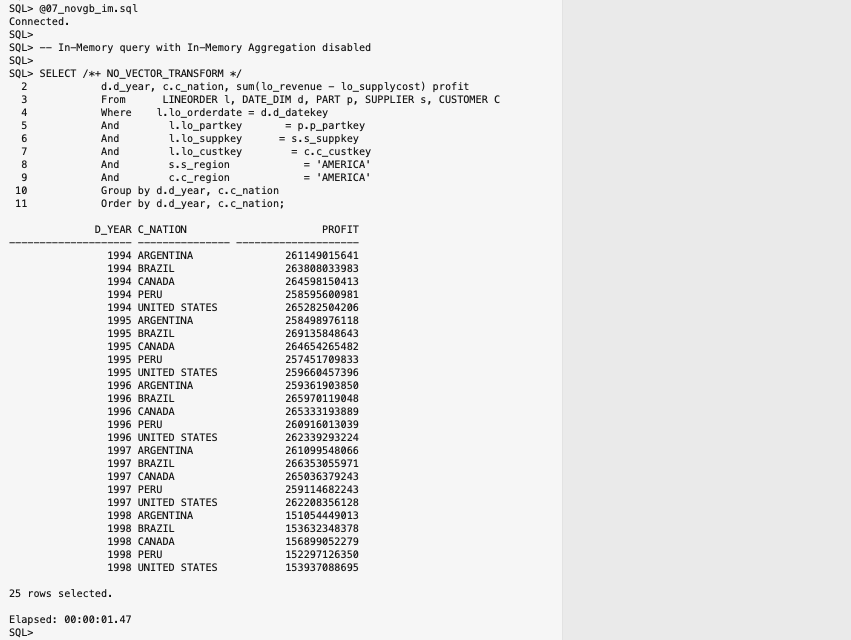
    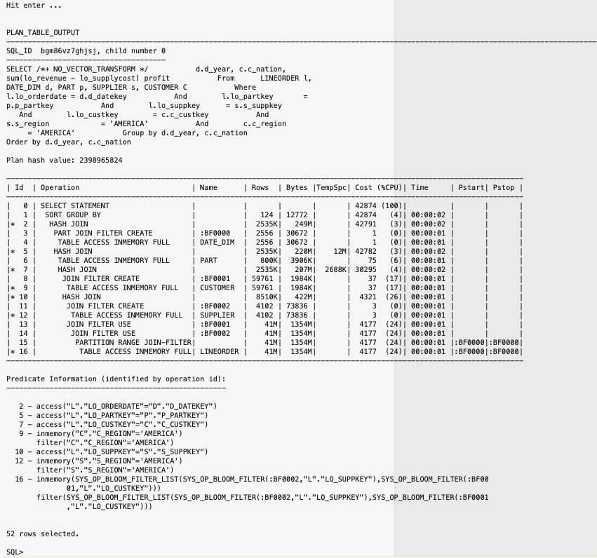

    Notice how much slower this second query ran even though it still ran in-memory, and even took advantage of Bloom filters. This is why we say that you can expect at least a 3-8x performance improvement with In-Memory Aggregation.

8. As we mentioned earlier, with Database In-Memory enabled the optimizer can even take advantage of vector transformation when the tables are not in-memory. To see this in action execute the same query against the buffer cache.

    Run the script *08\_vgb\_buffer.sql*

    ```
    <copy>
    @08_vgb_buffer.sql
    </copy>    
    ```

    or run the query below:

    ```
    <copy>
    set timing on
    alter session set inmemory_query = disable;
    SELECT
      d.d_year, c.c_nation, sum(lo_revenue - lo_supplycost) profit
    from
      LINEORDER l, DATE_DIM d, PART p, SUPPLIER s, CUSTOMER C
    where
      l.lo_orderdate = d.d_datekey
      and l.lo_partkey = p.p_partkey
      and l.lo_suppkey = s.s_suppkey
      and l.lo_custkey = c.c_custkey
      and s.s_region = 'AMERICA'
      and c.c_region = 'AMERICA'
    group by
      d.d_year, c.c_nation
    order by
      d.d_year, c.c_nation;
    set timing off
    select * from table(dbms_xplan.display_cursor());
    </copy>
    ```

    Query result:

    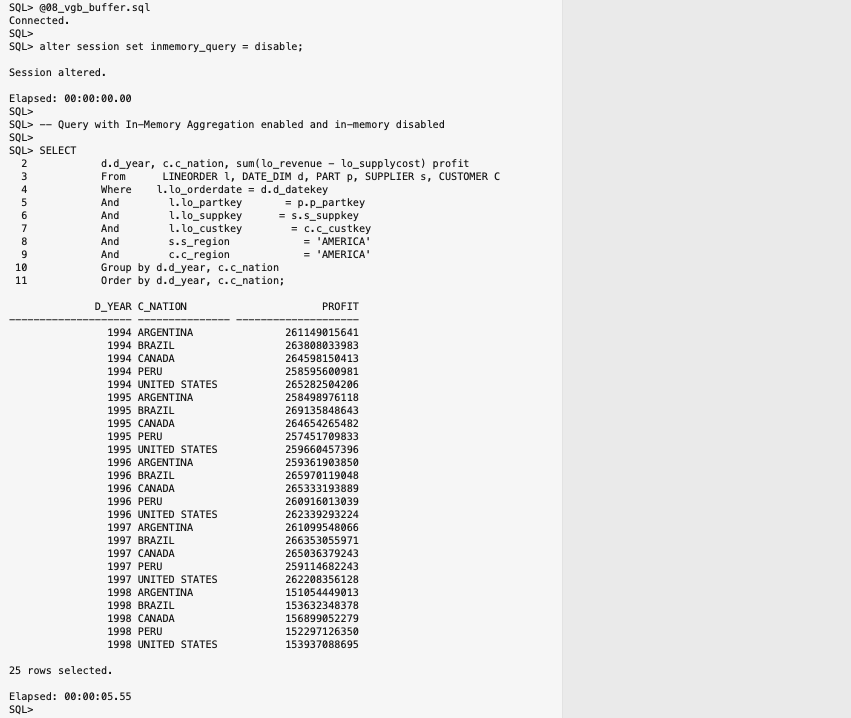
    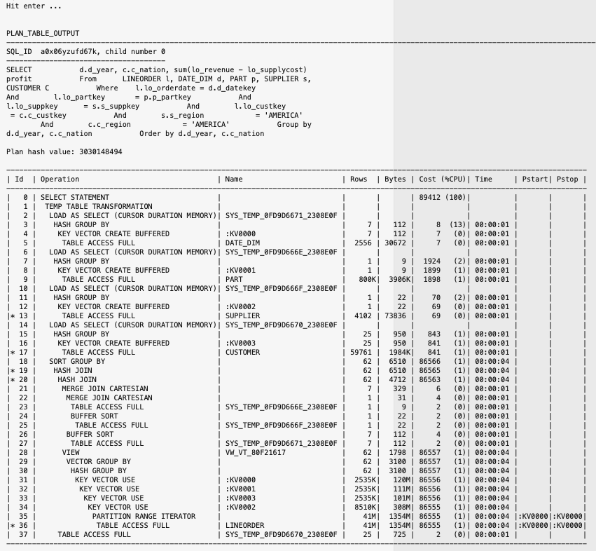
    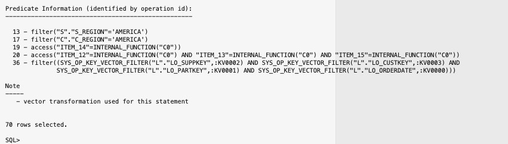


    Note that like hash joins with Bloom filters, vector group by with key vectors can be performed on row-store objects. This only requires that Database In-Memory be enabled and shows just how flexible Database In-Memory is. You don't have to have all objects populated in the IM column store. Of course, the row store objects cannot be accessed as fast as column-store objects and cannot take advantage of all of the other performance features available to IM column store scans.

9. And finally let's take a look at how our query runs in the row-store with no Database In-Memory optimizations.

    Run the script *09\_novgb\_buffer.sql*

    ```
    <copy>
    @09_novgb_buffer.sql
    </copy>    
    ```

    or run the query below:

    ```
    <copy>
    set timing on
    alter session set inmemory_query = disable;
    SELECT /*+ NO_VECTOR_TRANSFORM */
      d.d_year, c.c_nation, sum(lo_revenue - lo_supplycost) profit
    from
      LINEORDER l, DATE_DIM d, PART p, SUPPLIER s, CUSTOMER C
    where
      l.lo_orderdate = d.d_datekey
      and l.lo_partkey = p.p_partkey
      and l.lo_suppkey = s.s_suppkey
      and l.lo_custkey = c.c_custkey
      and s.s_region = 'AMERICA'
      and c.c_region = 'AMERICA'
    group by
      d.d_year, c.c_nation
    order by
    d.d_year, c.c_nation;
    set timing off
    select * from table(dbms_xplan.display_cursor());
    </copy>
    ```

    Query result:

    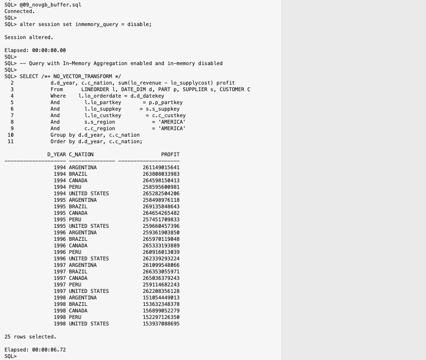
    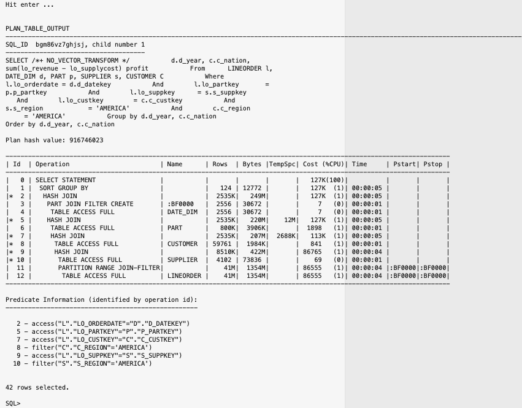

    Compare the time from Step 7 (06\_vgb\_im.sql) to the time running the query in the row-store with no vector group by enabled. Quite a dramatic difference.


## Conclusion

This lab saw our performance comparison expanded to queries with both joins and aggregations. You had an opportunity to see just how efficiently a hash join, that is automatically converted to a Bloom filter, can be executed in the IM column store.

You also got to see just how sophisticated the Oracle Optimizer has become over the last 30 plus years, when it used a combination of complex query transformations to find the optimal execution plan for a star query.

Oracle Database adds In-Memory database functionality to existing databases, and transparently accelerates analytics by orders of magnitude while simultaneously speeding up mixed-workload OLTP. With Oracle Database In-Memory, users get immediate answers to business questions that previously took hours.


## Acknowledgements

- **Author** - Andy Rivenes, Product Manager, Database In-Memory
- **Contributors** - Maria Colgan, Distinguished Product Manager
- **Last Updated By/Date** - Andy Rivenes, August 2022
