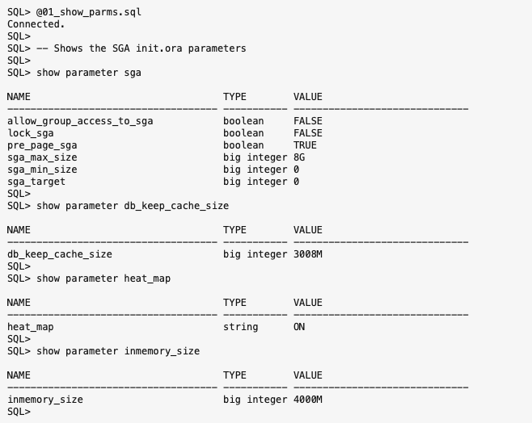
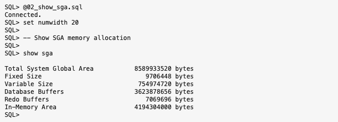
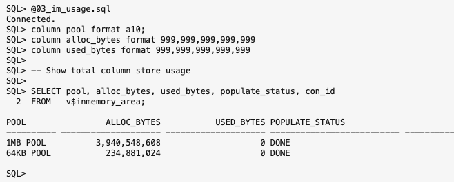
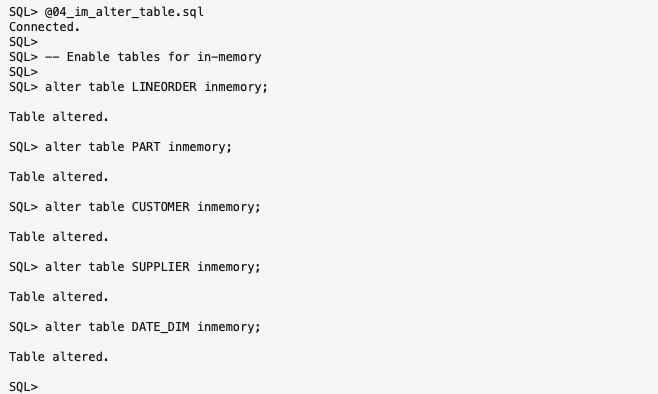
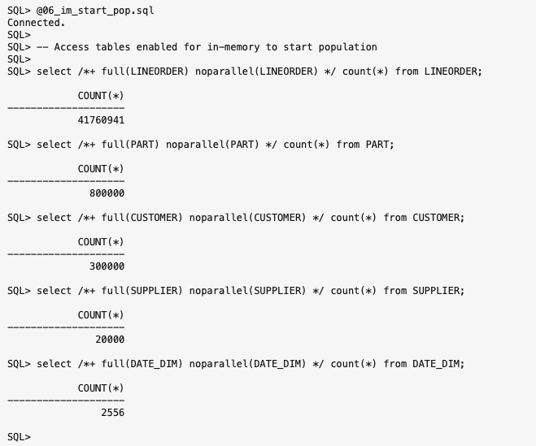
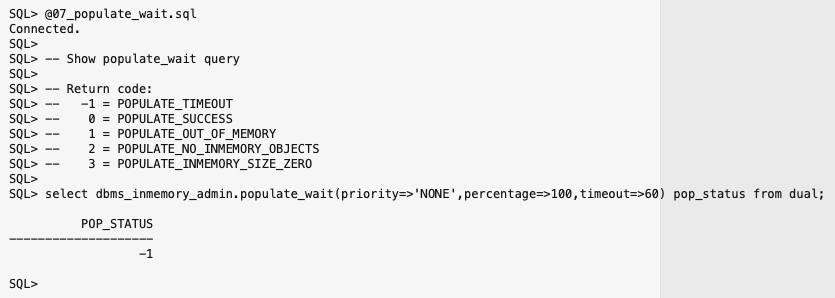
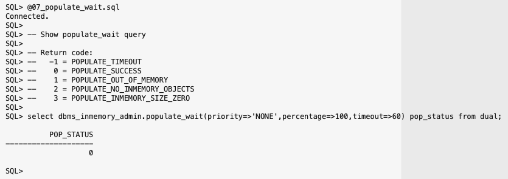
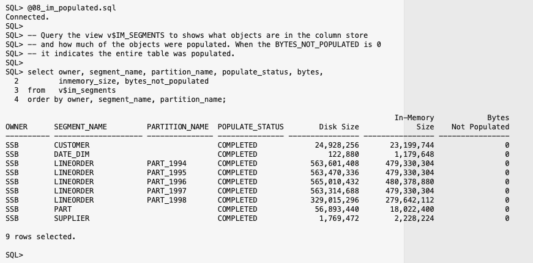
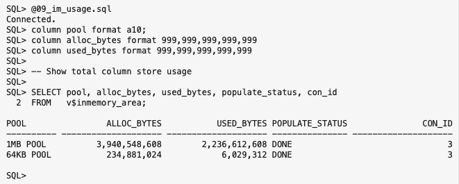

# Setting up the In-Memory column store

## Introduction

In this lab, you will explore how to enable the In-Memory column store, populate objects and query various views to monitor Database In-Memory.

Watch the video below to get an explanation of enabling the In-Memory column store.

[Youtube video](youtube:dZ9cnIL6KKw)

Quick walk through on how to enable In-Memory.

[Youtube video](youtube:oCES149OPeE)

Estimated Time: 30 minutes

### Objectives

-   Learn how to enable Database In-Memory and populate objects in the IM column store
-   Explore various views to monitor Database In-Memory

### Prerequisites

This lab assumes you have:
* Lab: Prepare Setup (Free-tier and Paid Tenants only)
* Lab: Environment Setup
* Lab: Initialize Environment

**NOTE:** *When doing Copy/Paste using the convenient* **Copy** *function used throughout the guide, you must hit the* **ENTER** *key after pasting. Otherwise the last line will remain in the buffer until you hit* **ENTER!**

## Task 1: Logging In and Enabling In-Memory

In this Lab we will be populating external data from a local directory and we will need to define a database directory to use in our external table definitions to point the database to our external data.

Let's switch to the Lab01-Setup folder and log back in to the PDB:

 ```
 <copy>
 cd /home/oracle/labs/inmemory/setup
 sqlplus ssb/Ora_DB4U@localhost:1521/pdb1
 </copy>
 ```

And adjust the sqlplus display:

 ```
 <copy>
 set pages 9999
 set lines 150
 </copy>
 ```

Query result:

```
[CDB1:oracle@dbhol:~/labs/inmemory]$ cd /home/oracle/labs/inmemory/setup
[CDB1:oracle@dbhol:~/labs/inmemory/AIM-High]$ sqlplus ssb/Ora_DB4U@localhost:1521/pdb1

SQL*Plus: Release 21.0.0.0.0 - Production on Fri Aug 19 18:33:55 2022
Version 21.4.0.0.0

Copyright (c) 1982, 2021, Oracle.  All rights reserved.

Last Successful login time: Thu Aug 18 2022 21:37:24 +00:00

Connected to:
Oracle Database 21c Enterprise Edition Release 21.0.0.0.0 - Production
Version 21.4.0.0.0

SQL> set pages 9999
SQL> set lines 150
SQL>
```

1. Database In-Memory is integrated into Oracle Database 12c (12.1.0.2) and higher.  The IM column store is not enabled by default, but can be easily enabled via a few steps.  Before you enable it, let's take a look at the default configuration. Set your oracle environment

    Run the script *01\_show\_parms.sql*

    ```
    <copy>
    @01_show_parms.sql
    </copy>    
    ```

    or run the query below:  

    ```
    <copy>
    show parameter sga
    show parameter db_keep_cache_size
    show parameter heat_map
    show parameter inmemory_size
    </copy>
    ```

    Query result:

    

    These parameters have already been set for this Lab. The IM column store is not enabled by default (i.e. INMEMORY_SIZE=0), but we have set it to a size that will work for this Lab.  HEAT_MAP defaults to OFF, but it has been enabled for one of the later labs. The KEEP pool (i.e. DB_KEEP_CACHE_SIZE) is set to 0 by default. We have defined it for this Lab so that you can compare the performance of objects populated in the IM column store with the same objects fully cached in the buffer cache and compare the difference in performance for yourself.

2. Database In-Memory is integrated into Oracle Database 12c (12.1.0.2) and higher.  The IM column store is allocated within the System Global Area (SGA) and can be easily displayed using normal database commands.

    Run the script *02\_show\_sga.sql*

    ```
    <copy>
    @02_show_sga.sql
    </copy>    
    ```

    or run the query below:  

    ```
    <copy>
    show sga
    </copy>
    ```

    Query result:

    

    Notice that the SGA is made up of Fixed Size, Variable Size, Database Buffers and Redo Buffers. And since we have set the INEMMORY_SIZE parameter we also see the In-Memory Area allocated within the SGA.


3. The In-Memory area is sub-divided into two pools:  a 1MB pool used to store actual columnar formatted data populated in the IM column store and a 64KB pool to store metadata about the objects populated in the IM column store.  The view V$INMEMORY_AREA shows the total memory allocated and used in the IM column store.

    Run the script *03\_im\_usage.sql*

    ```
    <copy>
    @03_im_usage.sql
    </copy>    
    ```

    or run the query below:  

    ```
    <copy>
    column pool format a10;
    column alloc_bytes format 999,999,999,999,999
    column used_bytes format 999,999,999,999,999
    SELECT pool, alloc_bytes, used_bytes, populate_status, con_id
    FROM   v$inmemory_area;
    </copy>
    ```

    Query result:

    

4. To add objects to the IM column store the inmemory attribute needs to be set for each object. This tells Oracle Database that these tables should be populated into the IM column store.

    Run the script *04\_im\_alter\_table.sql*

    ```
    <copy>
    @04_im_alter_table.sql
    </copy>    
    ```

    or run the query below:  

    ```
    <copy>
    alter table LINEORDER inmemory;
    alter table PART inmemory;
    alter table CUSTOMER inmemory;
    alter table SUPPLIER inmemory;
    alter table DATE_DIM inmemory;
    </copy>
    ```

    Query result:

       

5. The following query accesses the USER_TABLES view and displays attributes of the tables in the SSB schema.  

    Run the script *05\_im\_attributes.sql*

    ```
    <copy>
    @05_im_attributes.sql
    </copy>    
    ```

    or run the query below:  

    ```
    <copy>
    column table_name format a12;
    column partition_name format a15;
    column buffer_pool format a11;
    column compression heading 'DISK|COMPRESSION' format a11;
    column INMEMORY_PRIORITY heading 'INMEMORY|PRIORITY' format a10;
    column INMEMORY_DISTRIBUTE heading 'INMEMORY|DISTRIBUTE' format a12;
    column INMEMORY_COMPRESSION heading 'INMEMORY|COMPRESSION' format a14;
    select table_name, NULL as partition_name, buffer_pool, compression, compress_for, inmemory,
      inmemory_priority, inmemory_distribute, inmemory_compression
    from   user_tables
    where  table_name in ('DATE_DIM','PART','SUPPLIER','CUSTOMER')
    UNION ALL
    select table_name, partition_name, buffer_pool, compression, compress_for, inmemory,
      inmemory_priority, inmemory_distribute, inmemory_compression
    from   user_tab_partitions
    where  table_name = 'LINEORDER';
    </copy>
    ```

    Query result:

       

    Note that tables enabled for inmemory will have the inmemory attribute of ENABLED. The default priority level is NONE which means that the object is not populated until it is first accessed.

6. Let's populate the IM column store by accessing the tables that are enabled for inmemory with the following queries.

    Run the script *06\_im\_start_pop.sql*

    ```
    <copy>
    @06_im_start_pop.sql
    </copy>    
    ```

    or run the query below:  

    ```
    <copy>
    select /*+ full(LINEORDER) noparallel(LINEORDER) */ count(*) from LINEORDER;     
    select /*+ full(PART) noparallel(PART) */ count(*) from PART;                    
    select /*+ full(CUSTOMER) noparallel(CUSTOMER) */ count(*) from CUSTOMER;        
    select /*+ full(SUPPLIER) noparallel(SUPPLIER) */ count(*) from SUPPLIER;        
    select /*+ full(DATE_DIM) noparallel(DATE_DIM) */ count(*) from DATE_DIM;
    </copy>
    ```

    Query result:

    

7. There is a function available that enables the ability to programatically check if the IM column store has been populated. The function, dbms\_inmemory\_admin.populate_wait returns a code based on populate priority and percentage of population:

    ```
    -- Return code:
    --   -1 = POPULATE_TIMEOUT
    --    0 = POPULATE_SUCCESS
    --    1 = POPULATE_OUT_OF_MEMORY
    --    2 = POPULATE_NO_INMEMORY_OBJECTS
    --    3 = POPULATE_INMEMORY_SIZE_ZERO
    ```

    Run the script *07\_populate\_wait.sql*

    ```
    <copy>
    @07_populate_wait.sql
    </copy>    
    ```

    or run the query below:  

    ```
    <copy>
    select dbms_inmemory_admin.populate_wait(priority=>'NONE',percentage=>100,timeout=>60) pop_status from dual;
    </copy>
    ```

    Query result:

    

    The result after running the query a second time after pausing to allow the population to complete:

    

8. To identify which segments have been populated into the IM column store you can query the view V\$IM\_SEGMENTS.  Once the data population is complete, the BYTES\_NOT\_POPULATED attribute should be 0 for each segment.  

    Run the script *08\_im\_populated.sql*

    ```
    <copy>
    @08_im_populated.sql
    </copy>    
    ```

    or run the query below:  

    ```
    <copy>
    column owner format a10;
    column segment_name format a20;
    column partition_name format a15;
    column populate_status format a15;
    column bytes heading 'Disk Size' format 999,999,999,999
    column inmemory_size heading 'In-Memory|Size' format 999,999,999,999
    column bytes_not_populated heading 'Bytes|Not Populated' format 999,999,999,999
    select owner, segment_name, partition_name, populate_status, bytes,
      inmemory_size, bytes_not_populated
    from   v$im_segments
    order by owner, segment_name, partition_name;
    </copy>
   ```

    Query result:

    

9. Now let's check the total space usage used in the IM column store.

    Run the script *09\_im\_usage.sql*

    ```
    <copy>
    @09_im_usage.sql
    </copy>    
    ```

    or run the query below:  

    ```
    <copy>
    column pool format a10;
    column alloc_bytes format 999,999,999,999,999
    column used_bytes format 999,999,999,999,999
    column populate_status format a15;
    SELECT pool, alloc_bytes, used_bytes, populate_status, con_id
    FROM   v$inmemory_area;
    </copy>
    ```

    Query result:

    

## Conclusion

In this lab you saw that the IM column store is configured by setting the initialization parameter INMEMORY_SIZE. The IM column store is a new static pool in the SGA, and once allocated it can be resized dynamically, but it is not managed by either of the automatic SGA memory features.

You also had an opportunity to populate and view objects in the IM column store and to see how much memory they use. In this lab we populated five tables into the IM column store, and the LINEORDER table is the largest of the tables populated with over 23 million rows. You may have noticed that it is also a partitioned table. We will be using that attribute in later labs.

Remember that the population speed depends on the CPU capacity of the system as the in-memory data compression is a CPU intensive operation. The more CPU and processes you allocate the faster the populations will occur.

Finally you got to see how to determine if the objects were fully populated and how much space was being consumed in the IM column store.

You may now **proceed to the next lab**.

## Acknowledgements

- **Author** - Andy Rivenes, Product Manager, Database In-Memory
- **Contributors** -
- **Last Updated By/Date** - Andy Rivenes, August 2022
