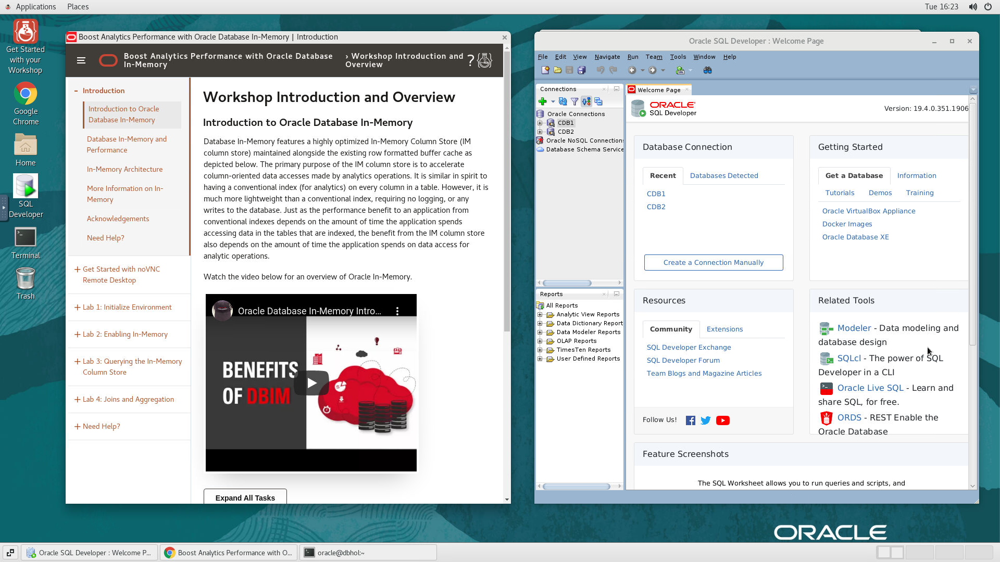
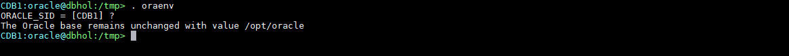
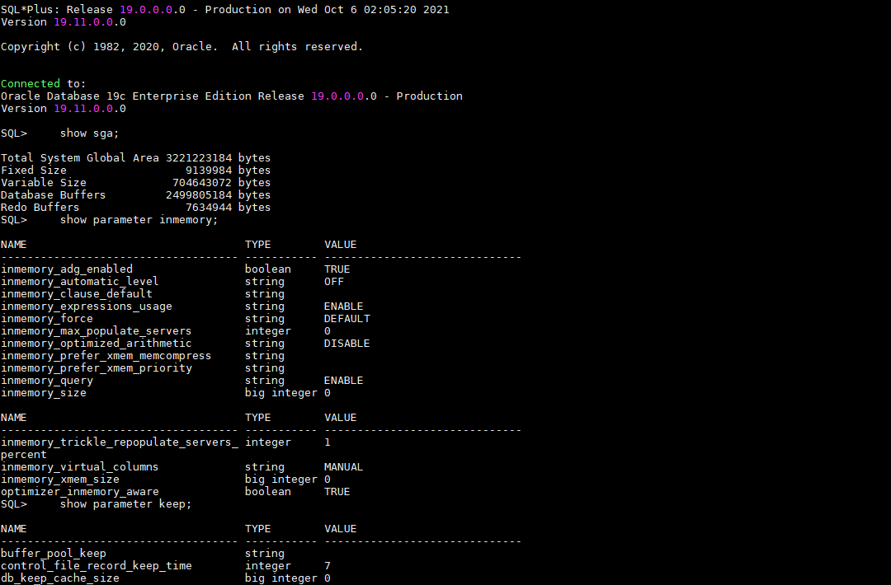
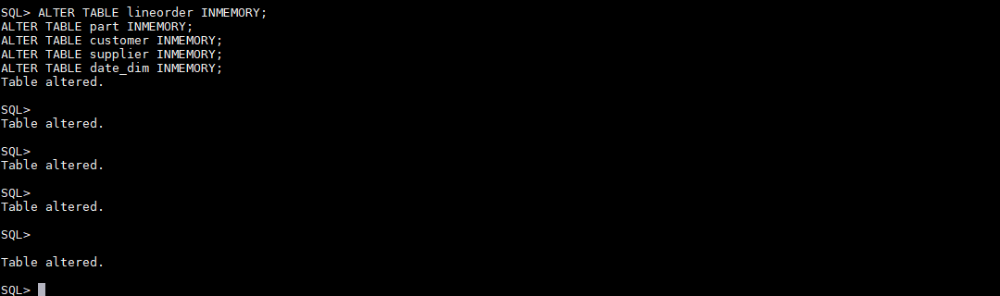
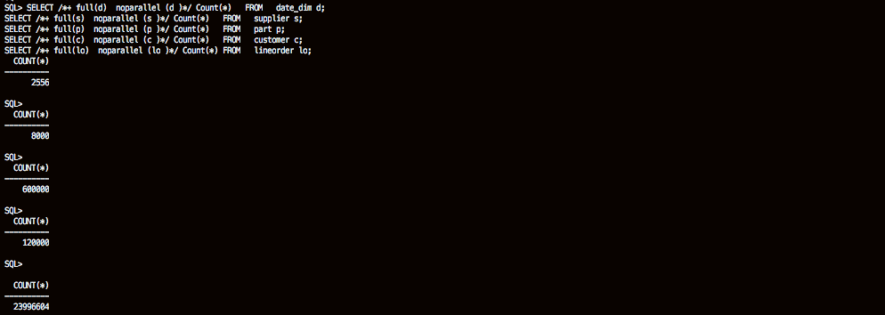
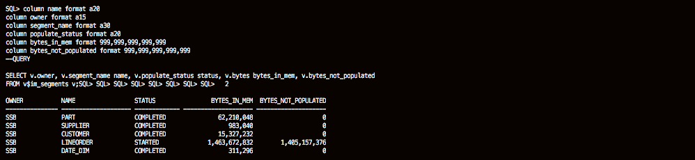

# Initialize Environment

## Introduction

In this lab we will review and startup all components required to successfully run this workshop.

*Estimated Lab Time:* 30 Minutes.

### Video Preview
Watch the video below to get an explanation of enabling the In-Memory column store.

[](youtube:dZ9cnIL6KKw)

Watch the video below for a walk through of the lab.
[](youtube:7rbgF8Z6hc4)


### Objectives
- Initialize the workshop environment.

### Prerequisites
This lab assumes you have:
- A Free Tier, Paid or LiveLabs Oracle Cloud account
- You have completed:
    - Lab: Prepare Setup (*Free-tier* and *Paid Tenants* only)
    - Lab: Environment Setup

**NOTE:** *When doing Copy/Paste using the convenient* **Copy** *function used throughout the guide, you must hit the* **ENTER** *key after pasting. Otherwise the last line will remain in the buffer until you hit* **ENTER!**

## Task 1: Validate That Required Processes are Up and Running.

1. Now with access to your remote desktop session, proceed as indicated below to validate your environment before you start executing the subsequent labs. The following Processes should be up and running:

    - Database Listeners
        - LISTENER (1521)
        - LISTCDB2 (1522)
    - Database Server Instances
        - CDB1
        - CDB2

    You may test database connectivity clicking on the *+* sign next to the Database(s) as shown below in the *SQL Developer Oracle Connections* panel.

    

2. Click the *Terminal* icon on the desktop to launch a session, then run the following to validate that expected processes are up.

    ```
    <copy>
    ps -ef|grep LIST|grep -v grep
    ps -ef|grep ora_|grep pmon|grep -v grep
    systemctl status oracle-database
    systemctl status oracle-db-listener
    </copy>
    ```

    
    
    

    If all expected processes are shown in your output as seen above, then your environment is ready for the next task.  

3. If you see questionable output(s), failure or down component(s), restart the service accordingly

    ```
    <copy>
    sudo systemctl restart oracle-database
    sudo systemctl restart oracle-db-listener
    </copy>
    ```

## Task 2: Initialize Database for In-Memory Use Cases

1. From your remote desktop session as user *oracle*, run the block below

    ```
    <copy>
    clear
    cd ~oracle/labs
    rm -rf ~oracle/labs/*
    wget -O novnc-inmemory.zip https://objectstorage.us-ashburn-1.oraclecloud.com/p/0El4NogWaezVO4e-dOd8WM91u5saPGXsDTYYIxFDVH-3jLH7UiG_hjNAP7_XGHKz/n/c4u04/b/livelabsfiles/o/labfiles/novnc-inmemory.zip
    unzip -qo novnc-inmemory.zip
    rm -f novnc-inmemory.zip
    cd inmemory
    ls -ltrh
    </copy>
    ```

    

## Task 2: Enable In-Memory

1.  All scripts for this lab are stored in the */home/oracle/labs/inmemory* folder and are to be executed as the oracle user. Let's navigate there now.  We recommend you type the commands to get a feel for working with In-Memory. But we will also allow you to copy the commands via the COPY button.

    ```
    <copy>
    cd ~/labs/inmemory/Part1
    ls
    </copy>
    ```

2. In-Memory is integrated into Oracle Database 12c and higher.  The IM column store is not enabled by default, but can be easily enabled via a few steps.  Before you enable it, let's take a look at the default configuration. Set your oracle environment

    ```
    <copy>
    . oraenv
    CDB1
    </copy>
    ```
    

    ```
    <copy>
    sqlplus / as sysdba
    </copy>
    ```

    ```
    <copy>
    show sga;
    show parameter inmemory_size;
    show parameter db_keep_cache_size;
    </copy>
    ```

    

    Notice that the SGA is made up of Fixed Size, Variable Size, Database Buffers and Redo.  There is no In-Memory in the SGA.  Let's enable it.

3.  Enter the commands to adjust the SGA and enable In-Memory.  The database will need to be restarted for the changes to take effect.

    ```
    <copy>
    prompt Changing init file;
    alter system set sga_max_size=6G scope=spfile;
    alter system set sga_target=6G scope=spfile;
    alter system set inmemory_size=2560M scope=spfile;
    alter system set db_keep_cache_size=2G scope=spfile;
    shutdown immediate;
    startup;
    </copy>
    ```
    


4.  Now let's take a look at the parameters.

    ```
    <copy>
    show sga;
    show parameter inmemory_size;
    show parameter db_keep_cache_size;
    exit
    </copy>
    ```

    

## Task 3: Enable In-Memory for Objects

The Oracle environment is already set up so sqlplus can be invoked directly from the shell environment. Since the lab is being run in a pdb called pdb1 you must supply this alias when connecting to the ssb account. If running scripts you just need to connect to sqlplus (i.e. sqlplus /nolog) since the ssb connection is built into each of the scripts.

1.  Login to the pdb as the SSB user and adjust sqlplus display.  

    ```
    <copy>
    sqlplus ssb/Ora_DB4U@localhost:1521/pdb1
    </copy>
    ```

    ```
    <copy>
    set pages 9999
    set lines 200
    </copy>
    ```

    

2.  The In-Memory area is sub-divided into two pools:  a 1MB pool used to store actual column formatted data populated into memory and a 64K pool to store metadata about the objects populated into the IM columns store.  `V$INMEMORY_AREA` shows the total IM column store.  The COLUMN command in these scripts identifies the column you want to format and the model you want to use. Run the query `03_im_usage.sql` or the query below.

    ```
    <copy>
    column alloc_bytes format 999,999,999,999;
    column used_bytes format 999,999,999,999;
    column populate_status format a15;
    --QUERY

    select * from v$inmemory_area;
    </copy>
    ```
    

3.  To check if any objects are populated in the IM column store query the `V$IM_SEGMENTS` view by running the script `05_im_segments.sql` or the query below.

    ```
    <copy>
    column name format a30
    column owner format a20
    --QUERY

    select v.owner, v.segment_name name, v.populate_status status from v$im_segments v;
    </copy>
    ```
       

4.  To add objects to the IM column store the inmemory attribute needs to be set.  This tells Oracle Database these tables should be populated into the IM column store. Run the script `06_im_alter_table.sql` or run the commands below.   

    ```
    <copy>
    ALTER TABLE lineorder INMEMORY;
    ALTER TABLE part INMEMORY;
    ALTER TABLE customer INMEMORY;
    ALTER TABLE supplier INMEMORY;
    ALTER TABLE date_dim INMEMORY;
    </copy>
    ```
       

5.  This looks at the `USER_TABLES` view and queries attributes of tables in the SSB schema. Run the script `07_im_attributes.sql` or the query below.  

    ```
    <copy>
    set pages 999
    column table_name format a12
    column cache format a5;
    column buffer_pool format a11;
    column compression heading 'DISK|COMPRESSION' format a11;
    column compress_for format a12;
    column INMEMORY_PRIORITY heading 'INMEMORY|PRIORITY' format a10;
    column INMEMORY_DISTRIBUTE heading 'INMEMORY|DISTRIBUTE' format a12;
    column INMEMORY_COMPRESSION heading 'INMEMORY|COMPRESSION' format a14;
    --QUERY    

    SELECT table_name, cache, buffer_pool, compression, compress_for, inmemory,
        inmemory_priority, inmemory_distribute, inmemory_compression
    FROM   user_tables;
    </copy>
    ```
       

    By default the IM column store is only populated when the object is accessed.

6.  Let's populate the store with some simple queries. Run the script `08_im_start_pop.sql` or run the queries below.

    ```
    <copy>
    SELECT /*+ full(d)  noparallel (d )*/ Count(*)   FROM   date_dim d;
    SELECT /*+ full(s)  noparallel (s )*/ Count(*)   FROM   supplier s;
    SELECT /*+ full(p)  noparallel (p )*/ Count(*)   FROM   part p;
    SELECT /*+ full(c)  noparallel (c )*/ Count(*)   FROM   customer c;
    SELECT /*+ full(lo)  noparallel (lo )*/ Count(*) FROM   lineorder lo;
    </copy>
    ```
    

7. Background processes are populating these segments into the IM column store.  To monitor this, you could query the `V$IM_SEGMENTS`.  Once the data population is complete, the `BYTES_NOT_POPULATED` should be 0 for each segment. Run the script `09_im_populated.sql` or run the query below.

    ```
    <copy>
    column name format a20
    column owner format a15
    column segment_name format a30
    column populate_status format a20
    column bytes_in_mem format 999,999,999,999,999
    column bytes_not_populated format 999,999,999,999,999
    --QUERY

    SELECT v.owner, v.segment_name name, v.populate_status status, v.bytes bytes_in_mem, v.bytes_not_populated
    FROM v$im_segments v;
    </copy>
    ```

    

8.  Now let's check the total space usage. Run the script `10_im_usage.sql` or run the query below.

    ```
    <copy>
    column alloc_bytes format 999,999,999,999;
    column used_bytes      format 999,999,999,999;
    column populate_status format a15;
    select * from v$inmemory_area;
    exit
    </copy>
    ```

    

    

    In this Lab you saw that the IM column store is configured by setting the initialization parameter `INMEMORY_SIZE`. The IM column store is a static pool in the SGA, and once allocated it can be increased in size dynamically, but it is not managed by either of the automatic SGA memory features.

    You also had an opportunity to populate and view objects in the IM column store and to see how much memory they use. In this lab we populated about 1471 MB of compressed data into the  IM column store, and the LINEORDER table is the largest of the tables populated with over 23 million rows.  Remember that the population speed depends on the CPU capacity of the system as the in-memory data compression is a CPU intensive operation. The more CPU and processes you allocate the faster the populations will occur.

    Finally you got to see how to determine if the objects were fully populated and how much space was being consumed in the IM column store.

    You may now [proceed to the next lab](#next).

## Appendix 1: Managing Startup Services

1. Database service (All databases and Standard Listener).

    - Start

    ```
    <copy>
    sudo systemctl start oracle-database
    </copy>
    ```
    - Stop

    ```
    <copy>
    sudo systemctl stop oracle-database
    </copy>
    ```

    - Status

    ```
    <copy>
    systemctl status oracle-database
    </copy>
    ```

    - Restart

    ```
    <copy>
    sudo systemctl restart oracle-database
    </copy>
    ```

2. Database service (Non-Standard Listeners).

    - Start

    ```
    <copy>
    sudo systemctl start oracle-db-listener
    </copy>
    ```
    - Stop

    ```
    <copy>
    sudo systemctl stop oracle-db-listener
    </copy>
    ```

    - Status

    ```
    <copy>
    systemctl status oracle-db-listener
    </copy>
    ```

    - Restart

    ```
    <copy>
    sudo systemctl restart oracle-db-listener
    </copy>
    ```

## Acknowledgements
* **Author** - Andy Rivenes, Sr. Principal Product Manager, Oracle Database In-Memory
* **Contributors** - Kay Malcolm, Didi Han, Rene Fontcha
* **Last Updated By/Date** - Rene Fontcha, LiveLabs Platform Lead, NA Technology, October 2021
