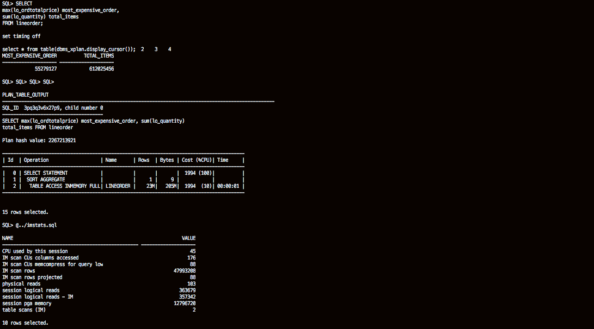
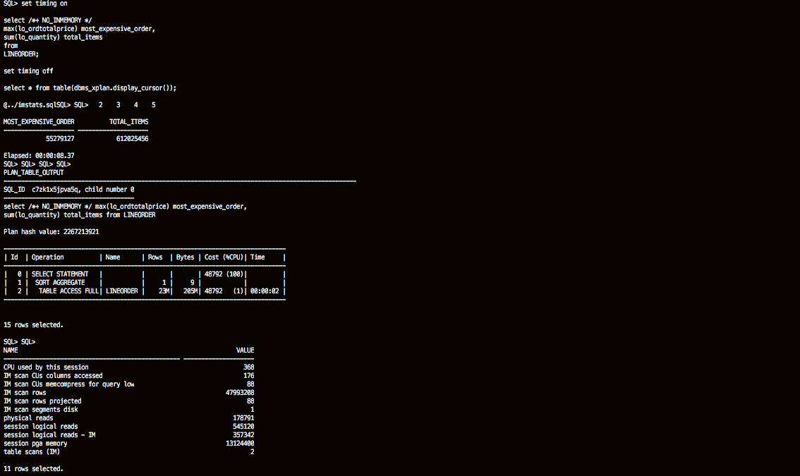
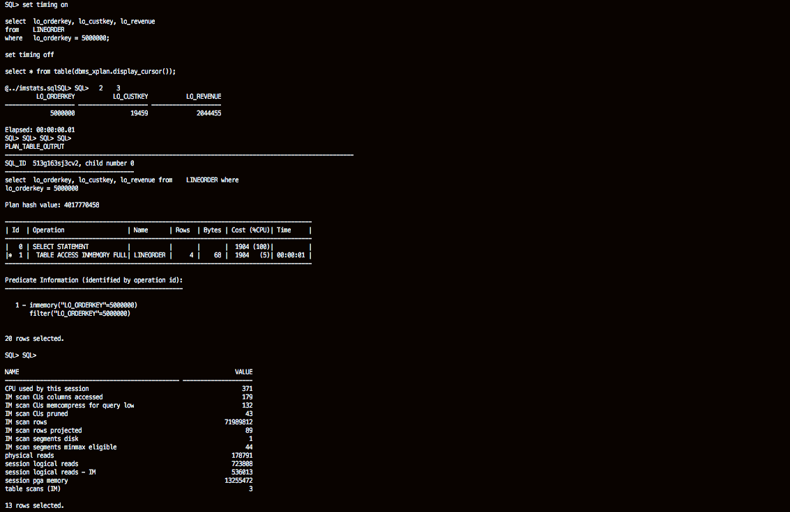
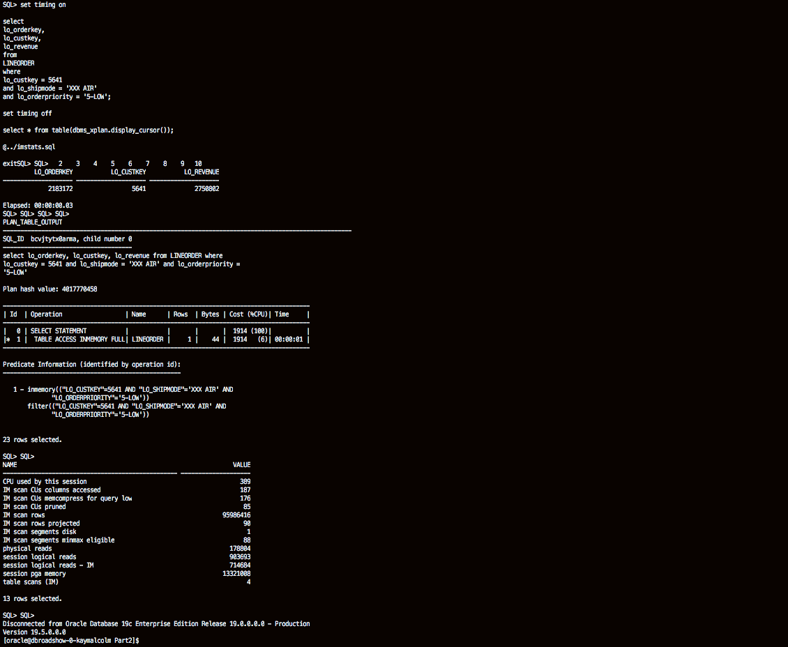

# In-Memory Queries

## Introduction
Watch a preview video of querying the In-Memory Column Store

[](youtube:U9BmS53KuGs)

Watch the video below for a walk through of the In-memory Queries lab.
[](youtube:KpqccIF8Hj8)

### Objectives

-   Perform various queries on the In-Memory Column Store

### Prerequisites
This lab assumes you have:
- A Free Tier, Paid or LiveLabs Oracle Cloud account
- You have completed:
    - Lab: Prepare Setup (*Free-tier* and *Paid Tenants* only)
    - Lab: Environment Setup
    - Lab: Initialize Environment

**NOTE:** *When doing Copy/Paste using the convenient* **Copy** *function used throughout the guide, you must hit the* **ENTER** *key after pasting. Otherwise the last line will remain in the buffer until you hit* **ENTER!**

## Task 1: Querying the In-Memory Column Store

Now that you’ve gotten familiar with the IM column store let’s look at the benefits of using it. You will execute a series of queries against the large fact table LINEORDER, in both the buffer cache and the IM column store, to demonstrate the different ways the IM column store can improve query performance above and beyond the basic performance benefits of accessing data in memory only.

1.  Let's switch to the Part2 folder and log back in to the PDB.

    ````
    <copy>
    cd /home/oracle/labs/inmemory/Part2
    sqlplus ssb/Ora_DB4U@localhost:1521/pdb1
    </copy>
    ````

    And adjust sqlplus display.

    ````
    <copy>
    set pages 9999
    set lines 100
    </copy>
    ````

    

2.  Let's begin with a simple query:  *What is the most expensive order we have received to date?*  There are no indexes or views setup for this.  So the execution plan will be to do a full table scan of the LINEORDER table.  Note the elapsed time.

    Run the script *01\_im\_query\_stats.sql*

    ```
    <copy>
    @01_im_query_stats.sql
    </copy>    
    ```

    or run the queries below.

    ````
    <copy>
    set timing on

    SELECT
    max(lo_ordtotalprice) most_expensive_order,
    sum(lo_quantity) total_items
    FROM lineorder;

    set timing off

    select * from table(dbms_xplan.display_cursor());

    @../imstats.sql
    </copy>
    ````
    The execution plan shows that we performed a TABLE ACCESS INMEMORY FULL of the LINEORDER table.

    

3.  To execute the same query against the buffer cache you will need to disable the IM column store with a hint called *NO\_INMEMORY*. If you don't, the Optimizer will try to access the data in the IM column store when the execution plan is a full table scan.

    Run the script *02\_buffer\_query\_stats.sql*

    ```
    <copy>
    @02_buffer_query_stats.sql
    </copy>    
    ```

    or run the queries below.

    ````
    <copy>
    set timing on

    select /*+ NO_INMEMORY */
    max(lo_ordtotalprice) most_expensive_order,
    sum(lo_quantity) total_items
    from
    LINEORDER;

    set timing off

    select * from table(dbms_xplan.display_cursor());

    @../imstats.sql
    </copy>
    ````

         


    As you can see the query executed extremely quickly in both cases because this is purely an in-memory scan. However, the performance of the query against the IM column store was significantly faster than the traditional buffer cache - why?  

    The IM column store only has to scan two columns - lo\_ordtotalprice and lo\_quantity - while the row store has to scan all of the columns in each of the rows until it reaches the lo\_ordtotalprice and lo_quantity columns. The IM column store also benefits from the fact that the data is compressed so the volume of data scanned is much less.  Finally, the column format can take advantage of SIMD vector processing (Single Instruction processing Multiple Data values). Instead of evaluating each entry in the column one at a time, SIMD vector processing allows a set of column values to be evaluated together in a single CPU instruction.

    To confirm that the IM column store was used, we need to examine the session level statistics. Notice that in the INMEMORY run several IM statistics show up (for this lab we have only displayed some key statistics – there are lots more!). The only one we are really interested in now is the "IM scan CUs columns accessed" which has been highlighted.

    IM scan rows: Number of rows in scanned In-Memory Compression Units (IMCUs).

    As our query did a full table scan of the LINEORDER table, that session statistic shows that we scanned 23 million rows from the IM column store. Notice that in the second buffer cache query that statistic does not show up. Only one in-memory statistic shows up, "IM scan segments disk" with a value of 1. This means that even though the LINEORDER table is in the IM column store (IM segment) we actually scan that segment outside of the column store from the buffer cache. Recall that we fully cached the tables in the KEEP pool so that we could compare memory to memory access, and in this case we can verify that the query did no physical IO.

4.  Let's look for a specific order in the LINEORDER table based on the order key.  Typically, a full table scan is not an efficient execution plan when looking for a specific entry in a table.

    Run the script *03\_single\_key\_im.sql*

    ```
    <copy>
    @03_single_key_im.sql
    </copy>    
    ```

    or run the queries below.

    ````
    <copy>
    set timing on

    select  lo_orderkey, lo_custkey, lo_revenue
    from    LINEORDER
    where   lo_orderkey = 5000000;

    set timing off

    select * from table(dbms_xplan.display_cursor());

    @../imstats.sql
    </copy>
    ````

    

5.  Think indexing lo\_orderkey would provide the same performance as the IM column store? There is an invisible index already created on the lo\_orderkey column of the LINEORDER table. By using the parameter OPTIMIZER\_USE\_INVISIBLE\_INDEXES we can compare the performance of the IM column store and the index. Let's see how well the index performs.

    Run the script *05\_\index\_comparison.sql*

    ```
    <copy>
    @05_index_comparison.sql
    </copy>    
    ```

    or run the queries below.  

    ````
    <copy>
    alter session set optimizer_use_invisible_indexes=true;

    set timing on

    Select  /* With index */ lo_orderkey, lo_custkey, lo_revenue
    From    LINEORDER
    Where   lo_orderkey = 5000000;

    set timing off

    select * from table(dbms_xplan.display_cursor());

    @../imstats.sql
    </copy>
    ````

    

    

6.  Analytical queries have more than one equality WHERE clause predicate. What happens when there are multiple single column predicates on a table? Traditionally you would create a multi-column index. Can storage indexes compete with that?  

    Let’s change our query to look for a specific line item in an order and monitor the session statistics:

    Run the script *06\_multi\_preds.sql*

    ```
    <copy>
    @06_multi_preds.sql
    </copy>    
    ```

    or run the queries below.  

    ````
    <copy>
    set timing on

    select
    lo_orderkey,
    lo_custkey,
    lo_revenue
    from
    LINEORDER
    where
    lo_custkey = 5641
    and lo_shipmode = 'XXX AIR'
    and lo_orderpriority = '5-LOW';

    set timing off

    select * from table(dbms_xplan.display_cursor());

    @../imstats.sql

    exit
    </copy>
    ````
    You can see that the In-Memory storage index is still used. In fact, we are able to use multiple storage indexes together in a similar manner to how Oracle Database can combine multiple bitmap indexes.

       

## Conclusion

In this lab you had an opportunity to try out Oracle’s In-Memory performance claims with queries that run against a table with over 23 million rows, the LINEORDER table, which resides in both the IM column store and the buffer cache. From a very simple aggregation, to more complex queries with multiple columns and filter predicates, the IM column store was able to out perform the buffer cache queries. Remember both sets of queries are executing completely within memory, so that’s quite an impressive improvement.

These significant performance improvements are possible because of Oracle’s unique in-memory columnar format that allows us to only scan the columns we need and to take full advantage of SIMD vector processing. We also got a little help from our new in-memory storage indexes, which allow us to prune out unnecessary data. Remember that with the IM column store, every column has a storage index that is automatically maintained for you.

## Acknowledgements

- **Author** - Andy Rivenes, Sr. Principal Product Manager,  Database In-Memory
- **Contributors** - Kay Malcolm, Anoosha Pilli, Rene Fontcha
- **Last Updated By/Date** - Rene Fontcha, LiveLabs Platform Lead, NA Technology, October 2021
