# Run Basic Oracle SQL Commands

## Introduction

This lab provides an introduction to the Structured Query Language (SQL). You will learn how to create tables with primary keys, columns, constraints, indexes, and foreign keys by running these basic commands in your provisioned Oracle Autonomous Database instance SQL Worksheet.

Estimated Time: 20 minutes

### About SQL and how it works

Structured Query Language (SQL) is the set of statements with which all programs and users access data in an Oracle database. Application programs and Oracle tools often allow users access to the database without using SQL directly, but these applications in turn must use SQL when executing the user's request.

The strengths of SQL provide benefits for all types of users, including application programmers, database administrators, managers, and end users. Technically speaking, SQL is a data sublanguage. The purpose of SQL is to provide an interface to a relational database such as Oracle, and all SQL statements are instructions to the database. In this SQL differs from general-purpose programming languages like C and BASIC. Among the features of SQL are the following:

* It processes sets of data as groups rather than as individual units.
* It provides automatic navigation to the data.
* It uses statements that are complex and powerful individually, and that therefore stand alone. Flow-control statements were not part of SQL originally, but they are found in the recently accepted optional part of SQL, ISO/IEC 9075-5: 1996. Flow-control statements are commonly known as "persistent stored modules" (PSM), and Oracle's PL/SQL extension to SQL is similar to PSM.

Essentially, SQL lets you work with data at the logical level. You need to be concerned with the implementation details only when you want to manipulate the data. For example, to retrieve a set of rows from a table, you define a condition used to filter the rows. All rows satisfying the condition are retrieved in a single step and can be passed as a unit to the user, to another SQL statement, or to an application. You need not deal with the rows one by one, nor do you have to worry about how they are physically stored or retrieved. All SQL statements use the optimizer, a part of Oracle that determines the most efficient means of accessing the specified data. Oracle also provides techniques that you can use to make the optimizer perform its job better.

SQL provides statements for a variety of tasks, including:

* Querying data
* Inserting, updating, and deleting rows in a table
* Creating, replacing, altering, and dropping objects
* Controlling access to the database and its objects
* Guaranteeing database consistency and integrity
* SQL unifies all of the preceding tasks in one consistent language.

SQL is a common language for all relational databases. All major relational database management systems support SQL, so you can transfer all skills you have gained with SQL from one database to another. In addition, all programs written in SQL are portable. They can often be moved from one database to another with very little modification.

### Objectives

In this lab, you will:
* Create Tables, Triggers
* Insert Data
* Indexing Columns
* Query Data and the Oracle Data Dictionary
* Add Columns
* Update Data
* Aggregate Queries
* Compress Data
* Delete Data
* Drop and Un-drop Tables

### Prerequisites

This lab assumes you have:

* Have successfully provisioned and connected to the Oracle Autonomous Database instance

## Task 1: Creating Tables

Tables are the basic unit of data storage in an Oracle Database. Data is stored in rows and columns. You define a table with a table name, such as employees, and a set of columns. You give each column a column name, such as employee\_id, last\_name, and job\_id; a datatype, such as VARCHAR2, DATE, or NUMBER; and a width. The width can be predetermined by the datatype, as in DATE. If columns are of the NUMBER datatype, define precision and scale instead of width. A row is a collection of column information corresponding to a single record.

1. You can specify rules for each column of a table. These rules are called integrity constraints. One example is a NOT NULL integrity constraint. This constraint forces the column to contain a value in every row.

    For example:

    ```
    <copy>
    create table DEPARTMENTS (  
        deptno        number,  
        name          varchar2(50) not null,  
        location      varchar2(50),  
        constraint pk_departments primary key (deptno)  
    );
    </copy>
    ```


    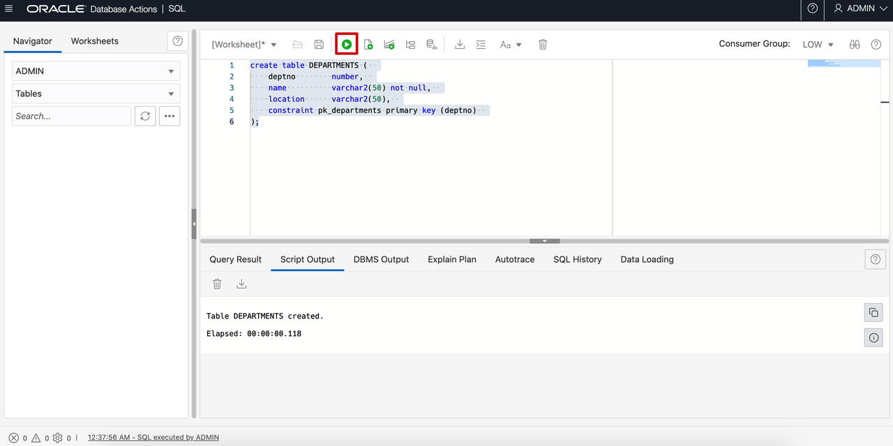

2. Tables can declarative specify relationships between tables, typically referred to as referential integrity. To see how this works we can create a "child" table of the DEPARTMENTS table by including a foreign key in the EMPLOYEES table that references the DEPARTMENTS table. For example:

    ```
    <copy>
    create table EMPLOYEES (  
        empno             number,  
        name              varchar2(50) not null,  
        job               varchar2(50),  
        manager           number,  
        hiredate          date,  
        salary            number(7,2),  
        commission        number(7,2),  
        deptno           number,  
        constraint pk_employees primary key (empno),  
        constraint fk_employees_deptno foreign key (deptno) 
            references DEPARTMENTS (deptno)  
    );
    </copy>
    ```

    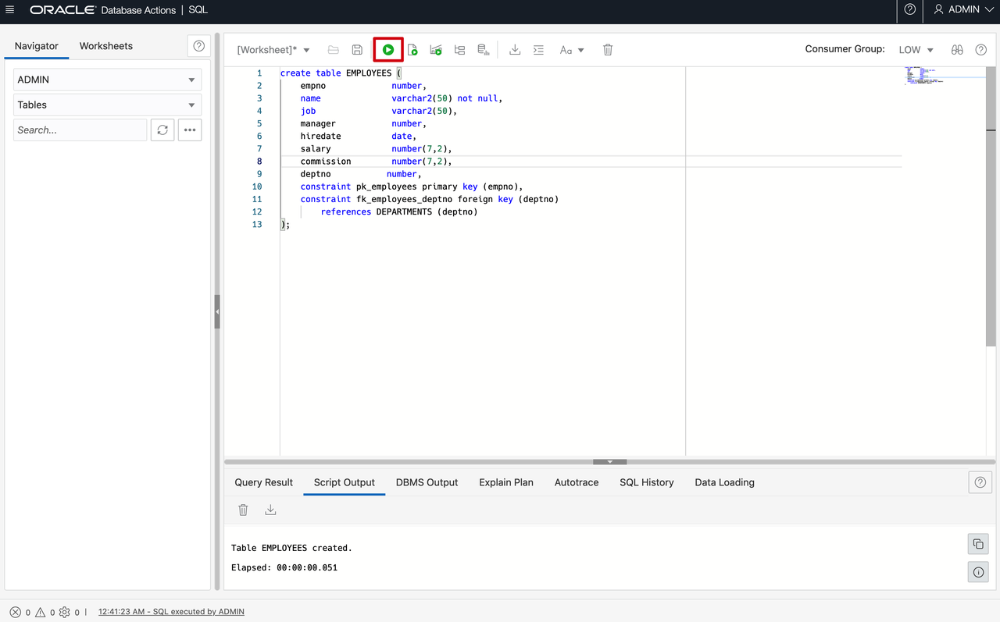

    Foreign keys must reference primary keys, so to create a "child" table the "parent" table must have a primary key for the foreign key to reference.

## Task 2: Creating Triggers

Triggers are procedures that are stored in the database and are implicitly run, or fired, when something happens. Traditionally, triggers supported the execution of a procedural code, in Oracle procedural SQL is called a PL/SQL block. PL stands for procedural language. When an INSERT, UPDATE, or DELETE occurred on a table or view. Triggers support system and other data events on DATABASE and SCHEMA.

1. Triggers are frequently used to automatically populate table primary keys, the trigger examples below show an example trigger to do just this. We will use a built in function to obtain a globallally unique identifier or GUID.

    ```
    <copy>
    create or replace trigger  DEPARTMENTS_BIU
        before insert or update on DEPARTMENTS
        for each row
    begin
        if inserting and :new.deptno is null then
            :new.deptno := to_number(sys_guid(), 
            'XXXXXXXXXXXXXXXXXXXXXXXXXXXXXXXX');
        end if;
    end;
    /
    </copy>
    ```

    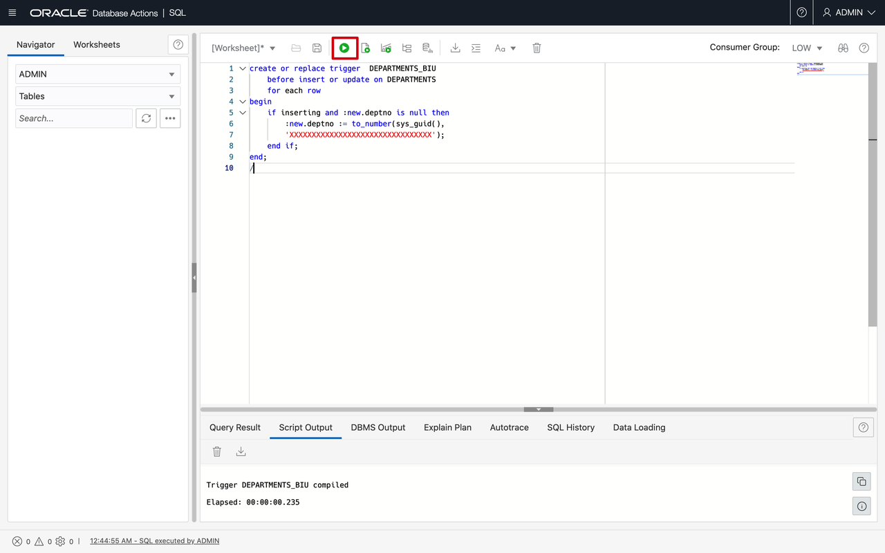

    ```
    <copy>
    create or replace trigger EMPLOYEES_BIU
        before insert or update on EMPLOYEES
        for each row
    begin
        if inserting and :new.empno is null then
            :new.empno := to_number(sys_guid(), 
                'XXXXXXXXXXXXXXXXXXXXXXXXXXXXXXXX');
        end if;
    end;
    /
    </copy>
    ```

    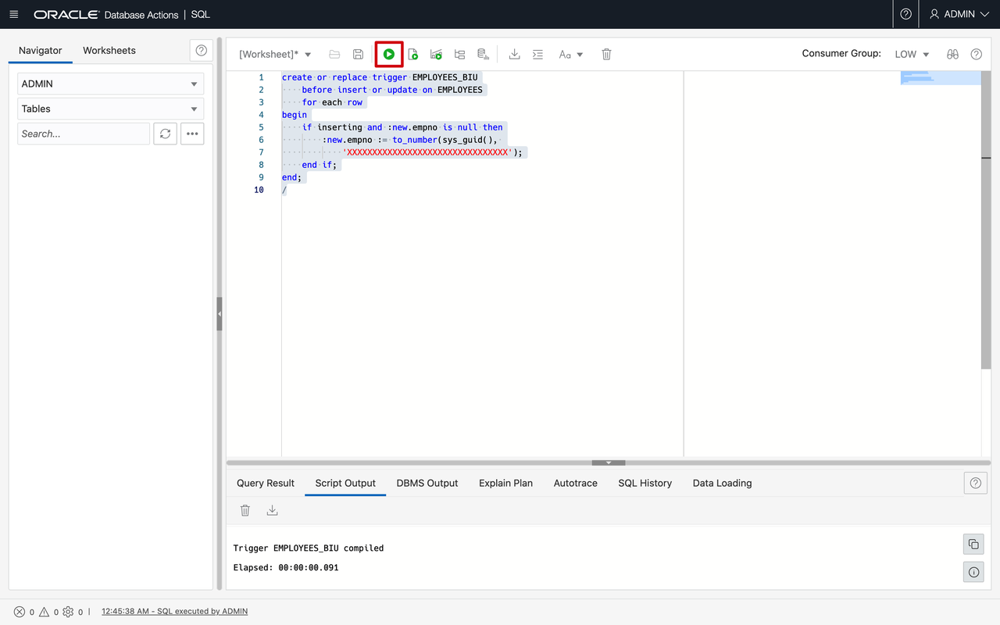

## Task 3: Inserting Data

1. Now that we have tables created, and we have triggers to automatically populate our primary keys, we can add data to our tables. Because we have a parent child relationship, with the DEPARTMENTS table as the parent table, and the EMPLOYEES table as the child we will first INSERT a row into the DEPARTMENTS table.

    ```
    <copy>
    insert into departments (name, location) values
        ('Finance','New York');

    insert into departments (name, location) values
        ('Development','San Jose');
    </copy>
    ```

    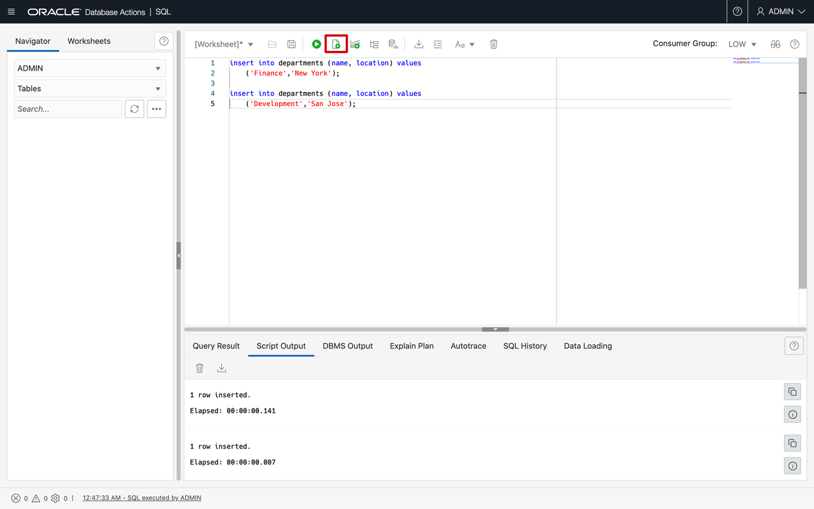

2. Lets verify that the insert was successful by running a SQL SELECT statement to query all columns and all rows of our table.

    ```
    <copy>
    select * from departments;
    </copy>
    ```

    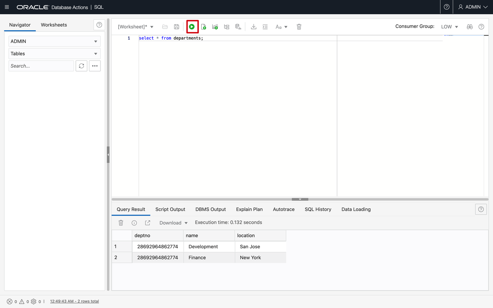

3. You can see that an ID will have been automatically generated. You can now insert into the EMPLOYEES table a new row but you will need to put the generated DEPTID value into your SQL INSERT statement. The examples below show how we can do this using a SQL query, but you could simply enter the department number directly.

    ```
    <copy>
    insert into EMPLOYEES 
        (name, job, salary, deptno) 
        values
        ('Sam Smith','Programmer', 
            5000, 
        (select deptno 
        from departments 
        where name = 'Development'));

    insert into EMPLOYEES 
        (name, job, salary, deptno) 
        values
        ('Mara Martin','Analyst', 
        6000, 
        (select deptno 
        from departments 
        where name = 'Finance'));

    insert into EMPLOYEES 
        (name, job, salary, deptno) 
        values
        ('Yun Yates','Analyst', 
        5500, 
        (select deptno 
        from departments 
        where name = 'Development'));
    </copy>
    ```

    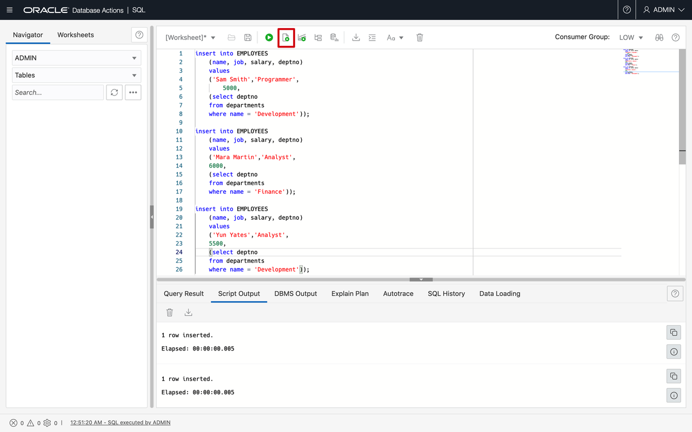

## Task 4: Indexing Columns

Typically developers index columns for three major reasons:
- To enforce unique values within a column
- To improve data access performance
- To prevent lock escalation when updating rows of tables that use declarative referential integrity

1. When a table is created and a PRIMARY KEY is specified an index is automatically created to enforce the primary key constraint. If you specific UNIQUE for a column when creating a column a unique index is also created. To see the indexes that already exist for a given table you can run the following dictionary query.

    ```
    <copy>
    select table_name "Table", 
        index_name "Index", 
        column_name "Column", 
        column_position "Position"
    from  user_ind_columns 
    where table_name = 'EMPLOYEES' or 
        table_name = 'DEPARTMENTS'
    order by table_name, column_name, column_position
    </copy>
    ```

    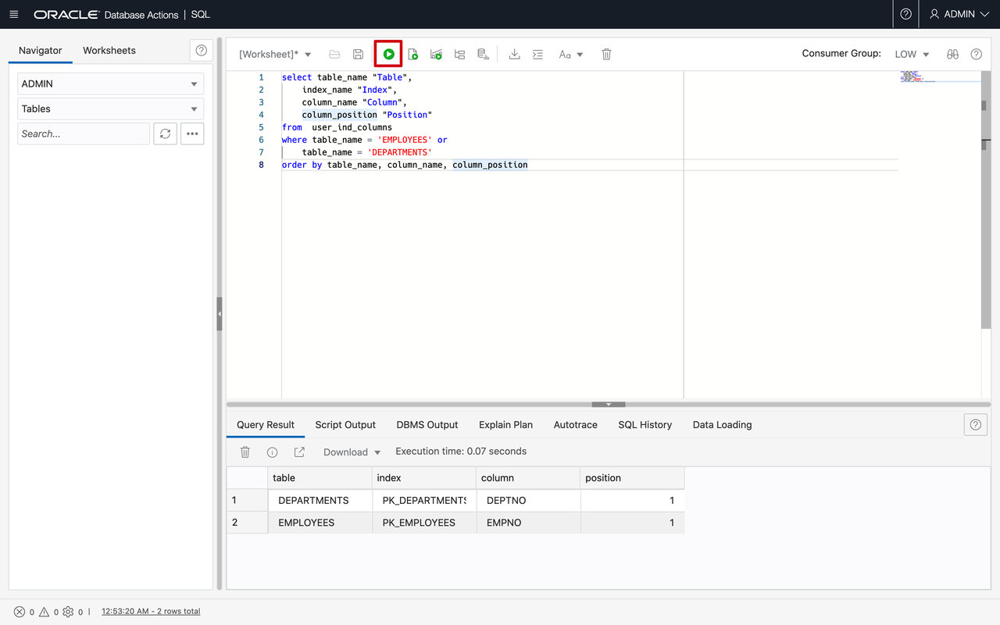

2. It is typically good form to index foreign keys, foreign keys are columns in a table that reference another table. In our EMPLOYEES and DEPARTMENTS table example the DEPTNO column in the EMPLOYEE table references the primary key of the DEPARTMENTS table.

    ```
    <copy>
    create index employee_dept_no_fk_idx 
    on employees (deptno)
    </copy>
    ```

    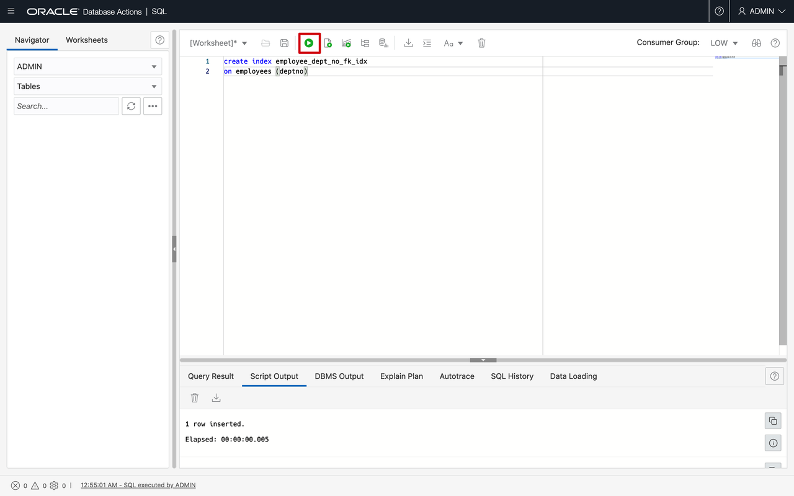

3. We may also determine that the EMPLOYEE table will be frequently searched by the NAME column. To improve the performance searches and to ensure uniqueness we can create a unique index on the EMPLOYEE table NAME column.

    ```
    <copy>
    create unique index employee_ename_idx
    on employees (name)
    </copy>
    ```

    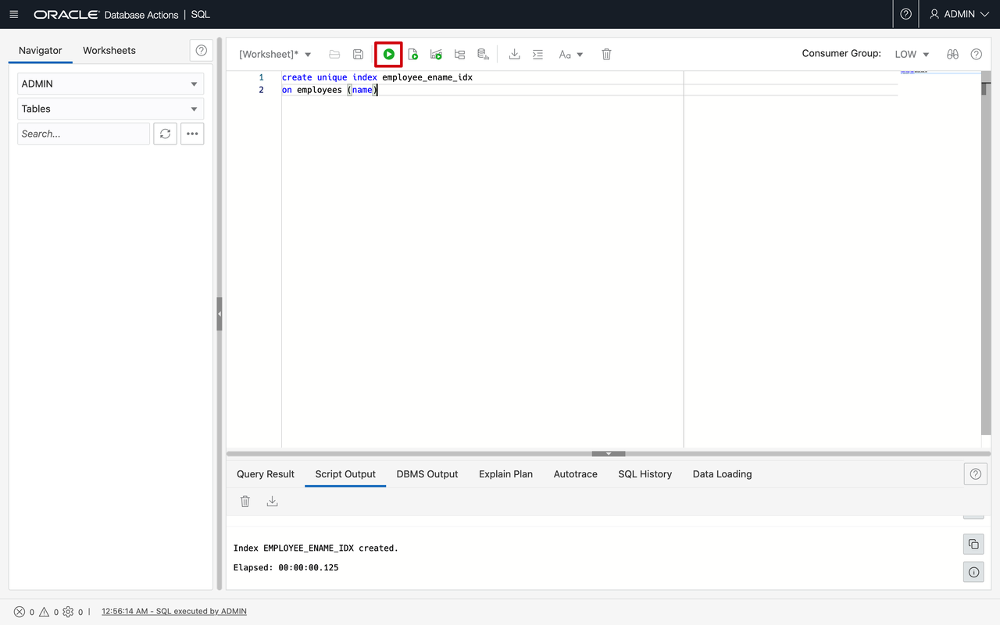

    Oracle provides many other indexing technologies including function based indexes which can index expressions, such as an upper function, text indexes which can index free form text, bitmapped indexes useful in data warehousing. You can also create indexed organized tables, you can use partition indexes and more. Sometimes it is best to have fewer indexes and take advantage of in memory capabilities. All of these topics are beyond the scope of this basic introduction.

## Task 5: Querying Data

1. To select data from a single table it is reasonably easy, simply use the SELECT ... FROM ... WHERE ... ORDER BY ... syntax.

    ```
    <copy>
    select * from employees;
    </copy>
    ```

    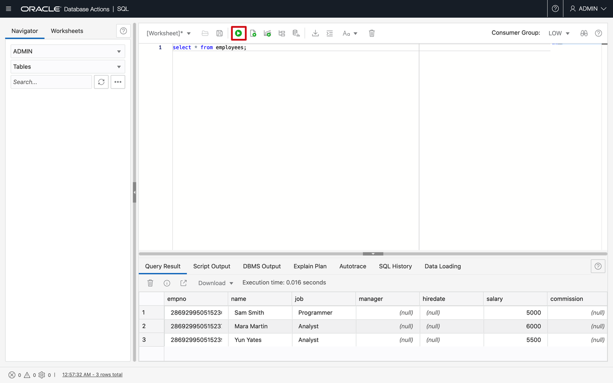

2. To query data from two related tables you can join the data

    ```
    <copy>
    select e.name employee,
           d.name department,
           e.job,
           d.location
    from departments d, employees e
    where d.deptno = e.deptno(+)
    order by e.name;
    </copy>
    ```

    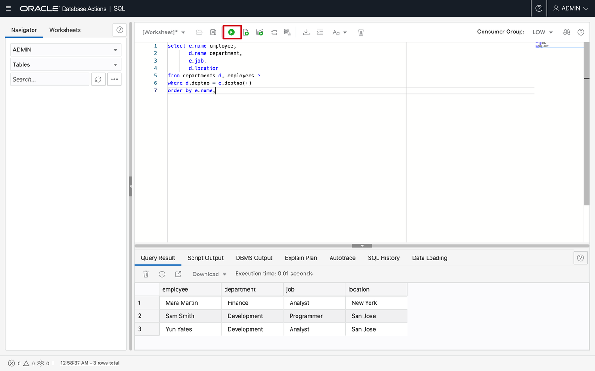

3. As an alternative to a join you can use an inline select to query data.

    ```
    <copy>
    select e.name employee,
          (select name 
           from departments d 
           where d.deptno = e.deptno) department,
           e.job
    from employees e
    order by e.name;
    </copy>
    ```

    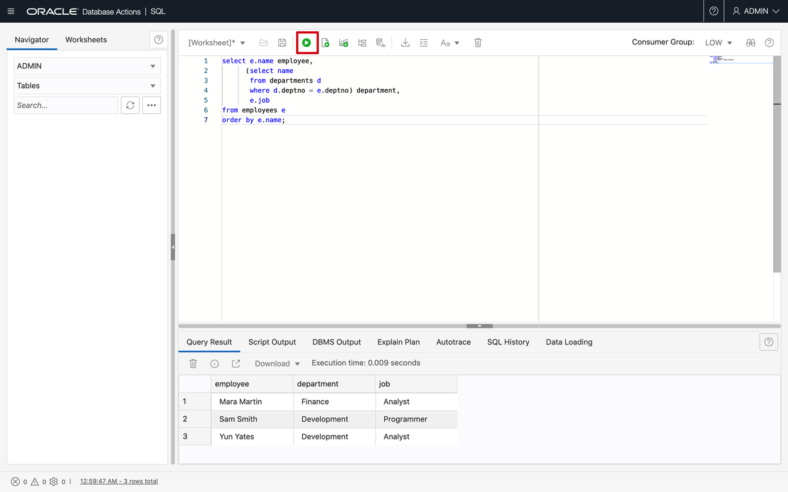

## Task 6: Adding Columns

1. You can add additional columns after you have created your table using the ALTER TABLE ... ADD ... syntax. For example:

    ```
    <copy>
    alter table EMPLOYEES 
    add country_code varchar2(2);
    </copy>
    ```

    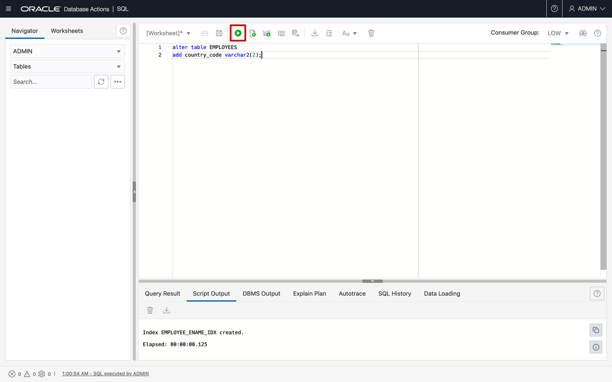

## Task 7: Querying the Oracle Data Dictionary

1. Table meta data is accessible from the Oracle data dictionary. The following queries show how you can query the data dictionary tables.

    ```
    <copy>
    select table_name, tablespace_name, status
    from user_tables
    where table_Name = 'EMPLOYEES';
    </copy>
    ```

    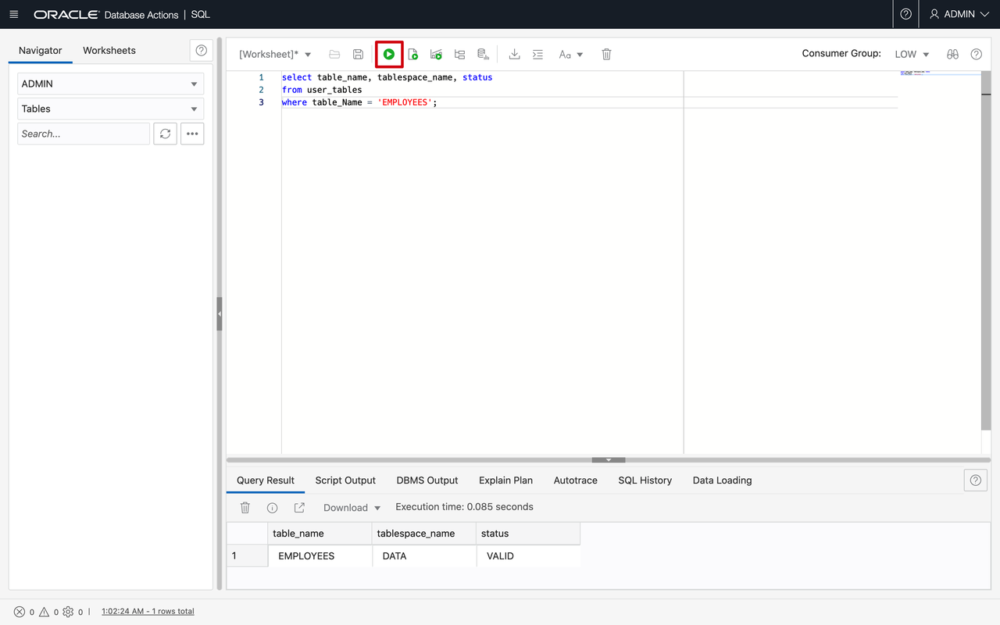

    ```
    <copy>
    select column_id, column_name , data_type
    from user_tab_columns
    where table_Name = 'EMPLOYEES'
    order by column_id;
    </copy>
    ```

    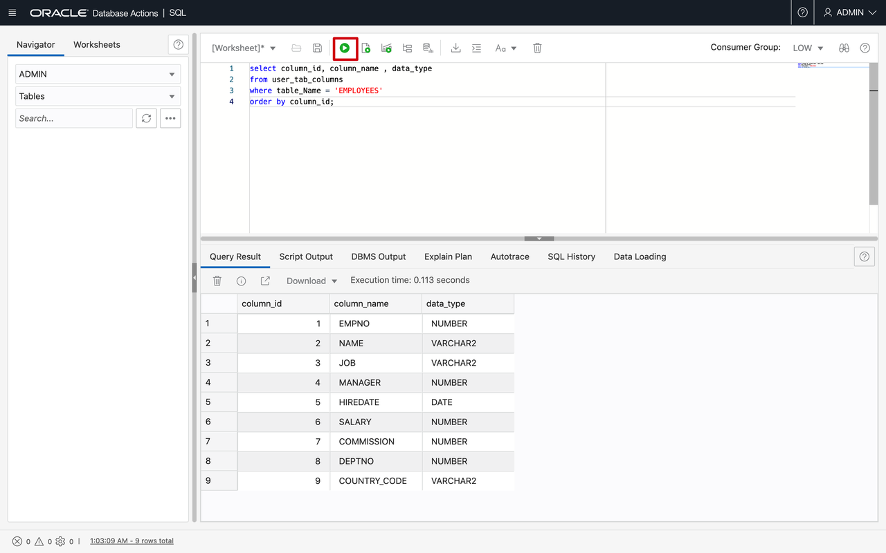

## Task 8: Updating Data

1. You can use SQL to update values in your table, to do this we will use the update clause.

    ```
    <copy>
    update employees
    set country_code = 'US';
    </copy>
    ```

    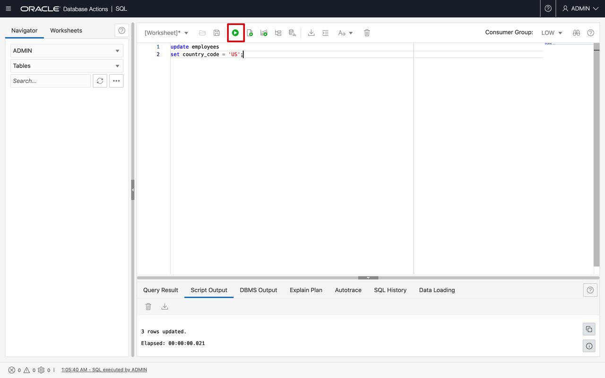

2. The query above will update all rows of the employee table and set the value of country code to US. You can also selectively update just a specific row.

    ```
    <copy>
    update employees
    set commission = 2000
    where  name = 'Sam Smith';
    </copy>
    ```

    

3. Lets run a Query to see what our data looks like

    ```
    <copy>
    select name, country_code, salary, commission
    from employees
    order by name;
    </copy>
    ```

    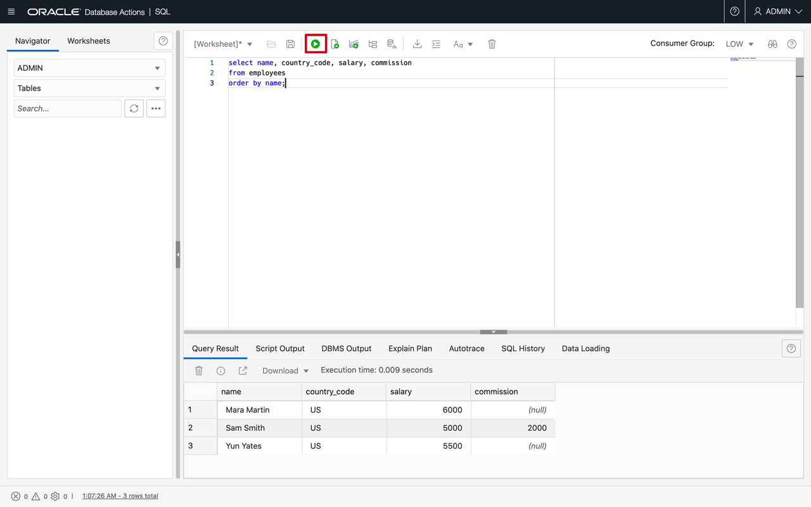

## Task 9: Aggregate Queries

1. You can sum data in tables using aggregate functions. We will use column aliases to rename columns for readability, we will also use the null value function (NVL) to allow us to properly sum columns with null values.

    ```
    <copy>
    select 
      count(*) employee_count,
      sum(salary) total_salary,
      sum(commission) total_commission,
      min(salary + nvl(commission,0)) min_compensation,
      max(salary + nvl(commission,0)) max_compensation
    from employees;
    </copy>
    ```

    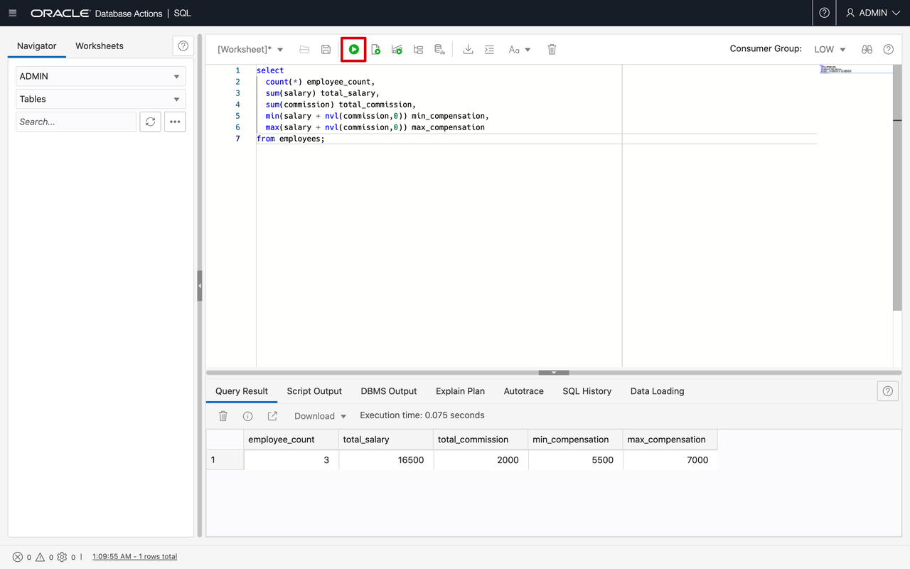

## Task 10: Compressing Data

As your database grows in size to gigabytes or terabytes and beyond, consider using table compression. Table compression saves disk space and reduces memory use in the buffer cache. Table compression can also speed up query execution during reads. There is, however, a cost in CPU overhead for data loading and DML. Table compression is completely transparent to applications. It is especially useful in online analytical processing (OLAP) systems, where there are lengthy read-only operations, but can also be used in online transaction processing (OLTP) systems.

You specify table compression with the COMPRESS clause of the CREATE TABLE statement. You can enable compression for an existing table by using this clause in an ALTER TABLE statement. In this case, the only data that is compressed is the data inserted or updated after compression is enabled. Similarly, you can disable table compression for an existing compressed table with the ALTER TABLE...NOCOMPRESS statement. In this case, all data the was already compressed remains compressed, and new data is inserted uncompressed.

1. To enable compression for future data use the following syntax.

    ```
    <copy>
    alter table EMPLOYEES compress for oltp; 
    alter table DEPARTMENTS compress for oltp;
    </copy>
    ```

    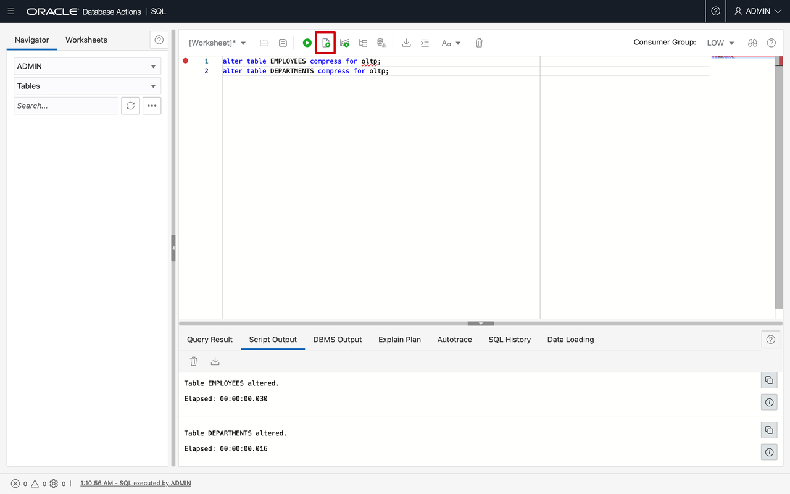

## Task 11: Deleting Data

1. You can delete one or more rows from a table using the DELETE syntax. For example to delete a specific row:

    ```
    <copy>
    delete from employees 
    where name = 'Sam Smith';
    </copy>
    ```

    

## Task 12: Dropping Tables

1. You can drop tables using the SQL DROP command. Dropping a table will remove all of the rows and drop sub-objects including indexes and triggers. The following DROP statements will drop the departments and employees tables. The optional cascade constraints clause will drop remove constraints thus allowing you to drop database tables in any order.

    ```
    <copy>
    drop table departments cascade constraints;
    drop table employees cascade constraints;
    </copy>
    ```

    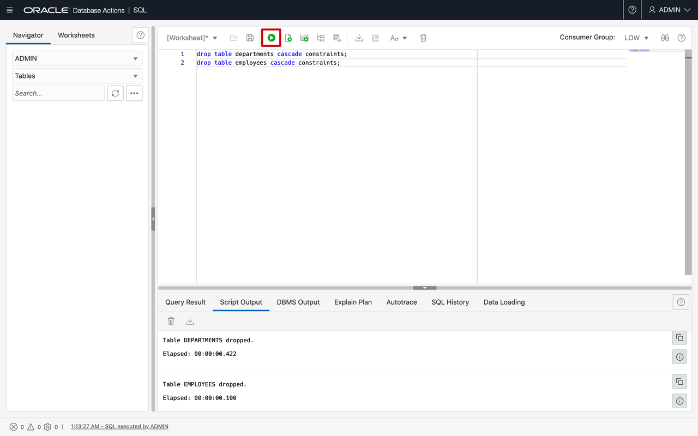

## Task 13: Un-dropping Tables

1. If the RECYCLEBIN initialization parameter is set to ON (the default in 10g), then dropping this table will place it in the recycle bin. To see if you can undrop a table run the following data dictionary query:

    ```
    <copy>
    select object_name, 
       original_name, 
       type, 
       can_undrop, 
       can_purge
    from recyclebin;
    </copy>
    ```

    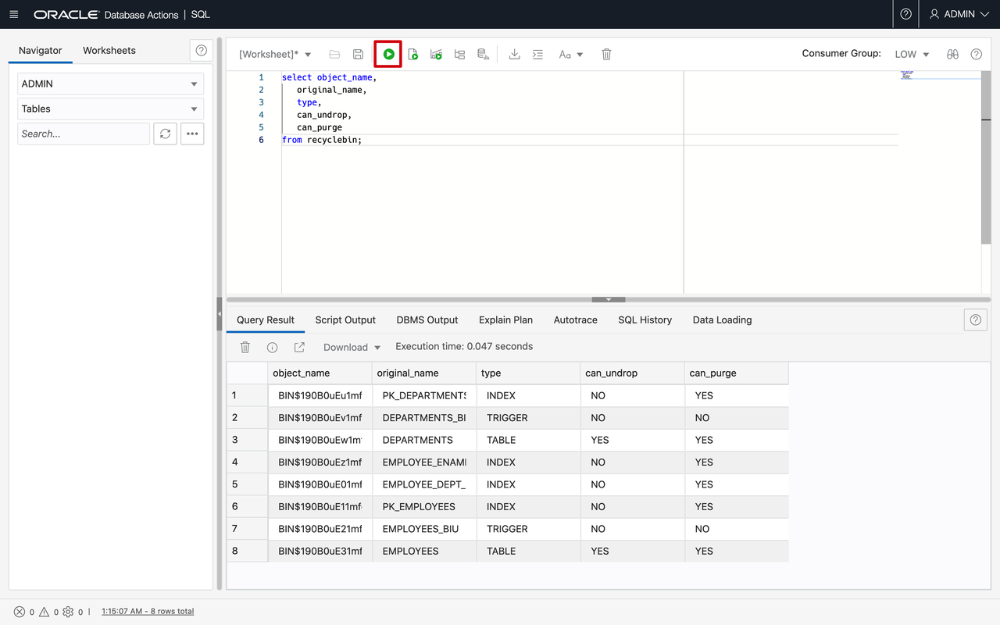

2. To undrop tables we use the flashback command, for example:

    ```
    <copy>
    flashback table DEPARTMENTS to before drop;
    flashback table EMPLOYEES to before drop;
    select count(*) departments 
    from departments;
    select count(*) employees
    from employees;
    </copy>
    ```

    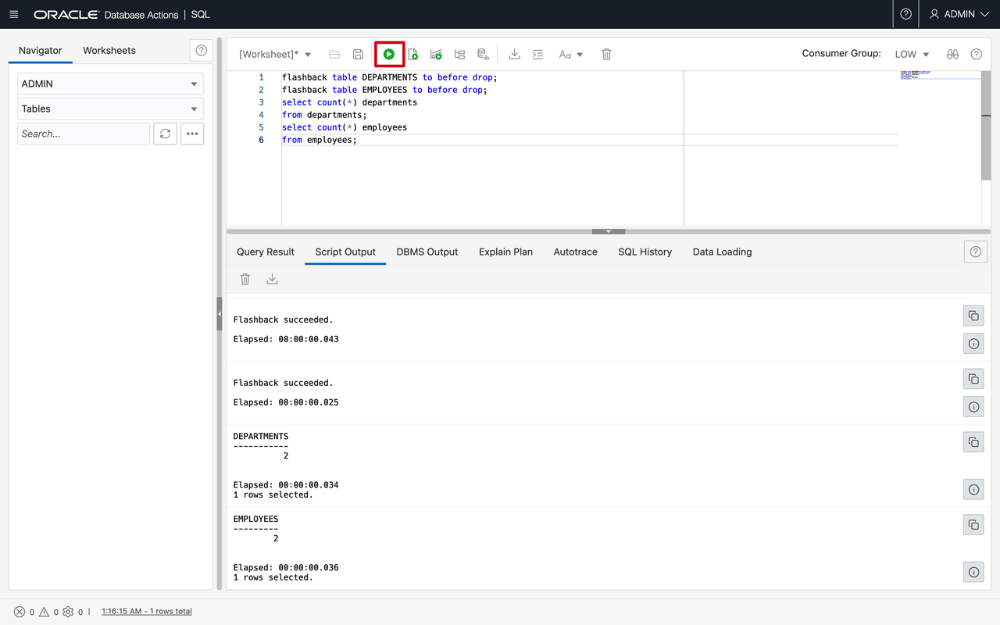

## Learn More

* [SQL Language Reference](https://docs.oracle.com/en/database/oracle/oracle-database/12.2/sqlrf/Introduction-to-Oracle-SQL.html#GUID-049B7AE8-11E1-4110-B3E4-D117907D77AC)

## Acknowledgements

* **Contributor** - Anoosha Pilli, Product Manager
* **Last Updated By/Date** - Anoosha Pilli, February 2022