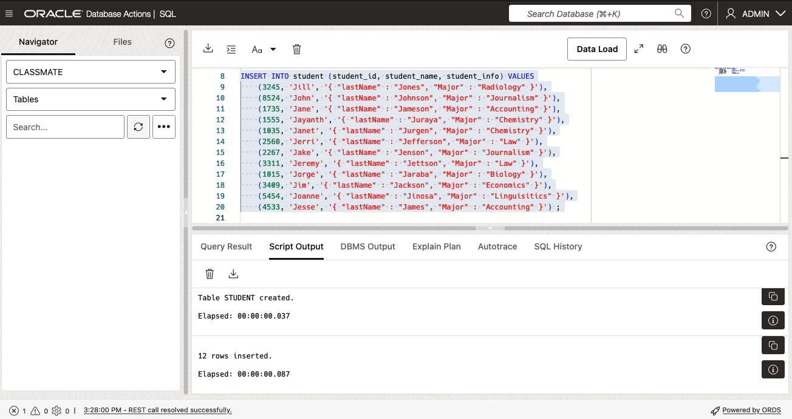
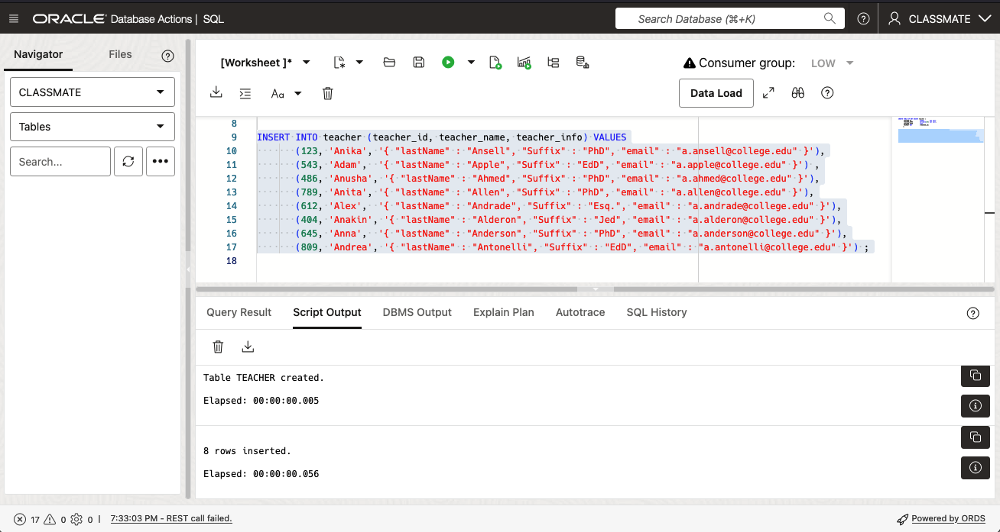
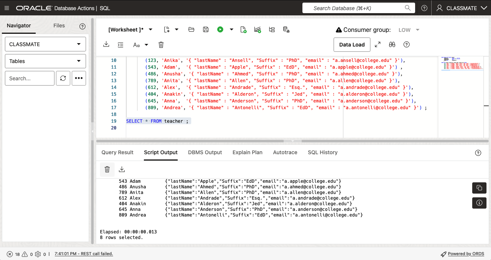
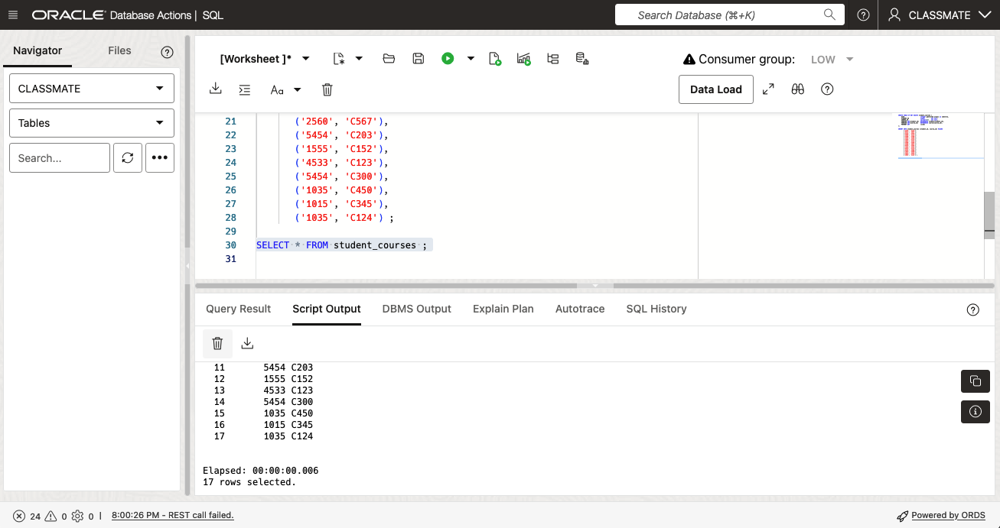

# Prepare your Environment for the Workshop

## Introduction

This lab provides a step-by-step guide to help you get started with the JSON Duality LiveLab. In this lab, you will create the necessary schema and tables need for the following labs.

In this lab, we will be creating a schema called CLASSMATE with the required tables and data for this lab.

Estimated Time: 15 minutes

### Objectives

In this lab, you will:
* Create and pre-populate the tables for the lab
 
### Prerequisites

This lab assumes you have:
* Oracle Autonomous Database 23ai provisioned.
* ClassMate schema pre-created.

## Task 1: Connect to your Autonomous Database as the user *classmate* 

1. After logging into your Oracle OCI account and navigating to your *ADB23ai* Autonomous Database instance, click on *"SQL"* under the *"Database Actions"* menu. Refer to the picture below-


    

2. Login as the `CLASSMATE` user. To do this, Click on the drop-down arrow to the right of the `ADMIN` user and click *Sign Out* . 

   

   At the Sign-in screen enter:

   Username:  *CLASSMATE*
   Password:  *College2024#*

   and click the "Sign in" button.

   

   This will bring you to the "Database Actions Launchpad".

   (If it's the first time you are accessing the Launchpad, your default homepage will be the "Development" page.  If not, click the "Development" tab to display the development menu.) 

   Click "SQL" in the menu on the left hand side of the screen. You will now be at the SQL Worksheet screen. 

   


   We're now ready to start creating our tables.

3. We will start by creating a table called: `student`.

   Copy and paste the following code in the SQL Worksheet pane. Click "Run Script" to execute the code.  

    ```
    <copy>
    CREATE TABLE IF NOT EXISTS student (
       STUDENT_ID           number       not null,
       STUDENT_NAME         varchar2(40) not null,
       STUDENT_INFO         json,
       PRIMARY KEY          (STUDENT_ID) 
      );
    </copy>
    ```

   


4. Once the `STUDENT` table is created, populate the `STUDENT` table using the following SQL code.

    ```
    <copy>
    INSERT INTO student (student_id, student_name, student_info) VALUES
           (3245, 'Jill', '{ "lastName" : "Jones", "Major" : "Radiology" }'),
           (8524, 'John', '{ "lastName" : "Johnson", "Major" : "Journalism" }'),
           (1735, 'Jane', '{ "lastName" : "Jameson", "Major" : "Accounting" }'),
           (1555, 'Jayanth', '{ "lastName" : "Juraya", "Major" : "Chemistry" }'),
           (1035, 'Janet', '{ "lastName" : "Jurgen", "Major" : "Chemistry" }'),
           (2560, 'Jerri', '{ "lastName" : "Jefferson", "Major" : "Law" }'),
           (2267, 'Jake', '{ "lastName" : "Jenson", "Major" : "Journalism" }'),
           (3311, 'Jeremy', '{ "lastName" : "Jettson", "Major" : "Law" }'),
           (1015, 'Jorge', '{ "lastName" : "Jaraba", "Major" : "Biology" }'),
           (3409, 'Jim', '{ "lastName" : "Jackson", "Major" : "Economics" }'),
           (5454, 'Joanne', '{ "lastName" : "Jinosa", "Major" : "Linguisitics" }'),
           (4533, 'Jesse', '{ "lastName" : "James", "Major" : "Accounting" }') ;
    </copy>
    ```

   

   You should see 12 rows created. 

   Verify the contents of the table you just created by clicking the "Run Script" button-

      ```
      <copy>
      SELECT * FROM student ;
      </copy>
      ```
   You should see the following:

   


5. Create the `teacher` table using the following script-

    ```
    <copy>
    CREATE TABLE IF NOT EXISTS teacher (
       TEACHER_ID           number       not null,
       TEACHER_NAME         varchar2(40) not null,
       TEACHER_INFO         json,
       PRIMARY KEY          (TEACHER_ID) 
      );
    </copy>
    ```

   

6. Once the `teacher` table is created, populate the `teacher` table with the following entries.

    ```
    <copy>
    INSERT INTO teacher (teacher_id, teacher_name, teacher_info) VALUES
           (123, 'Anika', '{ "lastName" : "Ansell", "Suffix" : "PhD", "email" : "a.ansell@college.edu" }'),
           (543, 'Adam',  '{ "lastName" : "Apple", "Suffix" : "EdD", "email" : "a.apple@college.edu" }') ,
           (486, 'Anusha', '{ "lastName" : "Ahmed", "Suffix" : "PhD", "email" : "a.ahmed@college.edu" }'),
           (789, 'Anita', '{ "lastName" : "Allen", "Suffix" : "PhD", "email" : "a.allen@college.edu" }'),
           (612, 'Alex',  '{ "lastName" : "Andrade", "Suffix" : "Esq.", "email" : "a.andrade@college.edu" }'),
           (404, 'Anakin', '{ "lastName" : "Alderon", "Suffix" : "Jed", "email" : "a.alderon@college.edu" }'),
           (645, 'Anna',  '{ "lastName" : "Anderson", "Suffix" : "PhD", "email" : "a.anderson@college.edu" }'),
           (809, 'Andrea', '{ "lastName" : "Antonelli", "Suffix" : "EdD", "email" : "a.antonelli@college.edu" }') ;
    </copy>
    ```

   

   You should see 8 rows inserted.

   You can also verify the contents of the table you just created by running the following-

      ```
      <copy>
      SELECT * FROM teacher ;
      </copy>
      ```

   You should see the following:

   


7. Create the `course` table using the following script-

    ```
    <copy>
    CREATE TABLE IF NOT EXISTS course (
       COURSE_ID               varchar2(5)  not null,
       COURSE_NAME             varchar2(10) not null,
       ROOM                    varchar2(5),
       TIME                    varchar2(5),
       TEACHER_ID              number  not null,
       VIRTUAL                 boolean,
       COURSE_INFO             json,
       FOREIGN KEY(teacher_id) REFERENCES teacher(teacher_Id),
       PRIMARY KEY             (COURSE_ID) 
      );
    /
    </copy>
    ```

   


   Once the `course` table is created, populate the `course` table with the following entries.

    ```
    <copy>
    INSERT INTO course (course_id, course_name, room, time, teacher_id, virtual, course_info) VALUES
       ('C123', 'MATH_01', 'A102', '14:00', 543, 'FALSE', 
                  '{ "courseNameFull" : "Mathematics 101", "preRequisites" : "none" }'),
       ('C124', 'MATH_02', 'A102', '16:00', 543, 'FALSE', 
                  '{ "courseNameFull" : "Mathematics 102", "preRequisites" : "MATH_01" }'),
       ('C152', 'CALC_01', 'A104', '10:00', 645, 'FALSE',
                  '{ "courseNameFull" : "Calculus 201", "preRequisites" : "none" }'),
       ('C203', 'ENGL_01', 'A202', '15:00', 543, 'FALSE', 
                  '{ "courseNameFull" : "English Literature 1", "preRequisites" : "none" }'),
       ('C300', 'PHYS_01', 'B405', '10:00', 789, 'FALSE', 
                  '{ "courseNameFull" : "Physics 101", "preRequisites" : "CALC_01" }'),
       ('C345', 'SCIE_02', 'B405', '16:00', 789, 'FALSE', 
                  '{ "courseNameFull" : "Science 102", "preRequisites" : "SCIE_01" }'),
       ('C450', 'SCIE_03', 'B405', '14:00', 486, 'FALSE', 
                  '{ "courseNameFull" : "Science 103", "preRequisites" : "SCIE_02" }'),
       ('C567', 'HIST_01', 'A102', '14:00', 612, 'FALSE', 
                  '{ "courseNameFull" : "History 101", "preRequisites" : "none" }'),
       ('C568', 'HIST_02', 'A102', '16:00', 612, 'FALSE', 
                  '{ "courseNameFull" : "History 102", "preRequisites" : "HIST_01" }'),
       ('C789', 'LANG_01', 'A256', '12:00', 543, 'FALSE', 
                  '{ "courseNameFull" : "Language 101", "preRequisites" : "none" }'), 
       ('C813', 'PSYC_01', 'B301', '11:00', 809, 'FALSE',
                  '{ "courseNameFull" : "Psychology 101", "preRequisites" : "none" }') ;
    </copy>
    ```

   You should see 11 rows inserted.

   

   You can also verify the contents of the table you just created-

    ```
    <copy>
    SELECT * FROM course ;
    </copy>
    ```

   You should see the following:

   


9. We are now going to create the `student_courses` table using the following script-

    ```
    <copy>
    CREATE TABLE IF NOT EXISTS student_courses (
       SCID                     integer generated always as identity, 
       STUDENT_ID               number        not null,
       COURSE_ID                varchar2(5)   not null,
       FOREIGN KEY(student_id)  REFERENCES student(student_id),
       FOREIGN KEY(course_id)   REFERENCES course(course_id), 
       PRIMARY KEY              (scId) 
    );
    </copy>
    ```

   

10. Once the `student_courses` table is created, populate the `student_courses` table with the following entries.

    ```
    <copy>
    INSERT INTO student_courses (student_id, course_id) VALUES
       ('3245', 'C123'),
       ('8524', 'C567'),
       ('3245', 'C345'),
       ('3409', 'C123'),
       ('2560', 'C789'),
       ('1555', 'C450'),
       ('1555', 'C123'),
       ('1035', 'C152'), 
       ('2560', 'C203'),
       ('2560', 'C567'),
       ('5454', 'C203'),
       ('1555', 'C152'),
       ('4533', 'C123'),
       ('5454', 'C300'),
       ('1035', 'C450'), 
       ('1015', 'C345'),
       ('1035', 'C124') ;
    </copy>
    ```
   

   You should see 17 rows inserted.

   You can also verify the contents of the table you just created issuing the following command-

    ```
    <copy>
    SELECT * FROM student_courses ;
    </copy>
    ```

   You should see the following:

   


# Wrapping up

Before proceeding any further, you may wish to refresh the navigator pane to display all of the tables we just created. This step is entirely optional.

You can refresh the navigator pane by clicking the "Refresh" button in the Navigator pane on the left hand side of the screen.

**BEFORE:**

   


**AFTER**

   

You can also view the description of the newly created tables using the Navigator too. Simply Click on arrow on the left hand side of the name of the table to you wish to view.    

   


Congratulations! You have finished the lab. You may now **proceed to the next lab** 

## Learn More

* [Oracle Database 23ai Feature Highlights](https://www.oracle.com/database/23ai/?source=v1-DBFree-ChatCTA-j2032-20240709)
* [Oracle Database 23ai Online Documentation](https://docs.oracle.com/en/database/oracle/oracle-database/23/index.html)
* [Oracle Developer Guide: Oracle JSON Relational Duality View Overview](https://docs.oracle.com/en/database/oracle/oracle-database/23/jsnvu/overview-json-relational-duality-views.html)


## Acknowledgements
* **Author** - Sean Stacey, Oracle Database Product Management
* **Contributors** - Ranjan Priyadarshi, Oracle Database Product Management
* **Last Updated By/Date** - Sean Stacey, Oracle Database Product Management, July 2024

