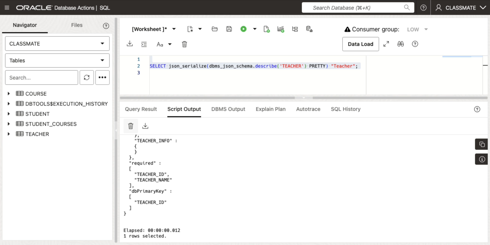
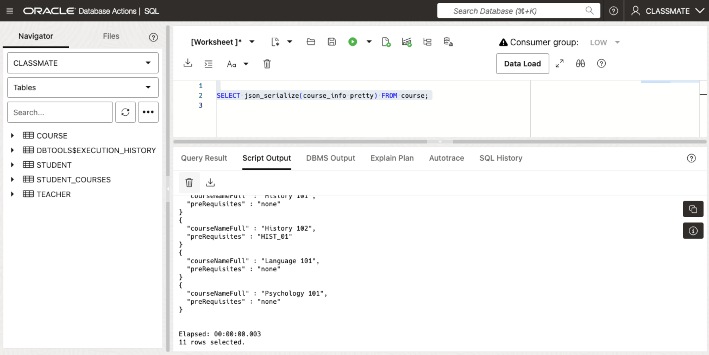
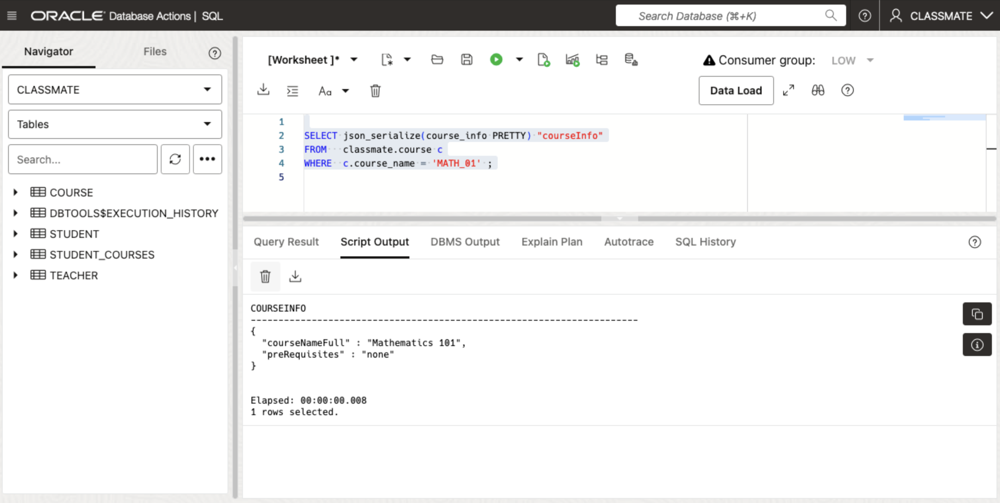
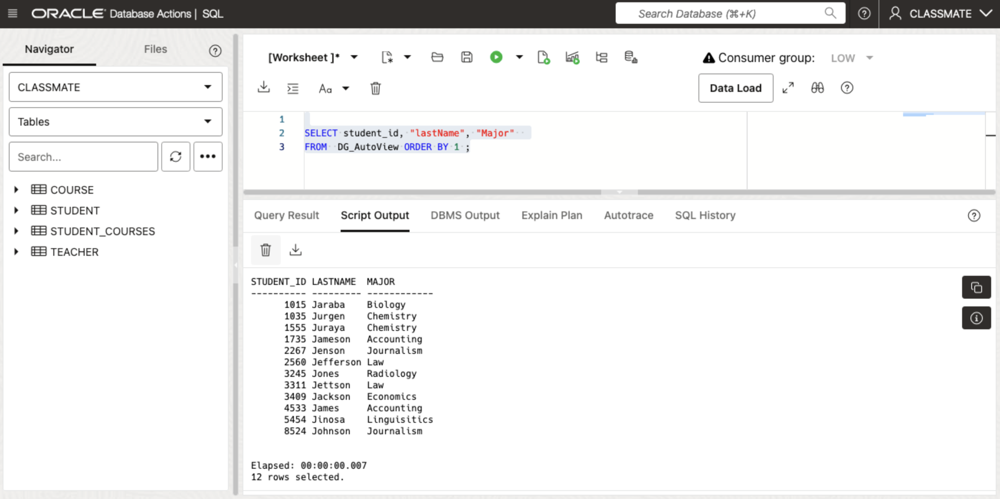

# Explore the Data

## Introduction

In this lab, we will be exploring the newly populated data that we created in the previous lab.

Estimated Time: 15 minutes

### Objectives

In this lab, you will:
* Query the data in the `CLASSMATE` schema
* Learn how to query JSON documents using SQL. 
* Use JSON_DATAGUIDE to map the JSON objects to relational views. 
 
### Prerequisites

This lab assumes you have:
* Oracle Autonomous Database 23ai provisioned.
* The CLASSMATE schema and tables created and populated.

## Task 1: Query the JSON schema for the CLASSMATE tables-

Oracle Database 23ai introduces a new JSON Schema package `dbms_json_schema` to describe the structure of a JSON document stored in an Oracle table. For our first step we'll start by looking at the JSON documents of the tables we just created.

We're now ready to describe the JSON documents for the tables we just created-

1. We can start by viewing the JSON Schema of the `student` table. Make sure to use "Run Script" to view the document pretty formatted:

      ```
      <copy>
      SELECT json_serialize(dbms_json_schema.describe('STUDENT') PRETTY) "Student";
      </copy>
      ```

      You should see the following:

      
 
      **NOTE:** You may have noticed we are able to use the *PRETTY* command to see the JSON document contents formatted in an easy to read format.

2. Next we can view the JSON Schema of the `teacher` table:

      ```
      <copy>
      SELECT json_serialize(dbms_json_schema.describe('TEACHER') PRETTY) "Teacher";
      </copy>
      ```

      You should see the following:
      
      

      *NOTE:* Feel free to resize the window size of the "Script Output" pane to view more of the JSON document. 

3. View the JSON Schema of the `course` table:

      ```
      <copy>
      SELECT json_serialize(dbms_json_schema.describe('COURSE') PRETTY) "Course";
      </copy>
      ```

      You should see the following:

      

      *NOTE:* Feel free to resize the window size of the "Script Output" pane to view more of the JSON document. 


4. It is also possible to display the contents of just the JSON Document. We can try this with the `course` table. We can view the contents of the `course_info` document in the `course` table by issueing the following command:

      ```
      <copy>
      SELECT json_serialize(course_info pretty) FROM course;
      </copy>
      ```

      You should see the following:

      


5. We can also look at the JSON document for a specific Course: **MATH_01**

      ```
      <copy>
      SELECT json_serialize(course_info PRETTY) "courseInfo"
      FROM   classmate.course c
      WHERE  c.course_name = 'MATH_01' ;
      </copy>
      ```

      You should see the following:

      


6. We can also look at the JSON document for an individual Student: **Jerri**

      ```
      <copy>
      SELECT student_name, json_serialize(student_info PRETTY) "studentInfo"
      FROM   classmate.student s
      WHERE  s.student_name = 'Jerri' ;
      </copy>
      ```

      You should see the following:

      


7. It is also possible to view the contents of a relational table as a JSON document with Oracle SQL.  

      ```
      <copy>
      SELECT JSON {*} FROM classmate.student ;
      </copy>
      ```

      You should see the following:

      


8. We can also perform a *Query-By-Example* (QBE) operation on a JSON document in Oracle. 

      In the next example we will see how to query the document to only view Students whose majors are in Biology or Chemistry. You can do this by running the following command-

      ```
      <copy>
      SELECT JSON {*}
      FROM   classmate.student 
      WHERE  json_value(student_info, '$.Major') IN ('Biology', 'Chemistry');
      </copy>
      ```

      You should see the following:

      

## Task 2: Using Oracle `JSON_DATAGUIDE`

One of the benefits of using an Oracle database to store JSON collections is that it is possible to leverage other Oracle features including Oracle Machine Learning algorithms. But many of the Oracle tools require data to be in a relatinal format. To ease this requirement Oracle has a feature called `JSON_DATAGUIDE`. `JSON_DATAGUIDE` provides the ability to render the contents of a JSON document to appear as a database relational view that can then be queried using the SQL language.

1. For our first step we will create a JSON_DATAGUIDE view for the `student` table. 

      ```
      <copy>
      DECLARE     
         dGuide CLOB ; 
      BEGIN
         SELECT JSON_DATAGUIDE(student_info, DBMS_JSON.FORMAT_HIERARCHICAL)     
         INTO   dGuide from student ;
         
         dbms_json.create_view('DG_AutoView', 'STUDENT', 'student_info', dGuide ); 
      END; 
      </copy>
      ```

      You should see the following:

      


2. You can describe the view to see the JSON document keys listed as columns. 

      ```
      <copy>
      DESC DG_AutoView  
      </copy>
      ```

      You should see the following:

      

      **NOTE:** The column names for the document keys are case-sensitive, so you will need to take that into account when querying the view. 

      A regular SQL query can display the contents of the view for us. 

      ```
      <copy>
      SELECT * FROM DG_AutoView ORDER BY 1 ;
      </copy>
      ```

      You should see the following:

      

      When querying the view, you will need to enclose the case-sensitive columns in double quotes.  

      ```
      <copy>
      SELECT student_id, "lastName", "Major"  
      FROM  DG_AutoView ORDER BY 1 ;
      </copy>
      ```

      You should see the following:

      

      Let's see what happens if we try to update the document using the view.
   
      ```
      <copy>
      UPDATE DG_AutoView 
      SET    "Major" = 'Law'
      WHERE  student_id = 1015 ;
      </copy>
      ```

      You should see the following

      

      **NOTE** This operation is expected to FAIL, as `DG_AUTOVIEW` is a view and as such it's not updateable. This restriction will be addressed in the next lab where we will be using Oracle Database 23ai JSON-Relational Duality Views.   


Congratulations! You have finished this lab. You may now **proceed to the next lab** 

## Learn More

* [Oracle Database 23ai Feature Highlights](https://www.oracle.com/database/23ai/?source=v1-DBFree-ChatCTA-j2032-20240709)
* [Oracle Database 23ai Online Documentation](https://docs.oracle.com/en/database/oracle/oracle-database/23/index.html)
* [Oracle Developer Guide: Oracle JSON Relational Duality View Overview](https://docs.oracle.com/en/database/oracle/oracle-database/23/jsnvu/overview-json-relational-duality-views.html)
* [Oracle Documentation: Information on the Oracle JSON-To-Duality Migrator](https://docs.oracle.com/en/database/oracle/oracle-database/23/jsnvu/json-duality.html)


## Acknowledgements
* **Author** - Sean Stacey, Oracle Database Product Management
* **Contributors** - Ranjan Priyadarshi, Oracle Database Product Management
* **Last Updated By/Date** - Sean Stacey, Oracle Database Product Management, July 2024

