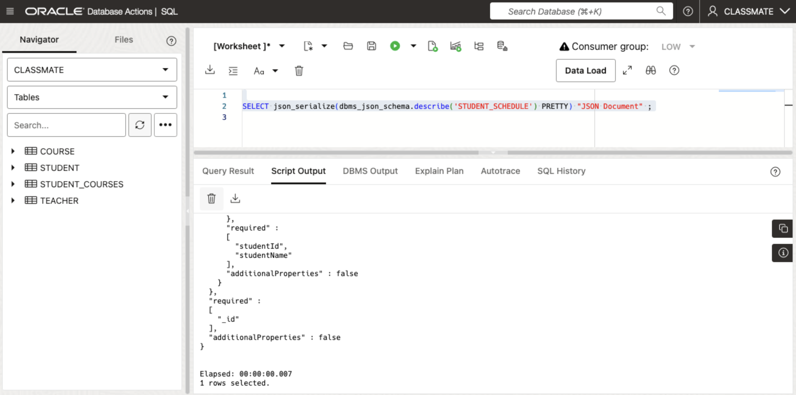
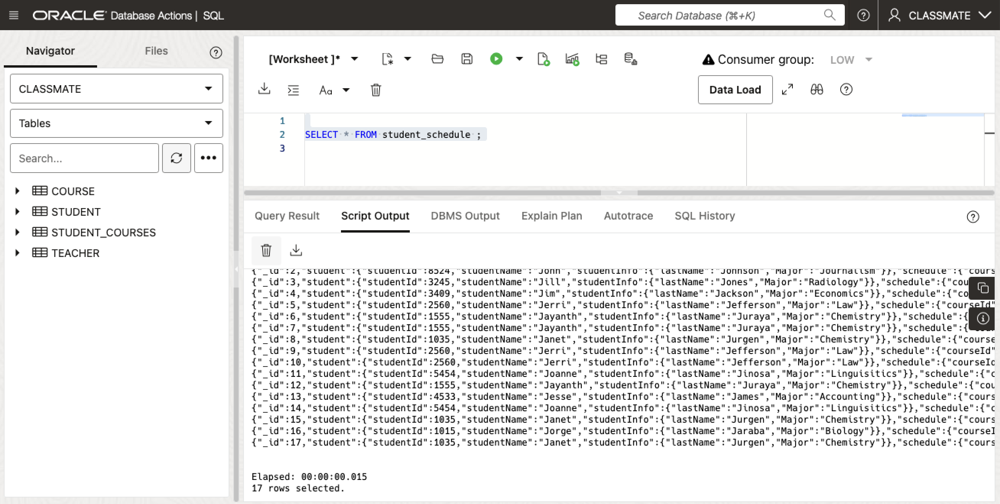
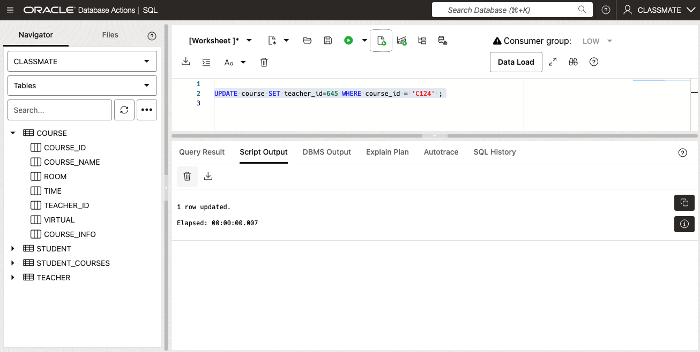
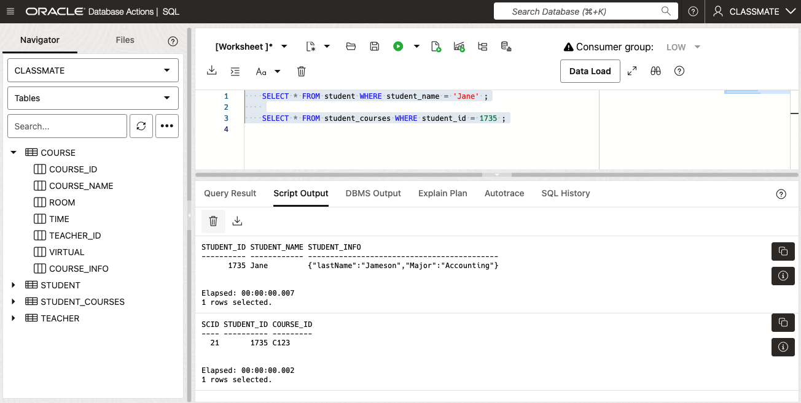

# The Extreme Flexibility of JSON Duality Views

## Introduction

In a previous lab we saw how it is possible to transpose the contents of a JSON document as a relational view using the SQL package JSON_DATAGUIDE. While DATAGUIDE views are a powerful tool for displaying and querying JSON documents with SQL, it is not possible update the contents...*

This lab demonstrates the extreme flexibility of JSON Duality Views in Oracle Database 23ai. You will learn how to work with SQL data and JSON documents simultaneously, leveraging the true duality of the views. With JSON Duality Views, you have the flexibility and data access benefits of the JSON document model combined with the storage efficiency and power of the relational model.

Estimated Time: 20 minutes

[Lab 3](videohub:1_w820xz7v)

### Objectives

In this lab, you will:

* Learn about the different types of JSON Duality Views available in Database 23ai
* Create Duality Views using two different approaches 
* See how to query JSON documents using SQL. 
* Perform insert and update operations on Duality Views and underlying SQL base tables


### Prerequisites

This lab assumes you have:
* An Oracle Autonomous Database 23ai provisioned.
* The CLASSMATE schema tables created and populated.


## Task 1: Create a JSON Duality View

1. Four our first step we will create a JSON Relational Duality View. Copy and run the following code-

    ```
    <copy>
    CREATE OR REPLACE JSON RELATIONAL DUALITY VIEW student_schedule AS
    SELECT JSON {'_id'     : sc.scid,
                    'student' :
                        (SELECT JSON {'studentId'   : s.student_id,
                                    'studentName' : s.student_name,
                                    'studentInfo' : s.student_info }
                        FROM   classmate.student s WITH NOINSERT UPDATE NODELETE
                        WHERE  sc.student_id = s.student_id
                        ),
                    'schedule' : 
                        (SELECT JSON {'courseId' : c.course_id,
                                    'courseName' : c.course_name,
                                    'courseRoom' : c.room,
                                    'courseTime' : c.time,
                                    'teacher'    : 
                                                    (SELECT JSON { 'teacherName' : t.teacher_name,
                                                                    'teacherId'   : t.teacher_id }
                                                    FROM   classmate.teacher t WITH NOINSERT UPDATE NODELETE 
                                                    WHERE  c.teacher_id = t.teacher_id)
                                    }
                        FROM   classmate.course c WITH NOINSERT UPDATE NODELETE
                        WHERE  sc.course_id = c.course_id
                        )
                    }
    FROM  classmate.student_courses sc WITH INSERT UPDATE DELETE ;
    </copy>
    ```

    You should see the following:

    

2. Let's take a look at the Duality View we just created:

    ```
    <copy>
    DESC student_schedule 
    </copy>
    ```

    You should see the following

    

    You will notice when describing the `STUDENT_SCHEDULE` that it contains a single JSON document called DATA.


3. As `STUDENT_SCHEDULE` is a JSON Document, we can use the `DBMS_JSON_SCHEMA.DESCRIBE` package to view the Duality View schema-

    ```
    <copy>
    SELECT dbms_json_schema.describe('STUDENT_SCHEDULE') ;
    </copy>
    ```

    You should see the following:

   


4. We can also pretty print the `STUDENT_SCHEDULE` definition.

    ```
    <copy>
    SELECT json_serialize(dbms_json_schema.describe('STUDENT_SCHEDULE') PRETTY) "JSON Document" ;
    </copy>
    ```

    You should see the following:

   


5. We can also query the `STUDENT_SCHEDULE` using regular SQL syntax.

    ```
    <copy>
    SELECT * FROM student_schedule ;
    </copy>
    ```

    You should see the following:

   


6. Once again, the output can be pretty printed too-

    ```
    <copy>
    SELECT json_serialize(data pretty) 
    FROM   student_schedule ;
    </copy>
    ```

    You should see the following:

   


7. Now that we understand how to view the contents of the `STUDENT_SCHEMA` Duality View, we can try a *Query-By-Example* (QBE) operation. We can start by displaying just the schedule for a Student named "Janet" -

    ```
    <copy>
    SELECT json_serialize(data pretty) 
    FROM   student_schedule
    WHERE  json_value(data, '$.student.studentName') IN ('Janet') ;
    </copy>
    ```

    You should see the following:

   

    **NOTE:** You should see 3 rows returned.

8. We can also query `STUDENT_SCHEDULE` to display the schedule for a specific Teacher: "Adam" :

    ```
    <copy>
    SELECT json_serialize(data pretty) 
    FROM   student_schedule
    WHERE  json_value(data, '$.schedule.teacherName') IN ('Adam') ;
    </copy>
    ```

    You should see the following:

   

    *NOTE: This query does not return any rows and it incorrectly displays: "No rows selected"*


9. The reason there are no rows returned is that the query is incorrect. The "Teacher" information is stored in an underlying table called `TEACHER`. In order to see the `STUDENT_SCHEDULE` for a specific Teacher we need to use the following query-

    ```
    <copy>
    SELECT json_serialize(data pretty) 
    FROM   student_schedule
    WHERE  json_value(data, '$.schedule.teacher.teacherName') IN ('Adam') ;
    </copy>
    ```

    You should see the following:

   

    This time you will see 8 rows returned.

    While this approach solves our problem, and could be useful in storing a nested document or array, it is inconvenient and tedious when all we are looking for is information about the course. To solve this issue we can use the **UNNEST** parameter which will promote the elements from the `TEACHER` table to be in-line with the rest of our course information. We will see how to do this in the next Task.


## Task 2: Create a JSON Duality View with UNNEST

1. To create a Duality View with the **UNNEST** parameter, run the following command to replace the `STUDENT_SCHEDULE` Duality View-

    ```
    <copy>
    CREATE OR REPLACE JSON RELATIONAL DUALITY VIEW student_schedule AS
    SELECT JSON {'_id'     : sc.scId,
                 'student' :
                     (SELECT JSON {'studentId'   : s.student_id,
                                   'studentName' : s.student_name,
                                   'studentInfo' : s.student_info }
                      FROM   classmate.student s WITH NOINSERT UPDATE NODELETE
                      WHERE  sc.student_id = s.student_id
                     ),
                 'schedule' : 
                     (SELECT JSON {'courseId'   : c.course_id,
                                   'courseName' : c.course_name,
                                   'courseRoom' : c.room,
                                   'courseTime' : c.time,
                                    UNNEST
                                        (SELECT JSON { 'teacherName' : t.teacher_name,
                                                       'teacherId'   : t.teacher_id }
                                         FROM   classmate.teacher t WITH NOINSERT NOUPDATE NODELETE 
                                         WHERE  c.teacher_id = t.teacher_id)
                     }
                      FROM   classmate.course c WITH NOINSERT UPDATE NODELETE
                      WHERE  sc.course_id = c.course_id
                     )
                 }
    FROM  classmate.student_courses sc WITH INSERT UPDATE DELETE ;
    </copy>
    ```

    You should see the following:

   

    **NOTE:** Notice the UNNEST parameter when selecting the Teacher information.

2. Before we run any queries against the new version of the `STUDENT_SCHEDULE`, we should first take a look at how it has changed. Pay special attention to the `TEACHER` information-

    ```
    <copy>
    SELECT json_serialize(dbms_json_schema.describe('STUDENT_SCHEDULE') PRETTY) "JSON Document" ;
    </copy>
    ```

    You should see the following:

   

    **NOTE:**  You should notice that the "teacherId" and "teacherName" are now at the same level as the "courseId" and "courseName".   


3. Now that we have recreated the `STUDENT_SCHEDULE`, let's re-run our previous queries to see how the UNNEST parameter affects the output:

    ```
    <copy>
    SELECT json_serialize(data pretty) 
    FROM   student_schedule
    WHERE  json_value(data, '$.student.studentName') IN ('Jerri') ;
    </copy>
    ```

    You should see the following:

   

    **NOTE:** You should see 3 rows returned.

4. Let's revisit looking for schedules for classes for a given Teacher. This time we'll use the query format that returned no rows-

    ```
    <copy>
    SELECT json_serialize(data pretty) 
    FROM   student_schedule
    WHERE  json_value(data, '$.schedule.teacherName') IN ('Adam') ;
    </copy>
    ```


    You should see the following:

   

    This time we are able to see the teacher information without the need to prefix the `teacherName` with the `teacher`.

    Feel free to try some other queries.


## Task 3: Perform insert and update operations on Duality Views via the SQL base tables

Beyond providing relational-to-document mapping, JSON Duality Views also support changes made to either the underlying base tables or the JSON documents themselves. All DML (Data Manipulation Language) operations are implicitly reflected across both data representations.

In this task we will first see how changes to the underlying base tables are reflected in the Duality Views. We will see how updates to the JSON document get applied to the underlying tables in the next Task.

For our first scenario let's see how the `STUDENT_SCHEDULE` is affected when we switch the Teachers for a given Class. For this example we will swap the Teachers for *MATH_02* (Course: C124) from *Adam* to *Anna*.

1. Let's start by looking at the student's schedule for the Course C124-

    ```
    <copy>
    SELECT json_serialize(data pretty) 
    FROM   student_schedule
    WHERE  json_value(data, '$.schedule.courseId') IN ('C124') ;
    </copy>
    ```

    You should see the following:

   


2. Update the `teacherid` from **543** (Adam) to **645** (Anna) for course C124-

    ```
    <copy>
    UPDATE course SET teacher_id=645 WHERE course_id = 'C124' ;
    </copy>
    ```

    You should see the following:

   


3. Let's revisit the entry for *MATH_02* by looking again at the Schedule for Course C124-

    ```
    <copy>
    SELECT json_serialize(data pretty) 
    FROM   student_schedule
    WHERE  json_value(data, '$.schedule.courseId') IN ('C124') ;
    </copy>
    ```

    You should see the following:

   


    Feel free to try some other queries.


## Task 4: Perform insert and update operations on Duality Views directly.

In the previous task we saw how changes made to the underlying base tables are reflected in the Duality View. This time we will see how updates to the JSON document get applied to the underlying tables. You will also see the power of JSON Duality views as the operation can transparently update multiple tables as one operation.

In this task, we will see what happens when we add a new Student into the JSON document directly. In our example, an existing Student named *"Jane Jameson"* is enrolling in *MATH_01* (Course C123).

1. Let's take a look at the Student Schedule before we perform any updates.

  a. We can start by checking the `student_schedule` JSON Duality View-

    ```
    <copy>
    SELECT json_serialize(data pretty) 
    FROM   student_schedule
    WHERE  json_value(data, '$.student.studentId') IN ('1735');
    
    SELECT json_serialize(data pretty) 
    FROM   student_schedule
    WHERE  json_value(data, '$.student.studentName') IN ('Jane');
    </copy>
    ```

    You should see the following:

   

    **NOTE:** You should see no rows returned from this query. We're running this query to confirm that Jane is not enrolled in any existing courses, so there's no entries in the student_schedule.


  b. Also take a look at the underlying tables:

    ```
    <copy>
    SELECT * FROM student WHERE student_name = 'Jane' ;
    
    SELECT * FROM student_courses WHERE student_id = 1735 ;
    </copy>
    ```

    You should see the following:

   

    **NOTE:** For this code, we see a row returned for the `student` table as *Jane* is a existing student. However we see no rows returned for the `student_schedule` as *Jane* is not yet enrolled in any courses.

2. Once you've established that there are no entries for the new Student, we can insert the student into the JSON Document-

    ```
    <copy>
    INSERT INTO student_schedule VALUES('{ "student" : {"studentId" : "1735",
                                                        "studentName" : "Jane",
                                                        "studentInfo" : {"lastName": "Jameson", "Major": "Accounting"}
                                                       },
                                           "schedule": {"courseId" : "C123",
                                                        "courseName" : "MATH_01",
                                                        "courseRoom" : "A102",
                                                        "courseTime" : "14:00",
                                                        "teacherName" : "Adam",
                                                        "teacherId" : 543 }
                                                       }');
    </copy>
    ```

    You should see the following:

   

                                     
3. We should now see the newly enrolled Student in our JSON Duality View as well as all of the related underlying tables.

  a. We will start by checking the `student_schedule` JSON Duality View-

    ```
    <copy>
    SELECT json_serialize(data pretty) 
    FROM   student_schedule
    WHERE  json_value(data, '$.student.studentId') IN ('1735');
    
    SELECT json_serialize(data pretty) 
    FROM   student_schedule
    WHERE  json_value(data, '$.student.studentName') IN ('Jane');
    </copy>
    ```

    This time you should see the following:

   

    **NOTE:** You will need to scroll up in the results pane to see the output for both statements. Each statement now returns a single row.  

  b. Also take a look at the underlying tables:

    ```
    <copy>
    SELECT * FROM student WHERE student_name = 'Jane' ;
    
    SELECT * FROM student_courses WHERE student_id = 1735 ;
    </copy>
    ```

    This time you should see the following:

   


    Feel free to try some other updates.

    Congratulations! You have finished this lab. You may now **proceed to the next lab** 


## Learn More

* [Oracle Database 23ai Feature Highlights](https://www.oracle.com/database/23ai/?source=v1-DBFree-ChatCTA-j2032-20240709)
* [Oracle Database 23ai Online Documentation](https://docs.oracle.com/en/database/oracle/oracle-database/23/index.html)
* [Oracle Developer Guide: Oracle JSON Relational Duality View Overview](https://docs.oracle.com/en/database/oracle/oracle-database/23/jsnvu/overview-json-relational-duality-views.html)
* [Oracle Documentation: Information on the Oracle JSON-To-Duality Migrator](https://docs.oracle.com/en/database/oracle/oracle-database/23/jsnvu/json-duality.html)

## Acknowledgements
* **Author** - Sean Stacey, Oracle Database Product Management
* **Contributors** - Killian Lynch, Oracle Database Product Management, Product Manager, Ranjan Priyadarshi, Oracle Database Product Management
* **Last Updated By/Date** - Sean Stacey, Oracle Database Product Management, July 2024

