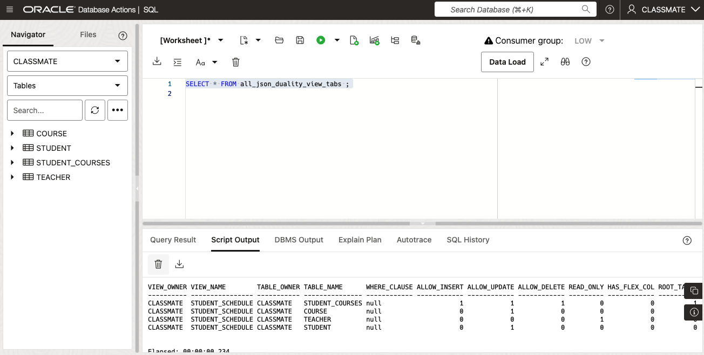
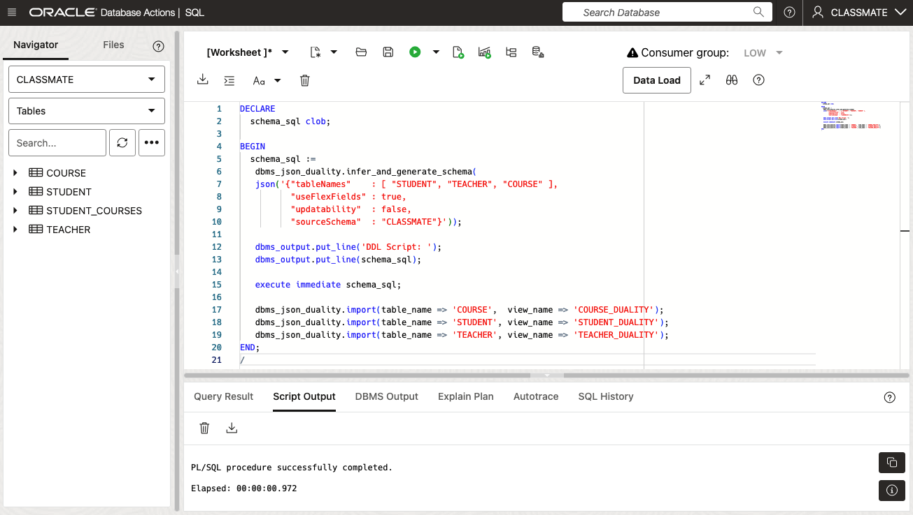
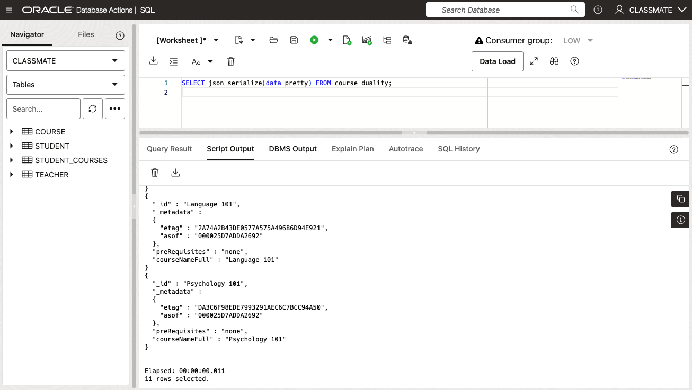
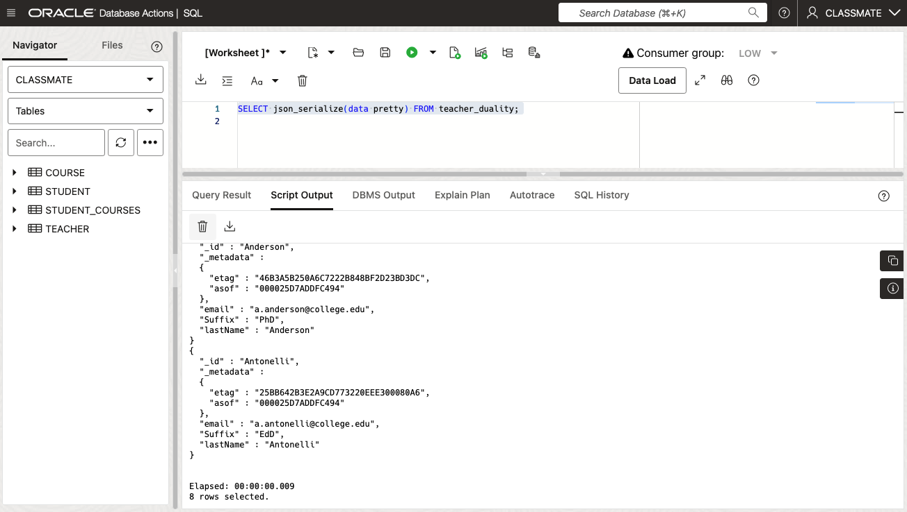
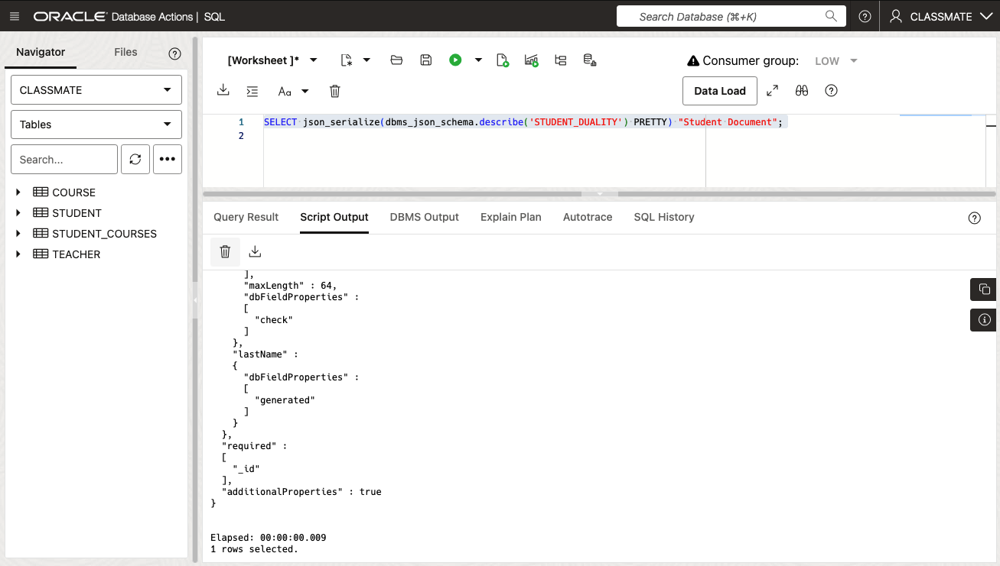
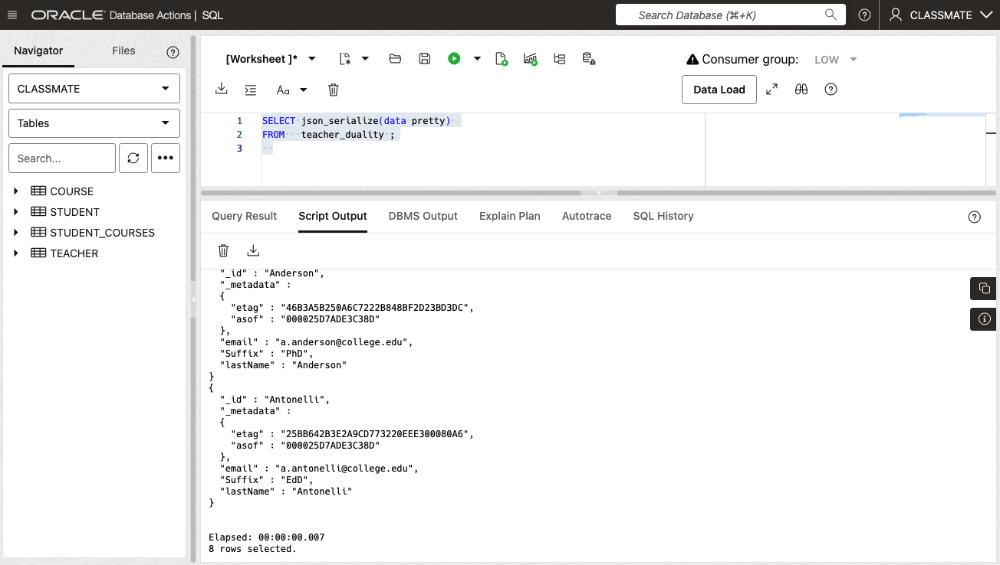
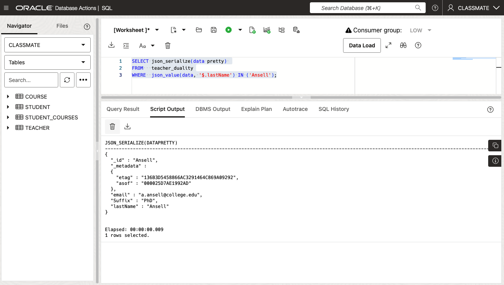

# Tools for working with JSON Duality Views

## Introduction

In this lab we will take a look at utilities in Oracle Database 23ai to assist with working with JSON Duality Views. 

The first lab task will cover dictionary views available to see information about the JSON Duality Views we have created. This includes information such as the underlying base tables, columns and relationships between the tables.

Estimated Time: 20 minutes

[Lab 4](videohub:1_w820xz7v)


### Objectives

In this lab, you will:

* Explore the metadata associated with JSON Duality Views.
* Use the JSON-To-Duality Migrator package to create JSON Duality Views.
* Perform SQL operations on the Duality Views created with the Migrator.


### Prerequisites

This lab assumes you have:
* Oracle Autonomous Database 23ai provisioned.
* The CLASSMATE schema tables created and populated.
* Already created the `student_schedule` Duality View.


## Task 1: Explore the metadata associated with JSON Duality Views.

Oracle Database 23ai provides a number of dictionary views to display the metadata information for any Duality Views you have created. In this task we will use the `student_schedule` Duality View we created in a previous lab.

1. To start with, it is possible to see a listing of all Duality Views that have been created by running the following query-

    ```
    <copy>
    SELECT * FROM all_json_duality_views 
    </copy>
    ```

   You should see the following:

   

   **NOTE:** If you scroll to the right of the Script Output pane you can see the JSON schema for the document. Also at the right end of the output is a column with the status of the view. 

      The `ALL_JSON_DUALITY_VIEWS` view displays: 
      - the Owner and Name of the Duality View 
      - the Owner and Name of the underlying Root table 
      - information about the operations permitted on the Daulity View
      - whether the Duality View is Read Only 
      - JSON Schema information for the Duality View 
      - the status or validity of the Duality View

   [More information on ALL\_JSON\_DUALITY\_VIEWS is available here.](https://docs.oracle.com/en/database/oracle/oracle-database/23/refrn/ALL_JSON_DUALITY_VIEWS.html)


2. For our next query, we will drill one step deeper and see a listing of all Duality Views and the underlying tables that the Duality View maps to. Run the following query-

    ```
    <copy>
    SELECT * FROM all_json_duality_view_tabs ;
    </copy>
    ```

   You should see the following:

   

      The `ALL_JSON_DUALITY_VIEW_TABS` view displays: 
      - the Owner and Name of the Duality View 
      - the Owner and Name of each of the underlying Base tables 
      - the SQL expression from the where clause applied to the Base tables to create the Duality View
      - information about the operations permitted on the Duality View
      - whether the Duality View is Read Only 
      - the parent of table, if the table is child table 
      - the relationship of the table to the parent table - in this case *singleton* means the child table is the target of an inner join 


   [More information on ALL\_JSON\_DUALITY\_VIEW\_TABS is available here.](https://docs.oracle.com/en/database/oracle/oracle-database/23/refrn/ALL_JSON_DUALITY_VIEW_TABS.html)


3. We can also see a listing of all Duality Views and the underlying tables and columns that the Duality View maps to. Run the following query-

    ```
    <copy>
    SELECT * FROM all_json_duality_view_tab_cols ;
    </copy>
    ```

   You should see the following:

   

      The `ALL_JSON_DUALITY_VIEW_TAB_COLS` view displays: 
      - the Owner and Name of the Duality View 
      - the Owner and Name of each of the underlying base tables 
      - whether the base table is the Root (or top-most ) table of the Duality View (binary value)
      - numeric value to identify the table in the Duality View
      - source column name, datatype and length
      - JSON key name being mapped to the column
      - information about the operations permitted on the Duality View
      - whether the column is read-only, generated or hidden
      - whether the column is part of a primary-key
      - position of the column in an ETAG, if it is part of an ETAG


   [More information on ALL\_JSON\_DUALITY\_VIEW\_TAB\_COLS is available here.](https://docs.oracle.com/en/database/oracle/oracle-database/23/refrn/ALL_JSON_DUALITY_VIEW_TAB_COLS.html)


4. The final dictionary view we'll look at in this lab provides information about the links associated with the base tables for the specified Duality Views. Run the following query-

    ```
    <copy>
    SELECT * FROM all_json_duality_view_links ;
    </copy>
    ```

   You should see the following:

   

      The `ALL_JSON_DUALITY_VIEW_TAB_LINKS` view displays: 
      - the Owner and Name of the Duality View 
      - the Owner and Name of each of the underlying "parent" base tables 
      - the Owner and Name of each of the underlying "child" base tables 
      - the column mappings between the parent and child tables
      - the type of join in use for the parent-child relationship
      - the name of the JSON key associated with the link
      - JSON key name being mapped to the column
      - information about the operations permitted on the Duality View
      - whether the column is read-only, generated or hidden
      - whether the column is part of a primary-key
      - position of the column in an ETAG, if it is part of an ETAG

   [More information on ALL\_JSON\_DUALITY\_VIEW\_TAB\_LINKS is available here.](https://docs.oracle.com/en/database/oracle/oracle-database/23/refrn/ALL_JSON_DUALITY_VIEW_LINKS.html)

   Feel free to run some additional queries of your own. 

## Task 2: Create a JSON Duality View using the JSON-To-Duality Migrator.

In this task we will look at the Oracle JSON-To-Duality Migrator package. The JSON-To-Duality Migrator automates the task of creating JSON Duality Views from JSON documents. The migrator has two main uses:

 1. Migrate an existing application and its sets of JSON documents from a document database to Oracle Database.
 2. Create a new application, based on knowledge of the different kinds of JSON documents it will use. 

The migrator automates the task of creating duality views. The resulting views are based on implicit document-content relations (shared content), and by default, the document parts that can be shared will be shared and are defined for maximum updateability.

More information on the JSON-To-Duality Migrator is available in the: [Oracle Database 23ai Reference](https://docs.oracle.com/en/database/oracle/oracle-database/23/jsnvu/json-duality.html)

The migrator provides the following three PL/SQL functions in the SQL package DBMS\_JSON\_DUALITY:

 - **infer_schema** infers the JSON schema that represents all of the input document sets.
 - **generate_schema** produces the code to create the required database objects for each duality view.
 - **infer\_and\_generate\_schema** performs both operations.

To keep things simple, we are going to perform the whole process using the *infer\_and\_generate\_schema* package.

1. For our first step, run the following script-

    ```
    <copy>
    DECLARE
      schema_sql clob;

    BEGIN
      schema_sql :=
       dbms_json_duality.infer_and_generate_schema(
       json('{"tableNames"    : [ "STUDENT", "TEACHER", "COURSE" ],
              "useFlexFields" : true,
              "updatability"  : false,
              "sourceSchema"  : "CLASSMATE"}'));

      dbms_output.put_line('DDL Script: ');
      dbms_output.put_line(schema_sql);

      execute immediate schema_sql;

      dbms_json_duality.import(table_name => 'COURSE',  view_name => 'COURSE_DUALITY');
      dbms_json_duality.import(table_name => 'STUDENT', view_name => 'STUDENT_DUALITY');
      dbms_json_duality.import(table_name => 'TEACHER', view_name => 'TEACHER_DUALITY');
    END;
    /
    </copy>
    ```

   You should see the following:

   


2. After successfully running the script, you will have 3 JSON Duality Views called: `course_duality`, `student_duality` and `teacher_duality`. We can view the duality views by running the following-

   a. To view `course_duality`

    ```
    <copy>
    SELECT json_serialize(data pretty) FROM course_duality;
    </copy>
    ```

   You should see the following:

   


   b. To view `student_duality`

    ```
    <copy>
    SELECT json_serialize(data pretty) FROM student_duality;
    </copy>
    ```

   You should see the following:

   


   c. To view `teacher_duality`

    ```
    <copy>
    SELECT json_serialize(data pretty) FROM teacher_duality;
    </copy>
    ```

   You should see the following:

   

   **NOTE:** You should notice a couple of things about the Duality Views that were created, first of all the views only contain the JSON document from each of the tables: `course_info`, `student_info` and `teacher_info`. Also, the key or **\_ID** column of the JSON Duality View is the first field of the Document.

3. We can also describe the Duality Views- 

    ```
    <copy>
    SELECT json_serialize(dbms_json_schema.describe('STUDENT_DUALITY') PRETTY) "Student Document";
    </copy>
    ```

   You should see the following:

   


4. We can also query the Duality Views using regular SQL syntax-

    ```
    <copy>
    SELECT * FROM teacher_duality ;
    </copy>
    ```

   You should see the following:

   


5. The output can be printed with *pretty* formatting too-

    ```
    <copy>
    SELECT json_serialize(data pretty) 
    FROM   teacher_duality ;
    </copy>
    ```

   You should see the following:

   


6. Let's take a look at the metadata for the new views. Run the following query-

    ```
    <copy>
    SELECT * 
    FROM   all_json_duality_view_tab_cols 
    WHERE  view_name IN ('COURSE_DUALITY', 'STUDENT_DUALITY', 'TEACHER_DUALITY')
    </copy>
    ```

   You should see the following:

   

   **Note:** Notice the columns that have been applied as the **_id** key for these Duality Views. Also notice the JSON documents contain Flexfields too. You can find out more about the Flex columns in chapter 7 of the JSON-Relational Duality Developers Guide linked in the *Learn More* section at the bottom of the lab.


7. Operations on the Duality Views created with the JSON Migrator tool are similar to other Duality Views in that we can even perform *Query-By-Example* (QBE) operations. For example, we can display just the details for a Teacher with a lastname of: "Ansell"-

    ```
    <copy>
    SELECT json_serialize(data pretty) 
    FROM   teacher_duality
    WHERE  json_value(data, '$.lastName') IN ('Ansell');
    </copy>
    ```

   You should see the following:

   


   Feel free to try some other queries, including operations from the previous lab.

   Congratulations! You have finished this lab. You may now **proceed to the next lab** 

## Learn More

* [Oracle Database 23ai Feature Highlights](https://www.oracle.com/database/23ai/?source=v1-DBFree-ChatCTA-j2032-20240709)
* [Oracle Database 23ai Online Documentation](https://docs.oracle.com/en/database/oracle/oracle-database/23/index.html)
* [Oracle Developer Guide: Oracle JSON Relational Duality View Overview](https://docs.oracle.com/en/database/oracle/oracle-database/23/jsnvu/overview-json-relational-duality-views.html)
* [Oracle Documentation: Information on the Oracle JSON-To-Duality Migrator](https://docs.oracle.com/en/database/oracle/oracle-database/23/jsnvu/json-duality.html)

## Acknowledgements
* **Author** - Sean Stacey, Oracle Database Product Management
* **Contributors** - Killian Lynch, Oracle Database Product Management, Product Manager
Ranjan Priyadarshi, Oracle Database Product Management
* **Last Updated By/Date** - Sean Stacey, Oracle Database Product Management, July 2024

