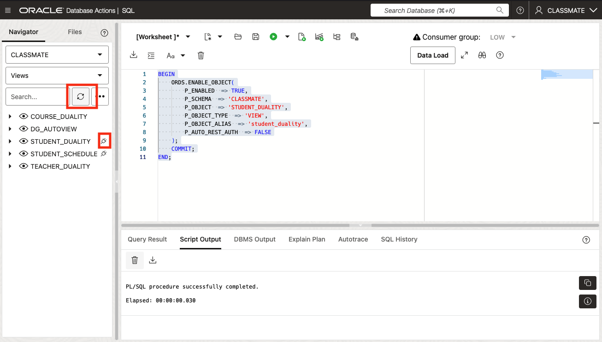
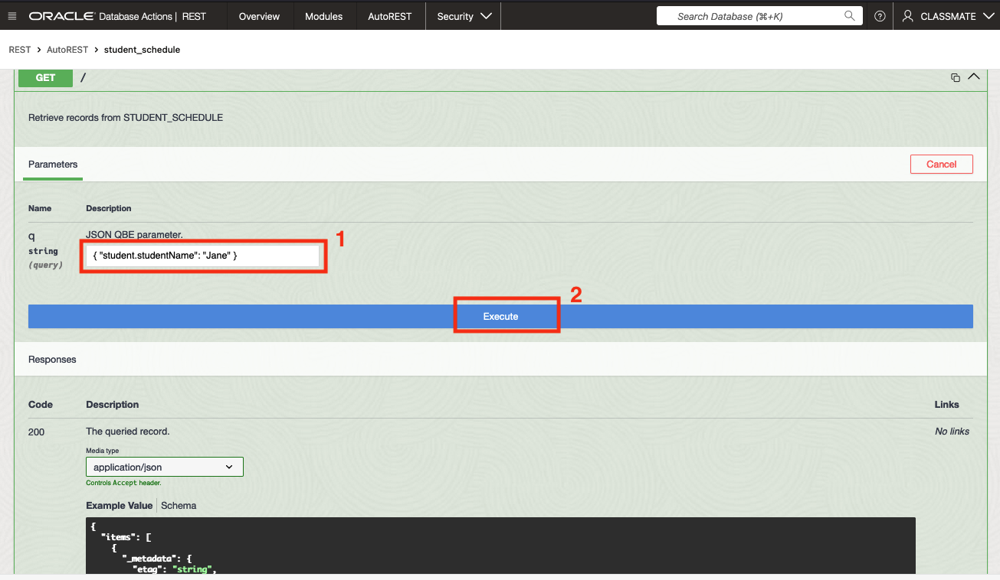
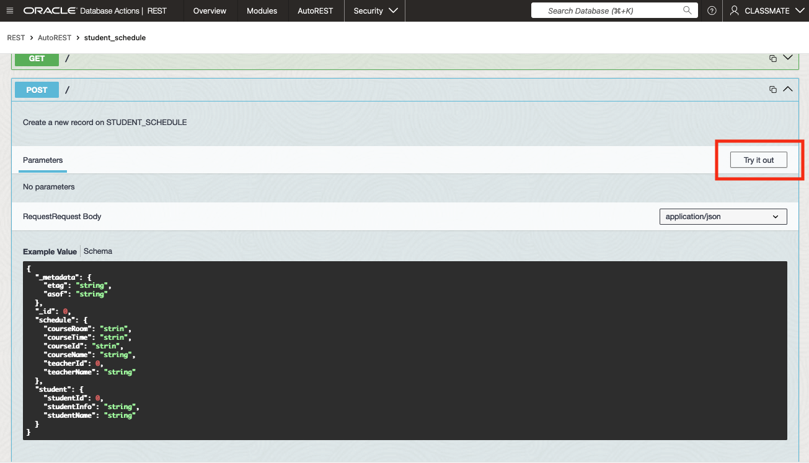
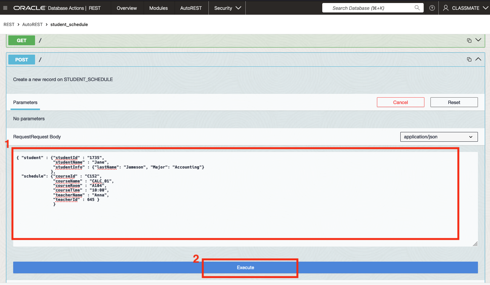
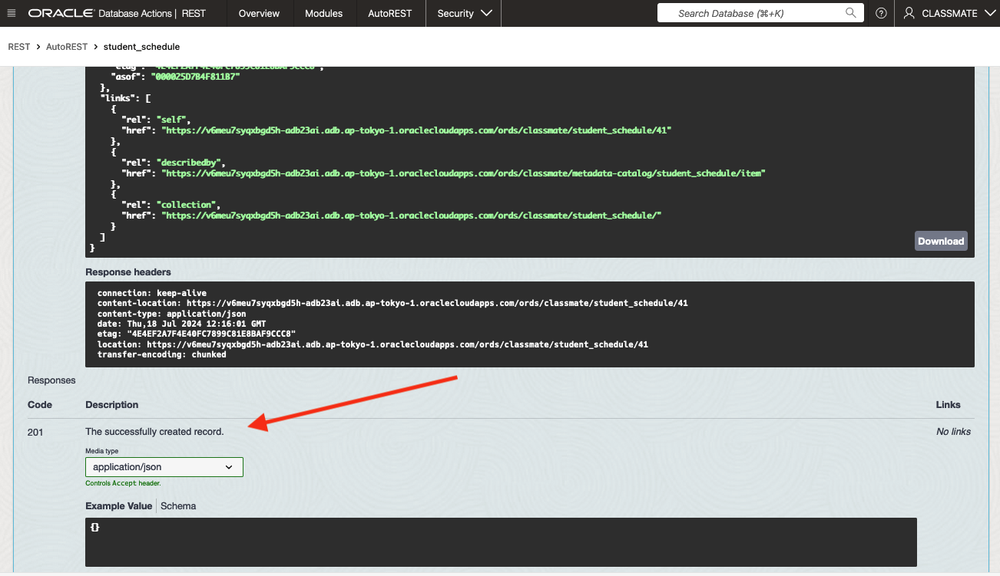

# Populate, Query, and Update Duality Views with REST

## Introduction

In this lab we will take a look at populating, querying, and updating Duality Views in the Oracle 23ai database using REST calls. You will see how you can use REST calls to upload data into the database using JSON documents with a POST call. It's important to note that when you make a POST request directly to a Duality View, the data is not stored within the view itself. Instead, the inserted data is stored in the underlying tables that make up the view.

Estimated Time: 10 minutes

[Lab 5](videohub:1_l54mu3jg)

### Objectives

In this lab, you will:

- REST-enable a Duality View 
- Query documents via GET
- Insert a document via POST


### Prerequisites

This lab assumes you have:

- Oracle Autonomous Database 23ai provisioned.
- Created and populated the CLASSMATE schema tables.
- Already created the `student_schedule` Duality View.

## Task 1: Use OpenAPI to run REST Calls in the Autonomous Database console

The Oracle Autonomous Database Actions | SQL tool makes it very easy to REST-enable your views. You can also use the OpenAPI within the tool to query your REST-enabled views with a graphical user interface (GUI). In this lab you will learn how to use the IDE:

1. The first step is to enable REST for our Duality Views. For this, we'll Use the Oracle Database Actions Navigator on the left of the screen. Click the drop-down arrow for the box showing **"Tables**", and select **Views**. Refer to the picture below.

  

   After switching the Navigator to display Views you should see-

  

2. Right click on the `STUDENT_SCHEDULE`, hover the mouse over **REST** and click **Enable** if it isn't already enabled. 
   
   If it is already enabled, it will say Disable... instead.
   
   If you see Disable... you don't have to do anything and can Skip ahead to Step number 5.

    **NOTE**: If you are running macOS, you may need to press the *control-key* while clicking the name of the view for the side panel to appear. 

  


3. The REST Enable Object side panel will appear. Select **Enable** to continue.

   

   After clicking **Enable** at the bottom of the pane, a "Confirmation" will pop-up temporarily at the bottom of the screen. Also a "plug-icon" will be displayed beside the `student_schedule` Duality View to indicate that is now REST-Enabled.  

   

4. Lets do the same thing for the `STUDENT_DUALITY` duality view, but this time using PL/SQL. Copy the following code and Select **Run Script**.

    ```
    <copy>
    BEGIN
        ORDS.ENABLE_OBJECT(
            P_ENABLED  => TRUE,
            P_SCHEMA  => 'CLASSMATE',
            P_OBJECT  => 'STUDENT_DUALITY',
            P_OBJECT_TYPE  => 'VIEW',
            P_OBJECT_ALIAS  => 'student_duality',
            P_AUTO_REST_AUTH  => FALSE
        );
        COMMIT;
    END;
    </copy>
    ```
    
 
    After the script completes running, click the **refresh-ICON** and you should see the following icon appear alongside the `STUDENT_DUALITY` view.

   


5. Click on the pancake menu in the upper left-hand corner of the Database Actions page to display the  the *Development* menu, then click on **REST**.

   Click the Pancake Menu.

   

   Click the **REST** menu selection.

   

   Click the **AUTOREST** tile.

   

6. Next, for the `student_schedule` view, click the three dots on the right and select **OpenAPI View**. 

   

7. Here, you can see the automatically configured REST calls that were enabled on the view.

    Expand the **GET** section. 

    

8. By default, this section shows sample parameters and responses. However, you can use it to try out the calls themselves.

    Click on **Try it out**. 

    

9. In the **q** field, enter the following query parameters: 

    ```
    <copy>{ "student.studentName": "Jane" }</copy>
    ```

   Click **Execute** to run the REST call with the given parameters. 


    

10. After the executing the REST call you should see in the **Responses** section that OpenAPI has built the call for you. You can see the cURL command and the request URL built from the query parameters you provided. Additionally, you can see the response from the server below, displaying student schedule for the "Jane".

    


## Task 2: Use POST REST Calls

1. Similar to the previous labs, let's add a new entry to our `student_schedule` Duality View. This time, we will use the POST section.

    Expand the **POST** section by clicking on the drop-down arrow.

    


2. Like the GET section, the POST section shows sample parameters and responses. Click on **Try it out** to test the calls.

    Click on **Try it out**. 
    

3. In the request body section, copy and paste the following code-

    ```
    <copy>
    { "student" : {"studentId" : "1735",
                   "studentName" : "Jane",
                    "studentInfo" : {"lastName": "Jameson", "Major": "Accounting"}
              },
      "schedule": {"courseId" : "C152",
                   "courseName" : "CALC_01",
                   "courseRoom" : "A104",
                   "courseTime" : "10:00",
                   "teacherName" : "Anna",
                   "teacherId" : 645 }
            }
    </copy>
    ```
   After pasting the code in the request body pane, click **Execute** - 

   

4. After executing the POST request, you will receive a response indicating that the entry was successfully added to the `student_schedule` Duality View.


   

5. We can now return to the database to see the new entry in the `student_schedule`. 

   Click the "pancake-menu" in the top lefthand corner of the screen and click **SQL** from the drop-down menu to return to the SQLDeveloper Web console.

   

6. For the first query,  view the `student_schedule` Duality View by running the following query-

   ```
   <copy>
   SELECT * FROM student_schedule ORDER BY 1 
   </copy>
   ```

   You should see the newly inserted row in the `student_schedule` Duality View.

   

   **NOTE:** Feel free to try this query using the PRETTY format to see the entry in the JSON document format.

7. We can also view the underlying `student_courses` table to see the newly inserted row by running the following query-

   ```
   <copy>
   SELECT * FROM student_courses ORDER BY 1 
   </copy>
   ```

   You should see the newly inserted row in the `student_courses` table.

   

Congratulations! You have now finished the workshop. We hope you enjoyed it.

In summary, this lab show-cased the versatility of JSON Relational Duality Views, which provide the ability to seamlessly work with data in both JSON Document format and SQL Relational format. The changes made through these views are automatically synchronized with the corresponding documents and tables. This flexibility empowers developers to perform create, read, update, and delete operations efficiently across multiple documents and tables, streamlining data management and enhancing productivity.


## Learn More

* [Oracle Database 23ai Feature Highlights](https://www.oracle.com/database/23ai/?source=v1-DBFree-ChatCTA-j2032-20240709)
* [Oracle Database 23ai Online Documentation](https://docs.oracle.com/en/database/oracle/oracle-database/23/index.html)
* [Oracle Developer Guide: Oracle JSON Relational Duality View Overview](https://docs.oracle.com/en/database/oracle/oracle-database/23/jsnvu/overview-json-relational-duality-views.html)
* [JSON Relational Duality: The Revolutionary Convergence of Document, Object, and Relational Models](https://blogs.oracle.com/database/post/json-relational-duality-app-dev)
* [JSON Duality View documentation](https://docs.oracle.com/en/database/oracle/oracle-database/23/jsnvu/index.html)
* [Blog: Key benefits of JSON Relational Duality](https://blogs.oracle.com/database/post/key-benefits-of-json-relational-duality-experience-it-today-using-oracle-database-23c-free-developer-release)
* [ORDS Documentation](https://docs.oracle.com/en/database/oracle/oracle-rest-data-services/24.2/index.html)


## Acknowledgements
* **Author** - Sean Stacey, Oracle Database Product Management
* **Contributors** - Killian Lynch, Oracle Database Product Management
* **Last Updated By/Date** - Sean Stacey, Oracle Database Product Management, July 2024

