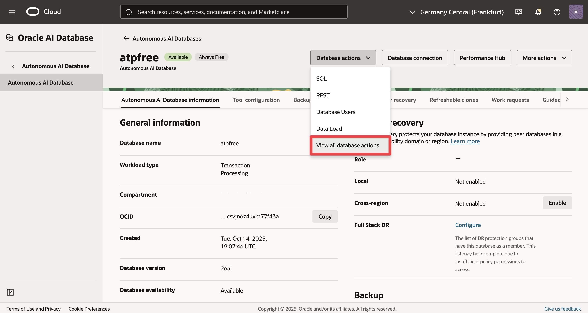
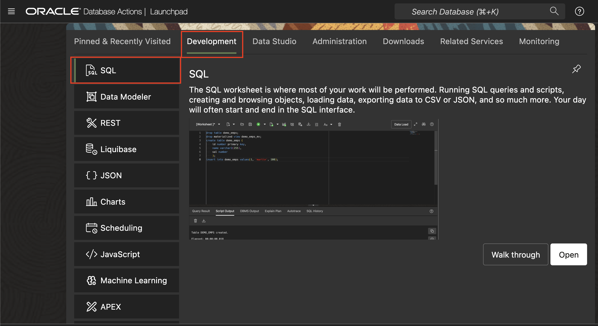
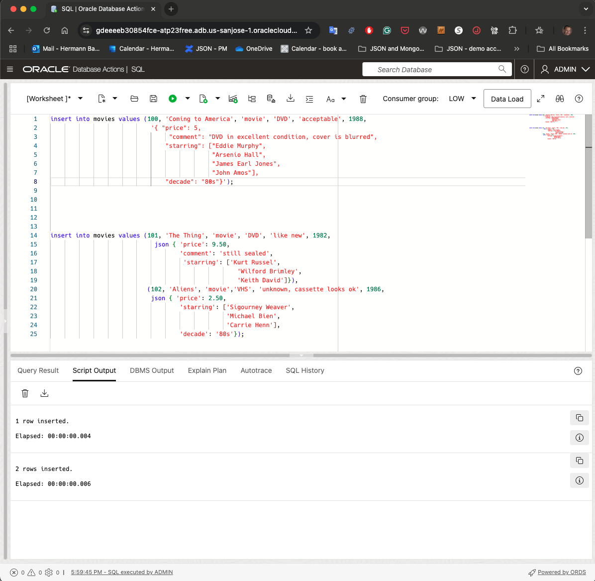
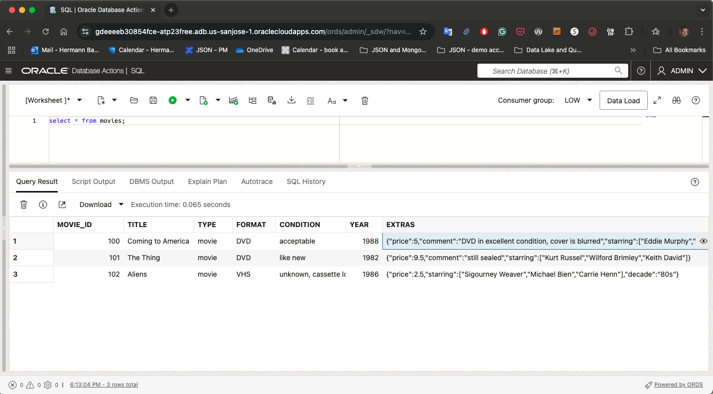
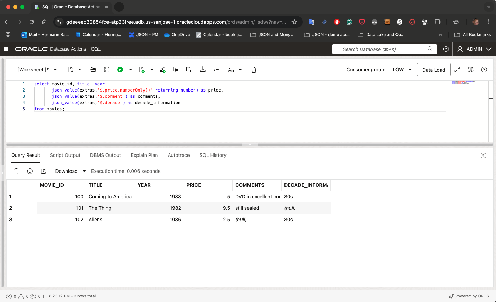

# Schema flexibility for relational tables with the JSON datatype

## Introduction

Oracle Database provides native JSON support, enabling the storage, indexing, and querying of JSON documents directly within standard relational tables. This native JSON datatype allows developers to manage schema-flexible data efficiently, making it easy to accommodate evolving data models without predefined relational schemas. Users benefit from Oracle’s powerful SQL/JSON query capabilities, blending structured and semi-structured data seamlessly.

Estimated Time: 15 minutes

### Objectives

In this lab, you will:

* Create a relational table using the JSON datatype for one of its columns
* Use SQL/JSON to work with the JSON column
* Understand the JSON extended datatypes

### Prerequisites

- An Oracle Autonomous Database 23ai or any Oracle Database 23ai. Note that if you don't use Oracle Autonomous Database, you have to manually install and configure Oracle Rest Data Services (ORDS) to use the JSON IDE used in this lab.

## Task 1: Create a relational table with a JSON column

1. Navigate to your Database by selecting **Oracle Database**, then **Autonomous Database**. Ensure you're in the correct compartment for the resource. Click the database display name to open the details page.

	

1. Click in the *Database Actions* dropdown list and select **View all database actions**

	


2. Below you can find the Database Actions homepage.

	


3. On the homepage, click the SQL tile under Development.

	

4. Create a table **movies** that consists of relational columns and one JSON colum.

	```
	<copy>
	create table if not exists movies (
		  movie_id number primary key
		, title      varchar2(100) not null 
		, type       varchar2(100) 
		, format     varchar2(100)
		, condition  varchar2(100)
		, year       number
		, extras     JSON
	);
	</copy>
	```

	You can see that you create this table just like any other table. JSON is just another native datatype of the Oracle database. You could become more specific and create the JSON datatype with one of the following JSON column modifiers:
	- JSON
	- JSON (object)
	- JSON (scalar)
	- JSON (array)

	If you specify any of the modifiers, the database will not only enforce proper JSON, but also the type of the JSON column modifier you have chosen. For our example we chose not to define a specific modifier.

	

## Task 2: Insert Documents

1. Let us now insert some data into our table, using normal SQL.

	```
	<copy>
	insert into movies values (100, 'Coming to America', 'movie', 'DVD', 'acceptable', 1988,
								'{ "price": 5,
    							 	"comment": "DVD in excellent condition, cover is blurred",
    								"starring": ["Eddie Murphy", 
												 "Arsenio Hall", 
												 "James Earl Jones", 
												 "John Amos"],
    								"decade": "80s"}');
	</copy>
	```

	As you see, it looks like a normal SQL INSERT statement. The only difference is that we specified a proper JSON document as input for our column EXTRAS. Copy the SQL statement and execute it in the SQL worksheet.

	Let us insert some more records. We will also use the JSON() constructor in this example and insert two rows in one go.

	```
	<copy>
	insert into movies values (101, 'The Thing', 'movie', 'DVD', 'like new', 1982,
								 json { 'price': 9.50,
										'comment': 'still sealed',
										 'starring': ['Kurt Russel',
										  			  'Wilford Brimley',
										  			  'Keith David']}),
							   (102, 'Aliens', 'movie','VHS', 'unknown, cassette looks ok', 1986,
    							json { 'price': 2.50,
									    'starring': ['Sigourney Weaver',
											         'Michael Bien',
											         'Carrie Henn'],
									    'decade': '80s'});
	</copy>
	```

	

When you compare the rows you just inserted, you will see that they do not have the same information in the JSON column. Some have a decade information, but one record does not store this information. Your documents can vary completely with the information you are storing in your JSON column.


## Task 3: Query your data

Your table now consists of relational column and a JSON column, as you will see when querying your data. While you can present the data obviously as JSON, the most common usage is probably to use a SQL/JSON operator to extract the known and common scalar values of your JSON documents to represent all relevant information as relational scalar values.

1. First, query your table as-is and see the mixed result set of relational columns and JSON objects:

	```
	<copy>
	select * from movies;
	</copy>
	```

	

	**Note**: Depending on the SQL client you are using, you might not get a textual representation of the JSON column EXTRAS back. Ultimately, this information is stored in a binary format on disk. If your SQL client happens to return gibberish or something like '[BLOB]', use the following SQL command to serialize the JSON information into a textual representation

	```
	<copy>
	select movie_id, title, type, format, condition, year, 
			json_serialize(extras) as extras
	from movies;
	</copy>
	```


2.  Now let's use the ANSI standard SQL/JSON operator JSON_VALUE() to extract the common JSON attributes of interest. You will see that the result set is completely relational.

	```
	<copy>
	select movie_id, title, year, 
       json_value(extras,'$.price.numberOnly()' returning number) as price,
       json_value(extras,'$.comment') as comments,
       json_value(extras,'$.decade') as decade_information
	from movies;
	</copy>
	```

	

	If the shape of your data has "settled" over time and you have identified the most common attributes you are using, you can easily wrap such a statement into a view and encapsulate the JSON object completely for any application. We are going to skip that part, but feel free to explore this yourself.


## Task 4: Extended scalar values in textual JSON objects

If you looked closely at the SQL examples in the previous sections you might have spotted that we were using some item methods in the example before to extract only numbers from our field **price** in our JSON column. As you know, with schema flexibility comes the risk of non-conformant (dirty) data.

As you might know, the JSON standard supports only a simple set of data types optimized for readability and ease of use, enabling straightforward data exchange and schema flexibility. These are:
	•	String: Text enclosed within double quotes, e.g., "hello world".
	•	Number: Integers or floating-point numbers, e.g., 42 or 3.14.
	•	Boolean: Logical true or false values, true or false.
	•	Array: Ordered lists of values enclosed in brackets [ ], e.g., [1, 2, 3].
	•	Object: Collections of key-value pairs enclosed in curly braces { }, e.g., {"name": "Alice"}.
	•	Null: Indicates an empty or undefined value, represented as null.

**So how do we handle datatypes in general in JSON columns?**

Native binary JSON data (OSON format) extends the JSON language by adding scalar types, such as date, that correspond to SQL types and are not part of the JSON standard. Oracle Database also supports the use of textual JSON objects that represent JSON scalar values, including such nonstandard values.

When you create native binary JSON data from textual JSON data that contains such extended objects, they can optionally be replaced with corresponding (native binary) JSON scalar values.

Let's insert another movie quickly and use the extended textual representation. If you do not specify a native binary datatype, then the values will be simply converted as-is to the matching JSON datatype.

1. Issue the following update statement that will add another json attribute to our movie **Aliens** using the extended scalar type system and an attribute to movies **The Thing** without using:

	```
	<copy>
	update movies set extras = json_transform(extras, 
	                           set '$.released' = DATE '1986-07-18') 
	where movie_id = 102;

	update movies set extras = json_transform(extras, 
	                           set '$.released' = '1982-06-25') 
	where movie_id = 101;
	</copy>
	```
	

	Now let's query the extras column for this movie using JSON_SERIALIZE() exposing the extended datatype information

	```
	<copy>
	select title, json_serialize(extras extended) from movies 
	where movie_id in (101,102);

	select title, json_value(extras,'$.released.type()') from movies 
	where movie_id in (101,102);
	</copy>
	```
	You'll see that we only have the extended datatype information **$oracleDate** for attributes that we explicitly classified as such. Others were just mapped as-is to conformant basic JSON standard types. 

	

	Now what does this mean? Does this render the date for the movie **The Thing* unusable as date? No, it does not. Just specify the return type of the SQL/JSON operator, and you are back in business (assuming that the conversion is successful, otherwise the default behavior of RETURN NULL ON ERROR will kick in).

	```
	<copy>
	select title, json_value(extras,'$.released' returning date) from movies 
	where movie_id in (101,102);
	</copy>
	```
	

## Task 5: Cleanup

We have experienced our table **movies** with w set of relational and JSON columns. We are going to look into the movies data in the next lab using a native JSON Collection Table, so let's clean up for the next exercise:

```
<copy>
drop table movies purge;
</copy>
```

There is obviously way more to the JSON datatype and how to effectively work with the JSON datatype, both as a column of a relational table and as JSON Collections. If you want to learn more about the JSON data type, check out the link below.

You may now proceed to the next lab.

## Learn More

* [JSON Data Type](https://docs.oracle.com/en/database/oracle/oracle-database/23/adjsn/json-data-type.html)
* [Extended Scalar Values](https://docs.oracle.com/en/database/oracle/oracle-database/23/adjsn/json-data-type.html#GUID-911D302C-CFAF-406B-B6A5-4E99DD38ABAD)


## Acknowledgements

* **Author** - Hermann Baer
* **Contributors** -  Beda Hammerschmidt
* **Last Updated By/Date** - Hermann Baer, April 2025