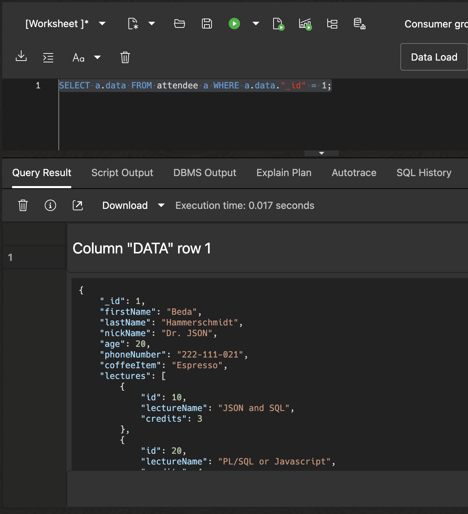
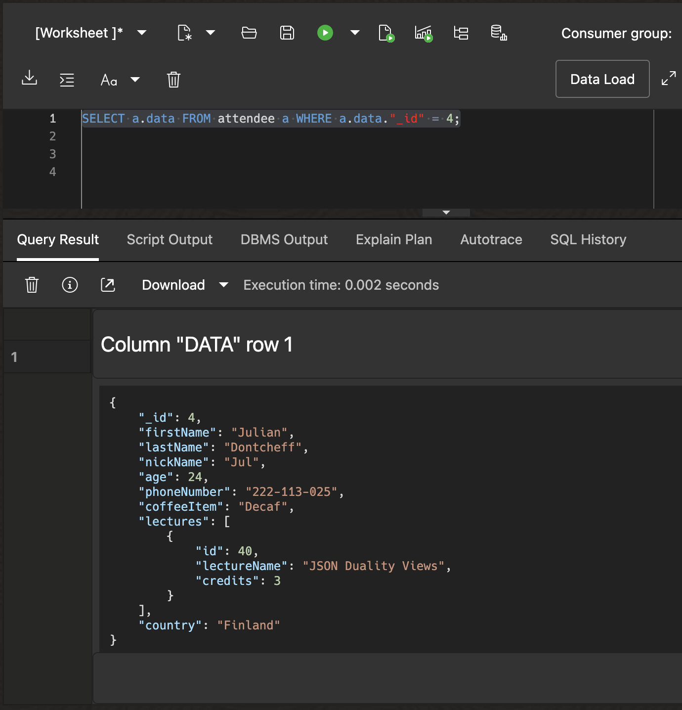
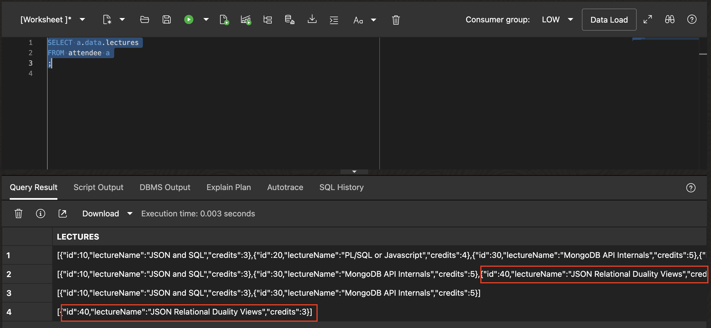

# Introduction to JSON Collections

## Introduction

This lab walks you through the steps to create and access JSON collections in the Oracle database.

Estimated Lab Time: 10 minutes

### About JSON Collections

JSON collections are database objects that store or otherwise provide a set of JSON documents. Client applications typically use operations provided by document APIs to manipulate collections and their documents. They can also use SQL to do so. In Oracle Database, a JSON collection is a special table or view that provides JSON documents in a single JSON-type object column named DATA. In this lab, we will be using JSON collection tables.

### Objectives

In this lab, you will:

* Learn how to create a JSON collection table
* Learn how to access JSON collection tables
* Learn about schema flexibility in JSON collections
* Learn about the data duplication problem with JSON collections

### Prerequisites

* Oracle Autonomous Database 23ai provisioned or one running in a LiveLabs environment

## Task 1: Create a JSON Collection and Load Data

In this task, we will create a JSON collection table called `attendee` that represents a collection of attendees for a database conference.

1. Click in the *Database Actions* dropdown list and select **View all database actions**

   


2. Below you can find the Database Actions homepage. Click the SQL tile under development to open the SQL worksheet.

   

3. In the SQL worksheet, create the `attendee` collection. 

      Copy the SQL below and press the 'run script' button.

      ```sql
      <copy>
      DROP TABLE IF EXISTS attendee;
      CREATE JSON COLLECTION TABLE IF NOT EXISTS attendee;
      </copy>
      ```

      

      This creates a table with a single JSON-type object column named `DATA`. Because it's ultimately "just a table", you can use a JSON collection table in most of the ways that you use a regular table. In particular, you can use GoldenGate to replicate a collection table between databases, including between Oracle Database and JSON document databases, such as MongoDB.

4. Insert data into the `attendee` collection.

      Copy the SQL below and press the 'run script' button.

      ```sql
      <copy>
      INSERT INTO attendee VALUES
      ('{"_id"          : 1,
         "firstName"    : "Beda",
         "lastName"     : "Hammerschmidt",
         "nickName"     : "Dr. JSON",
         "age"          : 20,
         "phoneNumber"  : "222-111-021",
         "coffeeItem"   : "Espresso",
         "lectures" : [ {"id" : 10, "lectureName" : "JSON and SQL", "credits" : 3},
                        {"id" : 20, "lectureName" : "PL/SQL or Javascript", "credits" : 4},
                        {"id" : 30, "lectureName" : "MongoDB API Internals", "credits" : 5},
                        {"id" : 50, "lectureName" : "Oracle ADB on iPhone", "credits" : 3},
                        {"id" : 40, "lectureName" : "JSON Duality Views", "credits" : 3} ]}');
      INSERT INTO attendee VALUES
      ('{"_id"          : 2,
         "firstName"    : "Hermann",
         "lastName"     : "Baer",
         "age"          : 22,
         "phoneNumber"  : "222-112-023",
         "coffeeItem"   : "Cappuccino",
         "lectures" : [ {"id" : 10, "lectureName" : "JSON and SQL", "credits" : 3},
                        {"id" : 30, "lectureName" : "MongoDB API Internals", "credits" : 5},
                        {"id" : 40, "lectureName" : "JSON Duality Views", "credits" : 3} ]}');
      INSERT INTO attendee VALUES
      ('{"_id"           : 3,
         "firstName"     : "Shashank",
         "lastName"      : "Gugnani",
         "nickName"      : "SG",
         "age"           : 23,
         "phoneNumber"   : "222-112-024",
         "coffeeItem"    : "Americano",
         "lectures" : [ {"id" : 10, "lectureName" : "JSON and SQL", "credits" : 3},
                        {"id" : 30, "lectureName" : "MongoDB API Internals", "credits" : 5} ]}');
      INSERT INTO attendee VALUES
      ('{"_id"          : 4,
         "firstName"    : "Julian",
         "lastName"     : "Dontcheff",
         "nickName"     : "Jul",
         "age"          : 24,
         "phoneNumber"  : "222-113-025",
         "coffeeItem"   : "Decaf",
         "lectures" : [ {"id" : 40, "lectureName" : "JSON Duality Views", "credits" : 3} ]}');

      COMMIT;
      </copy>
      ```

   As you see, it looks like a normal SQL `INSERT` statement. The only difference is that we specified a proper JSON document as input for our DATA column. Copy the SQL statement and execute it in the SQL worksheet.

## Task 2: Access a JSON Collection

1. Find a document in the `attendee` collection

      ```sql
      <copy>SELECT a.data FROM attendee a WHERE a.data."_id" = 1;</copy>
      ```

      

      **Tip:** If you get to the end of a long JSON column, you will see an eye. If you click on that eye, you will see your JSON document in a separate window in pretty format.
      
      

      
      We can also select specific fields within the JSON document by using the dot notation to peek inside the document.

      ```sql
      <copy>
      SELECT a.data.lastName || ', ' || a.data.firstName as name,
            a.data.nickName as nick_name
      FROM attendee a
      WHERE a.data."_id" = 1;
      </copy>
      ```

      

2. Add a field to an existing document. We will add a `country` field to Julian's attendee document to specify his country of origin.

      Copy the SQL below in the SQL worksheet and run it.

      ```sql
      <copy>
      UPDATE attendee a
      SET a.data = JSON_TRANSFORM(a.data, SET '$.country' = 'Finland')
      WHERE a.data."_id" = 4;

      COMMIT;
      </copy>
      ```

3. Query the updated document. It should now contain the `country` field, which can also be queried using dot notation.

      ```sql
      <copy>SELECT a.data FROM attendee a WHERE a.data."_id" = 4;</copy>
      ```

      

      ```sql
      <copy>
      SELECT a.data.lastName || ', ' || a.data.firstName as name,
            a.data.nickName as nick_name,
            a.data.country as country
      FROM attendee a
      WHERE a.data."_id" = 4;
      </copy>
      ```

      

## Task 3: Update Shared Information

In this task, we will update lecture name for lecture id 40, from "JSON Duality Views" to "JSON Relational Duality Views". Since lecture information is duplicated across multiple attendee documents, we must update the lecture name in all documents containing that lecture.

1. Find all document that contain lecture id 40. We will use a `JSON_EXISTS` predicate to find all such documents.

      ```sql
      <copy>
      SELECT data
      FROM attendee
      WHERE JSON_EXISTS(data, '$.lectures[*]?(@.id == 40)');
      </copy>
      ```
      You will see three records returned. For legibility we expanded one of the three records to show the redundant information about lecture 40 in one JSON document.

      

2. Update the lecture name in all documents containing lecture id 40. We will use a `JSON_EXISTS` predicate to find all such documents, then use `JSON_TRANSFORM` to update the lecture name only for the matching lecture id.

      ```sql
      <copy>
      UPDATE attendee
      SET data = JSON_TRANSFORM(
         data,
         SET '$.lectures[*]?(@.id == 40).lectureName' = 'JSON Relational Duality Views'
      )
      WHERE JSON_EXISTS(data, '$.lectures[*]?(@.id == 40)');

      COMMIT;
      </copy>
      ```

   This statement updates three documents, each of which references lecture id 40. **Note that we needed to update three documents to correct the lecture name for all our attendees.**

3. Select all documents from the view to see the updated documents.

   ```sql
   <copy>
   SELECT data
   FROM attendee;
   </copy>
   ```

   You can scroll through the documents or drill down into the detail of individual documents. For illustration purposes we highlight two of the changed entries in the screenshot below. (We actually updated three documents before, so you will find the third one when scrolling to the right.)

   

   We can see that the lecture name for lecture id 40 has now been updated consistently everywhere. It is easy to see the problem with JSON collections containing duplicate data - Any update to duplicate data must be managed carefully and kept consistent manually. In the next lab, we will see how duality views effectively solves this problem.

You may now **proceed to the next lab**.

## Learn More

* [JSON Collections](https://docs.oracle.com/en/database/oracle/oracle-database/23/adjsn/json-collections.html)
* [JSON-Relational Duality Views](https://docs.oracle.com/en/database/oracle/oracle-database/23/jsnvu/overview-json-relational-duality-views.html)

## Acknowledgements

* **Author** - Shashank Gugnani
* **Contributors** - Julian Dontcheff
* **Last Updated By/Date** - Shashank Gugnani, August 2025
