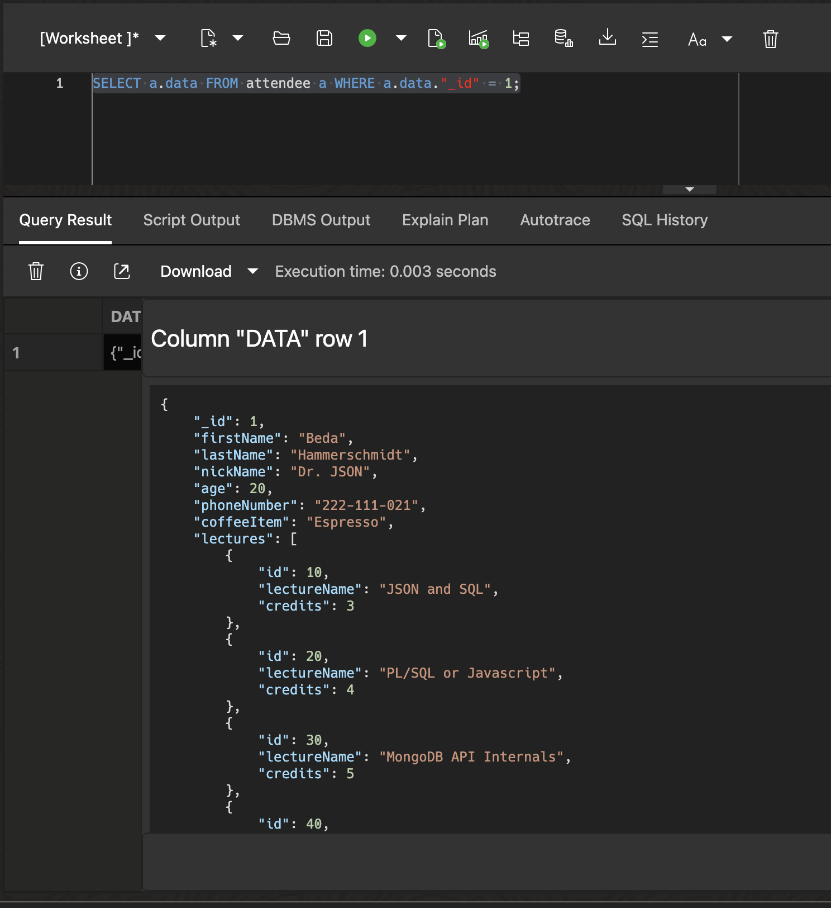
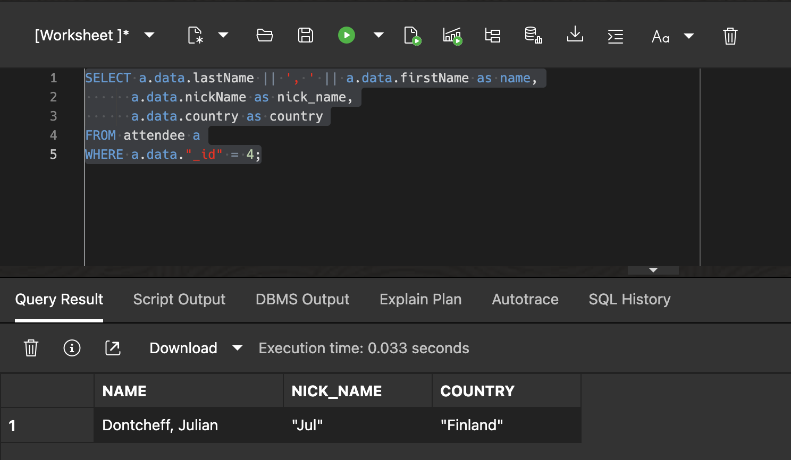
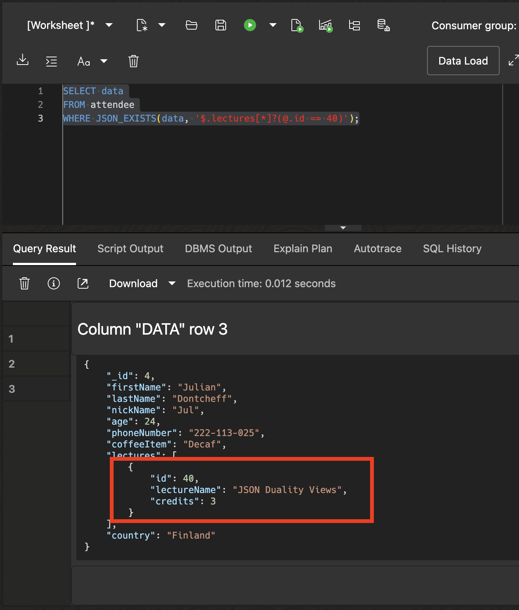

# Introduction to Duality Views

## Introduction

This lab walks you through the steps to create and access Duality Views in the Oracle database.

Estimated Lab Time: 10 minutes

### About Duality Views

A JSON-relational duality view exposes data stored in underlying database tables as collections of JSON documents; it is a mapping between table data and documents. Client applications typically use operations provided by document APIs to manipulate duality views and their documents. They can also use SQL to do so. In Oracle Database, a duality view provides JSON documents in a single JSON-type object column named DATA.

Duality views support schema flexibility using the concept of flex columns. Flex columns are special JSON columns designated to flexibly store unstructured fields, where any unrecognized fields are packed into the flex column on writes. This allows duality views to capture, represent, and expand fields dynamically while maintaining structure and consistency.

### Objectives

In this lab, you will:

* Learn how to create a duality view
* Learn how to access duality views
* Learn about flex field support in duality views
* Learn how to update shared data in duality views

## Task 1: Create a Duality View and Load Data

In this task, we will create a duality view called `attendee` that represents a collection of attendees for a database conference.

1. Click in the *Database Actions* dropdown list and select **View all database actions**

   


2. Below you can find the Database Actions homepage. Click the SQL tile under development to open the SQL worksheet.

   

3. Create the `attendees` and `lectures` tables using the SQL worksheet, using the 'run script' functionality (or your SQL client of choice). We also need to create a mapping table between attendees and lectures (`map_attendees_to_lectures` tables) to model the many-to-many relationship between them.

      ```sql
      <copy>
      -- cleanup, if needed
      DROP TABLE IF EXISTS map_attendees_to_lectures;
      DROP TABLE IF EXISTS attendees;
      DROP TABLE IF EXISTS lectures;

      -- Attendees table
      CREATE TABLE attendees (
         id            NUMBER GENERATED BY DEFAULT AS IDENTITY PRIMARY KEY,
         first_name    VARCHAR2(50),
         last_name     VARCHAR2(50),
         nick_name     VARCHAR2(50),
         age           NUMBER,
         phone_number  VARCHAR2(50),
         coffee_item   VARCHAR2(100),
         extras        JSON(Object)   -- Stores flexible additional attributes
      );

      -- Lectures table
      CREATE TABLE lectures (
         id          NUMBER GENERATED BY DEFAULT AS IDENTITY PRIMARY KEY,
         name        VARCHAR2(100),
         credits     NUMBER
      );

      -- Mapping table for many-to-many relationship between attendees and lectures
      CREATE TABLE map_attendees_to_lectures (
         attendee_id  NUMBER NOT NULL,
         lecture_id   NUMBER NOT NULL,
         PRIMARY KEY (attendee_id, lecture_id),
         FOREIGN KEY (attendee_id) REFERENCES attendees(id),
         FOREIGN KEY (lecture_id) REFERENCES lectures(id)
      );
      </copy>
      ```

2. Create two duality views - attendee and lectures - that represent the JSON document representation of the two entities we want to look at.

      ```sql
      <copy>
      DROP TABLE IF EXISTS attendee;
      DROP TABLE IF EXISTS lecture;
      DROP VIEW IF EXISTS lecture;
      
      CREATE OR REPLACE JSON DUALITY VIEW attendee AS
      attendees @insert @update @delete
      {
      _id : id,
      firstName : first_name,
      lastName : last_name,
      nickName : nick_name,
      age,
      phoneNumber : phone_number,
      coffeeItem : coffee_item,
      lectures : map_attendees_to_lectures @insert @update @delete
      [{
         lectures @unnest @insert @update
         {
            id,
            lectureName : name,
            credits
         }
      }]
      extras @flex
      };

      CREATE OR REPLACE JSON DUALITY VIEW lecture AS
      lectures @insert @update @delete
      {
         _id: id,
         lectureName: name,
         lectureCredtis: credits
      };
      </copy>
      ```

   Note how the view definition uses GraphQL-like what-you-see-is-what-you-get syntax which makes it easy to determine what the view output will look like.

3. Insert data into the attendee duality view.

      ```sql
      <copy>
      INSERT INTO attendee VALUES
      ('{"_id"          : 1,
         "firstName"    : "Beda",
         "lastName"     : "Hammerschmidt",
         "nickName"     : "Dr. JSON",
         "age"          : 20,
         "phoneNumber"  : "222-111-021",
         "coffeeItem"   : "Espresso",
         "lectures" : [ {"id" : 10, "lectureName" : "JSON and SQL", "credits" : 3},
                        {"id" : 20, "lectureName" : "PL/SQL or Javascript", "credits" : 4},
                        {"id" : 30, "lectureName" : "MongoDB API Internals", "credits" : 5},
                        {"id" : 50, "lectureName" : "Oracle ADB on iPhone", "credits" : 3},
                        {"id" : 40, "lectureName" : "JSON Duality Views", "credits" : 3} ]}');
      INSERT INTO attendee VALUES
      ('{"_id"          : 2,
         "firstName"    : "Hermann",
         "lastName"     : "Baer",
         "age"          : 22,
         "phoneNumber"  : "222-112-023",
         "coffeeItem"   : "Cappuccino",
         "lectures" : [ {"id" : 10, "lectureName" : "JSON and SQL", "credits" : 3},
                        {"id" : 30, "lectureName" : "MongoDB API Internals", "credits" : 5},
                        {"id" : 40, "lectureName" : "JSON Duality Views", "credits" : 3} ]}');
      INSERT INTO attendee VALUES
      ('{"_id"           : 3,
         "firstName"     : "Shashank",
         "lastName"      : "Gugnani",
         "nickName"      : "SG",
         "age"           : 23,
         "phoneNumber"   : "222-112-024",
         "coffeeItem"    : "Americano",
         "lectures" : [ {"id" : 10, "lectureName" : "JSON and SQL", "credits" : 3},
                        {"id" : 30, "lectureName" : "MongoDB API Internals", "credits" : 5} ]}');
      INSERT INTO attendee VALUES
      ('{"_id"          : 4,
         "firstName"    : "Julian",
         "lastName"     : "Dontcheff",
         "nickName"     : "Jul",
         "age"          : 24,
         "phoneNumber"  : "222-113-025",
         "coffeeItem"   : "Decaf",
         "lectures" : [ {"id" : 40, "lectureName" : "JSON Duality Views", "credits" : 3} ]}');

      COMMIT;
      </copy>
      ```

   As you see, it looks like a normal SQL INSERT statement. The only difference is that we specified a proper JSON document as input for our DATA column. Copy the SQL statement and execute it in the SQL worksheet.

## Task 2: Access a Duality View

1. Find a document in the `attendee` collection

      ```sql
      <copy>SELECT a.data FROM attendee a WHERE a.data."_id" = 1;</copy>
      ```

      

      We can also select specific fields within the JSON document by using the dot notation to peek inside the document.

      ```sql
      <copy>
      SELECT a.data.lastName || ', ' || a.data.firstName as name,
            a.data.nickName as nick_name
      FROM attendee a
      WHERE a.data."_id" = 1;
      </copy>
      ```

      

2. Add a field to an existing document. We will add a `country` field to Julian's attendee document to specify his country of origin. This field gets stored in the `extras` flex JSON column since it is not mapped to any column in the attendees table.

      ```sql
      <copy>
      UPDATE attendee a
      SET a.data = JSON_TRANSFORM(a.data, SET '$.country' = 'Finland')
      WHERE a.data."_id" = 4;

      COMMIT;
      </copy>
      ```

3. Query the updated document. It should now contain the `country` field, which can also be queried using dot notation just like any other non-flex field.

      ```sql
      <copy>SELECT a.data FROM attendee a WHERE a.data."_id" = 4;</copy>
      ```

      

      ```sql
      <copy>
      SELECT a.data.lastName || ', ' || a.data.firstName as name,
            a.data.nickName as nick_name,
            a.data.country as country
      FROM attendee a
      WHERE a.data."_id" = 4;
      </copy>
      ```

      

4. Query the `attendees` table. The `extras` column holds both the key and value for the `country` field.

      ```sql
      <copy>
      SELECT first_name, last_name, extras
      FROM attendees
      WHERE id = 4;
      </copy>
      ```

      

## Task 3: Update Shared Information

In this task, we will update lecture name for lecture id 40, from "JSON Duality Views" to "JSON Relational Duality Views". lecture information is duplicated across multiple attendee documents. However, duality views use relational tables underneath, so there is a **single row in the lecture table** storing lecture id 40's information, which is shared by all documents.

1. Find all document that contain lecture id 40. We will use a `JSON_EXISTS` predicate to find all such documents.

      ```sql
      <copy>
      SELECT data
      FROM attendee
      WHERE JSON_EXISTS(data, '$.lectures[*]?(@.id == 40)');
      </copy>
      ```

      For illustration purposes, the screenshot shows the detail information of one of the documents.

      

2. Update the lecture name in the equivalent lecture document using `JSON_TRANSFORM` to update the lecture name only for the matching lecture id. 

      This demonstrates one of the big benefits of Json Relational Duality Views. First, we have multiple document representations on top of the same data. As you see here, we expose documents for our lectures, as well as documents for out attendee's schedules. 

      ```sql
      <copy>
      SELECT data FROM lecture l WHERE l.data."_id" = 40;
      </copy>
      ```
      

      Let's now update this document.

      ```sql
      <copy>
      UPDATE lecture l
      SET data = JSON_TRANSFORM(
         data,
         SET '$.lectureName' = 'JSON Relational Duality Views'
      )
      WHERE l.data."_id" = 40;

      COMMIT;
      </copy>
      ```
      

      This statement updates **one lecture document**, as a result of which the row in the lecture table storing lecture id 40's information has been updated. As a result, the updated lecture information is **immediately reflected in all attendee's documents containing it**. This is one of the biggest advantages of duality views - updates to shared data are immediately reflected everywhere they are referenced!

3. Select all documents from the view to see the updated documents.

      ```sql
      <copy>
      SELECT data
      FROM attendee;
      </copy>
      ```
      You can scroll through the documents or drill down into the detail of individual documents. For illustration purposes we highlight two of the changed entries in the screenshot below. (We actually updated three documents before, so you will find the third one when scrolling to the right.)

      

      We can see that the lecture name for lecture id 40 has now been updated consistently everywhere. Updating the data in one place updates it consistently everywhere.

In this lab, we saw how duality views solve the data duplication problem with JSON collections while providing schema flexibility. However, users still need to define the relational schema and duality views upfront. What if the relational schema and duality views could be automatically inferred and created? In the next lab, we will work with the JSON-to-Duality Migrator, which solves exactly this problem!

You may now **proceed to the next lab**.

## Learn More

* [JSON-Relational Duality Views](https://docs.oracle.com/en/database/oracle/oracle-database/23/jsnvu/overview-json-relational-duality-views.html)
* [JSON Collections](https://docs.oracle.com/en/database/oracle/oracle-database/23/adjsn/json-collections.html)

## Acknowledgements

* **Author** - Shashank Gugnani
* **Contributors** - Julian Dontcheff
* **Last Updated By/Date** - Shashank Gugnani, August 2025
