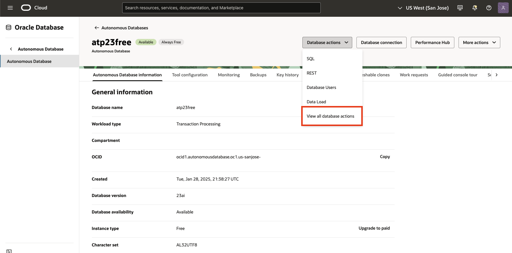
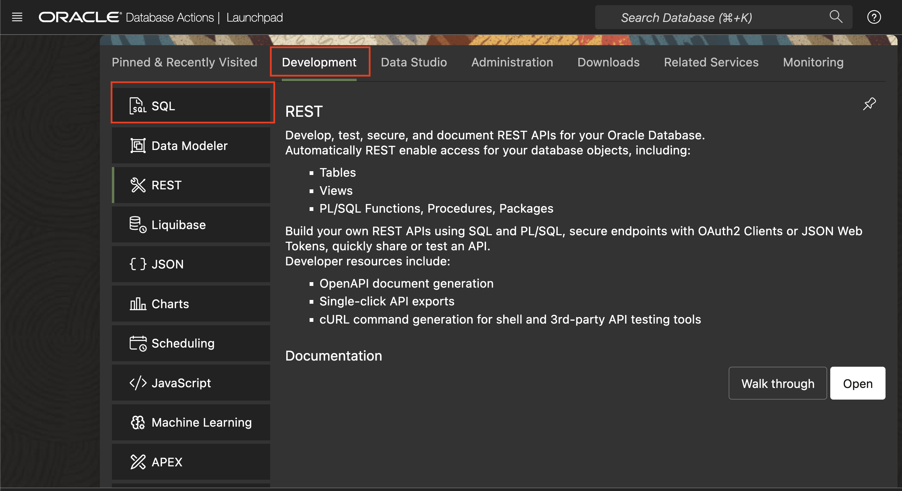
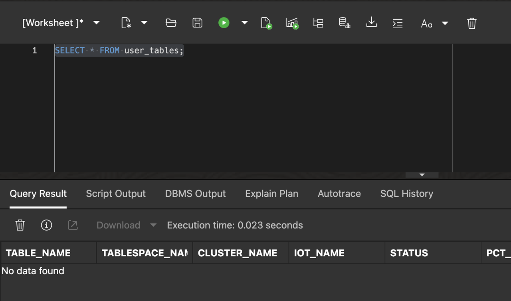
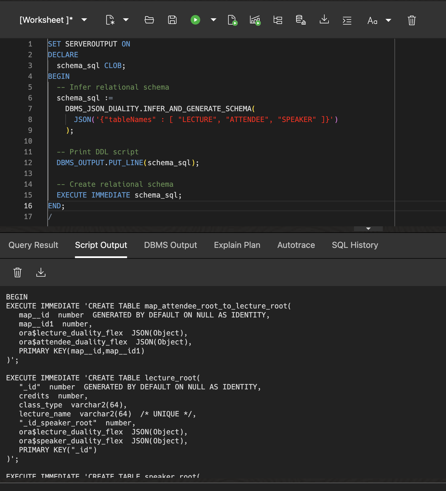
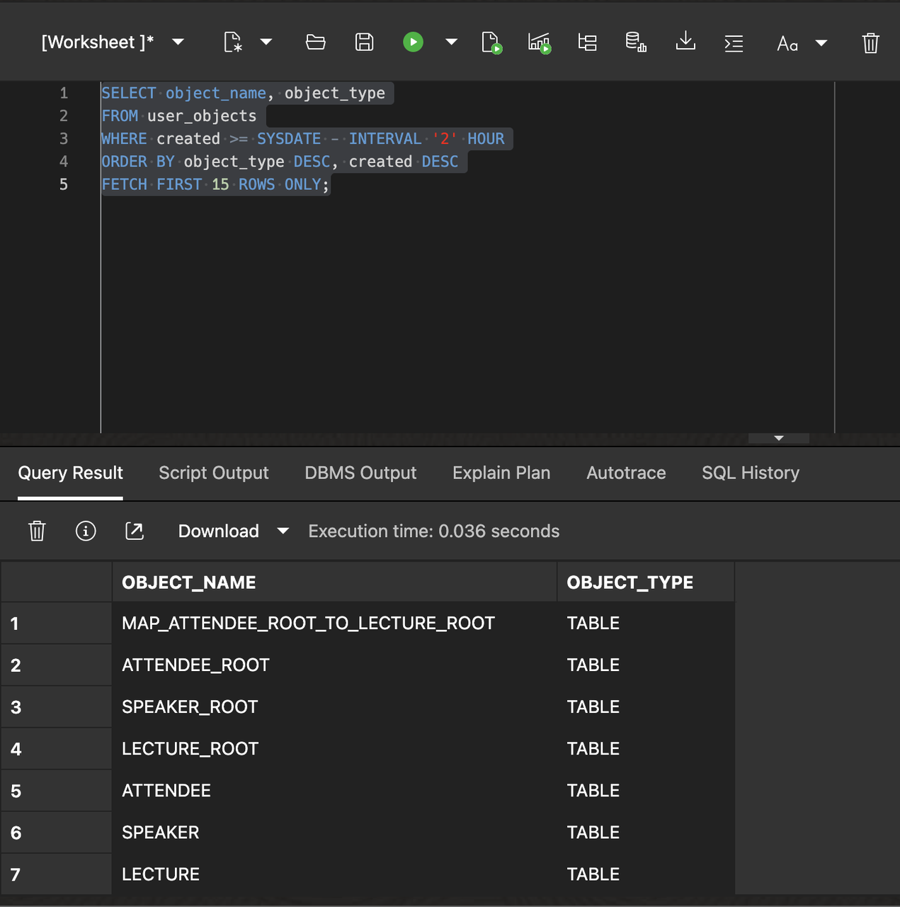
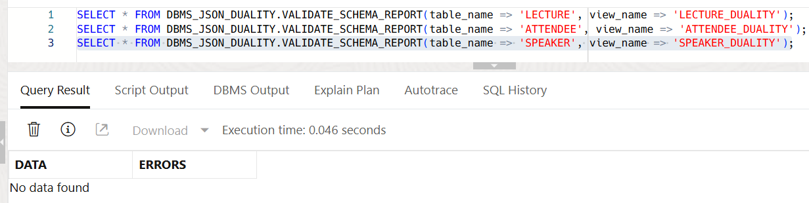
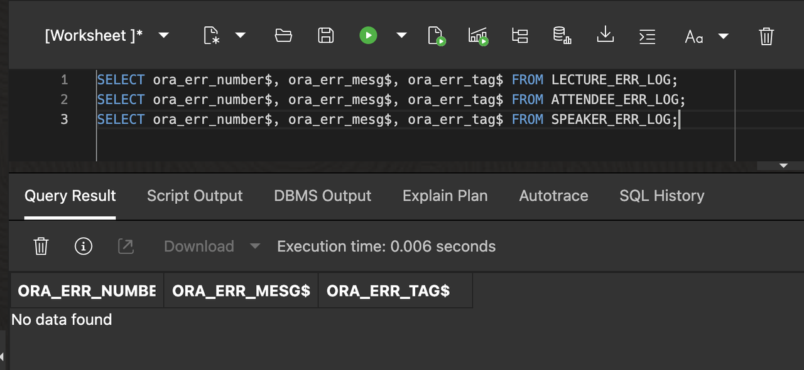

# Introduction to the JSON to Duality Migrator

## Introduction

This lab walks you through the steps to use the JSON to Duality Migrator.

Estimated Lab Time: 15 minutes

### About the JSON to Duality Migrator

The JSON to Duality Migrator addresses the challenge of preserving JSON document semantics in relational schemas. By inferring implicit relationships from document collections, it generates updatable duality views that mirror original JSON structures. This method ensures backward compatibility for applications reliant on document APIs while leveraging relational optimization, such as indexing and ACID compliance. The tool supports iterative refinement, allowing developers to adjust inferred schemas post-migration.

The migrator exposes a set of easy-to-use PL/SQL functions and procedures (part of the `DBMS_JSON_DUALITY` package) to assist with schema inference, schema generation, schema validation, data import, and data validation.

| API                         | Description                                                                                                      |
|-----------------------------|------------------------------------------------------------------------------------------------------------------|
| `infer_schema`              | Infers the relational schema that represents all the input collections                                           |
| `generate_schema`           | Produces the code to create the required database objects for each duality view                                  |
| `infer_and_generate_schema` | Performs both `infer_schema` and `generate_schema`                                                               |
| `validate_schema_report`    | Validates the inferred schema against the input collections                                                      |
| `import_all`                | Imports the existing document collections into the duality views (in fact into the underlying relational tables) |
| `validate_import_report`    | Validates the imported data against the input collections                                                        |
{: title="JSON to Duality Migrator API"}

### Objectives

In this lab, you will:

* Learn how to infer a relational schema using the JSON to Duality Migrator
* Learn how to import data into a duality view using the JSON to Duality Migrator

### Prerequisites

* Oracle Autonomous Database 23ai provisioned or one running in a LiveLabs environment

## Task 1: Create JSON Collections and Load Data

In this task, we will create JSON collection tables `speaker`, `attendee`, and `lecture` that represents collections required for a database conference application.

1. Click in the *Database Actions* dropdown list and select **View all database actions**

   


2. Below you can find the Database Actions homepage. Click the SQL tile under development to open the SQL worksheet.

   


3. Let's now drop all the objects that we created in the previous lab first.

    ```sql
    <copy>
    BEGIN
      FOR t IN (
        SELECT object_name
        FROM user_objects
        WHERE object_type = 'TABLE'
          AND created >= SYSDATE - INTERVAL '2' HOUR
      ) LOOP
        BEGIN
          EXECUTE IMMEDIATE 'DROP TABLE "' || t.object_name || '" CASCADE CONSTRAINTS PURGE';
        EXCEPTION
          WHEN OTHERS THEN
            DBMS_OUTPUT.PUT_LINE('Failed to drop table ' || t.object_name || ': ' || SQLERRM);
        END;
      END LOOP;
    END;
    /
    </copy>
    ```
    This code basically drops all tables that were created in the last 2 hours. If it took you longer to get to this point in the lab, then you need to increase the time window.

    Let's check that there are no objects existent in our schema anymore, or at least no objects that will collide with this workshop.

    ```sql
    <copy>
    SELECT * FROM user_tables;
    </copy>
    ```
   

2. Create the `speaker`, `attendee`, and `lecture` collections.

    ```sql
    <copy>
    DROP VIEW IF EXISTS speaker;
    DROP VIEW IF EXISTS attendee;
    DROP VIEW IF EXISTS lecture;
    DROP TABLE IF EXISTS speaker PURGE;
    DROP TABLE IF EXISTS attendee PURGE;
    DROP TABLE IF EXISTS lecture PURGE;
    CREATE JSON COLLECTION TABLE IF NOT EXISTS speaker;
    CREATE JSON COLLECTION TABLE IF NOT EXISTS attendee;
    CREATE JSON COLLECTION TABLE IF NOT EXISTS lecture;
    </copy>
    ```

3. Insert data into the `speaker`, `attendee`, and `lecture` collections.

    ```sql
    <copy>
    INSERT INTO speaker VALUES
      ('{"_id"            : 101,
          "name"           : "Abdul J.",
          "phoneNumber"    : "222-555-011",
          "yearsAtOracle"  : 25,
          "department"     : "Product Management",
          "lecturesTaught" : [ {"id" : 10, "lectureName" : "JSON and SQL",  "classType" : "Online"},
                              {"id" : 20, "lectureName" : "PL/SQL or Javascript", "classType" : "In-person"} ]}');
    INSERT INTO speaker VALUES
      ('{"_id"            : 102,
          "name"           : "Betty Z.",
          "phoneNumber"    : "222-555-022",
          "yearsAtOracle"  : 30,
          "department"     : "Autonomous Databases",
          "lecturesTaught" : [ {"id" : 30, "lectureName" : "MongoDB API Internals", "classType" : "In-person"},
                              {"id" : 40, "lectureName" : "Oracle ADB on iPhone", "classType" : "Online"} ]}');
    INSERT INTO speaker VALUES
      ('{"_id"            : 103,
          "name"           : "Colin J.",
          "phoneNumber"    : "222-555-023",
          "yearsAtOracle"  : 27,
          "department"     : "In-Memory and Data",
          "lecturesTaught" : [ {"id" : 50, "lectureName" : "JSON Duality Views", "classType" : "Online"} ]}');

    INSERT INTO attendee VALUES
      ('{"_id"          : 1,
          "firstName"    : "Beda",
          "lastName"     : "Hammerschmidt",
          "nickName"     : "Dr. JSON",
          "age"          : 20,
          "phoneNumber"  : "222-111-021",
          "coffeeItem"   : "Espresso",
          "lectures" : [ {"id" : 10, "lectureName" : "JSON and SQL", "credits" : 3},
                        {"id" : 20, "lectureName" : "PL/SQL or Javascript", "credits" : 4},
                        {"id" : 30, "lectureName" : "MongoDB API Internals", "credits" : 5},
                        {"id" : 40, "lectureName" : "Oracle ADB on iPhone", "credits" : 3},
                        {"id" : 50, "lectureName" : "JSON Duality Views", "credits" : 3} ]}');
    INSERT INTO attendee VALUES
      ('{"_id"          : 2,
          "firstName"    : "Hermann",
          "lastName"     : "Baer",
          "age"          : 22,
          "phoneNumber"  : "222-112-023",
          "coffeeItem"   : "Cappuccino",
          "lectures" : [ {"id" : 10, "lectureName" : "JSON and SQL", "credits" : 3},
                        {"id" : 30, "lectureName" : "MongoDB API Internals", "credits" : 5},
                        {"id" : 50, "lectureName" : "JSON Duality Views", "credits" : 3} ]}');
    INSERT INTO attendee VALUES
      ('{"_id"           : 3,
          "firstName"     : "Shashank",
          "lastName"      : "Gugnani",
          "nickName"      : "SG",
          "age"           : 23,
          "phoneNumber"   : "222-112-024",
          "coffeeItem"    : "Americano",
          "lectures" : [ {"id" : 10, "lectureName" : "JSON and SQL", "credits" : 3},
                        {"id" : 30, "lectureName" : "MongoDB API Internals", "credits" : 5} ]}');
    INSERT INTO attendee VALUES
      ('{"_id"          : 4,
          "firstName"    : "Julian",
          "lastName"     : "Dontcheff",
          "nickName"     : "Jul",
          "age"          : 24,
          "phoneNumber"  : "222-113-025",
          "coffeeItem"   : "Decaf",
          "lectures" : [ {"id" : 40, "lectureName" : "JSON Duality Views", "credits" : 3} ]}');

    INSERT INTO lecture VALUES
      ('{"_id"               : 10,
          "lectureName"       : "JSON and SQL",
          "creditHours"       : 3,
          "attendeesEnrolled" : [ {"_id" : 1, "name": "Beda", "age" : 20},
                                  {"_id" : 2, "name": "Hermann", "age" : 22},
                                  {"_id" : 3, "name": "Shashank", "age" : 23} ]}');
    INSERT INTO lecture VALUES
      ('{"_id"               : 20,
          "lectureName"       : "PL/SQL or Javascript",
          "creditHours"       : 4,
          "attendeesEnrolled" : [ {"_id" : 1, "name": "Beda", "age" : 20} ]}');
    INSERT INTO lecture VALUES
      ('{"_id"               : 30,
          "lectureName"       : "MongoDB API Internals",
          "creditHours"       : 5,
          "attendeesEnrolled" : [ {"_id" : 1, "name": "Beda", "age" : 20},
                                  {"_id" : 2, "name": "Hermann", "age" : 22},
                                  {"_id" : 3, "name": "Shashank", "age" : 23} ]}');
    INSERT INTO lecture VALUES
      ('{"_id"               : 40,
          "lectureName"       : "Oracle ADB on iPhone",
          "creditHours"       : 3,
          "attendeesEnrolled" : [ {"_id" : 1, "name": "Beda", "age" : 20} ]}');
    INSERT INTO lecture VALUES
      ('{"_id"               : 50,
          "lectureName"       : "JSON Duality Views",
          "creditHours"       : 3,
          "attendeesEnrolled" : [ {"_id" : 1, "name": "Beda", "age" : 20},
                                  {"_id" : 2, "name": "Hermann", "age" : 22},
                                  {"_id" : 4, "name": "Julian", "age" : 24} ]}');

    COMMIT;
    </copy>
    ```

## Task 2: Schema Inference using the JSON to Duality Migrator

In this task, we will infer a normalized relational schema using data from our JSON collections. The JSON to Duality Migrator will analyze the data in the input collections, and recommend a set of relational tables (including constraints, indexes, and sequences) and a set of duality views to match the input JSON collections.

1. Run the `INFER_AND_GENERATE_SCHEMA` procedure to infer a relational schema using a few lines of PL/SQL code. This procedure will analyze the data in our input collections, infer an optimized normalized relational schema, and generate a DDL script to create the relational schema along with duality views for each collection. 

    ```sql
    <copy>
    SET SERVEROUTPUT ON
    DECLARE
      schema_sql CLOB;
    BEGIN
      -- Infer relational schema
      schema_sql :=
        DBMS_JSON_DUALITY.INFER_AND_GENERATE_SCHEMA(
          JSON('{"tableNames" : [ "LECTURE", "ATTENDEE", "SPEAKER" ]}')
        );

      -- Print DDL script
      DBMS_OUTPUT.PUT_LINE(schema_sql);

      -- Create relational schema
      EXECUTE IMMEDIATE schema_sql;
    END;
    /
    </copy>
    ```
    Here, we store the generated DDL script in a `CLOB` variable and then call the `EXECUTE IMMEDIATE` PL/SQL construct to execute the script.

    

    You can also use external tables pointing to data stored in object stores as the input to `INFER_AND_GENERATE_SCHEMA`. This is useful in cases where you are migrating from an external database to Oracle.

2. Check the objects created by the migrator. Note that the relational schema is completely normalized - one table is created per logical entity, one for speaker (`speaker_root`), one for attendee (`attendee_root`), and one for lecture (`lecture_root`). The many-to-many relationship between attendees and lectures is automatically identified and a mapping table is created to map attendees to lectures.

    ```sql
    <copy>
    SELECT object_name, object_type
    FROM user_objects
    WHERE created >= SYSDATE - INTERVAL '2' HOUR
    ORDER BY object_type DESC, created DESC
    FETCH FIRST 15 ROWS ONLY;
    </copy>
    ```

    Note that the SQL script assumes you were running it within 2 hours of running the scheme inference and creation.

    

    You can also use the two-phase API (`INFER_SCHEMA` and `GENERATE_SCHEMA`) to split the schema inference and DDL script generation into separate calls. This is useful when you want to inspect and hand-modify the resulting schema before generating the final DDL script. There are always multiple ways of how to model JSON documents as relational schema.

3. Validate the schema using the `VALIDATE_SCHEMA_REPORT` table function. This should show no rows selected for each duality view, which means that there are no validation failures.

    ```sql
    <copy>
    SELECT * FROM DBMS_JSON_DUALITY.VALIDATE_SCHEMA_REPORT(table_name => 'LECTURE', view_name => 'LECTURE_DUALITY');
    SELECT * FROM DBMS_JSON_DUALITY.VALIDATE_SCHEMA_REPORT(table_name => 'ATTENDEE', view_name => 'ATTENDEE_DUALITY');
    SELECT * FROM DBMS_JSON_DUALITY.VALIDATE_SCHEMA_REPORT(table_name => 'SPEAKER', view_name => 'SPEAKER_DUALITY');
    </copy>
    ```

    

    The result shows no rows selected indicating that the resulting schema fits the input collections.

## Task 3: Data Import using the JSON to Duality Migrator

In this task, we will import data from input JSON collections into the duality views. We will also look at techniques to find document that cannot be imported successfully.

1. Let's create error logs to log errors for documents that do not get imported successfully. We leverage Oracle's DML Error Logging capabilities and start off with creating the tables that would track errors.

    ```sql
    <copy>
    BEGIN
      DBMS_ERRLOG.CREATE_ERROR_LOG(dml_table_name => 'LECTURE', err_log_table_name => 'LECTURE_ERR_LOG', skip_unsupported => TRUE);
      DBMS_ERRLOG.CREATE_ERROR_LOG(dml_table_name => 'ATTENDEE', err_log_table_name => 'ATTENDEE_ERR_LOG', skip_unsupported => TRUE);
      DBMS_ERRLOG.CREATE_ERROR_LOG(dml_table_name => 'SPEAKER', err_log_table_name => 'SPEAKER_ERR_LOG', skip_unsupported => TRUE);
    END;
    /
    </copy>
    ```

2. Let's import the data into the duality views using the `IMPORT_ALL` procedure.

    ```sql
    <copy>
    BEGIN
      DBMS_JSON_DUALITY.IMPORT_ALL(
                          JSON('{"tableNames" : [ "LECTURE", "ATTENDEE", "SPEAKER" ],
                                  "viewNames"  : [ "LECTURE_DUALITY", "ATTENDEE_DUALITY", "SPEAKER_DUALITY" ],
                                  "errorLog"   : [ "LECTURE_ERR_LOG", "ATTENDEE_ERR_LOG", "SPEAKER_ERR_LOG" ]}'
                          )
      );
    END;
    /
    </copy>
    ```
    

3. Query the error logs. The error logs are empty, showing that there are no import errors — there are no documents that did not get imported.

    ```sql
    <copy>
    SELECT ora_err_number$, ora_err_mesg$, ora_err_tag$ FROM LECTURE_ERR_LOG;
    SELECT ora_err_number$, ora_err_mesg$, ora_err_tag$ FROM ATTENDEE_ERR_LOG;
    SELECT ora_err_number$, ora_err_mesg$, ora_err_tag$ FROM SPEAKER_ERR_LOG;
    </copy>
    ```

    

    > **_NOTE:_** In case you find that some documents could not be imported successfully, you can look at the error message to understand the reason for the failure, fix the error by either modifying the relational schema or document contents, and reimport the failed document set.

In this lab, we used the default configuration options when invoking the `INFER_AND_GENERATE_SCHEMA` procedure and did not customize the relational schema in any way. However, in many use cases, you may want to customize the relational schema based on business requirements and the application model. In the next lab, we will see how to use a few configuration options to customize and design the relational schema with the JSON to Duality Migrator.

You may now **proceed to the next lab**.

## Learn More

* [Blog: JSON to Duality Migrator](https://blogs.oracle.com/database/post/jsontoduality-migrator)
* [Migrating from JSON to Duality](https://docs.oracle.com/en/database/oracle/oracle-database/23/sutil/migrating-from-json-to-duality.html)
* [JSON-Relational Duality Views](https://docs.oracle.com/en/database/oracle/oracle-database/23/jsnvu/overview-json-relational-duality-views.html)

## Acknowledgements

* **Author** - Shashank Gugnani
* **Contributors** - Julian Dontcheff
* **Last Updated By/Date** - Shashank Gugnani, August 2025
