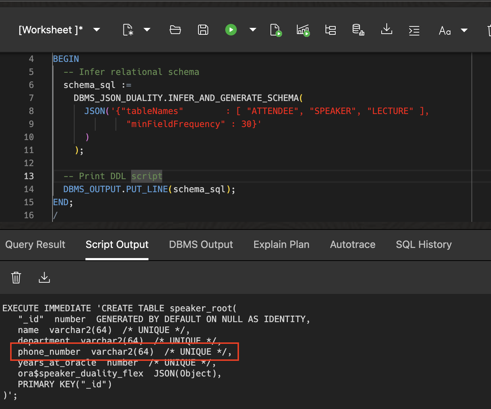
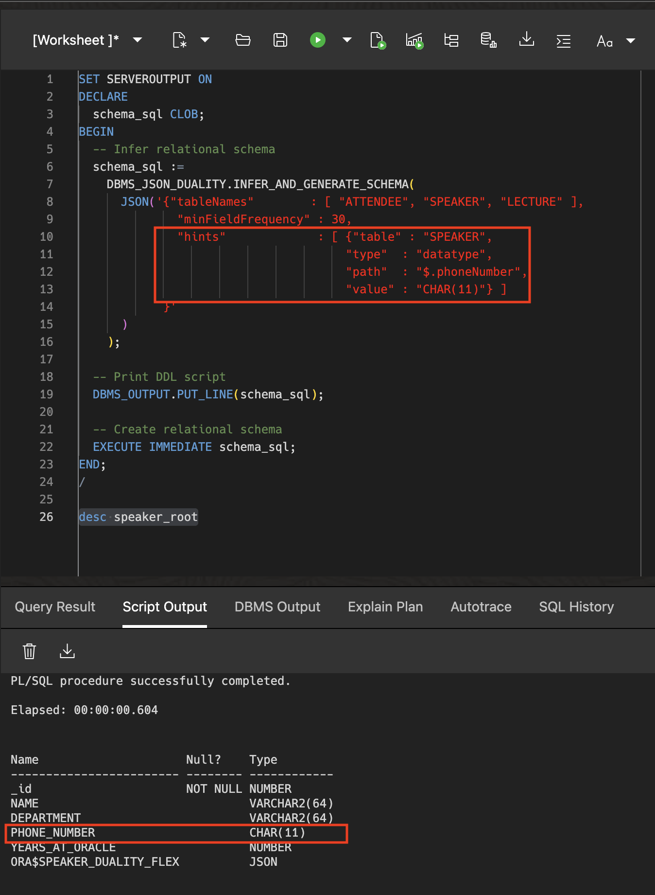
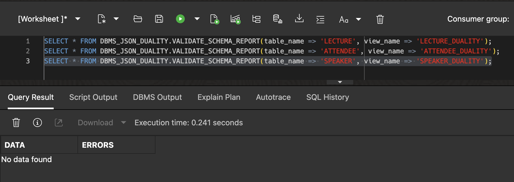
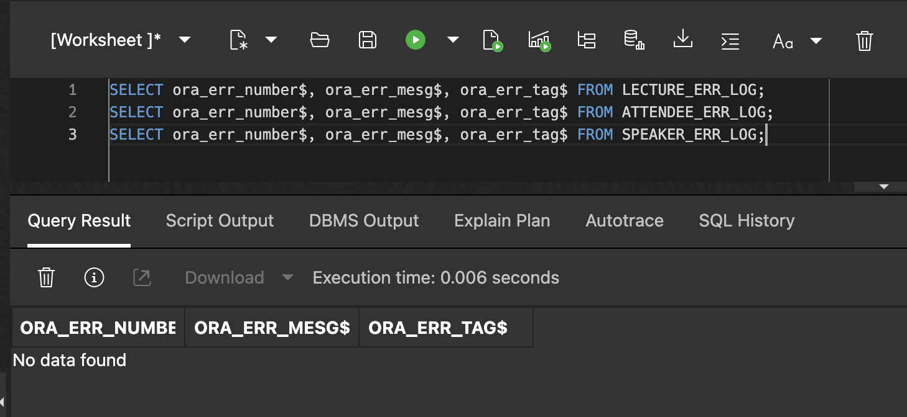
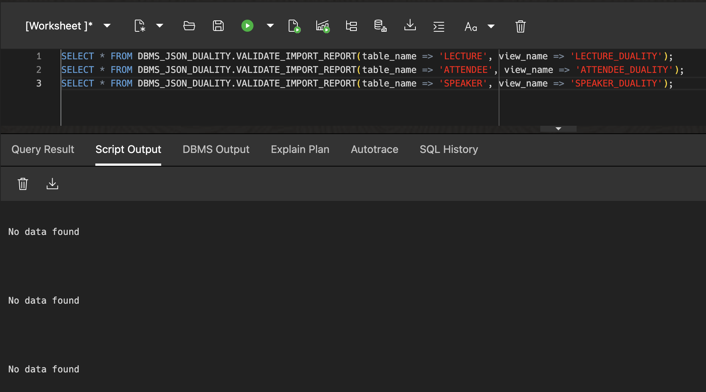
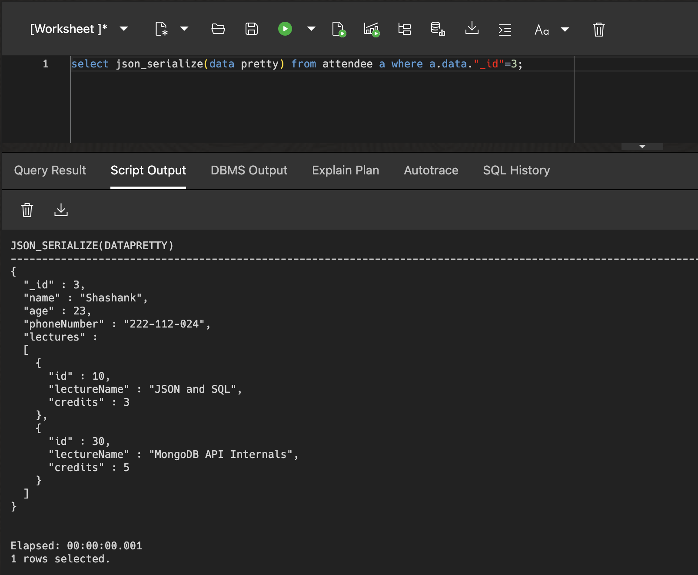

# Schema Design with the JSON to Duality Migrator

## Introduction

This lab walks you through the steps to guide relational schema design using the JSON to Duality Migrator.

Estimated Lab Time: 15 minutes

### About the JSON to Duality Migrator

The JSON to Duality Migrator addresses the challenge of preserving JSON document semantics in relational schemas. By inferring implicit relationships from document collections, it generates updatable duality views that mirror original JSON structures. This method ensures backward compatibility for applications reliant on document APIs while leveraging relational optimization, such as indexing and ACID compliance. The tool supports iterative refinement, allowing developers to adjust inferred schemas post-migration.

The migrator provides several customization parameters, a two-phase API, as well as a hint infrastructure to guide relational schema design. In this lab, we will cover some of these customizations.

### Objectives

In this lab, you will:

* Learn how to customize the relational schema using the JSON to Duality Migrator
* Learn how to validate imported data using the JSON to Duality Migrator

### Prerequisites

* Oracle Autonomous Database 23ai provisioned or one running in a LiveLabs environment

## Task 1: Create JSON Collections and Load Data

Just like the previous lab, we will start with JSON collection tables `speaker`, `attendee`, and `lecture` that represents collections required for a database conference application.

1. Click in the *Database Actions* dropdown list and select **View all database actions**

   


2. Below you can find the Database Actions homepage. Click the SQL tile under development to open the SQL worksheet.

   

3. Let's drop all the objects that we created in the previous lab first.

    ```sql
    <copy>
    BEGIN
      FOR t IN (
        SELECT object_name
        FROM user_objects
        WHERE object_type = 'TABLE'
          AND created >= SYSDATE - INTERVAL '2' HOUR
      ) LOOP
        BEGIN
          EXECUTE IMMEDIATE 'DROP TABLE "' || t.object_name || '" CASCADE CONSTRAINTS PURGE';
        EXCEPTION
          WHEN OTHERS THEN
            DBMS_OUTPUT.PUT_LINE('Failed to drop table ' || t.object_name || ': ' || SQLERRM);
        END;
      END LOOP;
    END;
    /
    </copy>
    ```

      This code basically drops all tables that were created in the last 2 hours. If it took you longer to get to this point in the lab, then you need to increase the time window.

      Let's check that there are no objects existent in our schema anymore, or at least no objects that will collide with this workshop..

      ```sql
      <copy>
      SELECT * FROM user_tables;
      </copy>
      ```
    

2. Create the `speaker`, `attendee`, and `lecture` collections.

    ```sql
    <copy>
    DROP VIEW IF EXISTS speaker;
    DROP VIEW IF EXISTS attendee;
    DROP VIEW IF EXISTS lecture;
    DROP TABLE IF EXISTS speaker PURGE;
    DROP TABLE IF EXISTS attendee PURGE;
    DROP TABLE IF EXISTS lecture PURGE;
    CREATE JSON COLLECTION TABLE IF NOT EXISTS speaker;
    CREATE JSON COLLECTION TABLE IF NOT EXISTS attendee;
    CREATE JSON COLLECTION TABLE IF NOT EXISTS lecture;
    </copy>
    ```

3. Insert data into the `speaker`, `attendee`, and `lecture` collections. The attendee data is a bit different from the previous lab - only one attendee has specified their pre-ordered coffee item.

    ```sql
    <copy>
    INSERT INTO speaker VALUES
      ('{"_id"            : 101,
          "name"           : "Abdul J.",
          "phoneNumber"    : "222-555-011",
          "yearsAtOracle"  : 25,
          "department"     : "Product Management",
          "lecturesTaught" : [ {"id" : 10, "lectureName" : "JSON and SQL",  "classType" : "Online"},
                              {"id" : 20, "lectureName" : "PL/SQL or Javascript", "classType" : "In-person"} ]}');
    INSERT INTO speaker VALUES
      ('{"_id"            : 102,
          "name"           : "Betty Z.",
          "phoneNumber"    : "222-555-022",
          "yearsAtOracle"  : 30,
          "department"     : "Autonomous Databases",
          "lecturesTaught" : [ {"id" : 30, "lectureName" : "MongoDB API Internals", "classType" : "In-person"},
                              {"id" : 40, "lectureName" : "Oracle ADB on iPhone", "classType" : "Online"} ]}');
    INSERT INTO speaker VALUES
      ('{"_id"            : 103,
          "name"           : "Colin J.",
          "phoneNumber"    : "222-555-023",
          "yearsAtOracle"  : 27,
          "department"     : "In-Memory and Data",
          "lecturesTaught" : [ {"id" : 50, "lectureName" : "JSON Duality Views", "classType" : "Online"} ]}');

    INSERT INTO attendee VALUES
      ('{"_id"          : 1,
          "name"         : "Beda",
          "age"          : 20,
          "phoneNumber"  : "222-111-021",
          "lectures" : [ {"id" : 10, "lectureName" : "JSON and SQL", "credits" : 3},
                        {"id" : 20, "lectureName" : "PL/SQL or Javascript", "credits" : 4},
                        {"id" : 30, "lectureName" : "MongoDB API Internals", "credits" : 5},
                        {"id" : 40, "lectureName" : "Oracle ADB on iPhone", "credits" : 3},
                        {"id" : 50, "lectureName" : "JSON Duality Views", "credits" : 3} ]}');
    INSERT INTO attendee VALUES
      ('{"_id"          : 2,
          "name"         : "Hermann",
          "age"          : 22,
          "phoneNumber"  : "222-112-023",
          "lectures" : [ {"id" : 10, "lectureName" : "JSON and SQL", "credits" : 3},
                        {"id" : 30, "lectureName" : "MongoDB API Internals", "credits" : 5},
                        {"id" : 50, "lectureName" : "JSON Duality Views", "credits" : 3} ]}');
    INSERT INTO attendee VALUES
      ('{"_id"           : 3,
          "name"          : "Shashank",
          "age"           : 23,
          "phoneNumber"   : "222-112-024",
          "lectures" : [ {"id" : 10, "lectureName" : "JSON and SQL", "credits" : 3},
                        {"id" : 30, "lectureName" : "MongoDB API Internals", "credits" : 5} ]}');
    INSERT INTO attendee VALUES
      ('{"_id"          : 4,
          "name"         : "Julian",
          "age"          : 24,
          "phoneNumber"  : "222-113-025",
          "coffeeItem"   : "Decaf",
          "lectures" : [ {"id" : 50, "lectureName" : "JSON Duality Views", "credits" : 3} ]}');

    INSERT INTO lecture VALUES
      ('{"_id"               : 10,
          "lectureName"       : "JSON and SQL",
          "creditHours"       : 3,
          "attendeesEnrolled" : [ {"_id" : 1, "name": "Beda", "age" : 20},
                                  {"_id" : 2, "name": "Hermann", "age" : 22},
                                  {"_id" : 3, "name": "Shashank", "age" : 23} ]}');
    INSERT INTO lecture VALUES
      ('{"_id"               : 20,
          "lectureName"       : "PL/SQL or Javascript",
          "creditHours"       : 4,
          "attendeesEnrolled" : [ {"_id" : 1, "name": "Beda", "age" : 20} ]}');
    INSERT INTO lecture VALUES
      ('{"_id"               : 30,
          "lectureName"       : "MongoDB API Internals",
          "creditHours"       : 5,
          "attendeesEnrolled" : [ {"_id" : 1, "name": "Beda", "age" : 20},
                                  {"_id" : 2, "name": "Hermann", "age" : 22},
                                  {"_id" : 3, "name": "Shashank", "age" : 23} ]}');
    INSERT INTO lecture VALUES
      ('{"_id"               : 40,
          "lectureName"       : "Oracle ADB on iPhone",
          "creditHours"       : 3,
          "attendeesEnrolled" : [ {"_id" : 1, "name": "Beda", "age" : 20} ]}');
    INSERT INTO lecture VALUES
      ('{"_id"               : 50,
          "lectureName"       : "JSON Duality Views",
          "creditHours"       : 3,
          "attendeesEnrolled" : [ {"_id" : 1, "name": "Beda", "age" : 20},
                                  {"_id" : 2, "name": "Hermann", "age" : 22},
                                  {"_id" : 4, "name": "Julian", "age" : 24} ]}');

    COMMIT;
    </copy>
    ```

## Task 2: Customized Schema Inference using the JSON to Duality Migrator

In this task, we will infer a customized normalized relational schema using data from our JSON collections. The JSON to Duality Migrator will analyze the data in the input collections, and recommend a set of relational tables (including constraints, indexes, and sequences) and a set of duality views to match the input JSON collections.

1. Run the `INFER_AND_GENERATE_SCHEMA` procedure to infer a relational schema. We specify `minFieldFrequency` as 30 so that the `coffeeItem` field will be pruned from the schema and won't map to a relational column.

    minFieldFrequency defines the percentage threshold for all documents when a field is considered an **occurence outlier**. Such outliers are not mapped to any underlying column. 


    ```sql
    <copy>
    SET SERVEROUTPUT ON
    DECLARE
      schema_sql CLOB;
    BEGIN
      -- Infer relational schema
      schema_sql :=
        DBMS_JSON_DUALITY.INFER_AND_GENERATE_SCHEMA(
          JSON('{"tableNames"        : [ "ATTENDEE", "SPEAKER", "LECTURE" ],
                  "minFieldFrequency" : 30}'
          )
        );

      -- Print DDL script
      DBMS_OUTPUT.PUT_LINE(schema_sql);
    END;
    /
    </copy>
    ```

    Let's inspect the output DDL script. Since `coffeeItem` appears in fewer than 30% of documents, there is no column in the relational schema for the field, nor does it appear in the duality view definition. 
    
    So what happens when you import the input data into this duality view? Can you guess from what we learnt in lab 4? Since the migrator creates flex JSON columns by default, the `coffeeItem` field will be inserted into the flex column! This is a great way of handling rare fields - set `minFieldFrequency` as desired and the migrator handles the rest.

    

    Feel free to experiment with different values and re-run the migrator code. We are only displaying the DDL, but not executing it.


2. Run the `INFER_AND_GENERATE_SCHEMA` procedure again with a datatype hint for the `phoneNumber` field. In the output above, we created a `VARCHAR2` column for phone number. Let's say that we want a fixed character length datatype (`CHAR`) for the phone number instead, since we know that all phone numbers will have the same length. We can use the hints configuration parameter to specify the datatype for the `phoneNumber` field.

    

    Let's now create the schema and influence the datatype for phoneNumber accordingly.

    ```sql
    <copy>
    SET SERVEROUTPUT ON
    DECLARE
      schema_sql CLOB;
    BEGIN
      -- Infer relational schema
      schema_sql :=
        DBMS_JSON_DUALITY.INFER_AND_GENERATE_SCHEMA(
          JSON('{"tableNames"        : [ "ATTENDEE", "SPEAKER", "LECTURE" ],
                  "minFieldFrequency" : 30,
                  "hints"             : [ {"table" : "SPEAKER",
                                          "type"  : "datatype",
                                          "path"  : "$.phoneNumber",
                                          "value" : "CHAR(11)"} ]
                }'
          )
        );

      -- Print DDL script
      DBMS_OUTPUT.PUT_LINE(schema_sql);

      -- Create relational schema
      EXECUTE IMMEDIATE schema_sql;
    END;
    /
    </copy>
    ```

    


3. Describe the `speaker_root` table. We can see that the datatype for the `PHONE_NUMBER` column is `CHAR(11)`, which is exactly what we specified in the hint parameter.

    ```sql
    <copy>
    DESC speaker_root
    </copy>
    ```

    

    The migrator also allows you to specify hints to specify identifying keys for sub-objects and whether to share data for sub-objects with other collections. The hint infrastructure is an effective tool to design and customize an effective normalized relational schema based on application and business requirements.

4. Validate the schema using the `VALIDATE_SCHEMA_REPORT` table function. This should show no rows selected for each duality view, which means that there are no validation failures.

    ```sql
    <copy>
    SELECT * FROM DBMS_JSON_DUALITY.VALIDATE_SCHEMA_REPORT(table_name => 'LECTURE', view_name => 'LECTURE_DUALITY');
    SELECT * FROM DBMS_JSON_DUALITY.VALIDATE_SCHEMA_REPORT(table_name => 'ATTENDEE', view_name => 'ATTENDEE_DUALITY');
    SELECT * FROM DBMS_JSON_DUALITY.VALIDATE_SCHEMA_REPORT(table_name => 'SPEAKER', view_name => 'SPEAKER_DUALITY');
    </copy>
    ```

    

## Task 3: Data Import and Validation using the JSON to Duality Migrator

In this task, we will import data from input JSON collections into the duality views. We will also look at techniques to find document that cannot be imported successfully and validate that data has been imported successfully.

1. Let's create error logs to log errors for documents that do not get imported successfully.

    ```sql
    <copy>
    BEGIN
      DBMS_ERRLOG.CREATE_ERROR_LOG(dml_table_name => 'LECTURE', err_log_table_name => 'LECTURE_ERR_LOG', skip_unsupported => TRUE);
      DBMS_ERRLOG.CREATE_ERROR_LOG(dml_table_name => 'ATTENDEE', err_log_table_name => 'ATTENDEE_ERR_LOG', skip_unsupported => TRUE);
      DBMS_ERRLOG.CREATE_ERROR_LOG(dml_table_name => 'SPEAKER', err_log_table_name => 'SPEAKER_ERR_LOG', skip_unsupported => TRUE);
    END;
    /
    </copy>
    ```

2. Let's import the data into the duality views using the `IMPORT_ALL` procedure.

    ```sql
    <copy>
    BEGIN
      DBMS_JSON_DUALITY.IMPORT_ALL(
                          JSON('{"tableNames" : [ "LECTURE", "ATTENDEE", "SPEAKER" ],
                                  "viewNames"  : [ "LECTURE_DUALITY", "ATTENDEE_DUALITY", "SPEAKER_DUALITY" ],
                                  "errorLog"   : [ "LECTURE_ERR_LOG", "ATTENDEE_ERR_LOG", "SPEAKER_ERR_LOG" ]}'
                          )
      );
    END;
    /
    </copy>
    ```
    

3. Query the error logs. The error logs are empty, showing that there are no import errors — there are no documents that did not get imported.

    ```sql
    <copy>
    SELECT ora_err_number$, ora_err_mesg$, ora_err_tag$ FROM LECTURE_ERR_LOG;
    SELECT ora_err_number$, ora_err_mesg$, ora_err_tag$ FROM ATTENDEE_ERR_LOG;
    SELECT ora_err_number$, ora_err_mesg$, ora_err_tag$ FROM SPEAKER_ERR_LOG;
    </copy>
    ```

    

    > **_NOTE:_** In case you find that some documents could not be imported successfully, you can look at the error message to understand the reason for the failure, fix the error by either modifying the relational schema or document contents, and reimport the failed document set.

4. Let's validate that all data has been successfully imported using the `VALIDATE_IMPORT_REPORT` table function. This function validates that all documents that have been imported into duality views have correct data by comparing the duality view document contents with the input collection document content. This should show no rows selected for each duality view, which means that all data has been successfully imported.

    ```sql
    <copy>
    SELECT * FROM DBMS_JSON_DUALITY.VALIDATE_IMPORT_REPORT(table_name => 'LECTURE', view_name => 'LECTURE_DUALITY');
    SELECT * FROM DBMS_JSON_DUALITY.VALIDATE_IMPORT_REPORT(table_name => 'ATTENDEE', view_name => 'ATTENDEE_DUALITY');
    SELECT * FROM DBMS_JSON_DUALITY.VALIDATE_IMPORT_REPORT(table_name => 'SPEAKER', view_name => 'SPEAKER_DUALITY');
    </copy>
    ```

    

   > **_NOTE:_** In case you find that some documents have different content that the input document, you can look at the error message to understand the reason for the difference, fix the error by either modifying the relational schema or document contents, and reimport the failed document set.

5. Now let's look at our duality views and compare them quickly with the original documents in our JSON collection.

    Issue the following SQL to show the attendee information for _id = 3, the original document in our JSON Collection table.

    ```sql
    <copy>
    SELECT json_serialize(data pretty) FROM attendee a WHERE a.data."_id"=3;
    </copy>
    ```
    

    Now let's do the exact same, looking at our new JSON Relational Duality View attendee_duality for the same _id. You will see it is exactly the same data, it just carries some additional metadata information for the lock-free concurrency capabilities of Duality Views and it is using some additinoal auto-generated names.

    ```sql
    <copy>
    SELECT json_serialize(data pretty) FROM attendee_duality a WHERE a.data."_id"=3;
    </copy>
    ```
    


## Learn More

* [JSON to Duality Migrator Schema Customization Options](https://docs.oracle.com/en/database/oracle/oracle-database/23/sutil/json-config-filelds-specifying-migrator-parameters.html#GUID-36F4ABA7-CA01-4D70-9CF1-50A00C21E149)
* [Blog: JSON to Duality Migrator](https://blogs.oracle.com/database/post/jsontoduality-migrator)
* [Migrating from JSON to Duality](https://docs.oracle.com/en/database/oracle/oracle-database/23/sutil/migrating-from-json-to-duality.html)
* [JSON-Relational Duality Views](https://docs.oracle.com/en/database/oracle/oracle-database/23/jsnvu/overview-json-relational-duality-views.html)

## Acknowledgements

* **Author** - Shashank Gugnani
* **Contributors** - Julian Dontcheff
* **Last Updated By/Date** - Shashank Gugnani, August 2025
