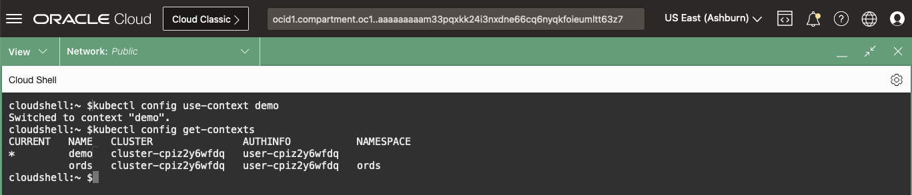

# Access the Kubernetes Cluster

## Introduction

This lab will walk you through establishing a connection to the Kubernetes cluster by generating a *kubeconfig* file.

You can think of the *kubeconfig* file as consolidated version of the `TNS_ADMIN` directory files.  Just as the files in the `TNS_ADMIN` directory contain all the information required to connect to your Oracle Databases, the *kubeconfig* file contains all the information required to connect to your Kubernetes clusters including:

* Cluster Info
* Login Methods
* User Credentials

*Estimated Time:* 10 minute

[Lab 4](videohub:1_ff2m583f)


### Objectives

* Establish a connection and interact with the cluster

### Prerequisites

This lab assumes you have:

* An accessible Oracle Kubernetes Engine Cluster

## Task 1: Create the Kubeconfig file

1. In OCI, navigate to Developer Services -> Kubernetes Clusters(OKE).

    

2. Ensure the Compartment is set to [](var:oci_compartment).

    

3. Select your cluster and click the "Access Cluster" button. Follow the steps to "Manage the cluster via Cloud Shell".

    

4. Paste the copied command into Cloud Shell.  This will create a configuration file, the *kubeconfig*, that *kubectl* uses to access the cluster in the default location of `$HOME/.kube/config`.

### Notes about the Kubeconfig File

The authentication token generated by the command in the kubeconfig file is short-lived, cluster-scoped, and specific to your account. As a result, you cannot share this kubeconfig file with other users to access the Kubernetes cluster.

> the authentication token could expire resulting in an error

If you perform this workshop over a number of hours or days, the authentication token could expire resulting in an error:

`error: You must be logged in to the server (Unauthorized)`

To resolve, re-run Task 1.

## Task 2: Test Kubernetes Access

Just as with *sqlplus*, used to query the objects in an Oracle Database, use *kubectl* to query the resources in the Kubernetes cluster.

### kube-apiserver

*kubectl* makes API calls to the clusters *kube-apiserver* on the *Control Plane* node.  In addition to the *kube-apiserver*, the *Control Plane* node contains all the core components of the cluster required to manage the *Worker* nodes, the workhorses of the cluster.


1. In Cloud Shell, run:

    ```bash
    <copy>
    kubectl get all -A
    </copy>
    ```

`kubectl get all -A` will prompt the *kube-apiserver* to query the *etcd* database which will return all the resources, across all *namespaces* (`-A`), in the Kubernetes cluster.


If an error is returned, ensure the Kubernetes cluster is up and running and that the *kubeconfig* file was properly generated in *Task 1*.

### etcd

*etcd* is a a B+tree key-value store that contains all the Kubernetes cluster information in JSON format.  It is the equivalent of the Oracle Database's Data Dictionary and should be regularly backed-up.  When considering High-Availability, distributing *etcd* across many nodes is of key importance.


## Task 3: Change the default Namespace Context

With kubeconfig files, you can organize your clusters, users, and *namespaces*. You can also define *contexts* to quickly and easily switch between clusters and *namespaces*.  This is the equivalent of having multiple connection strings in your `tnsnames.ora` file allowing you to connect to different databases.

### namespaces

In an Oracle Database, schema's provide a mechanism for isolating database objects within the same database.  *Namespaces* in Kubernetes are similar to schemas, they provide a means for isolating groups of resources within a single cluster.  Resources in a *namespace*, just like objects in a schema, need to be unique within a *namespace*, but not across *namespaces*.

1. Take a look at your context, in Cloud Shell:

    ```bash
    <copy>
    kubectl config get-contexts
    </copy>
    ```

    You will only have one context defined, but suppose you have a development and test cluster.  In the development cluster you work in your own *namespace* and in the test cluster all DBAs share the same *namespace*.  Additionally, the development cluster permits username/password authentication, while in the test cluster, you must use a certificate.

    

    All this information can be stored in a single kubeconfig file and you can define a `context` to group the cluster, user AuthN, and *namespace* together.

2. Rename the existing context to `demo`:

    ```bash
    <copy>
    kubectl config rename-context $(kubectl config current-context) demo
    </copy>
    ```

3. Create a new *Namespace* called `ords`:

    ```bash
    <copy>
    kubectl create namespace ords
    </copy>
    ```

4. Create a new context that points to the `ords` *namespace*:

    ```bash
    <copy>
    kubectl config set-context ords \
    --namespace=ords \
    --cluster=$(kubectl config get-clusters | tail -1) \
    --user=$(kubectl config get-users | tail -1)
    </copy>
    ```

    You'll use the `ords` *namespace* later in the Workshop to deploy your Microservice Application.

5. You should now have two contexts, one named `demo` and one named `ords`:

    ```bash
    <copy>
    kubectl config get-contexts
    </copy>
    ```

    Although in our example both contexts point to the same user and cluster, you can see how easy it is create different isolated environments.  Switching between clusters, users, and/or *namespaces* would simply involve changing the context.

6. Ensure your context is set to `demo`:

    ```bash
    <copy>
    kubectl config use-context demo
    kubectl config get-contexts
    </copy>
    ```

    

For Production clusters, you may consider storing its context in an entirely different kubeconfig file to limit access and prevent mistakes.  Using the `production` context would be a matter of setting the `KUBECONFIG` environment variable to its location.

### Fun Fact?

You'll often see example commands online where `kubectl` is shortened to just `k`: `k get contexts; k create namespace ords`, etc.

This is a heavily used practice implemented by creating an alias:

```bash
<copy>
alias k="kubectl"
</copy>
```

You may now **proceed to the next lab**

## Learn More

* [Command line tool (kubectl)](https://kubernetes.io/docs/reference/kubectl/)
* [Organizing Cluster Access Using kubeconfig Files](https://kubernetes.io/docs/concepts/configuration/organize-cluster-access-kubeconfig/)
* [Kubernetes Components](https://kubernetes.io/docs/concepts/overview/components/)
* [Kubernetes - High Availability](https://kubernetes.io/docs/setup/production-environment/tools/kubeadm/ha-topology/)
* [Kubernetes - Namespaces](https://kubernetes.io/docs/concepts/overview/working-with-objects/namespaces/)

## Acknowledgements

* **Authors** - [](var:authors)
* **Contributors** - [](var:contributors)
* **Last Updated By/Date** - John Lathouwers, May 2023
