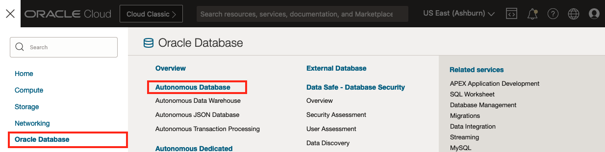
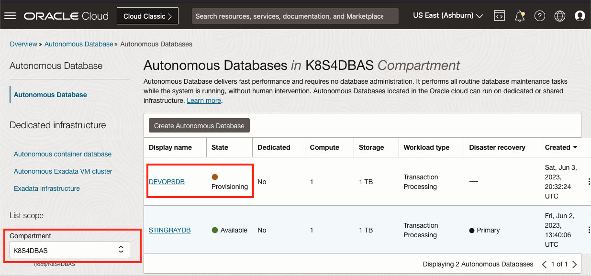
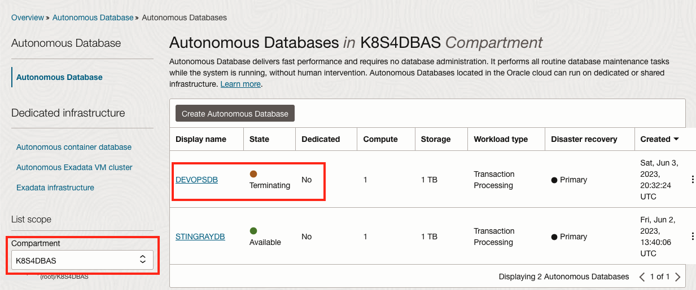

# Provision and Bind to an Oracle Autonomous Database (ADB)

"If you build it, they will come."
\- Ray Kinsella (paraphrased)

## Introduction

In this lab, you will provision a new Oracle Autonomous Database (ADB) and bind to an existing one using the OraOperator.

*Estimated Lab Time:* 5 minutes

Watch the video below for a quick walk through of the lab.
[](youtube:zNKxJjkq0Pw)

### Objectives

* Provision a new Oracle Autonomous Database (ADB) using the OraOperator
* Bind to an existing ADB using the OraOperator

### Prerequisites

This lab assumes you have:

* [Generated a Kubeconfig File](?lab=generate-kubeconfig)
* A [Running and Healthy OraOperator](?lab=deploy-oraoperator)
* A provisioned Oracle ADB in OCI

## Kubernetes Custom Resources and Controllers

The OraOperator introduces Oracle specific, **Custom Resource Definition (CRD)** types to the Kubernetes (K8s) cluster, such as, but not limited to, the Autonomous Database.  This **CRD** defines the structure and behaviour of a **AutonomousDatabase** type and allows you to create or bind to an existing one.

In order to manage the **AutonomousDatabase** type, the OraOperator also introduces custom **Controllers** to manage the  **AutonomousDatabase** type within the K8s cluster. These controllers act as "built-in SOPs" specifically designed for handling the  **AutonomousDatabase** resource.

The controllers provide a declarative API, allowing users to specify the desired state of the  **AutonomousDatabase** resource.  They continuously monitor the current state of the resource and take actions to reconcile any differences between the desired state and the actual state.


The actions that the AutonomousDatabase controller can perform includes:

* Create an Autonomous Database
* Manage ADMIN database user password
* Download instance credentials (wallets)
* Scale the OCPU core count or storage
* Rename an Autonomous Database
* Stop/Start/Terminate an Autonomous Database
* Delete the resource from the K8s cluster

You will use the OraOperator to perform some of these actions in this Lab and the [Lifecycle Operations (ADB)](?lab=lifecycle-adb) Lab.

## Task 1: Create a Namespace

In K8s, a *Namespace* is a virtual cluster that provides a way to divide the physical K8s cluster resources logically between multiple users or teams.  Additionally, Namespaces enable fine-grained control over access and resource allocation.  By defining appropriate Role-Based Access Control (RBAC) policies, you can control which users or groups have access to specific Namespaces and the resources within them.

In Cloud Shell, create a namespace for the AutonomousDatabase Resources:

```bash
<copy>
kubectl create namespace adb
</copy>
```

Output:

```text
namespace/adb created
```

### Namespace Best Practices

* For production clusters, avoid using the `default` namespace. Instead, make other namespaces and use those.
* Avoid creating namespaces with the prefix `kube-`, it is reserved for K8s system namespaces.

## Task 1: Retrieve the existing ADB OCID

During the [Deploy Workshop Stack Lab](?lab=setup-stack), a new Autonomous Database was provisioned in Oracle Cloud Infrastructure for you.

Retrieve the OCID for the Autonomous Database, by running the following in Cloud Shell:

```bash
<copy>
# Get the Compartment OCID
COMPARTMENT_OCID=$(oci iam compartment list \
  --name [](var:oci_compartment) | 
  jq -r '.data[].id')

# Get the ADB OCID from the Compartment
ADB_OCID=$(oci db autonomous-database list \
  --compartment-id $COMPARTMENT_OCID | 
  jq -r '.data[].id')

echo "ADB OCID: $ADB_OCID"
</copy>
```

The above commands will also store the Compartment OCID which will be used to provision a new ADB from K8s.

## Task 3: Create a new ADB

Use the OraOperator to provision a new Autonomous Database by creating a manifest file that will:

* Create a Secret to hold the ADMIN password
* Provision an new ADB

```bash
<copy>
cat > adb_provision.yaml << EOF
---
apiVersion: v1
kind: Secret
type: Opaque
metadata:
  name: adb-devops-admin-password
stringData:
  adb-new-admin-password: Th1s_W1ll_N0t_l1v3
---
apiVersion: database.oracle.com/v1alpha1
kind: AutonomousDatabase
metadata:
  name: adb-devops
spec:
  hardLink: true
  details:
    compartmentOCID: $COMPARTMENT_OCID
    dbName: DEVOPSDB
    displayName: DEVOPSDB
    dbVersion: 19c
    dbWorkload: OLTP
    cpuCoreCount: 1
    dataStorageSizeInTBs: 1
    adminPassword:
      k8sSecret:
        name:  adb-devops-admin-password
EOF
</copy>
```

The above YAML invokes the K8s built-in `v1` API to create an `Opaque` `Secret` resource called `adb-devops-admin-password` with the value of `Th1s_W1ll_N0t_l1v3`.

It will also access the OraOperators' custom controller API `database.oracle.com/v1alpha1` to create an `AutonomousDatabase` (custom) resource in the `$COMPARTMENT_OCID` (substituted by the real value stored in *Task 2*) with the self-explanatory properties in the `spec.details` section.

**Important:** the `spec.hardLink: true` field indicates that if you delete this `AutonomousDatabase` resource from the K8s cluster, also delete the ADB associated with it.
> Good for DevOps CI/CD... Bad for Production!

If it were set to `false` then deleting the resource from K8s would *NOT* delete ADB itself.

Create the new ADB in the `adb` namespace:

```bash
<copy>
kubectl apply -f adb_provision.yaml -n adb
</copy>
```

Output:

```text
secret/adb-new-admin-password created
autonomousdatabase.database.oracle.com/adb-new created
```

## Task 4: Verify ADB Provisioning

In the OCI Console, navigate to Oracle Database -> Autonomous Database.  



Ensure you are in the K8S4DBAS Compartment and you will see the `DEVOPSDB` being provisioned.



## Task 3: Bind to an existing ADB

Create a manifest file for an existing ADB leveraging the **AutonomousDatabase** Custom Resource, using its OCID to identify it:

```bash
<copy>
cat > adb_bind.yaml << EOF
---
apiVersion: database.oracle.com/v1alpha1
kind: AutonomousDatabase
metadata:
  name: adb-existing
spec:
  hardLink: false
  details:
    autonomousDatabaseOCID: $ADB_OCID
EOF
</copy>
```

The above YAML sends a request to the `database.oracle.com/v1alpha1` API exposed by the OraOperator controller to create a resource of `kind: AutonomousDatabase`.

The resource `name` will be called `adb-existing`.  

It will bind to an existing ADB with `autonomousDatabaseOCID` equal to `$ADB_OCID` (substituted by the real value stored in *Task 2*).

**Important:** the `spec.hardLink: false` (default) field indicates that if you delete this `AutonomousDatabase` resource from the K8s cluster, *do not* delete the ADB associated with it.
> Good for Production... Bad for DevOps!

If it were set to `true` then deleting the resource from K8s *WOULD* delete ADB itself.

Create a the **AutonomousDatabase** Custom Resource in K8s by applying the manifest file to the `adb` namespace:

```bash
<copy>
kubectl apply -f adb_bind.yaml -n adb
</copy>
```

Output:

```text
autonomousdatabase.database.oracle.com/adb-existing created
```

## Task 4: Review the Existing ADB Custom Resource

The bind manifest create a new *AutonomousDatabase* resource called *adb-existing* in the *adb* namespace.

To retrieve its details run (`kubectl get <resource> <resource_name> -n <namespace>`):

```bash
<copy>
kubectl get AutonomousDatabase adb-existing -n adb
</copy>
```

With the exception of the **DISPLAY NAME** and **DB NAME**, you should see similar output:

```text
NAME   DISPLAY NAME   DB NAME      STATE       DEDICATED   OCPUS   
adb    STINGRAYDB     STINGRAYDB   AVAILABLE   false       1    
```

To get more details, lets describe the resource (`kubectl describe <resource_type> <resource_name> -n <namespace>`):

```bash
<copy>
kubectl describe AutonomousDatabase adb-existing -n adb
</copy>
```

A lot of interesting information will be displayed including CPU and Storage settings, Connection Strings, and its Lifecycle State (AVAILABLE).

## Task 5: Delete the Provisioned ADB

The ADB provisioned by the OraOperator is great for DevOps, after which it should be deleted.  The physical ADB is deleted because you specified a `hardLink` between the K8s resource and the database.

```bash
<copy>
kubectl delete adb adb-devops -n adb
kubectl delete secret adb-devops-admin-password -n adb
</copy>
```

Output:

```text
autonomousdatabase.database.oracle.com "adb-devops" deleted
secret "adb-devops-admin-password" deleted
```

## Task 6: Verify ADB Termination

In the OCI Console, navigate to Oracle Database -> Autonomous Database.  


Ensure you are in the K8S4DBAS Compartment and you will see the `DEVOPSDB` being terminated.



## Learn More

* [Oracle Autonomous Database](https://www.oracle.com/uk/autonomous-database/)
* [OCI - Instance Principal](https://docs.oracle.com/en-us/iaas/Content/Identity/Tasks/callingservicesfrominstances.htm)
* [Kubernetes Secrets](https://K8s.io/docs/concepts/configuration/secret/)

## Acknowledgements

* **Author** - John Lathouwers, Developer Advocate, Database Development Operations
* **Last Updated By/Date** - John Lathouwers, May 2023
