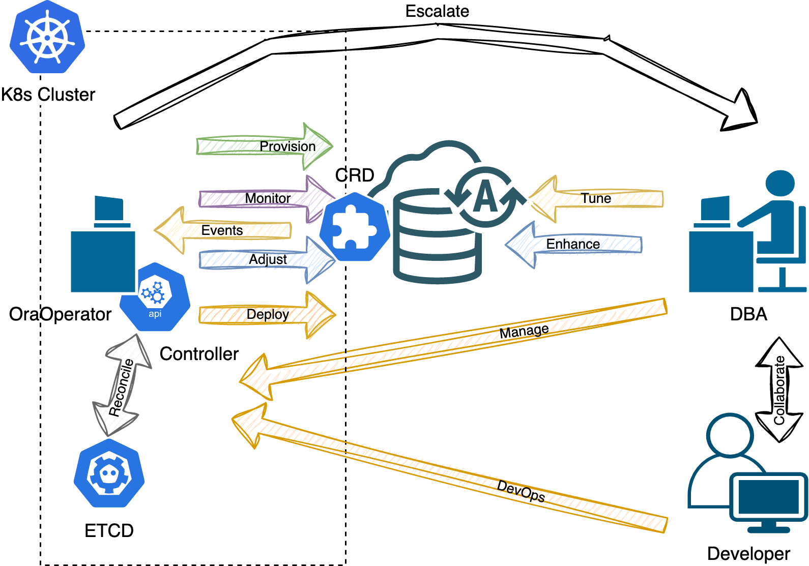

# Bind the OraOperator to an Oracle Autonomous Database (ADB)

## Introduction

In this lab, we bind the OraOperator to an Oracle Autonomous Database (ADB).

*Estimated Lab Time:* 5 minutes

Watch the video below for a quick walk through of the lab.
[](youtube:zNKxJjkq0Pw)

### Objectives

* Connect the OraOperator to an existing ADB

### Prerequisites

This lab assumes you have:

* [Generated a Kubeconfig File](?lab=generate-kubeconfig)
* A [Running and Healthy OraOperator](?lab=deploy-oraoperator)
* A provisioned Oracle ADB in OCI

## Kubernetes Custom Resources and Controllers

The OraOperator introduces Oracle specific, **Custom Resource Definition (CRD)** types to the Kubernetes Cluster, such as, but not limited to, the Autonomous Database.  This CRD defines the structure and behaviour of a **AutonomousDatabase** type and allows you to create or bind to an existing one.

In order to manage the AutonomousDatabase type, the OraOperator also introduces custom **Controllers** to manage the AutonomousDatabase type within the Kubernetes cluster. These controllers act as "built-in SOPs" specifically designed for handling the AutonomousDatabase resource.

The controllers provide a declarative API, allowing users to specify the desired state of the AutonomousDatabase resource.  They continuously monitor the current state of the resource and take actions to reconcile any differences between the desired state and the actual state.



The actions that the AutonomousDatabase controller can perform includes:

* Create an Autonomous Database
* Manage ADMIN database user password
* Download instance credentials (wallets)
* Scale the OCPU core count or storage
* Rename an Autonomous Database
* Stop/Start/Terminate an Autonomous Database
* Delete the resource from the K8s cluster

You will use the OraOperator to perform some of these actions in the [Lifecycle Operations (ADB)](?lab=lifecycle-adb) Lab.

## Task 1: Create a Namespace

In Kubernetes, a *Namespace* is a virtual cluster that provides a way to divide the physical Kubernetes cluster resources logically between multiple users or teams.  Additionally, Namespaces enable fine-grained control over access and resource allocation.  By defining appropriate Role-Based Access Control (RBAC) policies, you can control which users or groups have access to specific Namespaces and the resources within them.

In Cloud Shell, create a namespace for the AutonomousDatabase Resources:

```bash
<copy>
kubectl create namespace adb
</copy>
```

Output:

```text
namespace/adb created
```

### Namespace Best Practices

* For production clusters, avoid using the `default` namespace. Instead, make other namespaces and use those.
* Avoid creating namespaces with the prefix `kube-`, it is reserved for Kubernetes system namespaces.

## Task 2: Retrieve the ADB OCID

During the [Deploy Workshop Stack Lab](?lab=setup-stack), a new Autonomous Database was provisioned in Oracle Cloud Infrastructure for you.

Retrieve the OCID for the Autonomous Database, by running the following in Cloud Shell:

```bash
<copy>
# Get the Compartment OCID
COMPARTMENT_OCID=$(oci iam compartment list \
  --name [](var:oci_compartment) | 
  jq -r '.data[].id')

# Get the ADB OCID from the Compartment
ADB_OCID=$(oci db autonomous-database list \
  --compartment-id $COMPARTMENT_OCID | 
  jq -r '.data[].id')

echo "ADB OCID: $ADB_OCID"
</copy>
```

## Task 3: Create a Secret - ADMIN Password

It is important to highlight that during the creation of the OCI resources, Instance Principals were established that allow the K8s nodes to manage the ADB.  This includes changing its ADMIN password.

The password currently assigned to the ADB was randomised and is unknown, but when you bind to the ADB via the OraOperator, you are instructing the Controller to modify the ADB to the newly defined, desired state.  In regards to the ADMIN password, it will currently not be what you will define in the K8s Secret, and will therefor be modified accordingly.

In Cloud Shell, generate a base64 encoded password string.  You can choose any password so long as it complies with the [Password Complexity](https://docs.oracle.com/en/cloud/paas/autonomous-database/adbsa/manage-users-create.html#GUID-72DFAF2A-C4C3-4FAC-A75B-846CC6EDBA3F) rules.

Generate a Base64 encoded string of the new password:

```bash
ADB_PWD=$(echo "MyNewPassword_1234" | base64)
```

Start a manifest file to bind to the ADB with a K8s Secret containing the new password for the ADB ADMIN user.

```bash
<copy>
cat > adb_bind.yaml << EOF
---
apiVersion: v1
stringData:
  adb-admin-password: $ADB_PWD
kind: Secret
metadata:
  labels:
    app.kubernetes.io/part-of: database
  name: adb-admin-password
  namespace: adb
type: Opaque
EOF
</copy>
```

## Task 4: Create a Secret - Wallet Password

Similar to the ADMIN password, a new password will be supplied for the ADB Wallet:

```bash
<copy>
cat >> adb_bind.yaml << EOF
---
apiVersion: v1
stringData:
  adb-instance-wallet-password: $ADB_PWD
kind: Secret
metadata:
  labels:
    app.kubernetes.io/part-of: database
  name: adb-instance-wallet-password
  namespace: adb
type: Opaque
EOF
```

## Task 4: Create the Bind Manifest

Add to the manifest the AutonomousDatabase Resource definition that will bind to the pre-created Autonomous Database:

```bash
<copy>
cat >> adb_bind.yaml << EOF
---
apiVersion: database.oracle.com/v1alpha1
kind: AutonomousDatabase
metadata:
  labels:
    app.kubernetes.io/part-of: database
  name: adb
  namespace: adb
spec:
  details:
    autonomousDatabaseOCID: $ADB_OCID
    adminPassword:
      k8sSecret:
        name: adb-admin-password
    wallet:
      name: adb-tns-admin
      password:
        k8sSecret:
          name: adb-instance-wallet-password
EOF
</copy>
```

The syntax for creating and Autonomous Database via the OraOperator requires a bit more definition, such as how many OCPUs, Disk Space, etc., but is entirely possible and is extremely useful in DevOps to quickly stand-up and tear-down an Oracle Autonomous Database in CI/CD pipelines.

## Task 4: Apply the Bind Manifest

Finally, apply the manifest to create the two K8s Secrets and bind to the existing ADB.  As part of applying the manifest, the ADB's ADMIN password will be modified and a wallet will be generated/downloaded into a new K8s secret.


```bash
<copy>
kubectl apply -f adb_bind.yaml
</copy>
```

Output:

```text
secret/adb-admin-password created
secret/adb-instance-wallet-password created
autonomousdatabase.database.oracle.com/adb created
```

## Task 5: Review Resources and Secrets

After the deployment, review the new K8s resources and secrets.

### Resource

The bind manifest create a new *AutonomousDatabase* resource called *adb* in the *adb* namespace.

To retrieve its details run (`kubectl get <resource> <resource_name> -n <namespace>`):

```bash
<copy>
kubectl get AutonomousDatabase adb -n adb
</copy>
```

With the exception of the **DISPLAY NAME** and **DB NAME**, you should see similar output:

```text
NAME   DISPLAY NAME   DB NAME      STATE       DEDICATED   OCPUS   
adb    STINGRAYDB     STINGRAYDB   AVAILABLE   false       1    
```

To get more details, lets describe the resource (`kubectl describe <resource_type> <resource_name> -n <namespace>`):

```bash
<copy>
kubectl describe AutonomousDatabase adb -n adb
</copy>
```

A lot of interesting information will be displayed including CPU and Storage settings, Connection Strings, and its Lifecycle State (AVAILABLE).

### Secrets

You created two secrets as part of binding to the pre-created Database, but a new Secret **adb-tns-admin** will have been created that contains the wallet information for the ADB.

Get the Secrets in the ADB namespace (`kubectl get secrets -n <namespace>`):
```bash
<copy>
kubectl get secrets -n adb
</copy>
```

Output:

```text
NAME                           TYPE     DATA   AGE
adb-admin-password             Opaque   1      13m
adb-instance-wallet-password   Opaque   1      13m
adb-tns-admin                  Opaque   9      13m
```

Take a closer look at the **adb-tns-admin** secret by describing it (`kubectl describe secrets <secret_name> -n <namespace>):

```bash
<copy>
kubectl describe secrets adb-tns-admin -n adb
</copy>
```

Output:

```text
Name:         adb-tns-admin
Namespace:    adb
Labels:       app=adb
Annotations:  <none>

Type:  Opaque

Data
====
ojdbc.properties:  691 bytes
sqlnet.ora:        114 bytes
cwallet.sso:       5349 bytes
ewallet.p12:       5304 bytes
ewallet.pem:       5710 bytes
keystore.jks:      3191 bytes
tnsnames.ora:      1310 bytes
truststore.jks:    2056 bytes
README:            3037 bytes
```

You'll see what equates to a `TNS_ADMIN` directory, and in fact, this Secret will be used by applications for just that purpose.

## Learn More

* [Oracle Autonomous Database](https://www.oracle.com/uk/autonomous-database/)
* [OCI - Instance Principal](https://docs.oracle.com/en-us/iaas/Content/Identity/Tasks/callingservicesfrominstances.htm)
* [Kubernetes Secrets](https://kubernetes.io/docs/concepts/configuration/secret/)

## Acknowledgements

* **Author** - John Lathouwers, Developer Advocate, Database Development Operations
* **Last Updated By/Date** - John Lathouwers, May 2023
