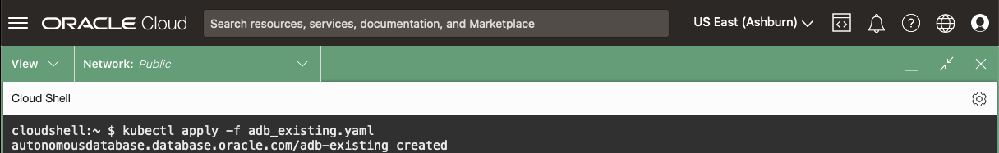
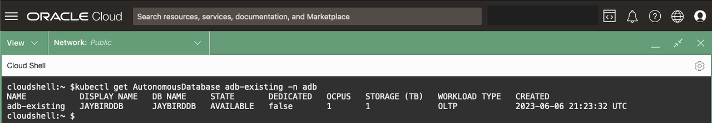
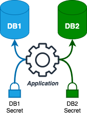
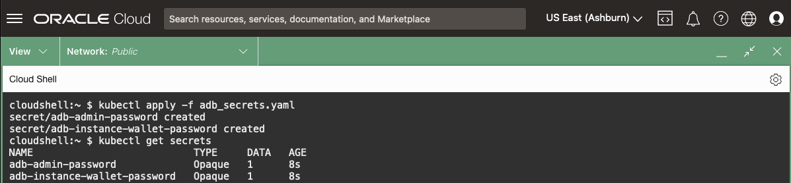
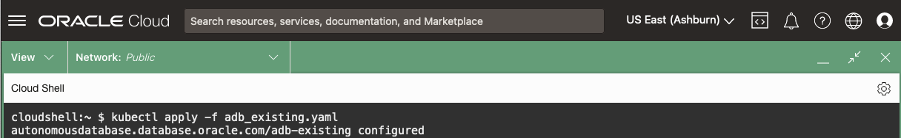
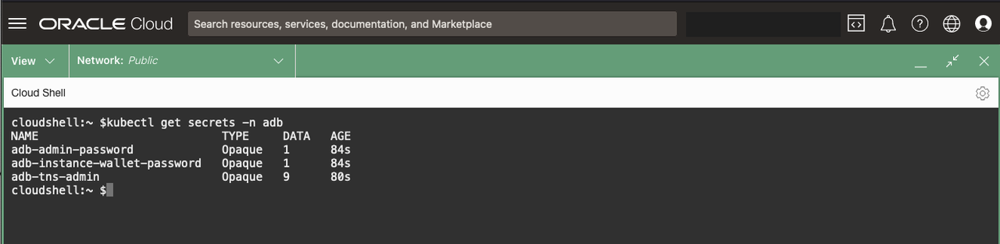
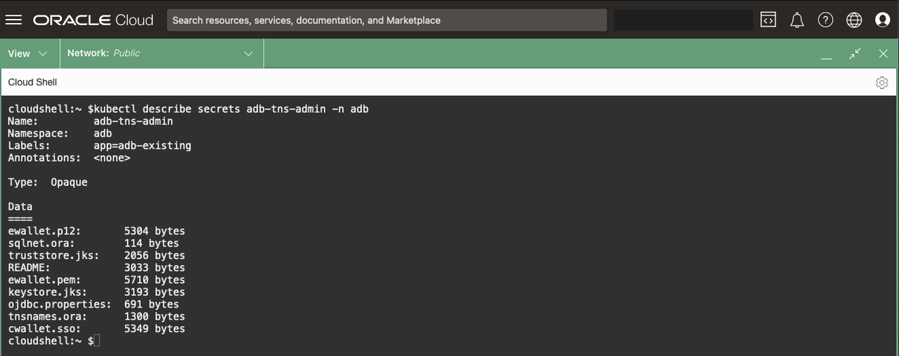

# Bind to an Oracle Autonomous Database (ADB)

## Introduction

In this lab, you will bind to an existing Oracle Autonomous Database (ADB) using the **OraOperator**.

*Estimated Time:* 10 minutes

[Lab 7](videohub:1_wdee00m6)

### Objectives

* Bind to an existing ADB using the **OraOperator**

### Prerequisites

This lab assumes you have:

* [Generated a Kubeconfig File](?lab=access-cluster)
* A [Running and Healthy OraOperator](?lab=deploy-oraoperator)
* A provisioned Oracle ADB in OCI

## Task 1: Retrieve the existing ADB OCID

During the [Deploy Workshop Stack Lab](?lab=deploy-stack), a new Autonomous Database (ADB) was provisioned in Oracle Cloud Infrastructure for you.

1. Retrieve the OCID for the ADB, by running the following in Cloud Shell:

    ```bash
    <copy>
    # Get the Compartment OCID
    COMPARTMENT_OCID=$(oci iam compartment list \
      --name [](var:oci_compartment) |
      jq -r '.data[].id')

    # Get the ADB OCID from the Compartment
    ADB_OCID=$(oci db autonomous-database list \
      --lifecycle-state AVAILABLE \
      --compartment-id $COMPARTMENT_OCID |
      jq -r '.data[].id')

    echo "ADB OCID: $ADB_OCID"
    </copy>
    ```

## Task 2: Create a manifest to Bind

1. Create a *manifest file* to define the resource of an existing ADB, leveraging the *AutonomousDatabase CRD* from the OraOperator:

    ```bash
    <copy>
    cat > adb_existing.yaml << EOF
    ---
    apiVersion: database.oracle.com/v1alpha1
    kind: AutonomousDatabase
    metadata:
      name: adb-existing
    spec:
      hardLink: false
      details:
        autonomousDatabaseOCID: $ADB_OCID
    EOF
    </copy>
    ```

The above YAML sends a request to the `database.oracle.com/v1alpha1` API exposed by the **OraOperator** to define a resource of `kind: AutonomousDatabase`.

The resource `name` will be called `adb-existing`.

It will bind to an existing ADB with `autonomousDatabaseOCID` equal to `$ADB_OCID` (substituted by the real value stored in *Task 1*).

**Important:** the `spec.hardLink: false` (default) field indicates that if you delete this `AutonomousDatabase` resource from the Kubernetes cluster, *do not* delete the ADB associated with it.

> Good for Production... Bad for DevOps!

If it were set to `true` then deleting the resource from Kubernetes *WOULD* delete ADB itself.

## Task 3: Apply the existing ADB Manifest

1. Define the **AutonomousDatabase** *CRD* in Kubernetes by applying the *manifest file*:

    ```bash
    <copy>
    kubectl apply -f adb_existing.yaml
    </copy>
    ```

    

## Task 4: Review the Existing ADB Custom Resource

1. Retrieve the `adb-existing` resource details by running (`kubectl get <resource> <resource_name> [-n <namespace>]`).  You can omit the `-n <namespace>` as your *kubeconfig* context has already set it for you:

    ```bash
    <copy>
    kubectl get AutonomousDatabase adb-existing
    </copy>
    ```

    With the exception of the **DISPLAY NAME** and **DB NAME**, you should see similar output:

    

2. Describe the `adb-existing` resource (`kubectl describe <resource_type> <resource_name> [-n <namespace>]`) to get more details.

    Use the resource_type alias `adb` for `AutonomousDatabase` to save some typing.

    You can view all the resource_type alias short names by running: `kubectl api-resources`

    ```bash
    <copy>
    kubectl describe adb adb-existing
    </copy>
    ```

    A lot of useful information will be displayed including CPU and Storage settings, Connection Strings, and its Lifecycle State (AVAILABLE).  You will modify these fields later to manage the ADB via K8s.

## Task 5: Secrets

A Kubernetes *Secret* is an API object used to store sensitive information such as passwords, tokens, or keys.  It is important to note that a *Secret*, by default, is not encrypted only base64-encoded, but they are still useful.

> a Secret, by default, is not encrypted

Suppose you've written a bit of code to remotely check tablespace usage.  You first test it on one database hard-coding the authentication (AuthN) credentials into the script for convenience while testing.  It works great but you'll need to remove the AuthN credentials from the code and add a function to retrieve them from an external source.  Once you've done this, you can safely share your tablespace check code with the world without exposing confidential data.



Kubernetes *Secrets* are that external source which decouples sensitive information from your application code.  This ensures your application is distributable and portable, without exposing confidential data.

## Task 6: Create Secrets

If you take a closer look at the output from **Task 4**: `kubectl describe adb adb-existing` you'll notice that the resources does not have a value for the ADMIN password or the Wallet:

```yaml
...
spec:
  Details:
    Admin Password:
      k8sSecret:
...
    Wallet:
      Password:
        k8sSecret:
```

Create two *Secrets* which will applied to those values.

1. In Cloud Shell, assign the `ADB_PWD` variable a password (for Workshop purposes only).

    You can choose any password so long as it complies with the [Password Complexity](https://docs.oracle.com/en/cloud/paas/autonomous-database/adbsa/manage-users-create.html#GUID-72DFAF2A-C4C3-4FAC-A75B-846CC6EDBA3F) rules.

    ```bash
    <copy>
    ADB_PWD=$(echo "K8s4DBAs_$(date +%H%S%M)")
    </copy>
    ```

2. Create a *Secret* that will hold the database ADMIN and ADB wallet password:

    ```bash
    <copy>
    cat > adb_secrets.yaml << EOF
    ---
    apiVersion: v1
    kind: Secret
    type: Opaque
    metadata:
      name: adb-admin-password
    stringData:
      adb-admin-password: $ADB_PWD
    ---
    apiVersion: v1
    kind: Secret
    type: Opaque
    metadata:
      name: adb-instance-wallet-password
    stringData:
      adb-instance-wallet-password: $ADB_PWD
    EOF
    </copy>
    ```

    Take a quick look at the syntax:

    You are using the "core" API, `v1` and defining two resources of `kind: Secret` of `type: Opaque`.  They are named: `adb-admin-password` and `adb-instance-wallet-password` respectively.  *Secret* `adb-admin-password` has a single key/value data: `adb-admin-password:$ADB_PWD` while `adb-instance-wallet-password` has a single key/value data: `adb-instance-wallet-password:$ADB_PWD`

3. Create the *Secret* resources:

    ```bash
    <copy>
    kubectl apply -f adb_secrets.yaml
    </copy>
    ```

4. Query the *Secret* resources:

    ```bash
    <copy>
    kubectl get secrets
    </copy>
    ```

    

## Task 7: Redefine the ADB - Add Secrets

Now that you've defined two *Secrets* in Kubernetes, redefine the `adb-existing` resource to use them.  Keep in mind that when you redefine the `adb-existing` resource with the *Secrets*, the ADB bound to it will no longer be in the desired state.  The OraOperator controllers will update the real-world ADB to reconcile the differences.

1. Update the previously created `adb_existing.yaml` file with the new *Secret* definitions:

    ```bash
    <copy>
    cat >> adb_existing.yaml << EOF
        adminPassword:
          k8sSecret:
            name: adb-admin-password
        wallet:
          name: adb-tns-admin
          password:
            k8sSecret:
              name: adb-instance-wallet-password
    EOF
    </copy>
    ```

    Take a quick look at the syntax:

    You are appending to the `adb_existing.yaml` manifest to **redefine** the `adb-existing` resource, setting the `spec.details.adminPassword` and `spec.details.wallet` keys.  Under the wallet section, you are specifying the name of a *Secret*, `adb-tns-admin`, that the OraOperator will define to store the wallet.

2. Apply the manifest:

    ```bash
    <copy>
    kubectl apply -f adb_existing.yaml
    </copy>
    ```

    

## Task 8: Review ADB Wallet Secrets

1. Get the *Secrets* (`kubectl get secrets [-n <namespace>]`):

    ```bash
    <copy>
    kubectl get secrets
    </copy>
    ```

    

    You created the first two *Secrets* and instructed OraOperator to create the third named `adb-tns-admin`.

2. Take a closer look at the **adb-tns-admin** *Secret* by describing it (`kubectl describe secrets <secret_name> [-n <namespace>]`):

    ```bash
    <copy>
    kubectl describe secrets adb-tns-admin
    </copy>
    ```

    

    You'll see what equates to a `TNS_ADMIN` directory, and in fact, this *Secret* can be used by Microservice applications for just that purpose.

You may now **proceed to the next lab**

## Learn More

* [Oracle Autonomous Database](https://www.oracle.com/uk/autonomous-database/)
* [Kubernetes Secrets](https://K8s.io/docs/concepts/configuration/secret/)

## Acknowledgements

* **Authors** - [](var:authors)
* **Contributors** - [](var:contributors)
* **Last Updated By/Date** - John Lathouwers, July 2023
