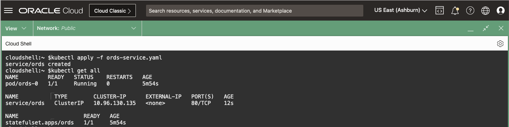

# Deploy Microservice Application

## Introduction

You will deploy an Microservice Application which will create a new user in the Database via Liquibase and use the new user access the Oracle Database.

The application will be the SQL Web Developer from Oracle Rest Data Services (ORDS).

*Estimated Lab Time:* 20 minutes

Watch the video below for a quick walk through of the lab.

### Objectives

* Have a running Microservice Application connected to the Oracle Database

### Prerequisites

This lab assumes you have:

* [Generated a Kubeconfig File](?lab=generate-kubeconfig)
* A [Running and Healthy OraOperator](?lab=deploy-oraoperator)
* The [OraOperator bound to an ADB](?lab=bind-adb)

## Task 1: Create a Namespace

In K8s, a *Namespace* is a virtual cluster that provides a way to divide the physical K8s cluster resources logically between multiple users or teams.  Additionally, Namespaces enable fine-grained control over access and resource allocation.  By defining appropriate Role-Based Access Control (RBAC) policies, you can control which users or groups have access to specific resources within Namespaces.  You'll see an example of this when scheduling a Stop/Start CronJob.

In Cloud Shell, create a namespace for the Microservice Application:

~~~bash
<copy>
kubectl create namespace sqldev-web
</copy>
~~~

Output:

~~~text
namespace/sqldev-web created
~~~

### Namespace Best Practices

* For production clusters, avoid using the `default` namespace. Instead, make other namespaces and use those.
* Avoid creating namespaces with the prefix `kube-`, it is reserved for K8s system namespaces.

## Task 2: Create the Database Secrets

Your application will want to talk to the Oracle Database and to do so, just like a non-Microservice application, it will need both Authentication credentials and Database (Names) Resolution strings.  Whether you use Oracle Enterprise User Security and LDAP or username/passwords and TNS_ADMIN, the general requirements will be the same.

### Names Resolution

For the Database (Names) Resolution, copy the wallet secret from the `adb` namespace to the `sqlweb-dev` namespace.  This can be done with a `kubectl` one-liner, in Cloud Shell:

~~~bash
<copy>
kubectl get secret adb-tns-admin -n adb -o json | 
    jq 'del(.metadata | .ownerReferences, .namespace, .resourceVersion, .uid)' | 
    kubectl apply -n sqldev-web -f -
</copy>
~~~

The above command will export the `adb-tns-admin` secret from the `adb` namespaces to JSON while excluding some metadata fields and load the secret back into the K8s `sqldev-web` namespace.

After the copy is done, you can query the new secret: `kubectl get secrets -n sqldev-web`

### Authentication

Set some variables to assist in creating the K8s manifests for Authentication by using the Secrets and data from the AutonomousDatabase resources in the `adb` namespace:

~~~bash
<copy>
ADB_PWD=$(kubectl get secrets/adb-admin-password -n adb --template="{{index .data \"adb-admin-password\" | base64decode}}")

SERVICE_NAME=$(kubectl get adb -n adb -o json | jq -r .items[0].spec.details.dbName)_TP
</copy>
~~~

Start a Manifest file for the Application Deployment, starting with the Authentication secrets:

~~~bash
<copy>
cat > sqldev-web.yaml << EOF
---
apiVersion: v1
kind: Secret
metadata:
  name: db-secrets
type: Opaque
stringData:
  db.username: ADMIN
  db.password: ${ADB_PWD}
  db.service_name: ${SERVICE_NAME}
  ords.password: ${ADB_PWD}
EOF
</copy>
~~~

## Task 3: Create the ConfigMaps

You'll create two ConfigMaps, one will be the ORDS configuration file and the other will be a Liquibase ChangeLog.

A *ConfigMap* is like a *Secret* but to store non-confidential data. Pods can consume ConfigMaps as environment variables, command-line arguments, or as configuration files in a volume.

### ORDS Configuration

The ORDS configuration does not store any sensitive data, so build a manifest to create a *ConfigMap* of its configuration file.  The ConfigMap will be mounted as a file into the Container and used by the ORDS process to start the application.

Append the `ords-config` ConfigMap to the Application Deployment manifest:

~~~bash
<copy>
cat >> sqldev-web.yaml << EOF
---
apiVersion: v1
kind: ConfigMap
metadata:
  name: ords-config
  labels:
    name: ords-config
data:
  pool.xml: |-
    <?xml version="1.0" encoding="UTF-8"?>
    <!DOCTYPE properties SYSTEM "http://java.sun.com/dtd/properties.dtd">
    <properties>
    <entry key="feature.sdw">true</entry>
    <entry key="restEnabledSql.active">true</entry>
    <entry key="db.connectionType">tns</entry>
    <entry key="db.tnsDirectory">/opt/oracle/ords/network/admin</entry>
    <entry key="db.tnsAliasName">${SERVICE_NAME}</entry>
    <entry key="db.username">ORDS_PUBLIC_USER_K8</entry>
    <entry key="plsql.gateway.mode">proxied</entry>
    <entry key="database.api.enabled">true</entry>
    <entry key="jdbc.MaxLimit">50</entry>
    <entry key="jdbc.InitialLimit">10</entry>
    </properties>
EOF
</copy>
~~~

### Liquibase ChangeLog

In an ADB, the `ORDS_PUBLIC_USER` already exists for providing Rest Data Services out-of-the-box, you'll want to avoid messing with that database user.  Instead, you'll want to create a new, similar user for your application.  You can do this as part of the deployment using **SQLcl + Liquibase** inside what is known as an **initContainer**.

An **initContainer** is just like an regular application container, except it will run to completion and stop.  They are perfect for ensuring the database has the correct users, permissions, and objects present for the application container to use.  

**Liquibase** is an open-source tool that enables you to define, manage, and version control your database schema. It utilises ChangeLogs, which contain a series of database changes, to modify and evolve your schema. These ChangeLogs are applied to the database, and Liquibase keeps track of the changes that have been executed, allowing for easier management and tracking of database schema modifications.

The below ConfigMap will create two new users in the ADB: `ORDS_PUBLIC_USER_K8` and `ORDS_PLSQL_GATEWAY_K8`.  It will also grant the required permissions for them to run the SQL Developer Web application.

~~~bash
<copy>
cat >> sqldev-web.yaml << EOF
---
apiVersion: v1
kind: ConfigMap
metadata:
  name: liquibase-changelog
data:
  liquibase.sql: "liquibase update -chf changelog.sql"
  changelog.sql: |-
    -- liquibase formatted sql

    -- changeset gotsysdba:1 endDelimiter:/
    DECLARE
        L_USER  VARCHAR2(255);
    BEGIN
        BEGIN
            SELECT USERNAME INTO L_USER FROM DBA_USERS WHERE USERNAME='ORDS_PUBLIC_USER_K8';
            execute immediate 'ALTER USER "ORDS_PUBLIC_USER_K8" IDENTIFIED BY "\${ORDS_PWD}"';
        EXCEPTION WHEN NO_DATA_FOUND THEN
            execute immediate 'CREATE USER "ORDS_PUBLIC_USER_K8" IDENTIFIED BY "\${ORDS_PWD}"';
        END;
        BEGIN
            SELECT USERNAME INTO L_USER FROM DBA_USERS WHERE USERNAME='ORDS_PLSQL_GATEWAY_K8';
            execute immediate 'ALTER USER "ORDS_PLSQL_GATEWAY_K8" IDENTIFIED BY "\${ORDS_PWD}"';
        EXCEPTION WHEN NO_DATA_FOUND THEN
            execute immediate 'CREATE USER "ORDS_PLSQL_GATEWAY_K8" IDENTIFIED BY "\${ORDS_PWD}"';
        END;
    END;    
    /
    --rollback drop user "ORDS_PUBLIC_USER_K8" cascade;
    --rollback drop user "ORDS_PLSQL_GATEWAY_K8" cascade;

    -- changeset gotsysdba:2
    GRANT CONNECT TO ORDS_PUBLIC_USER_K8;
    ALTER USER ORDS_PUBLIC_USER_K8 PROFILE ORA_APP_PROFILE;
    GRANT CONNECT TO ORDS_PLSQL_GATEWAY_K8;
    ALTER USER ORDS_PLSQL_GATEWAY_K8 PROFILE ORA_APP_PROFILE;
    ALTER USER ORDS_PLSQL_GATEWAY_K8 GRANT CONNECT THROUGH ORDS_PUBLIC_USER_K8;

    -- changeset gotsysdba:3 endDelimiter:/
    BEGIN
        ORDS_ADMIN.PROVISION_RUNTIME_ROLE (
            p_user => 'ORDS_PUBLIC_USER_K8',
            p_proxy_enabled_schemas => TRUE
        );
    END;
    /

    -- changeset gotsysdba:4 endDelimiter:/
    BEGIN
        ORDS_ADMIN.CONFIG_PLSQL_GATEWAY (
            p_runtime_user => 'ORDS_PUBLIC_USER_K8',
            p_plsql_gateway_user => 'ORDS_PLSQL_GATEWAY_K8'
        );
    END;
    /
EOF
</copy>
~~~

## Task 4: Create the Deployment

Finally, define the Application deployment manifest itself.  It looks like a lot is going on there, but if you break it down it's not all that complicated.

Ignore the first couple of lines for now, you'll get to those later in the lab.

First we see the `initContainers`.  This is the Liquibase container that will startup before the the `containers` section.  It will mount the `adb-tns-admin` Secret to the `/opt/oracle/network/admin` directory and `liquibase-changelog` ConfigMap to the `/opt/oracle/network/admin` inside the Container.  It will then pull the `SQLcl` image from Oracle's Container Registry and run the `liquibase.sql` against the database defined in the `db-secret` Secret.

Next is the `container`, the application you are deploying.  In addition to mounting the `adb-tns-admin` Secret to the `/opt/oracle/network/admin` directory for Names Resolution, it will also mount the `ords-config` ConfigMap to the `/home/oracle/ords/config` directory.

It will download the `ORDS` image from Oracle's Container Registry, generate a wallet for the database password and startup the ORDS server in standalone mode.

Append the deployment code to the existing manifest file:

~~~bash
<copy>
cat >> sqldev-web.yaml << EOF
---
apiVersion: apps/v1
kind: StatefulSet
metadata:
  name: sqldev-web
spec:
  replicas: 1
  selector:
    matchLabels:
      app: sqldev-web
  template:
    metadata:
      labels:
        app: sqldev-web
    spec:
      initContainers:
      - name: liquibase
        image: container-registry.oracle.com/database/sqlcl:23.1.0
        imagePullPolicy: IfNotPresent
        args: ["-L", "-nohistory", "\$(LB_COMMAND_USERNAME)/\$(LB_COMMAND_PASSWORD)@\$(LB_COMMAND_URL)", "@liquibase.sql"]
        env:
          - name: ORDS_PWD
            valueFrom:
              secretKeyRef:
                name: db-secrets
                key: ords.password
          - name: LB_COMMAND_SERVICE
            valueFrom:
              secretKeyRef:
                name: db-secrets
                key: db.service_name
          - name: LB_COMMAND_URL
            value: jdbc:oracle:thin:@\$(LB_COMMAND_SERVICE)?TNS_ADMIN=/opt/oracle/network/admin
          - name: LB_COMMAND_USERNAME
            valueFrom:
              secretKeyRef:
                name: db-secrets
                key: db.username
          - name: LB_COMMAND_PASSWORD
            valueFrom:
              secretKeyRef:
                name: db-secrets
                key: db.password
        volumeMounts:
        - mountPath: /opt/oracle/network/admin
          name: tns-admin
          readOnly: true
        - mountPath: /opt/oracle/sql_scripts
          name: liquibase-changelog
          readOnly: true
      containers:
        - image: "container-registry.oracle.com/database/ords:23.1.3"
          imagePullPolicy: IfNotPresent
          name: sqldev-web
          command:
            - /bin/bash
            - -c
            - |
              ords --config \$ORDS_CONFIG config secret --password-stdin db.password <<< \$ORDS_PWD;
              ords --config \$ORDS_CONFIG serve
          env:
            - name: IGNORE_APEX
              value: "TRUE"
            - name: ORDS_CONFIG
              value: /home/oracle/ords/config
            - name: ORACLE_HOME
              value: /opt/oracle/ords
            - name: ORDS_PWD
              valueFrom:
                secretKeyRef:
                  name: db-secrets
                  key: ords.password
            - name: LB_COMMAND_SERVICE
              valueFrom:
                secretKeyRef:
                  name: db-secrets
                  key: db.service_name
          volumeMounts:
            - name: ords-config
              mountPath: "/home/oracle/ords/config/databases/default/"
              readOnly: true
            - name: ords-wallet
              mountPath: "/home/oracle/ords/config/databases/default/wallet"
              readOnly: false
            - name: tns-admin
              mountPath: "/opt/oracle/ords/network/admin"
              readOnly: true
            - name: liquibase-changelog
              mountPath: "/opt/oracle/sql_scripts"
              readOnly: true
          ports:
            - containerPort: 8080
          securityContext:
            capabilities:
              drop:
                - ALL
            runAsNonRoot: true
            runAsUser: 54321
            readOnlyRootFilesystem: false
            allowPrivilegeEscalation: false
      volumes:
        - name: ords-config
          configMap:
            name: ords-config
        - name: ords-wallet
          emptyDir: {}
        - name: liquibase-changelog
          configMap:
            name: liquibase-changelog
        - name: tns-admin
          secret:
            secretName: adb-tns-admin
EOF
</copy>
~~~

## Task 5: Deploy the Application

You now have a single manifest that will deploy everything you need for your application, apply it and watch it come to life:

~~~bash
<copy>
kubectl apply -f sqldev-web.yaml -n sqldev-web
kubectl get pod/sqldev-web-0 -n sqldev-web -w
</copy>
~~~

## Task 6: Expose your Application

Now that your application is up and running, and given it is a web application, you need to allow access to it.  First you'll create a `Service` to expose your application to the network.  

Take a look back at the manifest for your application and the first couple of lines, specifically these ones:

~~~yaml
spec:
  replicas: 1
  selector:
    matchLabels:
      app: sqldev-web
~~~

Only one `replica` was created, which translates to the single pod `sqldev-web-0` in the namespace.  If you think of replica's as an instance in a RAC database, when you only have one it is easy to route traffic to it.  However, if you have multiple instances and they can go up and down independently, ensuring High Availability, then you need something to keep track of those "Endpoints" for routing traffic.  In a RAC, this is the SCAN Listener, in a K8s cluster, this is a `Service`.

Let's define the Service for your application, routing all traffic from port 80 to 8080 (the port the application is listening on).  The `selector` from your deployment will need to match the `selector` in the service, this is how it knows which pods are valid endpoints:

~~~bash
<copy>
cat > sqldev-web-service.yaml << EOF
---
apiVersion: v1
kind: Service
metadata:
  name: sqldev-web
spec:
  selector:
    app: sqldev-web
  ports:
    - name: http
      port: 80
      targetPort: 8080
EOF
</copy>
~~~

Apply the Service manifest, and query your namespace:

~~~bash
<copy>
kubectl apply -f sqldev-web-service.yaml -n sqldev-web
kubectl get all -n sqldev-web
</copy>
~~~

## Task 7: Create the Ingress

The `Service` exposed the application to the K8s Cluster, for you to access it from a Web Browser, it needs to be exposed to outside the cluster.  During the provisioning of the Stack, the Ansible portion deployed a Microservice Application called `ingress-nginx`.  That service interacted with Oracle Cloud Infrastructure and spun up a LoadBalancer.  To expose the application to the LoadBalancer, create an `Ingress` resource that will interact with the `ingress-nginx` Microservice to allow your application to be accessed from outsid the cluster:

~~~bash
<copy>
cat > sqldev-web-ingress.yaml << EOF
---
apiVersion: networking.k8s.io/v1
kind: Ingress
metadata:
  name: sqldev-web
spec:
  ingressClassName: nginx
  rules:
  - http:
      paths:
      - path: /
        pathType: Prefix
        backend:
          service:
            name: sqldev-web
            port:
              number: 80
EOF
</copy>
~~~

~~~bash
<copy>
kubectl apply -f sqldev-web-ingress.yaml -n sqldev-web
kubectl get ingress -n sqldev-web
</copy>
~~~

## Task 8: Access Microservice Application

In the output from the Ingress, copy the IP and visit: `http://<IP>/ords/sql-developer`:

Log into your Application and Explore!

## Learn More

* [SQLcl](https://docs.oracle.com/en/database/oracle/sql-developer-command-line/23.1/index.html)
* [Liquibase](https://www.liquibase.org/)

## Acknowledgements

* **Author** - John Lathouwers, Developer Advocate, Database Development Operations
* **Last Updated By/Date** - John Lathouwers, May 2023
