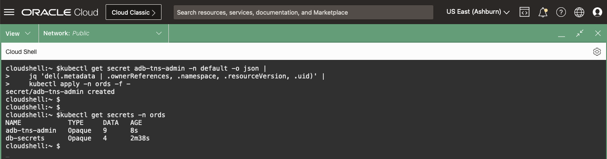
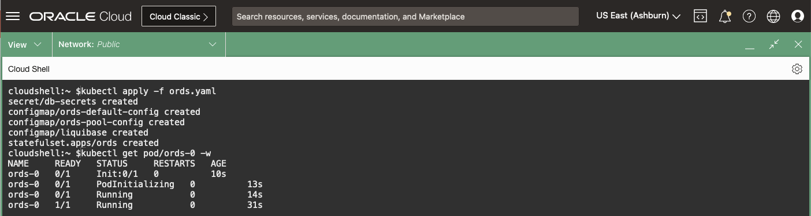
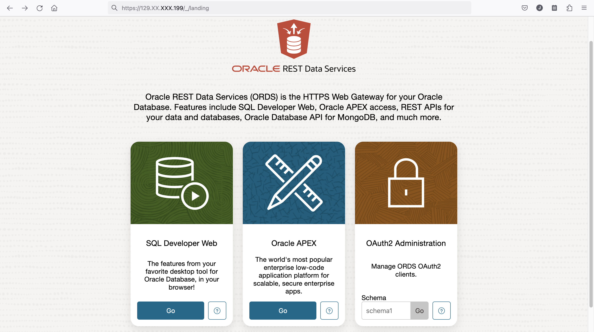

# Deploy Microservice Application

## Introduction

You will deploy an Microservice Application which will create a new user in the Database via Liquibase and use the new user access the Oracle Database.

The application will be the SQL Web Developer from Oracle Rest Data Services (ORDS).

*Estimated Time:* 20 minutes

[Lab 8](videohub:1_7f7gm9v2)


### Objectives

* Have a running Microservice Application connected to the Oracle Database

### Prerequisites

This lab assumes you have:

* [Generated a Kubeconfig File](?lab=access-cluster)
* A [Running and Healthy OraOperator](?lab=deploy-oraoperator)
* The [OraOperator bound to an ADB](?lab=bind-adb)

## Task 1: Switch Context

In the [Access the Kubernetes Cluster](?lab=access-cluster#task3changethedefaultnamespacecontext) Lab, you created a new `ords` namespace and a *Context* to set it as the working *Namespace*.

You will use the `ords` *namespace* for your Application while the ADB resource resides in the `default` *namespace*.  This is to illustrate how different teams (Developers and DBAs) can manage their resources in their own "virtual clusters", reducing the impact they have on each other, and to allow additional security via Role Based Access Controls (*RBAC*).

1. Switch to `ords` context:

    ```bash
    <copy>
    kubectl config use-context ords
    </copy>
    ```

1. Verify context:

    ```bash
    <copy>
    kubectl config get-contexts
    </copy>
    ```

## Task 2: Create the Database Secrets

Your application will want to talk to the Oracle Database and to do so, just like a non-Microservice application, it will need both Authentication credentials and Database (Names) Resolution strings.  Whether you use Oracle Enterprise User Security and LDAP or username/passwords and TNS_ADMIN, the general requirements will be the same.

### Names Resolution

For the Database (Names) Resolution, copy the wallet *Secret* from the `default` *namespace* to the `ords` *namespace*.

1. This can be done with a `kubectl` one-liner:

    ```bash
    <copy>
    kubectl get secret adb-tns-admin -n default -o json |
        jq 'del(.metadata | .ownerReferences, .namespace, .resourceVersion, .uid)' |
        kubectl apply -n ords -f -
    </copy>
    ```

    The above command will export the `adb-tns-admin` *Secret* from the `default` *namespace* to JSON, exclude some metadata fields, and load the *Secret* back into the Kubernetes `ords` *namespace*... a sort of `CREATE TABLE.. AS SELECT...` operation.

2. Query the new *Secret*:

    ```bash
    <copy>
    kubectl get secrets -n ords
    </copy>
    ```

    

### Authentication

1. Set some variables to assist in creating the Kubernetes *manifest file* for Authentication by using the *Secrets* and data from the AutonomousDatabase resources in the `default` *namespace*:

    ```bash
    <copy>
    ADB_PWD=$(kubectl get secrets/adb-admin-password -n default --template="{{index .data \"adb-admin-password\" | base64decode}}")

    SERVICE_NAME=$(kubectl get adb -n default -o json | jq -r .items[0].spec.details.dbName)_TP
    </copy>
    ```

## Task 3: Start a Manifest File

Start a *manifest file* for the Application Deployment.

1. Insert the Authentication *Secrets*:

    ```bash
    <copy>
    cat > ords.yaml << EOF
    ---
    apiVersion: v1
    kind: Secret
    metadata:
      name: db-secrets
    type: Opaque
    stringData:
      db.username: ADMIN
      db.password: ${ADB_PWD}
      db.service_name: ${SERVICE_NAME}
      ords.password: ${ADB_PWD}
    EOF
    </copy>
    ```

## Task 4: Create the ConfigMaps

You'll create two *ConfigMaps*, one will be the ORDS configuration file and the other will be a Liquibase ChangeLog.

A *ConfigMap* is like a *Secret* but to store non-confidential data. *Pods* can consume *ConfigMaps* as environment variables, command-line arguments, or as configuration files in a *Volume*.

### ORDS Configuration

The ORDS configuration does not store any sensitive data, so append to the *manifest file* two *ConfigMap*s of its configuration.  The *ConfigMap*s will be mounted as files into the Container and used by the ORDS process to start the application and make a connection to the database.

1. Append the `ords-config` *ConfigMap* to the Application Deployment *manifest file*:

    ```bash
    <copy>
    cat >> ords.yaml << EOF
    ---
    apiVersion: v1
    kind: ConfigMap
    metadata:
      name: ords-default-config
      labels:
        name: ords-default-config
    data:
      settings.xml: |-
        <?xml version="1.0" encoding="UTF-8"?>
        <!DOCTYPE properties SYSTEM "http://java.sun.com/dtd/properties.dtd">
        <properties>
          <entry key="database.api.enabled">true</entry>
          <entry key="feature.sdw">true</entry>
          <entry key="jdbc.InitialLimit">10</entry>
          <entry key="jdbc.MaxLimit">100</entry>
          <entry key="restEnabledSql.active">true</entry>
          <entry key="security.httpsHeaderCheck">X-Forwarded-Proto: https</entry>
          <entry key="standalone.context.path">/</entry>
          <entry key="standalone.http.port">8080</entry>
          <entry key="standalone.static.context.path">/i</entry>
        </properties>
    ---
    apiVersion: v1
    kind: ConfigMap
    metadata:
      name: ords-pool-config
      labels:
        name: ords-pool-config
    data:
      pool.xml: |-
        <?xml version="1.0" encoding="UTF-8"?>
        <!DOCTYPE properties SYSTEM "http://java.sun.com/dtd/properties.dtd">
        <properties>
          <entry key="db.connectionType">tns</entry>
          <entry key="db.tnsAliasName">${SERVICE_NAME}</entry>
          <entry key="db.tnsDirectory">/opt/oracle/network/admin</entry>
          <entry key="db.username">ORDS_PUBLIC_USER_K8S</entry>
          <entry key="plsql.gateway.mode">proxied</entry>
        </properties>
    EOF
    </copy>
    ```

### Liquibase ChangeLog

In an ADB, the `ORDS_PUBLIC_USER` already exists for providing Rest Data Services out-of-the-box.  You'll want to avoid messing with that database user and instead create a new, similar user for your application.  You can do this as part of the deployment using **SQLcl + Liquibase** inside what is known as an *initContainer*.

An *initContainer* is just like an regular application container, except it will run to completion and stop.  They are perfect for ensuring the database has the correct users, permissions, and objects present for the application container to use.

**Liquibase** is an open-source tool that enables you to define, manage, and version control your database schema. It utilises ChangeLogs, which contain a series of database changes, to modify and evolve your schema. These ChangeLogs are applied to the database, and **Liquibase** keeps track of the changes that have been executed, allowing for easier management and tracking of database schema modifications.


The below *ConfigMap* will create two new users in the ADB: `ORDS_PUBLIC_USER_K8S` and `ORDS_PLSQL_GATEWAY_K8S`.  It will also grant the required permissions for them to run the ORDS Microservice application.

1. Append the *ConfigMap* to your application manifest:

    ```yaml
    <copy>
    cat >> ords.yaml << EOF
    ---
    apiVersion: v1
    kind: ConfigMap
    metadata:
      name: liquibase
    data:
      liquibase.sql: "liquibase update -chf changelog.sql"
      changelog.sql: |-
        -- liquibase formatted sql

        -- changeset gotsysdba:create_users endDelimiter:/ runAlways:true
        DECLARE
          l_user VARCHAR2(255);
          l_cdn  VARCHAR2(255);
        BEGIN
          BEGIN
            SELECT USERNAME INTO l_user FROM DBA_USERS WHERE USERNAME='ORDS_PUBLIC_USER_K8S';
            EXECUTE IMMEDIATE 'ALTER USER "ORDS_PUBLIC_USER_K8S" PROFILE ORA_APP_PROFILE';
            EXECUTE IMMEDIATE 'ALTER USER "ORDS_PUBLIC_USER_K8S" IDENTIFIED BY "\${ORDS_PWD}"';
          EXCEPTION
            WHEN NO_DATA_FOUND THEN
              EXECUTE IMMEDIATE 'CREATE USER "ORDS_PUBLIC_USER_K8S" IDENTIFIED BY "\${ORDS_PWD}" PROFILE ORA_APP_PROFILE';
          END;
          EXECUTE IMMEDIATE 'GRANT CONNECT TO "ORDS_PUBLIC_USER_K8S"';
          BEGIN
            SELECT USERNAME INTO l_user FROM DBA_USERS WHERE USERNAME='ORDS_PLSQL_GATEWAY_K8S';
              EXECUTE IMMEDIATE 'ALTER USER "ORDS_PLSQL_GATEWAY_K8S" PROFILE DEFAULT';
              EXECUTE IMMEDIATE 'ALTER USER "ORDS_PLSQL_GATEWAY_K8S" NO AUTHENTICATION';
            EXCEPTION
              WHEN NO_DATA_FOUND THEN
                EXECUTE IMMEDIATE 'CREATE USER "ORDS_PLSQL_GATEWAY_K8S" NO AUTHENTICATION PROFILE DEFAULT';
          END;
          EXECUTE IMMEDIATE 'GRANT CONNECT TO "ORDS_PLSQL_GATEWAY_K8S"';
          EXECUTE IMMEDIATE 'ALTER USER "ORDS_PLSQL_GATEWAY_K8S" GRANT CONNECT THROUGH "ORDS_PUBLIC_USER_K8S"';
          ORDS_ADMIN.PROVISION_RUNTIME_ROLE (
              p_user => 'ORDS_PUBLIC_USER_K8S'
            ,p_proxy_enabled_schemas => TRUE
          );
          ORDS_ADMIN.CONFIG_PLSQL_GATEWAY (
              p_runtime_user => 'ORDS_PUBLIC_USER_K8S'
            ,p_plsql_gateway_user => 'ORDS_PLSQL_GATEWAY_K8S'
          );

          BEGIN
            SELECT images_version INTO L_CDN
              FROM APEX_PATCHES
            where is_bundle_patch = 'Yes'
            order by patch_version desc
            fetch first 1 rows only;
          EXCEPTION WHEN NO_DATA_FOUND THEN
            select version_no INTO L_CDN
              from APEX_RELEASE;
          END;
          apex_instance_admin.set_parameter(
              p_parameter => 'IMAGE_PREFIX',
              p_value     => 'https://static.oracle.com/cdn/apex/'||L_CDN||'/'
          );
        END;
        /
        --rollback drop user "ORDS_PUBLIC_USER_K8S" cascade;
        --rollback drop user "ORDS_PLSQL_GATEWAY_K8S" cascade;
    EOF
    </copy>
    ```

By using a variable for the passwords, you are not exposing any sensitive information in your code.  The value for the variable will be set using environment variables in the Applications *Deployment* specification, which will pull the values from the *Secret* you created.

## Task 5: Create the Application

Finally, define the Application *Deployment* manifest itself.  It looks like a lot is going on, but if you break it down it's not all that complicated.

1. Create a *StatefulSet*

    For Lab purposes only, define this Application as a *StatefulSet* to ensure the names of the *Pods* are predictable.  Call this application `ords` with a single *Pod* as defined by *replicas*.  Create *Volumes* of the *ConfigMaps* and *Secrets* so the application can mount them into its containers.  The purpose of the other keys will be explored later in the Lab.

    ```bash
    <copy>
    cat >> ords.yaml << EOF
    ---
    apiVersion: apps/v1
    kind: StatefulSet
    metadata:
      name: ords
    spec:
      replicas: 1
      selector:
        matchLabels:
          app.kubernetes.io/name: ords
      template:
        metadata:
          labels:
            app.kubernetes.io/name: ords
        spec:
          volumes:
            - name: ords-default-config
              configMap:
                name: ords-default-config
            - name: ords-pool-config
              configMap:
                name: ords-pool-config
            - name: liquibase
              configMap:
                name: liquibase
            - name: tns-admin
              secret:
                secretName: "adb-tns-admin"
            - name: ords-wallet
              emptyDir: {}
    EOF
    </copy>
    ```

2. Add the *initContainers*.

    This is the **Liquibase** container that will startup before the the `containers` section.  It will *VolumeMount* the `adb-tns-admin` *Secret* to the `/opt/oracle/network/admin` directory and `liquibase` *ConfigMap* to the `/opt/oracle/network/admin` inside the Container.  It will then pull the `SQLcl` image from Oracle's Container Registry and run the `liquibase.sql` against the database defined in the `db-secret` *Secret*.

    ```bash
    <copy>
    cat >> ords.yaml << EOF
          initContainers:
            - name: liquibase
              image: container-registry.oracle.com/database/sqlcl:latest
              imagePullPolicy: IfNotPresent
              args: ["-L", "-nohistory", "\$(LB_COMMAND_USERNAME)/\$(LB_COMMAND_PASSWORD)@\$(LB_COMMAND_URL)", "@liquibase.sql"]
              env:
                - name: LIQUIBASE_DUPLICATE_FILE_MODE
                  value: WARN
                - name: LB_COMMAND_USERNAME
                  valueFrom:
                    secretKeyRef:
                      name: "db-secrets"
                      key: db.username
                - name: LB_COMMAND_PASSWORD
                  valueFrom:
                    secretKeyRef:
                      name: "db-secrets"
                      key: db.password
                - name: DB_SERVICE
                  valueFrom:
                    secretKeyRef:
                      name: "db-secrets"
                      key: db.service_name
                - name: LB_COMMAND_URL
                  value: jdbc:oracle:thin:@\$(DB_SERVICE)?TNS_ADMIN=/opt/oracle/network/admin
                - name: ORDS_PWD
                  valueFrom:
                    secretKeyRef:
                      name: "db-secrets"
                      key: db.password
              volumeMounts:
              - mountPath: /opt/oracle/network/admin
                name: tns-admin
                readOnly: true
              - mountPath: /opt/oracle/sql_scripts
                name: liquibase
                readOnly: true
    EOF
    </copy>
    ```

3. Add the `container`, the application you are deploying.

    In addition to mounting the `adb-tns-admin` *Secret* to the `/opt/oracle/network/admin` directory for Names Resolution, it will also mount the *ConfigMap*s `ords-default-config` to the `/opt/oracle/standalone/config/global` and `ords-pool-config` to the `/opt/oracle/standalone/config/databases/default/` directories.

    The *Pod* will download the `ORDS` image from Oracle's Container Registry, generate a wallet for the database password and startup the ORDS server in standalone mode.

    Append the deployment code to the existing *manifest file*:

    ```bash
    <copy>
    cat >> ords.yaml << EOF
          containers:
            - image: "container-registry.oracle.com/database/ords:23.3.0"
              imagePullPolicy: IfNotPresent
              name: ords
              command:
                - /bin/bash
                - -c
                - |
                  ords --config \$ORDS_CONFIG config secret --password-stdin db.password <<< \$ORDS_PWD;
                  ords --config \$ORDS_CONFIG serve
              env:
                - name: ORDS_CONFIG
                  value: /opt/oracle/standalone/config
                - name: ORACLE_HOME
                  value: /opt/oracle
                - name: TNS_ADMIN
                  value: /opt/oracle/network/admin
                - name: DB_SERVICE
                  valueFrom:
                    secretKeyRef:
                      name: "db-secrets"
                      key: db.service_name
                - name: ORDS_PWD
                  valueFrom:
                    secretKeyRef:
                      name: "db-secrets"
                      key: db.password
              volumeMounts:
                - name: ords-default-config
                  mountPath: "/opt/oracle/standalone/config/global/"
                  readOnly: false
                - name: ords-pool-config
                  mountPath: "/opt/oracle/standalone/config/databases/default/"
                  readOnly: true
                - name: ords-wallet
                  mountPath: "/opt/oracle/standalone/config/databases/default/wallet"
                  readOnly: false
                - name: tns-admin
                  mountPath: "/opt/oracle/network/admin"
                  readOnly: true
              readinessProbe:
                tcpSocket:
                  port: 8080
                initialDelaySeconds: 15
                periodSeconds: 10
              livenessProbe:
                tcpSocket:
                  port: 8080
                initialDelaySeconds: 15
                periodSeconds: 10
              ports:
                - name: ords-port
                  containerPort: 8080
              securityContext:
                capabilities:
                  drop:
                    - ALL
                runAsNonRoot: true
                runAsUser: 54321
                readOnlyRootFilesystem: false
                allowPrivilegeEscalation: false
    EOF
    </copy>
    ```

## Task 6: Deploy the Application

You now have a single *manifest file* that will deploy everything you need for your application.  You could take that file and deploy it into any Kubernetes cluster (such as UAT or PRD).  Simply change the contents of the *Secrets* and *ConfigMaps* to make it enviroment specific.

1. Apply the *manifest file*:

    ```bash
    <copy>
    kubectl apply -f ords.yaml
    </copy>
    ```

2. Watch the *Pod* come to life:

    ```bash
    <copy>
    kubectl get pod/ords-0 -w
    </copy>
    ```

    Press `Ctrl-C` to break the loop

    

## Task 7: Expose your Application

Now that your application is up and running, and given it is a web application, you need to allow access to it.  First you'll create a *Service* to expose your application to the network.

Take a look back at the *manifest file* for your application and the first couple of lines, specifically these ones:

```yaml
spec:
  replicas: 1
  selector:
    matchLabels:
      app.kubernetes.io/name: ords
```

Only one *replica* was created, which translates to the single *Pod* `ords-0` in the *Namespace*.  If you think of *replica's* as an instance in a RAC database, when you only have one it is easy to route traffic to it.  However, if you have multiple instances and they can go up and down independently, ensuring High Availability, then you need something to keep track of those "Endpoints" for routing traffic.  In a RAC, this is the SCAN Listener, in a K8s cluster, this is a *Service*.

1. Define the *Service* for your application, routing all traffic from port 80 to 8080 (the port the application is listening on).

    The `selector` from your deployment will need to match the `selector` in the service, this is how it knows which *Pods* are valid endpoints:

    ```bash
    <copy>
    cat > ords-service.yaml << EOF
    ---
    apiVersion: v1
    kind: Service
    metadata:
      name: ords-svc
    spec:
      selector:
        app.kubernetes.io/name: ords
      ports:
        - name: ords-svc-port
          protocol: TCP
          port: 80
          targetPort: ords-port
    EOF
    </copy>
    ```

2. Apply the *Service* manifest:

    ```bash
    <copy>
    kubectl apply -f ords-service.yaml
    </copy>
    ```

3. Query your *Namespace* to view the *Service*:

    ```bash
    <copy>
    kubectl get all
    </copy>
    ```

    

4. Query your *Service* to ensure it has picked up your application as an endpoint:

    ```bash
    <copy>
    kubectl get pods -o wide
    kubectl describe service
    </copy>
    ```

    

**Bonus**: Scale up your *statefulset*.  What happens to the Endpoints of the *Service*?


## Task 8: Create the Ingress

The *Service* exposed the application to the Kubernetes Cluster, for you to access it from a Web Browser, it needs to be exposed outside the cluster.  During the provisioning of the Stack, the **Ansible** portion deployed a Microservice Application called `ingress-nginx`.  That Microservice interacted with Oracle Cloud Infrastructure, via the *cloud-controller-manager* and spun up a LoadBalancer.  To expose the application to the LoadBalancer, create an `Ingress` resource that will interact with the `ingress-nginx` Microservice to allow your application to be accessed from outside the cluster:

1. Create the Ingress *manifest file*:

    ```bash
    <copy>
    cat > ords-ingress.yaml << EOF
    ---
    apiVersion: networking.k8s.io/v1
    kind: Ingress
    metadata:
      name: ords-ingress
      annotations:
        nginx.ingress.kubernetes.io/upstream-vhost: \$host
        nginx.ingress.kubernetes.io/force-ssl-redirect: "true"
    spec:
      ingressClassName: nginx
      rules:
        - http:
            paths:
              - path: /
                pathType: ImplementationSpecific
                backend:
                  service:
                    name: ords-svc
                    port:
                      name: ords-svc-port
    EOF
    </copy>
    ```

2. Apply the *manifest file* and query the resource:

    ```bash
    <copy>
    kubectl apply -f ords-ingress.yaml
    </copy>
    ```

3. Watch the `ingress` resource until a Public IP is available:

    ```bash
    <copy>
    kubectl get ingress -w
    </copy>
    ```

    Press `Ctrl-C` to break the loop

    

## Task 9: Access the Microservice Application

In the output from the Ingress, copy the IP and visit: `http://<IP>`.  You will see a warning page about a self-signed TLS Certificate, accept the risk to view the ORDS landing page:



From here you can log into SQL Developer Web to explore your database, or log into your APEX and start designing a Low-Code application!

Use the username `ADMIN` and the password retreived from the Kubernetes secret:

```bash
<copy>
kubectl get secrets/adb-admin-password -n default --template="{{index .data \"adb-admin-password\" | base64decode}}"
</copy>
```


## Task 10: Delete the Microservice Application

While you could delete the individual resources manually, or by using the *manifest file*, another way to delete this Microservice Application is to delete the *namespace* it is deployed in.  This is the equivalent of dropping a schema from the database.

1. Delete the `ords` *Namespace*:

    ```bash
    <copy>
    kubectl delete namespace ords
    </copy>
    ```

    

2. Refresh your browser accessing the application:

    

    **Note:** instead of the 404, you may experience spinning with an eventual timeout.  This is because the deleted *Ingress* resource will eventually cause the *cloud-controller-manager* to reconcile away the public IP exposing the application.

You may now **proceed to the next lab**

## Learn More

* [SQLcl](https://docs.oracle.com/en/database/oracle/sql-developer-command-line/23.1/index.html)
* [Liquibase](https://www.liquibase.org/)
* [Oracle Rest Data Services](https://docs.oracle.com/en/database/oracle/oracle-rest-data-services/)
* [Kubernetes ConfigMaps](https://kubernetes.io/docs/concepts/configuration/configmap/)

## Acknowledgements

* **Authors** - [](var:authors)
* **Contributors** - [](var:contributors)
* **Last Updated By/Date** - John Lathouwers, September 2023
