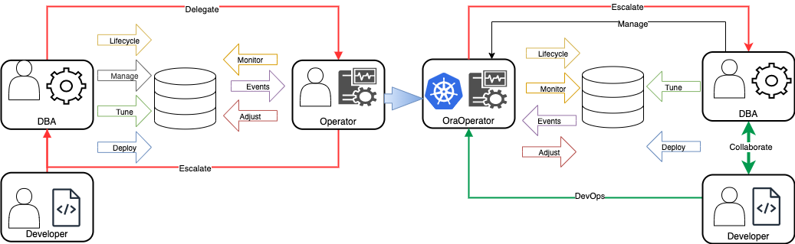
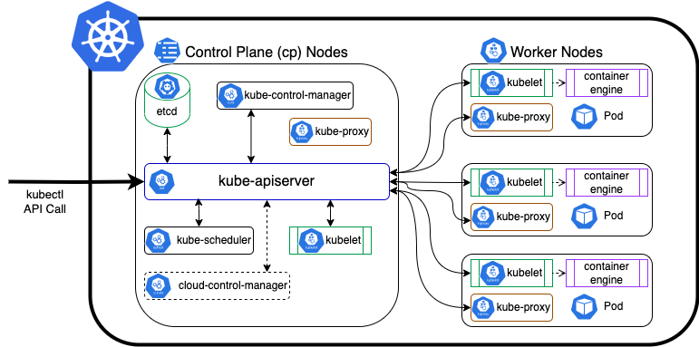
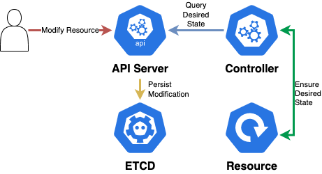
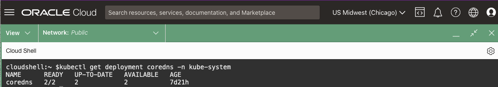
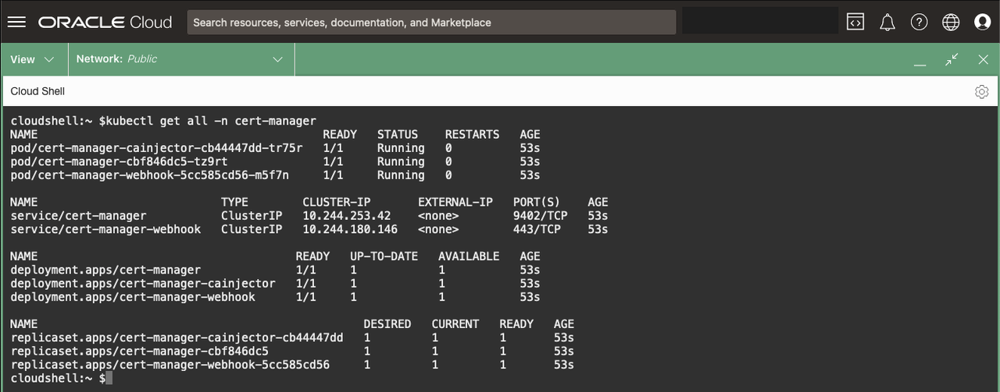
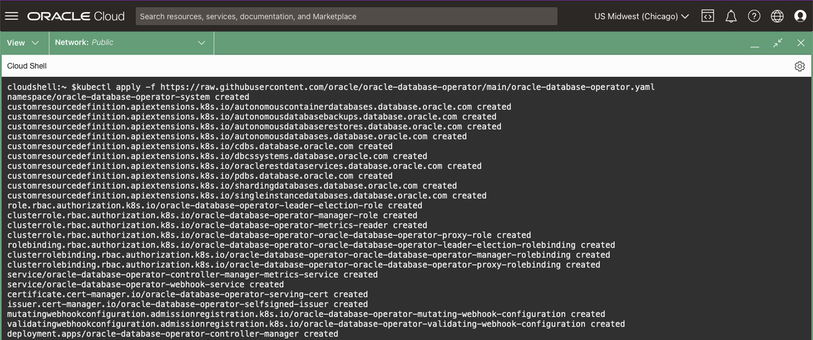
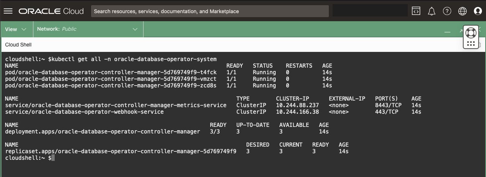

# Deploy the Oracle Operator for Kubernetes (OraOperator)

## Introduction

This lab will walk you through deploying the Oracle Operator for Kubernetes (OraOperator).  In Kubernetes, an *Operator* is a software component that extends the behaviour of Kubernetes clusters without modifying the Kubernetes code itself.  

> Kubernetes Operators are designed to mimic the role of a human data centre operator

The human operator gains their system knowledge from the Subject Matter Experts (SMEs) through documented Standard Operation Procedures (SOPs).  Over time, the human operator also gains the experience of how the systems should behave and how to respond when problems occur, enhancing the maturity of the SOPs.  They may even take responsibility for some of the SMEs tasks such as: deploying software, performing generic configurations, and lifecycle management.



In short, human operators become extensions of the SMEs, and in this case, the Oracle Operator for Kubernetes becomes an extension of the Oracle DBA.

*Estimated Time:* 5 minutes

[Lab 6](videohub:1_in973skw)


### Objectives

* Have a Running and Healthy OraOperator

### Prerequisites

This lab assumes you have:

* [Generated a Kubeconfig File](?lab=access-cluster)
* [Are using the demo namespace](?lab=access-cluster#Task3:ChangethedefaultNamespaceContext)

## Task 1: Kubernetes Resources

Kubernetes has built-in resources, or API endpoints, that usually represent a collection of concrete objects on the cluster.  You've already looked at a few of them in previous labs including *Nodes*, *Namespaces*, *Pods*, and *Deployments*.

1. Take a look at the built-in resources available in your cluster:

    ```bash
    <copy>
    kubectl api-resources
    </copy>
    ```

You'll notice there doesn't appear to be anything related to an Oracle Database.  Fortunately, Kubernetes allows you to extend the capabilities of your cluster with *Custom Resource Definitions*, or *CRDs*.

When you install the OraOperator later in this Lab, it will create *CRDs* allowing you to define Single Instance, RAC, Sharded, and Cloud Oracle Databases including the Autonomous Database in the Kubernetes Cluster.

## Task 2: Resource Controllers and Operators

On their own though, Kubernetes Resources only let you define your objects in the cluster.  When you combine a Resource with a *Controller* you have a true declarative API to fully manage your Resources.

Kubernetes comes with a set of built-in *Controllers* that run inside the *kube-control-manager* which operates in a continuous loop to monitor the current state of built-in resources, like *Deployments*.  

It is the *Controllers* job to watch the built-in resources and send instructions that will ensure the built-in resources match the desired configuration.



## Task 3: Controller In Action

To see a *Controller* in action, you will delete pods resulting in a *Deployment* resource being in an undesired state.  The Controller will automatically send instructions on how to bring the *Deployment* back to the desired state.



1. Your cluster comes with a built-in DNS server, **coredns**.  The **coredns** pods are tied to a *Deployment* that stipulates there should be two **coredns** pods running (i.e. two *Replicas*) at all times.  

    **Note**: The number of *Pods* may vary depending on the number of *Worker Nodes* in your cluster.

    Take a look at the **coredns** deployment, it should show **2/2** Pods are in the desired **READY** state:

    ```bash
    <copy>
    kubectl get deployment coredns -n kube-system
    </copy>
    ```

    

2. List out the **coredns** *Pods*:

    ```bash
    <copy>
    kubectl get pods -l k8s-app=kube-dns -n kube-system
    </copy>
    ```

    Note their names, specifically the suffixed hash and their AGE.

3. Delete the *Pods* and re-query them:

    ```bash
    <copy>
    kubectl delete pods -l k8s-app=kube-dns -n kube-system
    </copy>
    ```

    ```bash
    <copy>
    kubectl get pods -l k8s-app=kube-dns -n kube-system
    </copy>
    ```

You can probably predict where this is going... you will need *Controllers* to handle the *CRDs* that define Oracle Databases in a Kubernetes Cluster.  

Fortunately Kubernetes allows you to extend the clusters capabilities with *Custom Controllers*.  The specific type of *Custom Controller* that will monitor and change the Oracle Database *CRDs* is known as an *Operator*, which brings us to the **OraOperator**.

## Task 4: Install OraOperator

The **OraOperator** is developed and supported by Oracle, with *Custom Controllers* for provisioning, configuring, and managing the lifecycle of Oracle Databases, defined by *CRDs*, deployed within or outside Kubernetes clusters.

To install the OraOperator, you will first need to install a dependency, **cert-manager**:

1. Install **cert-manager**:

    ```bash
    <copy>
    kubectl apply -f https://github.com/jetstack/cert-manager/releases/latest/download/cert-manager.yaml
    </copy>
    ```

2. Check the **cert-manager** installed resources:

    ```bash
    <copy>
    kubectl get all -n cert-manager
    </copy>
    ```

    

3. Install the **OraOperator**:

    ```bash
    <copy>
    kubectl apply -f https://raw.githubusercontent.com/oracle/oracle-database-operator/main/oracle-database-operator.yaml
    </copy>
    ```

    

4. Check **OraOperator** installed resources:

    ```bash
    <copy>
    kubectl get all -n oracle-database-operator-system
    </copy>
    ```

    

    The output shows a *Deployment* named `oracle-database-operator-controller-manager`. This is the **Operator's Custom Controller** manager which will watch your Kubernetes cluster for any Oracle Database *CRDs* and ensure that they are always running in their desired state.

## Task 5: OraOperator CRDs

1. Rerun the query which returned the `api-resources`, but this time filter it on the new **database.oracle.com** group:

    ```bash
    <copy>
    kubectl api-resources --api-group=database.oracle.com
    </copy>
    ```

    You will now see all the new *CRDs* introduced by the **OraOperator** that will be managed by the `oracle-database-operator-controller-manager`.

    

You may now **proceed to the next lab**

## Learn More

* [Kubernetes Operators](https://kubernetes.io/docs/concepts/extend-kubernetes/operator/)
* [Kubernetes Custom Resources](https://kubernetes.io/docs/concepts/extend-kubernetes/api-extension/custom-resources/)
* [Oracle Operator for Kubernetes](https://github.com/oracle/oracle-database-operator)
* [Cert-Manager](https://cert-manager.io/)

## Acknowledgements

* **Authors** - [](var:authors)
* **Contributors** - [](var:contributors)
* **Last Updated By/Date** - John Lathouwers, July 2023
