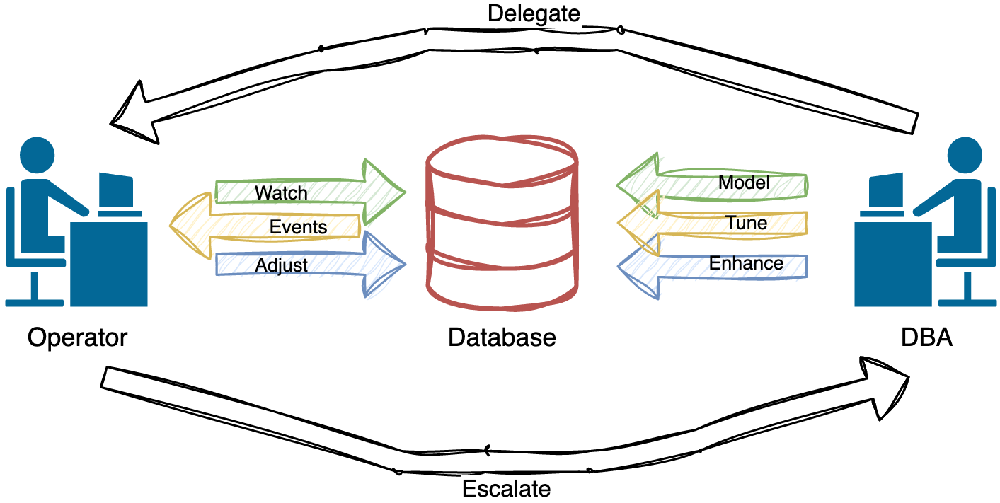
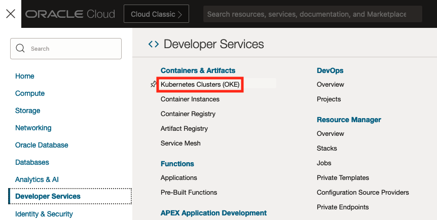
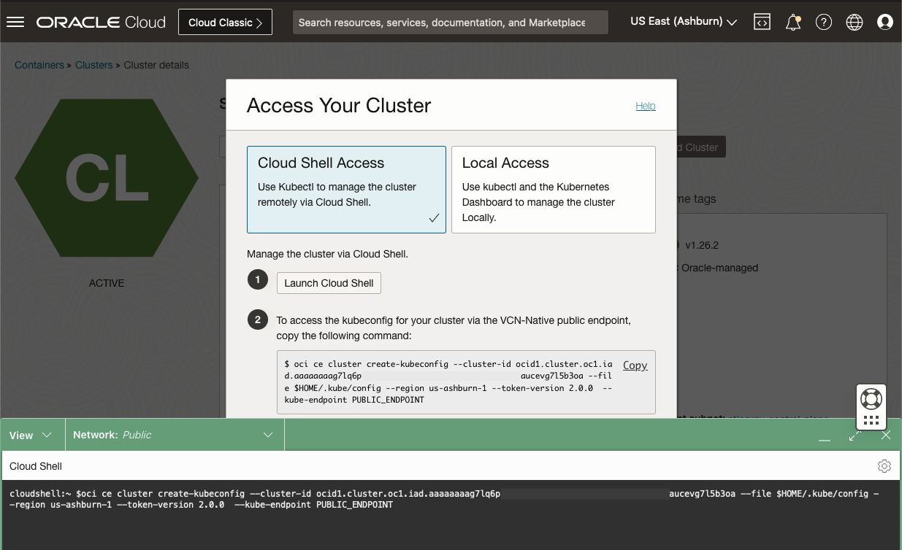

# Deploy the Oracle Operator for Kubernetes (OraOperator)

## Introduction

This lab will walk you through deploying the Oracle Operator for Kubernetes (OraOperator).

*Estimated Lab Time:* 5 minutes

Watch the video below for a quick walk through of the lab.
[](youtube:zNKxJjkq0Pw)

### Objectives

* Have a Running and Healthy OraOperator

### Prerequisites

This lab assumes you have:

* An accessible Kubernetes Cluster

## Kubernetes Operators

In Kubernetes (K8s), an **Operator** is a software component that extends the behavior of K8s clusters without modifying the Kubernetes code itself.

K8s Operators are designed to mimic the role of a human data centre operator: The human operator gains their system knowledge from the Subject Matter Experts (SMEs) through documented Standard Operation Procedures (SOPs).  Over time, the human operator also gains the experience of how the systems should behave and how to respond when problems occur, enhancing the maturity of the SOPs.  They may even take responsibility for some of the SMEs tasks such as: deploying software, performing generic configurations, and lifecycle management.

In short, human operators become extensions of the SMEs.



Like the human operator, the OraOperator in K8s, is an extension of the Oracle DBA in a K8s cluster.  The OraOperator is developed and supported by Oracle, with "built-in SOPs" for provisioning, configuring, and managing the lifecycle of Oracle databases deployed within or outside K8s clusters, including Cloud databases.

## Task 1: Create the Kubeconfig file

In OCI, navigate to Developer Services -> Kubernetes Clusters(OKE).



Select your cluster and click the "Access Cluster" button. Follow the steps to "Manage the cluster via Cloud Shell".



Paste the copied command into Cloud Shell.  This will create a configuration file, the `kubeconfig`, that `kubectl` uses to access the cluster.

## Task 2: Test Kubernetes Access

Just as with `srvctl`, used to query the resources in a Oracle Grid Infrastructure Cluster, use `kubectl` to query the resources in the K8s cluster.

```bash
<copy>
kubectl get all -A
</copy>
```

The command should return a table like structure of pods and namespaces.  If an error is returned, ensure the K8s cluster is up and running and that the `kubeconfig` file was properly generated (Task 1).

## Task 3: Install Cert-Manager

The OraOperator uses webhooks, automated messages sent from apps when something happens, to intercept and validate user requests to the OraOperator before they are persisted in etcd.  A sort of table check-constraint to ensure the input is valid before inserting it.

Webhooks require TLS certificates that are generated and managed by Cert-Manager, an open-source certificate management solution designed for Kubernetes.

To install Cert-Manager:

```bash
<copy>
kubectl apply -f https://github.com/jetstack/cert-manager/releases/latest/download/cert-manager.yaml
</copy>
```

To check its installed resources:

```bash
<copy>
kubectl get all -n cert-manager
</copy>
```

The output will be similar to:

```text
NAME                                           READY   STATUS    RESTARTS   AGE
pod/cert-manager-5968f94ffb-5tf4b              1/1     Running   0          7m55s
pod/cert-manager-cainjector-7c9d98fd74-rwqdd   1/1     Running   0          7m55s
pod/cert-manager-webhook-8bd7f6948-kr2t9       1/1     Running   0          7m55s

NAME                           TYPE        CLUSTER-IP      EXTERNAL-IP   PORT(S)    AGE
service/cert-manager           ClusterIP   10.44.196.215   <none>        9402/TCP   7m55s
service/cert-manager-webhook   ClusterIP   10.44.39.41     <none>        443/TCP    7m55s

NAME                                      READY   UP-TO-DATE   AVAILABLE   AGE
deployment.apps/cert-manager              1/1     1            1           7m55s
deployment.apps/cert-manager-cainjector   1/1     1            1           7m55s
deployment.apps/cert-manager-webhook      1/1     1            1           7m55s

NAME                                                 DESIRED   CURRENT   READY   AGE
replicaset.apps/cert-manager-5968f94ffb              1         1         1       7m55s
replicaset.apps/cert-manager-cainjector-7c9d98fd74   1         1         1       7m55s
replicaset.apps/cert-manager-webhook-8bd7f6948       1         1         1       7m55s
```

## Task 4: Install Oracle Operator for Kubernetes

To install the OraOperator:

```bash
<copy>
kubectl apply -f https://raw.githubusercontent.com/oracle/oracle-database-operator/main/oracle-database-operator.yaml
</copy>
```

To check its installed resources:

```bash
<copy>
kubectl get all -n oracle-database-operator-system
</copy>
```

The output will be similar to:

```text
NAME                                                               READY   STATUS    RESTARTS   AGE
pod/oracle-database-operator-controller-manager-64678cdc97-6xxfb   1/1     Running   0          8m36s
pod/oracle-database-operator-controller-manager-64678cdc97-kqcgl   1/1     Running   0          8m36s
pod/oracle-database-operator-controller-manager-64678cdc97-pjl94   1/1     Running   0          8m36s

NAME                                                                  TYPE        CLUSTER-IP     EXTERNAL-IP   PORT(S)    AGE
service/oracle-database-operator-controller-manager-metrics-service   ClusterIP   10.44.239.33   <none>        8443/TCP   8m36s
service/oracle-database-operator-webhook-service                      ClusterIP   10.44.15.60    <none>        443/TCP    8m36s

NAME                                                          READY   UP-TO-DATE   AVAILABLE   AGE
deployment.apps/oracle-database-operator-controller-manager   3/3     3            3           8m36s

NAME                                                                     DESIRED   CURRENT   READY   AGE
replicaset.apps/oracle-database-operator-controller-manager-64678cdc97   3         3         3       8m36s
```

## Learn More

* [Kubernetes Operators](https://kubernetes.io/docs/concepts/extend-kubernetes/operator/)
* [Oracle Operator for Kubernetes](https://github.com/oracle/oracle-database-operator)
* [Cert-Manager](https://cert-manager.io/)

## Acknowledgements

* **Author** - John Lathouwers, Developer Advocate, Database Development Operations
* **Last Updated By/Date** - John Lathouwers, May 2023
