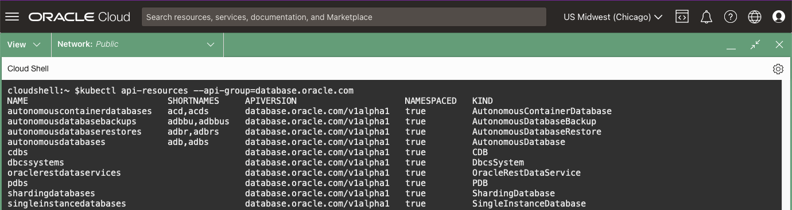

# Deploy the Oracle Operator for Kubernetes (OraOperator)

## Introduction

This lab will walk you through deploying the Oracle Operator for Kubernetes (OraOperator).  In Kubernetes (K8s), an **Operator** is a software component that extends the behaviour of K8s clusters without modifying the K8s code itself.  

> K8s Operators are designed to mimic the role of a human data centre operator

The human operator gains their system knowledge from the Subject Matter Experts (SMEs) through documented Standard Operation Procedures (SOPs).  Over time, the human operator also gains the experience of how the systems should behave and how to respond when problems occur, enhancing the maturity of the SOPs.  They may even take responsibility for some of the SMEs tasks such as: deploying software, performing generic configurations, and lifecycle management.


In short, human operators become extensions of the SMEs, and in this case, the Oracle Operator for Kubernetes becomes an extension of the Oracle DBA.

*Estimated Lab Time:* 5 minutes

Watch the video below for a quick walk through of the lab.
[](youtube:zNKxJjkq0Pw)

### Objectives

* Have a Running and Healthy OraOperator

### Prerequisites

This lab assumes you have:

* [Generated a Kubeconfig File](?lab=AccesstheKubernetesCluster)
* [Are using the demo namespace](?lab=AccesstheKubernetesCluster#ChangethedefaultNamespaceContext)

## Task 1: Kubernetes Resources

Kubernetes has built-in resources, or API endpoints, that usually represent a collection of concrete objects on the cluster.  You've already looked at a few of them in the [Explore The Cluster](?lab=ExploreTheCluster) Lab including nodes, namespaces, pods, and services.

Take a look at the built-in resources available in your cluster.  

In Cloud Shell:

```bash
<copy>
kubectl api-resources
</copy>
```

You'll notice there doesn't appear to be anything related to an Oracle Database.  Fortunately, Kubernetes allows you to extend the capabilities of your cluster with **Custom Resource Definitions**, or **CRDs**.

When you install the OraOperator later in this Lab, it will create **CRDs** allowing you to define Single Instance, RAC, Sharded, and Cloud Oracle Databases including the Autonomous Database in the Kubernetes Cluster.

## Task 2: Resource Controllers and Operators

On their own though, Kubernetes Resources only let you define your objects in the cluster.  When you combine a Resource with a **Controller** you have a true declarative API to fully manage your Resources.

Kubernetes comes with a set of built-in Controllers that run inside the **kube-control-manager** which operates in a continuous loop to monitor the current state of built-in resources, like Deployments.  It is the Controllers job to watch and make changes to the built-in resources to ensure they match the desired configuration.


To see a built-in Controller in action, you will delete pods and see new ones created in their place.  

Your cluster comes with a built-in DNS server, `coredns`.  The `coredns` pods are tied to a Deployment that stipulates there should always be two `coredns` pods running (i.e. two **Replicas**) at all times.

List out the `coredns` pods:

```bash
<copy>
kubectl get pods -l k8s-app=kube-dns -n kube-system
</copy>
```

Note their names, specifically the suffixed hash and their AGE.  Delete and re-list them:

```bash
<copy>
kubectl delete pods -l k8s-app=kube-dns -n kube-system
kubectl get pods -l k8s-app=kube-dns -n kube-system
</copy>
```

The controller which watches Deployments recognised that after you deleted the pods, the Deployment was not in the defined state (0 of 2 Replica) and reconciled it by starting up two new pods.

You can probably predict where this is going... you will need **Controllers** to handle the **CRDs** that define Oracle Databases in a Kubernetes Cluster.  Again, fortunately Kubernetes allows you to extend the clusters capabilities with **Custom Controllers**.  The specific type of **Custom Controller** that will monitor and change the Oracle Database **CRDs** is known as an **Operator**, which brings us to the OraOperator.

## Task 3: Install OraOperator

The OraOperator is developed and supported by Oracle, with **Custom Controllers** for provisioning, configuring, and managing the lifecycle of Oracle Databases, defined by **CRDs**, deployed within or outside Kubernetes clusters.

To install the OraOperator, you will first need to install a dependency, **cert-manager**:

In Cloud Shell run:

```bash
<copy>
kubectl apply -f https://github.com/jetstack/cert-manager/releases/latest/download/cert-manager.yaml
</copy>
```

To check its installed resources:

```bash
<copy>
kubectl get all -n cert-manager
</copy>
```

The output will be similar to:


Next to install the OraOperator, in Cloud Shell run:

```bash
<copy>
kubectl apply -f https://raw.githubusercontent.com/oracle/oracle-database-operator/main/oracle-database-operator.yaml
</copy>
```

The output will look similar to this:


To check its installed resources:

```bash
<copy>
kubectl get all -n oracle-database-operator-system
</copy>
```

The output will be similar to:


Notice all the resources in the namespace are **Custom Controllers** which will watch your cluster to ensure the new **CRDs** are in their desired state.

### Custom Resource Definitions

Finally, rerun query to get the `api-resources`, but this time filter it on the new **database.oracle.com** group:

```bash
<copy>
kubectl api-resources --api-group=database.oracle.com
</copy>
```

You will now see all the new **CRDs** introduced by the OraOperator.



## Learn More

* [Kubernetes Operators](https://kubernetes.io/docs/concepts/extend-kubernetes/operator/)
* [Kubernetes Custom Resources](https://kubernetes.io/docs/concepts/extend-kubernetes/api-extension/custom-resources/)
* [Oracle Operator for Kubernetes](https://github.com/oracle/oracle-database-operator)
* [Cert-Manager](https://cert-manager.io/)

## Acknowledgements

* **Authors** - [](var:authors)
* **Contributors** - [](var:contributors)
* **Last Updated By/Date** - John Lathouwers, July 2023
