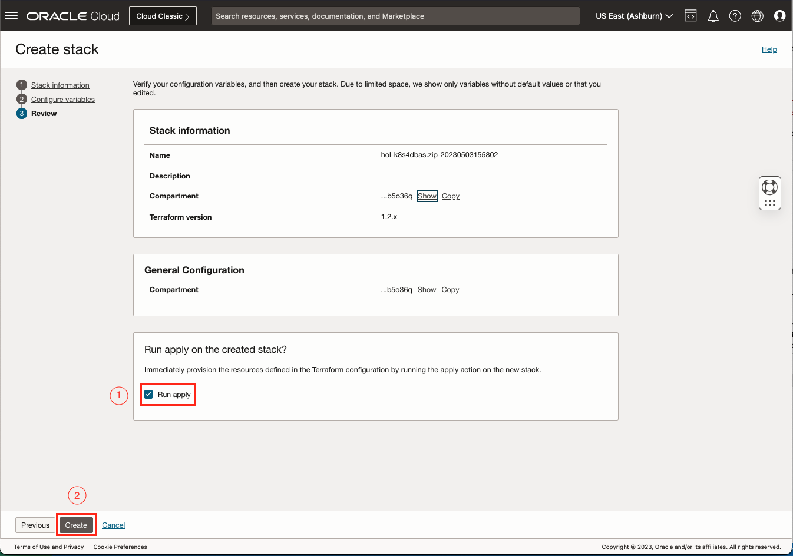
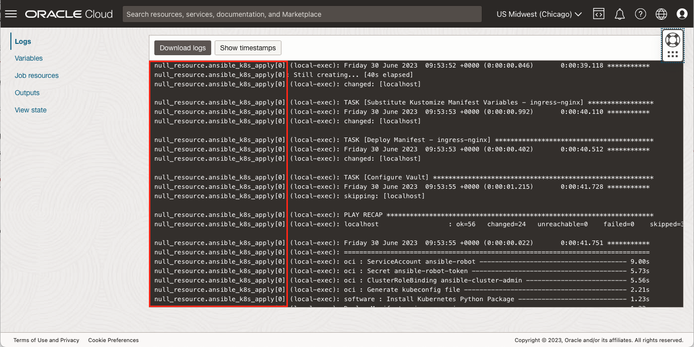

# Deploy Workshop Stack

## Introduction

In this lab, you will provision and configure the Oracle Cloud resources required for the Workshop using *Oracle Resource Manager (ORM)*.  ORM will stand-up the Infrastructure using *Terraform* and perform some basic Configuration using *Ansible*.  

Don't panic, how this works will be explored... while it is working.  

*Estimated Lab Time:* 10 minutes

### Objectives

* Deploy the Oracle Resource Manager (ORM) Stack
* Learn about Infrastructure as Code (IaC) and Terraform
* Learn about Configuration Management (CM) and Ansible

### Prerequisites

This lab assumes you have:

* An Oracle Cloud User with the policies outlined in [Prepare the OCI Tenancy](?lab=prepare-oci "Prepare OCI")

### Infrastructure Overview

At the end of this lab, the following Cloud Infrastructure will have been created for you:

* Virtual Cloud Network (VCN)
    * Public Subnet
    * Private Subnet
    * NAT and Internet Gateways
    * Network Security Groups
* Flexible Load Balancer
* Oracle Kubernetes Engine (OKE)
    * Managed Control Plane
    * Two Worker Nodes
* Autonomous Database

## Task 1: Click the Magic Button

The below "Magic Button" will take you directly to the the Create Stack page in the Oracle Cloud Infrastructure (OCI) Console. The button is linked to the Terraform and Ansible configuration file package, referred to as the Stack, which contains the IaC/CM for this workshop.

### **Notes**

* If you are not logged into OCI, you will be prompted to login after pushing the button.
* If you are logged into OCI, you will not be prompted to login.  Verify you are in the correct tenancy as the correct user.
* If the  Compartment does not exist, you are either in the wrong tenancy or logged in as the wrong user.

### Press the Magic Button to begin the deployment process

[![Deploy to Oracle Cloud][magic_button]][magic_arch_stack]

## Task 2: Update the Stack Information

1. Tick the "Oracle Terms of Use"
2. Change "Create in compartment" to: ``
3. Click "Next"

## Task 3: Review the Configuration Variables

Using variables in IaC helps improve the maintainability, reusability, and flexibility of your infrastructure code.  It allows you to reuse the same infrastructure definition across different environments and projects.

For example, the IaC in this particular stack is used in two different OCI Marketplace Offerings:

* [Oracle Backend for Spring Boot](https://cloudmarketplace.oracle.com/marketplace/en_US/listing/138899911 "Oracle Backend for Spring Boot")
* [Oracle Backend for Parse Platform](https://cloudmarketplace.oracle.com/marketplace/en_US/listing/139274906 "Oracle Backend for Parse Platform")

but it has been slimmed down, via variables, specifically for this workshop.  This demonstrates how easy it is to modify infrastructure configurations, as needed, without requiring any changes to the underlying code.

Tick the "Show Database Options?" to see what can be customised, but please do not change any values.

### Please do not change anything on this page, click "Next"

## Task 4: Apply! the Stack

We're ready to deploy the Infrastructure and do some minor Configuration Management.

1. Tick "Run apply"
2. Click "Create"

The Infrastructure deployment and configuration will take approximately **15 minutes**.  Grab a cup of tea and continue to the next tasks to learn about IaC using Terraform and Configuration Management using Ansible.

### Troubleshooting

When using OCI Free Tier, it is possible that the Stack deployment will fail due to a lack of compute resources in your chosen region.  Fear not and realise the power of Infrastructure as Code!  

Should the Stack Deployment fail due to **"Out of host capacity."**, please follow the [Out of Capacity](?lab=troubleshooting#OutofCapacity) guide.

## Task 5: Learn about Infrastructure as Code (IaC) using Terraform

Terraform is a tool for managing infrastructure as code (IaC) that can be version-controlled.  Take a look at the IaC that creates the Autonomous Oracle Database (ADB) for this Workshop.  The ADB is defined, in 16 lines, using the `oci_database_autonomous_database` resource from the [Oracle provided Terraform OCI provider](https://registry.terraform.io/providers/oracle/oci/latest/docs).  Most the arguments are set by variables, allowing you to customise the ADB without having to rewrite the code which describes it.  When you **Apply** the IaC, it calls underlying APIs to provision the resource as it is defined, and records it in a "State" file.

For the DBA this is invaluable as it means you can define the ADB once, use variables where permitted and constants where mandated for your organisations standards.  Those 16 lines of IaC can then be used over and over to provision, and tear-down, hundreds of ADBs.  

> use variables where permitted and constants where mandated

As Terraform is declarative, that IaC can also be used to modify existing ADBs that were created by by it, by comparing the configuration in the "State" file with the real-world resources.

During the ORM interview phase, when you ticked the "Show Database Options?" the `Autonomous Database CPU Core Count` was set to `1`.  That value was assigned to `var.adb_cpu_core_count` during provisioning.

After the Stack has provisioned, you could "Edit" the Stack, change the database's CPU Core Count to `2`, Apply, and your ADB will be modified accordingly.  Alternatively, if the ADB was modified outside of the IaC (someone has increased the CPU to `3`), it has "drifted" from the configuration stored in the "State".  Running an **Apply** will reconcile that drift and modify the ADB back to desired state as defined in the IaC.

### Other benefits of IaC

* **Manage infrastructure at scale:** you can manage thousands of resources across multiple environments with a single, consistent workflow.
* **Increase collaboration:** By using a version-controlled infrastructure configuration, you can collaborate more easily with other developers and stakeholders, and track changes to your infrastructure over time.

## Task 6: Review the Logs - Terraform

Scroll through and familiarise yourself with the logs.  Whether using ORM or any other means to run Terraform, the output will be the same and broken into three distinct parts:

* Resources that will be Added, Changed, or Destroyed
* Plan counts
* The actions being performed

**Best Practice** It is best practice to run a `terraform plan` and review what actions will take place before running a `terraform apply` to implement those actions.  This ensures that resources (databases, networks, etc) are not accidentally modified or deleted.

## Task 7: Learn about Configuration Management using Ansible

Ansible is an open-source automation tool used in this Stack for Configuration Management.  It is designed to be simple and easy to use, and much like Terraform, uses a declarative language to describe the desired state of a system, allowing you to focus on the "what" instead of the "how".

All of what you do manually in this Workshop can be automated by Ansible as part of the Stack deployment, but only the Configuration of an "Ingress Controller" has been left enabled.  You will see the "Ingress Controller" later in the Workshop when deploying your Microservice Application.

> All of what you do manually in this Workshop can be automated by Ansible

In the Workshop Stack, Terraform will write a number of variable and inventory files **(2)** describing the Infrastructure that it has provisioned.  It will then call Ansible **(3)** to run Playbooks (a series of tasks that include conditionals, loops, and error handling) against the infrastructure definition **(4)** to configure it **(5)**.  

## Task 7: Review the Logs - Ansible

While Ansible can be used to configure any type of Infrastructure, it is limited to the Oracle Kubernetes Engine in this Workshop.

Scrolling through the actions section of the log, you will see Ansible kick into action to start Configuration Management.

It is important to note, Ansible has a robust community and ecosystem, with many third-party modules available for common tasks like interacting with cloud providers, databases, and other services.  

Oracle has released an [OCI Ansible Collection](https://docs.oracle.com/en-us/iaas/Content/API/SDKDocs/ansible.htm) to support the automation of cloud configurations and the orchestration of complex operational processes.

## Common Issues

* [Out of Capacity](?lab=troubleshooting#OutofCapacity)

## Learn More

* [Oracle Resource Manager (ORM)](https://www.oracle.com/uk/devops/resource-manager/)
* [Using the Deploy to Oracle Cloud Button](https://docs.oracle.com/en-us/iaas/Content/ResourceManager/Tasks/deploybutton.htm)
* [Terraform](https://registry.terraform.io/providers/oracle/oci/latest/docs)
* [Ansible](https://docs.oracle.com/en-us/iaas/Content/API/SDKDocs/ansible.htm)

## Acknowledgements

* **Authors** - 
* **Contributors** - 
* **Last Updated By/Date** - John Lathouwers, July 2023

[magic_button]: https://oci-resourcemanager-plugin.plugins.oci.oraclecloud.com/latest/deploy-to-oracle-cloud.svg
[magic_arch_stack]: https://cloud.oracle.com/resourcemanager/stacks/create?zipUrl=https://github.com/oracle/microservices-datadriven/releases/download/23.5.1/hol-k8s4dbas.zip
